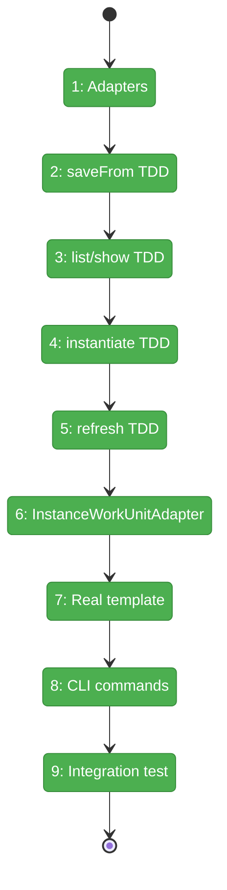
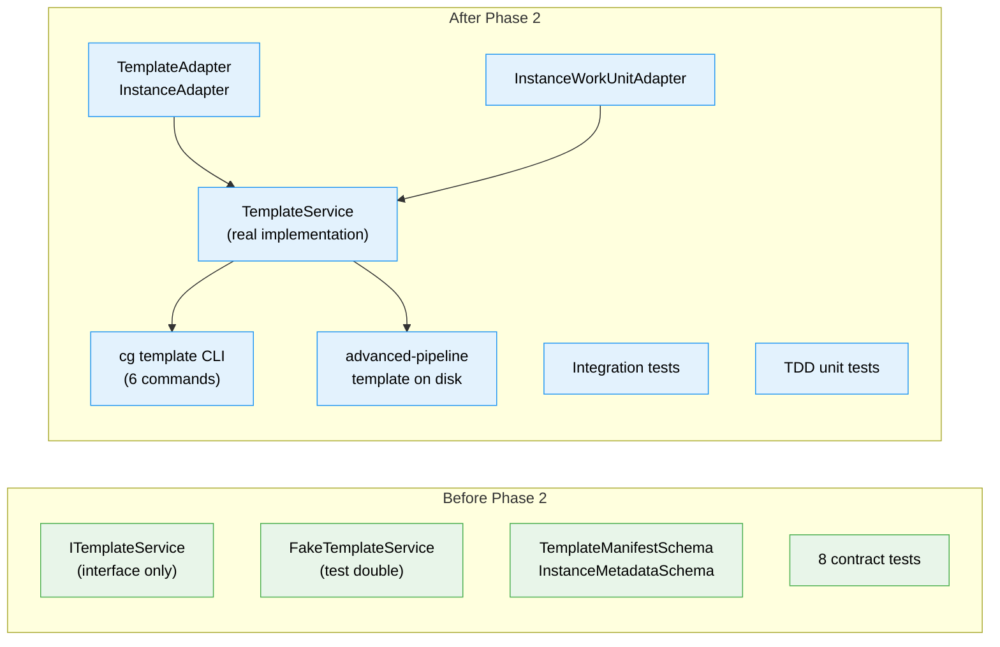

# Flight Plan: Phase 2 — Template/Instance Service + CLI Commands

**Plan**: [wf-web-plan.md](../../wf-web-plan.md)
**Phase**: Phase 2: Template/Instance Service + CLI Commands
**Generated**: 2026-02-25
**Status**: Landed

---

## Departure → Destination

**Where we are**: Phase 1 delivered schemas (TemplateManifestSchema, InstanceMetadataSchema), interfaces (ITemplateService with saveFrom, IInstanceService), fakes, and 8 passing contract tests. No real implementation yet — the system is typed but inert.

**Where we're going**: A developer can run `cg template save-from my-graph --as my-template` to save a working graph as a template, `cg template instantiate my-template --id sprint-42` to create an independent instance, and `cg template refresh my-template/sprint-42` to update units from the template. All operations validated by TDD unit tests + integration tests.

---

## Domain Context

### Domains We're Changing

| Domain | What Changes | Key Files |
|--------|-------------|-----------|
| _platform/positional-graph | New TemplateService implementation, TemplateAdapter, InstanceAdapter, InstanceWorkUnitAdapter | `packages/workflow/src/services/template.service.ts`, `packages/workflow/src/adapters/template.adapter.ts`, `packages/workflow/src/adapters/instance.adapter.ts`, `packages/positional-graph/src/adapters/instance-workunit.adapter.ts` |
| _platform/positional-graph (CLI) | New `cg template` command group | `apps/cli/src/commands/template.command.ts`, `apps/cli/src/lib/container.ts` |

### Domains We Depend On (no changes)

| Domain | What We Consume | Contract |
|--------|----------------|----------|
| _platform/file-ops | IFileSystem.copyDirectory, mkdir, readFile, writeFile, exists, glob | IFileSystem, IPathResolver |
| _platform/positional-graph | PositionalGraphDefinitionSchema, IWorkUnitLoader, WorkspaceContext | Zod schema, interface, type |

---

## Flight Status

**Legend**: grey = pending | yellow = active | red = blocked/needs input | green = done

---

## Stages

- [x] **Stage 1: Path adapters** — TemplateAdapter + InstanceAdapter for filesystem path resolution (`template.adapter.ts`, `instance.adapter.ts` — new files)
- [x] **Stage 2: saveFrom TDD** — Tests then implementation for saving graphs as templates (`template-service.test.ts`, `template.service.ts` — new files)
- [x] **Stage 3: list/show TDD** — Tests then implementation for template discovery (`template-service.test.ts`, `template.service.ts` — append)
- [x] **Stage 4: instantiate TDD** — Tests then implementation for template instantiation. Single destination dir with state.json (unified storage per Workshop 003) (`template-service.test.ts`, `template.service.ts` — append)
- [x] **Stage 5: refresh TDD** — Tests then implementation for unit refresh with active-run warning (`template-service.test.ts`, `template.service.ts` — append)
- [x] **Stage 6: InstanceWorkUnitAdapter** — Unit loader that resolves from instance-local paths (`instance-workunit.adapter.ts` — new file)
- [x] **Stage 7: Real template** — Build advanced-pipeline graph imperatively, save as template (`.chainglass/templates/workflows/advanced-pipeline/`)
- [x] **Stage 8: CLI commands** — 6 commands under `cg template` + DI wiring (`template.command.ts`, `container.ts` — new + modify)
- [x] **Stage 9: Integration test** — Script path validation after copy (`template-lifecycle.test.ts` — new file)

---

## Architecture: Before & After

**Legend**: existing (green, from Phase 1) | new (blue, created in Phase 2)

---

## Acceptance Criteria

- [ ] TemplateService implements all 6 ITemplateService methods (saveFrom, listWorkflows, showWorkflow, instantiate, listInstances, refresh)
- [ ] saveFrom strips runtime state (state.json, outputs/, events) and bundles units
- [ ] instantiate creates independent instance + fresh runtime state (no separate activate step)
- [ ] refresh overwrites all units with warning on active runs
- [ ] InstanceWorkUnitAdapter resolves units from instance-local paths
- [ ] 6 CLI commands registered under `cg template`
- [ ] advanced-pipeline template exists on disk (4 lines, 6 nodes, 6 units)
- [ ] Integration test proves script paths work after copy
- [ ] All TDD tests pass with Test Doc format
- [ ] Contract tests pass for Real implementation (extend from Phase 1)

## Goals & Non-Goals

**Goals**: Real TemplateService, path adapters, CLI commands, first template, integration tests
**Non-Goals**: No orchestration changes, no web UI, no old workgraph modifications

---

## Checklist

- [x] T001: Create TemplateAdapter
- [x] T002: Create InstanceAdapter
- [x] T003: TDD saveFrom tests
- [x] T004: Implement TemplateService.saveFrom()
- [x] T005: TDD list/show tests
- [x] T006: Implement listWorkflows() + showWorkflow()
- [x] T007: TDD instantiate tests
- [x] T008: Implement TemplateService.instantiate()
- [x] T009: TDD refresh tests
- [x] T010: Implement TemplateService.refresh()
- [x] T011: Create InstanceWorkUnitAdapter
- [x] T012: Build and save advanced-pipeline template
- [x] T013: Register CLI command group + DI wiring
- [x] T014: CLI save-from
- [x] T015: CLI list + show
- [x] T016: CLI instantiate
- [x] T017: CLI refresh
- [x] T018: CLI instances
- [x] T019: Integration test: script paths
