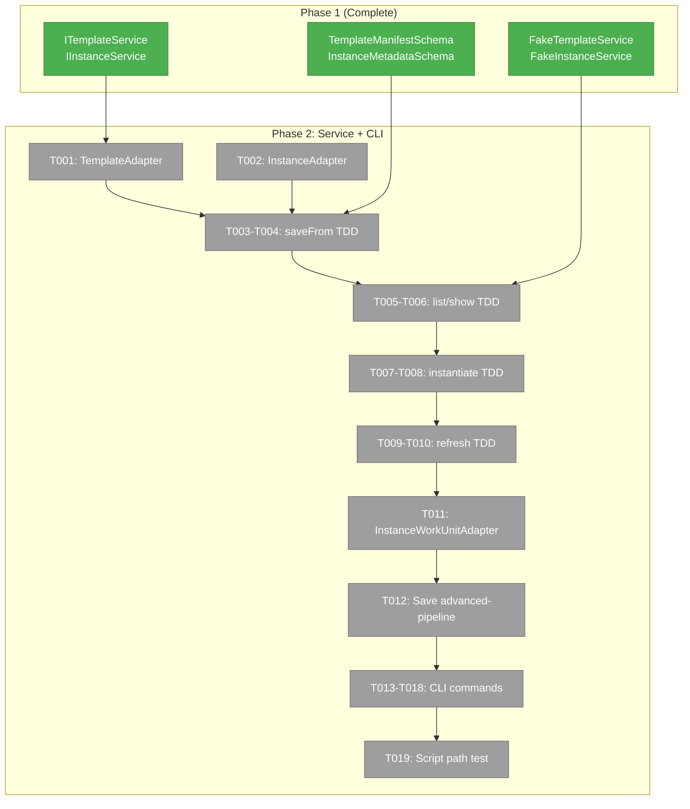
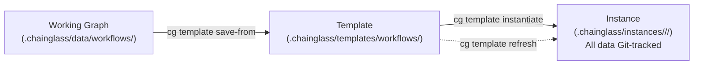
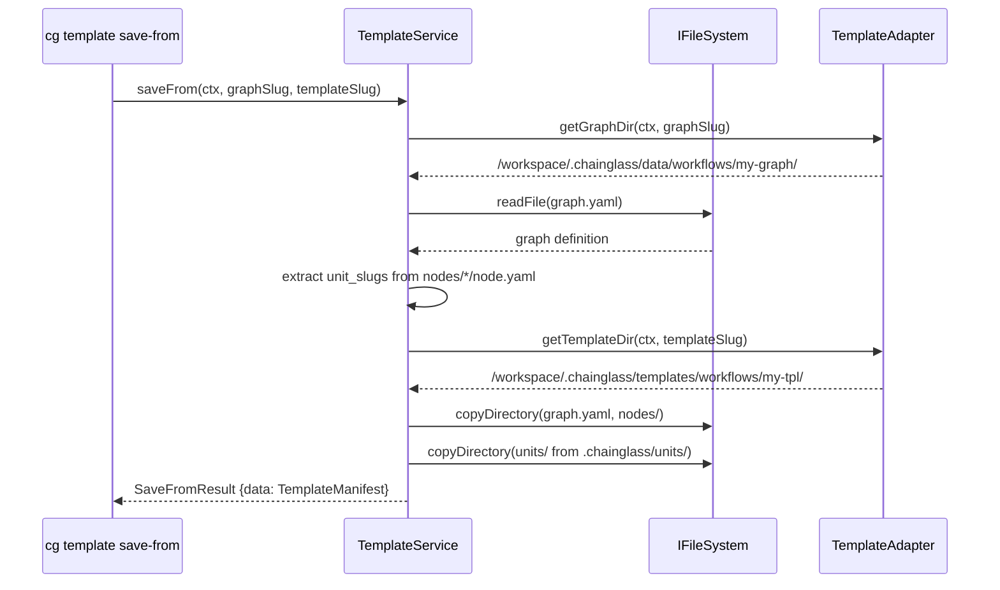

# Phase 2: Template/Instance Service + CLI Commands

## Executive Briefing

- **Purpose**: Build the real TemplateService implementation and CLI commands so the template/instance lifecycle can be validated through actual `cg template` usage. This is the core implementation phase — everything from Phase 1 (schemas, interfaces, fakes) gets wired to real filesystem operations and a real CLI.
- **What We're Building**: A TemplateService that can save working graphs as templates, list/show templates, instantiate templates into independent instances, and refresh instance units. Plus 6 CLI commands (`save-from`, `list`, `show`, `instantiate`, `refresh`, `instances`) and an InstanceWorkUnitAdapter that resolves units from instance-local paths.
- **Goals**:
  - ✅ `TemplateService` real implementation (all 6 ITemplateService methods)
  - ✅ `TemplateAdapter` + `InstanceAdapter` for path resolution
  - ✅ `InstanceWorkUnitAdapter` for instance-local unit loading
  - ✅ 6 CLI commands under `cg template`
  - ✅ First real template (advanced-pipeline saved from working graph)
  - ✅ Integration tests proving the full CLI → service → filesystem round-trip
- **Non-Goals**:
  - ❌ No orchestration changes (drive loop, ONBAS, ODS untouched)
  - ❌ No web UI (CLI-only)
  - ❌ No old workgraph system changes (deprecated, removal is OOS)

## Prior Phase Context

### Phase 1: Domain Finalization & Template Schema (Complete — 6/6 tasks)

**A. Deliverables**:
- `packages/workflow/src/schemas/workflow-template.schema.ts` — TemplateManifestSchema, TemplateNodeEntrySchema, TemplateUnitEntrySchema
- `packages/workflow/src/schemas/instance-metadata.schema.ts` — InstanceMetadataSchema, InstanceUnitEntrySchema
- `packages/workflow/src/interfaces/template-service.interface.ts` — ITemplateService (6 methods)
- `packages/workflow/src/interfaces/instance-service.interface.ts` — IInstanceService (getStatus)
- `packages/workflow/src/fakes/fake-template-service.ts` — FakeTemplateService with call tracking
- `packages/workflow/src/fakes/fake-instance-service.ts` — FakeInstanceService with call tracking
- `test/contracts/template-service.contract.ts` + `.test.ts` — 6 contract tests
- `test/contracts/instance-service.contract.ts` + `.test.ts` — 2 contract tests

**B. Dependencies Exported** (available for Phase 2):
- `ITemplateService`: saveFrom, listWorkflows, showWorkflow, instantiate, listInstances, refresh — all return `{data, errors}` Result pattern
- `IInstanceService`: getStatus — returns `{data: InstanceStatus | null, errors}`
- `TemplateManifest`, `InstanceMetadata` — Zod-derived types for return values
- `FakeTemplateService`, `FakeInstanceService` — for consumer tests
- All exported from `@chainglass/workflow` barrel

**C. Gotchas & Debt**:
- Templates reuse existing graph.yaml + node.yaml format (Workshop 002). No new YAML parser needed.
- All methods accept WorkspaceContext as first param — path-agnostic design.

**D. Incomplete Items**: None.

**E. Patterns to Follow**:
- ADR-0003: Zod schemas first, types via `z.infer<>`
- ADR-0004: DI via `useFactory`, no decorators
- Result pattern: `{data, errors}` not exceptions
- Fakes over mocks: call tracking arrays + return builders
- Contract tests: shared suites run against both Fake and Real

## Pre-Implementation Check

| File | Exists? | Domain Check | Notes |
|------|---------|-------------|-------|
| `packages/workflow/src/adapters/template.adapter.ts` | ❌ | ✅ Correct dir | New — 11 existing adapters in dir for pattern reference |
| `packages/workflow/src/adapters/instance.adapter.ts` | ❌ | ✅ Correct dir | New |
| `packages/workflow/src/services/template.service.ts` | ❌ | ✅ Correct dir | New — 11 existing services in dir for pattern reference |
| `packages/positional-graph/src/adapters/instance-workunit.adapter.ts` | ❌ | ✅ Correct dir | New — instance-local unit resolution |
| `apps/cli/src/commands/template.command.ts` | ❌ | ✅ Correct dir | New — follows workgraph.command.ts pattern |
| `apps/cli/src/lib/container.ts` | ✅ | N/A | Modify — add TemplateService DI registration |
| `test/unit/workflow/template-service.test.ts` | ❌ | ✅ | New — TDD tests |
| `test/integration/template-lifecycle.test.ts` | ❌ | ✅ | New — integration tests |
| `IFileSystem.copyDirectory()` | ✅ | N/A | Ready — async with `exclude?: string[]` option |

## Architecture Map



## Tasks

| Status | ID | Task | Domain | Path(s) | Done When | Notes |
|--------|-----|------|--------|---------|-----------|-------|
| [x] | T001 | Create `TemplateAdapter` | _platform/positional-graph | `packages/workflow/src/adapters/template.adapter.ts` | Resolves paths: `getTemplateDir(ctx, slug)` → `.chainglass/templates/workflows/<slug>/`, `getStandaloneUnitDir(ctx, slug)` → `.chainglass/templates/units/<slug>/`, `listTemplateSlugs(ctx)` via glob. Test Doc format for unit tests. | Follow WorkspaceDataAdapterBase pattern. Uses IFileSystem, IPathResolver. |
| [x] | T002 | Create `InstanceAdapter` | _platform/positional-graph | `packages/workflow/src/adapters/instance.adapter.ts` | Resolves paths: `getInstanceDir(ctx, wfSlug, instId)` → `.chainglass/instances/<wf>/<id>/`, `getInstanceUnitDir(ctx, wfSlug, instId, unitSlug)`, `listInstanceIds(ctx, wfSlug)` via glob. Test Doc format. | Override getDomainPath() per WorkUnitAdapter pattern. No data/instances/ path — all instance data (state.json, outputs, events) in same dir. Per Workshop 003 / Finding 08. |
| [x] | T003 | TDD: saveFrom tests (red→green) | _platform/positional-graph | `test/unit/workflow/template-service.test.ts` | Tests verify: graph.yaml copied, nodes/*/node.yaml copied, state.json excluded, outputs/ excluded, events excluded, units bundled from `.chainglass/units/`. Uses FakeFileSystem. Test Doc format. | TDD per constitution P3. Core of Workshop 002. |
| [x] | T004 | Implement `TemplateService.saveFrom()` | _platform/positional-graph | `packages/workflow/src/services/template.service.ts` | Reads graph from `.chainglass/data/workflows/<slug>/`, copies graph.yaml + nodes/*/node.yaml (only node.yaml, not outputs/data/events), extracts unit_slugs from all node.yaml, bundles units from `.chainglass/units/` → `templates/workflows/<tpl>/units/`. Passes T003 tests. | Uses IFileSystem.copyDirectory(). Register via useFactory per ADR-0004. |
| [x] | T005 | TDD: list/show tests (red→green) | _platform/positional-graph | `test/unit/workflow/template-service.test.ts` (append) | Tests verify: listWorkflows returns TemplateManifest[] from glob scan, showWorkflow returns single manifest or null. Uses FakeFileSystem with pre-populated template dirs. Test Doc format. | TDD per constitution P3. |
| [x] | T006 | Implement `TemplateService.listWorkflows()` + `showWorkflow()` | _platform/positional-graph | `packages/workflow/src/services/template.service.ts` (append) | Glob-discovers `.chainglass/templates/workflows/*/graph.yaml`, parses each graph.yaml + scans nodes/ for node count + scans units/ for unit count. Returns TemplateManifest[]. Passes T005 tests. | Glob discovery per PL-10. Graceful empty on missing dir. |
| [x] | T007 | TDD: instantiate tests (red→green) | _platform/positional-graph | `test/unit/workflow/template-service.test.ts` (append) | Tests verify: full directory copy from template to instance, instance.yaml written with correct metadata, state.json created in instance dir with `pending` status, units/ copied. Single destination — no data/ dir. Uses FakeFileSystem. Test Doc format. | TDD per constitution P3. Per Workshop 003: unified storage. |
| [x] | T008 | Implement `TemplateService.instantiate()` | _platform/positional-graph | `packages/workflow/src/services/template.service.ts` (append) | Copies template → instance dir (graph.yaml, nodes/, units/), writes instance.yaml, creates fresh state.json `{graph_status:"pending",nodes:{},questions:[]}` in same dir, chmod +x all .sh files. Single destination per Workshop 003. Passes T007 tests. | Uses IFileSystem.copyDirectory(). No dual-write. |
| [x] | T009 | TDD: refresh tests (red→green) | _platform/positional-graph | `test/unit/workflow/template-service.test.ts` (append) | Tests verify: each unit in instance overwritten from template, refreshed_at timestamps updated in instance.yaml, warns if state.json shows in_progress. Test Doc format. | TDD per constitution P3. |
| [x] | T010 | Implement `TemplateService.refresh()` | _platform/positional-graph | `packages/workflow/src/services/template.service.ts` (append) | For each unit in instance.yaml: rm instance unit dir → cp template unit dir. Update all refreshed_at timestamps. Read state.json to detect active run → return warning in errors[] if in_progress. Passes T009 tests. | Warn on active run per spec AC-16. |
| [x] | T011 | Create `InstanceWorkUnitAdapter` | _platform/positional-graph | `packages/positional-graph/src/adapters/instance-workunit.adapter.ts` | IWorkUnitLoader that resolves units from a given base path (e.g., `instances/<wf>/<id>/units/<slug>/`) instead of global `.chainglass/units/`. Constructor takes `basePath: string` — decoupled from instance naming scheme so DI factory can construct with any root. Loads unit.yaml, resolves prompt_template/script paths relative to base. Registered via `useFactory` per ADR-0004. Test Doc format for unit test. | Per finding 05. Elegant: accept base path, not (wfSlug, instanceId) — keeps adapter reusable for any context. Phase 3 wires the DI factory that selects between WorkUnitAdapter and InstanceWorkUnitAdapter based on execution context. |
| [x] | T012 | Build advanced-pipeline graph and save as template | _platform/positional-graph | `.chainglass/templates/workflows/advanced-pipeline/` | Build graph imperatively in temp workspace via buildAdvancedPipeline(), call saveFrom() to produce template, copy result to real worktree at `.chainglass/templates/workflows/advanced-pipeline/`. Committed artifact. Verify: graph.yaml has 4 lines 6 nodes, 6 units bundled, no state.json. Template-only — no instance created (instances tested in Phase 3). | First real template — validates saveFrom end-to-end on a real graph. Script outputs to real worktree, not temp. |
| [x] | T013 | Register CLI `cg template` command group + DI wiring | _platform/positional-graph | `apps/cli/src/commands/template.command.ts`, `apps/cli/src/lib/container.ts` | Command group registered with Commander. TemplateService resolved from DI container via TEMPLATE_SERVICE token + useFactory. All 6 subcommands scaffolded. | Follow workgraph.command.ts pattern. Add DI token to shared tokens. |
| [x] | T014 | CLI `cg template save-from <graph> --as <template>` | _platform/positional-graph | `apps/cli/src/commands/template.command.ts` | Resolves workspace context, calls service.saveFrom(), prints summary (line count, node count, units bundled). Returns exit 0 on success, exit 1 on error. | Primary template creation path. |
| [x] | T015 | CLI `cg template list` + `cg template show <slug>` | _platform/positional-graph | `apps/cli/src/commands/template.command.ts` | `list` prints table of templates (slug, nodes, units). `show` prints detailed template info (lines, nodes with unit refs, bundled units). | Validates template discovery. |
| [x] | T016 | CLI `cg template instantiate <slug> --id <id>` | _platform/positional-graph | `apps/cli/src/commands/template.command.ts` | Calls service.instantiate(), prints summary (instance path, graph status, units copied). | End-to-end: CLI → service → filesystem + runtime. |
| [x] | T017 | CLI `cg template refresh <slug>/<id>` | _platform/positional-graph | `apps/cli/src/commands/template.command.ts` | Calls service.refresh(), prints refreshed units. If active run detected, outputs warning and prompts for confirmation (--force to skip). | Per spec AC-16. |
| [x] | T018 | CLI `cg template instances <slug>` | _platform/positional-graph | `apps/cli/src/commands/template.command.ts` | Lists all instances of a template (instance ID, created_at, graph status). | Instance discovery. |
| [ ] | T019 | Integration test: script paths after copy | _platform/positional-graph | `test/integration/template-lifecycle.test.ts` | Copy a code unit (with scripts/simulate.sh) from template to instance, verify script is executable, verify script can read its own unit.yaml via relative path from CWD. Test Doc format. | Per finding 01 — critical risk. Scripts use $CG_WORKSPACE_PATH. |

## Context Brief

**Key findings from plan**:
- Finding 01 (Critical): Script relative paths may break when units copied to instances. Integration test T019 validates this.
- Finding 02 (High): `IFileSystem.copyDirectory()` already exists — inject and reuse, don't rebuild.
- Finding 03 (High): `InitService.hydrateStarterTemplates()` pattern — adopt similar copy structure.
- Finding 05 (High): WorkUnitAdapter hardcodes `.chainglass/units/` — InstanceWorkUnitAdapter (T011) resolves from instance-local paths.
- Finding 07 (High): Templates saved FROM working graphs — saveFrom() copies graph.yaml + nodes/*/node.yaml, strips runtime state. Per Workshop 002.
- Finding 08 (High): Instance data fully Git-tracked — all runtime data (state.json, outputs, events) under `.chainglass/instances/`, NOT gitignored `data/`. Per Workshop 003.

**Domain dependencies** (contracts this phase consumes):
- `_platform/file-ops`: `IFileSystem` (copyDirectory, mkdir, readFile, writeFile, exists, glob), `IPathResolver` (join, dirname) — core I/O for all template operations
- `_platform/positional-graph`: `WorkspaceContext` — first param of all service methods
- `_platform/positional-graph`: `ResultError` — error return pattern
- `_platform/positional-graph`: `PositionalGraphDefinitionSchema` — validate graph.yaml during saveFrom
- `_platform/positional-graph`: `IWorkUnitLoader` — interface for InstanceWorkUnitAdapter

**Domain constraints**:
- ADR-0004: All DI via `useFactory`. No decorators.
- ADR-0012: CLI commands are Consumer domain — thin wrappers calling service methods.
- No imports from `@chainglass/workgraph` (deprecated domain).
- Schema validation: use existing Zod schemas where possible (PositionalGraphDefinitionSchema for graph.yaml).

**Reusable from Phase 1**:
- `ITemplateService`, `IInstanceService` interfaces — implement these
- `TemplateManifestSchema`, `InstanceMetadataSchema` — return types
- `FakeTemplateService` — for consumer tests (CLI command tests)
- Contract tests — extend with Real implementation in this phase

**Mermaid flow diagram** (template lifecycle):


**Mermaid sequence diagram** (save-from flow):


## Discoveries & Learnings

_Populated during implementation by plan-6._

| Date | Task | Type | Discovery | Resolution | References |
|------|------|------|-----------|------------|------------|

---

```
docs/plans/048-wf-web/
  ├── wf-web-plan.md
  ├── wf-web-spec.md
  ├── research-dossier.md
  ├── workshops/
  │   ├── 001-template-instance-directory-layout.md
  │   └── 002-template-creation-flow-and-node-identity.md
  └── tasks/
      ├── phase-1-schema-and-interfaces/ (complete)
      └── phase-2-template-service-and-cli/
          ├── tasks.md                    ← this file
          ├── tasks.fltplan.md            ← flight plan
          └── execution.log.md           # created by plan-6
```
