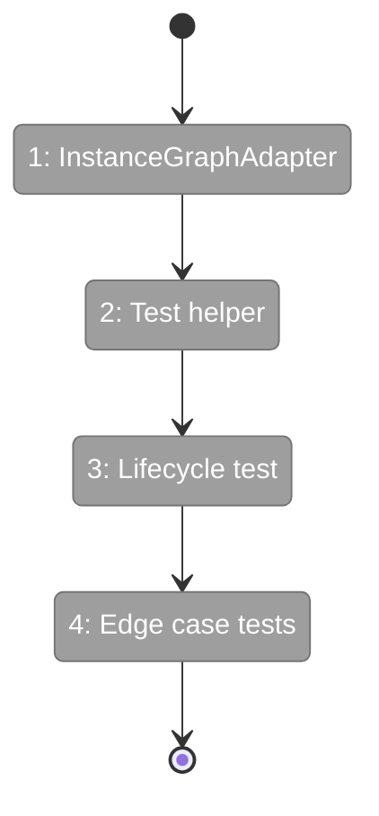
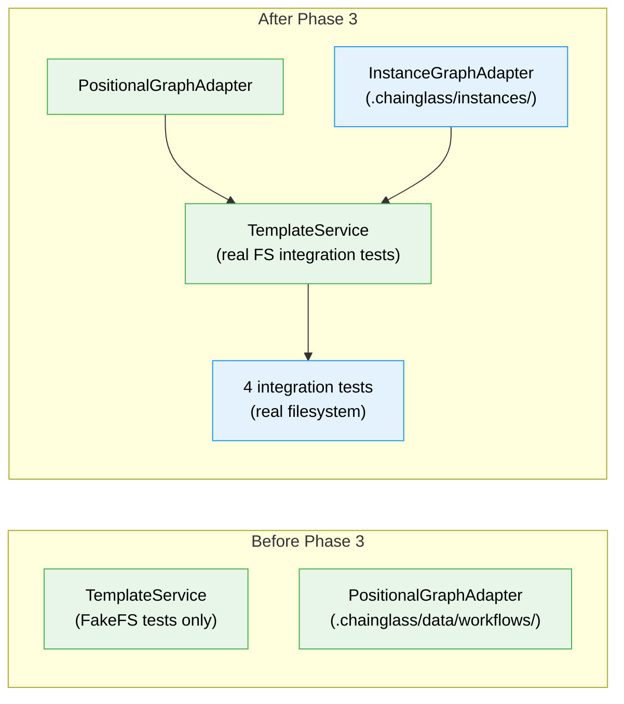

# Flight Plan: Phase 3 — Integration Testing & Instance Orchestration

**Plan**: [wf-web-plan.md](../../wf-web-plan.md)
**Phase**: Phase 3: Integration Testing & Instance Orchestration
**Generated**: 2026-02-25
**Status**: Ready for takeoff

---

## Departure → Destination

**Where we are**: Phases 1-2 delivered schemas, interfaces, fakes, a real TemplateService (6 methods), 6 CLI commands, an InstanceWorkUnitAdapter, and 27 passing tests — all validated with FakeFileSystem. The advanced-pipeline template exists on disk. No integration with the real graph engine yet.

**Where we're going**: A developer can build a graph, save it as a template, instantiate it, and verify the instance is runnable — all proven by integration tests using real filesystem I/O and real YAML parsing. Edge cases (multi-instance isolation, refresh safety, template isolation) are verified.

---

## Domain Context

### Domains We're Changing

| Domain | What Changes | Key Files |
|--------|-------------|-----------|
| _platform/positional-graph | New InstanceGraphAdapter for instance path routing | `packages/positional-graph/src/adapter/instance-graph.adapter.ts` |

### Domains We Depend On (no changes)

| Domain | What We Consume | Contract |
|--------|----------------|----------|
| _platform/positional-graph | IPositionalGraphService (graph CRUD) | Build graphs for test setup |
| _platform/positional-graph | TemplateService (saveFrom, instantiate, refresh) | Phase 2 implementation |
| _platform/file-ops | NodeFileSystemAdapter, PathResolverAdapter | Real filesystem for integration tests |

---

## Flight Status

**Legend**: grey = pending | yellow = active | red = blocked/needs input | green = done

---

## Stages

- [ ] **Stage 1: InstanceGraphAdapter** — TDD adapter that routes graph engine to instance directories (`instance-graph.adapter.ts` — new file)
- [ ] **Stage 2: Test helper setup** — Shared integration test infrastructure with real filesystem (`template-instance-orchestration.test.ts` — new file)
- [ ] **Stage 3: Full lifecycle test** — save-from → instantiate → verify runnable (AC-6)
- [ ] **Stage 4: Edge case tests** — Multi-instance isolation (AC-8), refresh safety (AC-16), template isolation (AC-7, AC-12)

---

## Architecture: Before & After

**Legend**: existing (green, from Phase 1-2) | new (blue, created in Phase 3)

---

## Acceptance Criteria

- [ ] InstanceGraphAdapter routes to `.chainglass/instances/<wf>/<id>/`
- [ ] Integration test proves save-from → instantiate → instance is runnable (AC-6)
- [ ] Integration test proves multiple instances are independent (AC-8)
- [ ] Integration test proves refresh warns on active run (AC-16)
- [ ] Integration test proves template edits don't affect instances (AC-7, AC-12)

## Goals & Non-Goals

**Goals**: InstanceGraphAdapter, 4 integration tests with real filesystem, edge case coverage
**Non-Goals**: No actual agent execution, no orchestration loop changes, no CLI changes

---

## Checklist

- [ ] T001: TDD InstanceGraphAdapter tests
- [ ] T002: Implement InstanceGraphAdapter
- [ ] T003: Integration test helper setup
- [ ] T004: Full lifecycle test (save-from → instantiate → verify)
- [ ] T005: Multi-instance isolation test
- [ ] T006: Refresh safety test
- [ ] T007: Template isolation test
