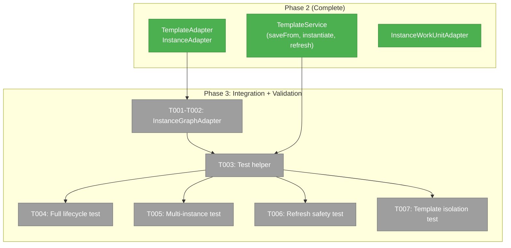
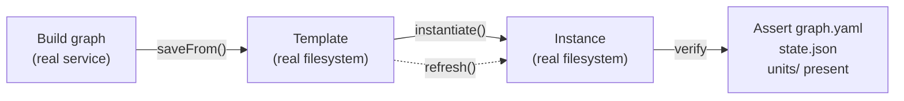
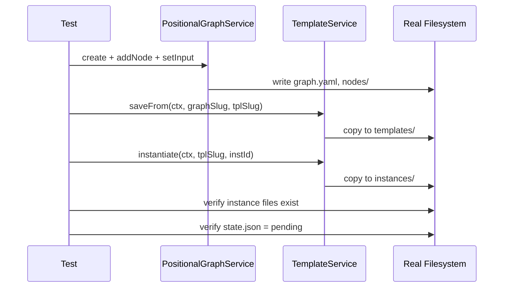

# Phase 3: Integration Testing & Instance Validation

## Executive Briefing

- **Purpose**: Prove the template/instance system works end-to-end with real filesystem operations and the real graph engine. Phase 2 validated with FakeFileSystem; Phase 3 validates with real disk I/O, real YAML parsing, and real graph state management.
- **What We're Building**: An instance-aware graph adapter that lets the orchestration engine read/write to instance directories, plus 4 integration tests proving isolation, refresh safety, and full lifecycle correctness.
- **Goals**:
  - ✅ `InstanceGraphAdapter` — graph engine reads/writes to `.chainglass/instances/<wf>/<id>/`
  - ✅ Full lifecycle proof: save-from → instantiate → verify graph runnable
  - ✅ Instance isolation: multiple instances, independent state
  - ✅ Refresh safety: warning on active run, content updated correctly
  - ✅ Template isolation: template edits don't affect existing instances
- **Non-Goals**:
  - ❌ No actual agent execution (drive to completion with real LLM agents)
  - ❌ No orchestration loop changes (ONBAS, ODS, Reality untouched)
  - ❌ No CLI changes
  - ❌ No web UI

## Prior Phase Context

### Phase 1: Domain Finalization & Template Schema (Complete — 6/6 tasks)

**A. Deliverables**: Zod schemas (TemplateManifestSchema, InstanceMetadataSchema), interfaces (ITemplateService, IInstanceService), fakes, 8 contract tests.

**B. Dependencies Exported**: All types via `z.infer<>`, interfaces with Result pattern `{data, errors}`, fakes with call tracking + return builders.

**C. Gotchas & Debt**: None. Templates reuse existing graph.yaml + node.yaml format (Workshop 002).

**D. Incomplete Items**: None.

**E. Patterns to Follow**: Interface-first, fakes over mocks, contract test parity, Zod schema source of truth, Result pattern.

### Phase 2: Template/Instance Service + CLI (Complete — 19/19 tasks)

**A. Deliverables**: TemplateService (6 methods), TemplateAdapter, InstanceAdapter, InstanceWorkUnitAdapter, 6 CLI commands, advanced-pipeline template, 24 unit tests + 3 integration tests.

**B. Dependencies Exported**: Real TemplateService implementation, path adapters, DI tokens (TEMPLATE_SERVICE, TEMPLATE_ADAPTER, INSTANCE_ADAPTER), InstanceWorkUnitAdapter with basePath constructor.

**C. Gotchas & Debt**: InstanceWorkUnitAdapter DI factory wiring deferred to Phase 3. TemplateService uses concrete adapter types (F003 noted but deferred). Script chmod is no-op with FakeFileSystem.

**D. Incomplete Items**: None. Instance execution context (DI adapter selection) carries forward.

**E. Patterns to Follow**: TDD red→green, Result pattern, useFactory DI, WorkspaceDataAdapterBase override for tracked storage, FakeFileSystem pre-population for unit tests. For integration tests: use real NodeFileSystemAdapter + temp dirs.

## Pre-Implementation Check

| File | Exists? | Domain Check | Notes |
|------|---------|-------------|-------|
| `packages/positional-graph/src/adapter/instance-graph.adapter.ts` | ❌ | ✅ Correct dir | New — follows PositionalGraphAdapter pattern |
| `test/integration/template-instance-orchestration.test.ts` | ❌ | ✅ | New — integration tests with real filesystem |
| `test/helpers/positional-graph-e2e-helpers.ts` | ✅ | N/A | Has `createTestServiceStack()` — reuse for Phase 3 |
| `dev/test-graphs/shared/graph-test-runner.ts` | ✅ | N/A | Has `withTestGraph()` — reuse for graph creation |
| `packages/positional-graph/src/adapter/index.ts` | ✅ | N/A | Modify — add InstanceGraphAdapter export |

## Architecture Map



## Tasks

| Status | ID | Task | Domain | Path(s) | Done When | Notes |
|--------|-----|------|--------|---------|-----------|-------|
| [ ] | T001 | TDD: InstanceGraphAdapter tests | _platform/positional-graph | `test/unit/positional-graph/instance-graph-adapter.test.ts` | Tests verify: getGraphDir() returns `.chainglass/instances/<wf>/<id>/`, overrides getDomainPath(), validates slug pattern. Uses FakeFileSystem. Test Doc format. | TDD per constitution P3. Follows PositionalGraphAdapter pattern. |
| [ ] | T002 | Implement `InstanceGraphAdapter` | _platform/positional-graph | `packages/positional-graph/src/adapter/instance-graph.adapter.ts` | Extends PositionalGraphAdapter, overrides getGraphDir() to return pre-resolved instance path (slug arg ignored — adapter is scoped to one instance). Constructor: `(fs, pathResolver, instancePath: string)`. Clean Architecture: same interface as PositionalGraphAdapter, swapped via child container per execution context using useFactory. Barrel export added. Passes T001 tests. | Idiomatic DI pattern: child container + factory selects adapter. Follows InstanceWorkUnitAdapter precedent (basePath constructor). PositionalGraphService unchanged — depends on adapter interface, not concrete class. |
| [ ] | T003 | Create integration test helper for template lifecycle | _platform/positional-graph | `test/integration/template-instance-orchestration.test.ts` | Shared `beforeEach` that: creates temp dir, copies units from dev/test-graphs/advanced-pipeline, wires real TemplateService + PositionalGraphService with NodeFileSystemAdapter, builds graph via service calls, saves as template. Cleanup in afterEach. | Reuse patterns from `test/helpers/positional-graph-e2e-helpers.ts` and `dev/test-graphs/shared/graph-test-runner.ts`. |
| [ ] | T004 | Integration test: save-from → instantiate → verify runnable | _platform/positional-graph | `test/integration/template-instance-orchestration.test.ts` | Build graph with real service, save as template, instantiate, verify: instance dir has graph.yaml + nodes/ + units/ + state.json (pending), graph.yaml parseable by real YAML parser, node count matches. Test Doc format. | Full lifecycle proof — plan task 3.2. AC-6. |
| [ ] | T005 | Integration test: multiple instances from same template | _platform/positional-graph | `test/integration/template-instance-orchestration.test.ts` | Instantiate same template twice with different IDs, verify: both instance dirs exist independently, each has its own state.json, modifying state in one doesn't affect the other. Test Doc format. | Proves instance isolation — plan task 3.3. AC-8. |
| [ ] | T006 | Integration test: refresh during active run | _platform/positional-graph | `test/integration/template-instance-orchestration.test.ts` | Instantiate, manually set state.json to `in_progress`, call refresh, verify: ACTIVE_RUN_WARNING in errors, units still refreshed, state.json unchanged by refresh. Test Doc format. | Proves refresh safety — plan task 3.4. AC-16. |
| [ ] | T007 | Integration test: template modification doesn't affect instance | _platform/positional-graph | `test/integration/template-instance-orchestration.test.ts` | Instantiate, then modify a template unit's prompt file, verify: instance unit prompt unchanged. Then refresh and verify: instance unit now matches updated template. Test Doc format. | Proves template isolation + refresh correctness — plan task 3.5. AC-7, AC-12. |

## Context Brief

**Key findings from plan**:
- Finding 01 (Critical): Script paths validated in Phase 2 T019 — Phase 3 builds on this with real filesystem
- Finding 05 (High): InstanceWorkUnitAdapter created in Phase 2, DI factory wiring for Phase 3
- Finding 08 (High): Unified storage — all instance data at `.chainglass/instances/` (Workshop 003)

**Domain dependencies** (contracts this phase consumes):
- `_platform/positional-graph`: `IPositionalGraphService` — build graphs imperatively for test setup
- `_platform/positional-graph`: `PositionalGraphAdapter` — pattern reference for InstanceGraphAdapter
- `_platform/positional-graph`: `PositionalGraphService` constructor — accepts adapter via DI
- `_platform/file-ops`: `NodeFileSystemAdapter`, `PathResolverAdapter` — real filesystem for integration tests
- `_platform/positional-graph`: `ITemplateService` (via TemplateService) — saveFrom, instantiate, refresh

**Domain constraints**:
- ADR-0004: InstanceGraphAdapter registered via useFactory
- Workshop 003: Instance data at `.chainglass/instances/` (tracked), not `.chainglass/data/`
- No changes to orchestration internals (ONBAS, ODS, Reality)

**Reusable from prior phases**:
- `TemplateService` (Phase 2) — saveFrom, instantiate, refresh
- `TemplateAdapter`, `InstanceAdapter` (Phase 2) — path resolution
- `createTestServiceStack()` from `test/helpers/positional-graph-e2e-helpers.ts`
- `withTestGraph()` from `dev/test-graphs/shared/graph-test-runner.ts`
- `advanced-pipeline` template at `.chainglass/templates/workflows/advanced-pipeline/`
- `dev/test-graphs/advanced-pipeline/units/` — real unit fixtures

**Mermaid flow diagram** (integration test lifecycle):


**Mermaid sequence diagram** (full lifecycle test):


## Discoveries & Learnings

_Populated during implementation by plan-6._

| Date | Task | Type | Discovery | Resolution | References |
|------|------|------|-----------|------------|------------|

---

```
docs/plans/048-wf-web/
  ├── wf-web-plan.md
  ├── wf-web-spec.md
  ├── research-dossier.md
  ├── workshops/
  │   ├── 001-template-instance-directory-layout.md
  │   ├── 002-template-creation-flow-and-node-identity.md
  │   └── 003-instance-unified-storage.md
  └── tasks/
      ├── phase-1-schema-and-interfaces/ (complete)
      ├── phase-2-template-service-and-cli/ (complete)
      └── phase-3-integration-and-validation/
          ├── tasks.md                    ← this file
          ├── tasks.fltplan.md            ← flight plan
          └── execution.log.md           # created by plan-6
```
