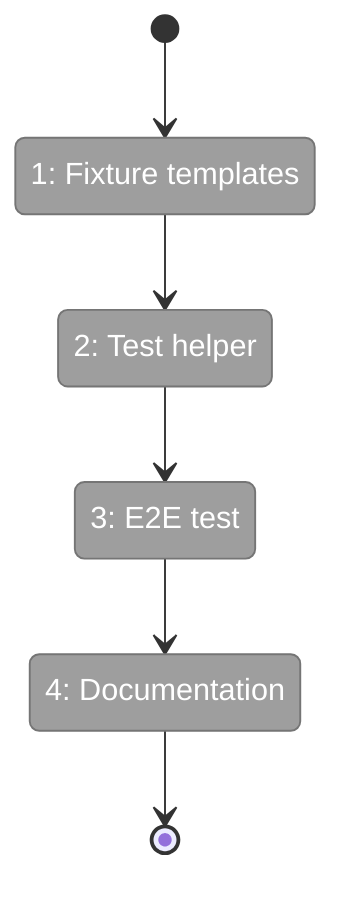
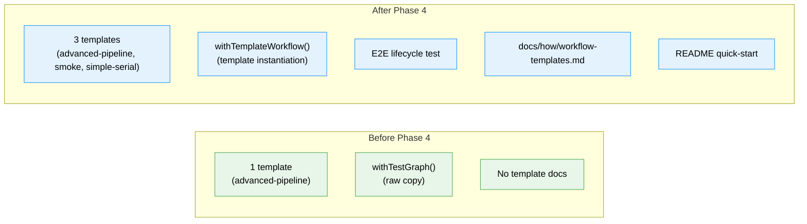

# Flight Plan: Phase 4 — E2E Test Migration & Documentation

**Plan**: [wf-web-plan.md](../../wf-web-plan.md)
**Phase**: Phase 4: E2E Test Migration & Documentation
**Generated**: 2026-02-26
**Status**: Ready for takeoff

---

## Departure → Destination

**Where we are**: Phases 1-3 delivered schemas, interfaces, a real TemplateService with 6 CLI commands, an InstanceGraphAdapter, and 46 passing tests (unit + integration) proving the template lifecycle works. One committed template (advanced-pipeline) exists. No fixture migration, no test helper, no docs yet.

**Where we're going**: Two more fixtures (smoke, simple-serial) exist as committed templates. A `withTemplateWorkflow()` helper lets any test instantiate a template into a temp workspace. An e2e test proves the full lifecycle. User documentation teaches `cg template` usage.

---

## Domain Context

### Domains We're Changing

| Domain | What Changes | Key Files |
|--------|-------------|-----------|
| _platform/positional-graph | 2 new templates, test helper, e2e test | `.chainglass/templates/workflows/smoke/`, `simple-serial/`, `dev/test-graphs/shared/template-test-runner.ts`, `test/e2e/` |
| consumer (docs) | User documentation | `docs/how/workflow-templates.md`, `README.md` |

### Domains We Depend On (no changes)

| Domain | What We Consume | Contract |
|--------|----------------|----------|
| _platform/positional-graph | TemplateService, PositionalGraphService | saveFrom, instantiate, refresh, create, addNode |
| _platform/file-ops | NodeFileSystemAdapter | Real filesystem for template generation + e2e |

---

## Flight Status

**Legend**: grey = pending | yellow = active | red = blocked/needs input | green = done

---

## Stages

- [ ] **Stage 1: Fixture templates** — Generate smoke + simple-serial templates from fixtures (committed artifacts)
- [ ] **Stage 2: Test helper** — Create `withTemplateWorkflow()` in `dev/test-graphs/shared/template-test-runner.ts`
- [ ] **Stage 3: E2E test** — Full lifecycle test using withTemplateWorkflow (AC-21)
- [ ] **Stage 4: Documentation** — User guide + README quick-start

---

## Architecture: Before & After

**Legend**: existing (green, from Phase 1-3) | new (blue, created in Phase 4)

---

## Acceptance Criteria

- [ ] smoke and simple-serial fixtures exist as committed templates (AC-20 partial)
- [ ] withTemplateWorkflow() helper creates temp instance from template
- [ ] E2E test validates full lifecycle: instantiate → verify → refresh → verify (AC-21)
- [ ] docs/how/workflow-templates.md covers concepts, layout, CLI, refresh, Git
- [ ] README has cg template quick-start

## Goals & Non-Goals

**Goals**: 2 fixture templates, test helper, e2e test, user docs, README update
**Non-Goals**: No bulk fixture conversion (only smoke + simple-serial), no old test removal, no code changes

---

## Checklist

- [ ] T001: Generate smoke template
- [ ] T002: Generate simple-serial template
- [ ] T003: Create withTemplateWorkflow() helper
- [ ] T004: E2E lifecycle test
- [ ] T005: Write workflow-templates.md
- [ ] T006: Update README
