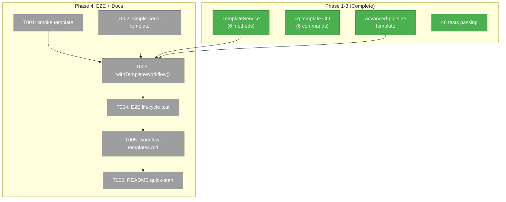
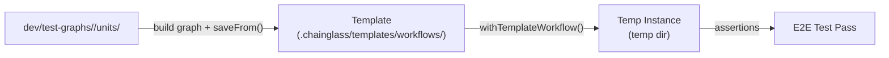
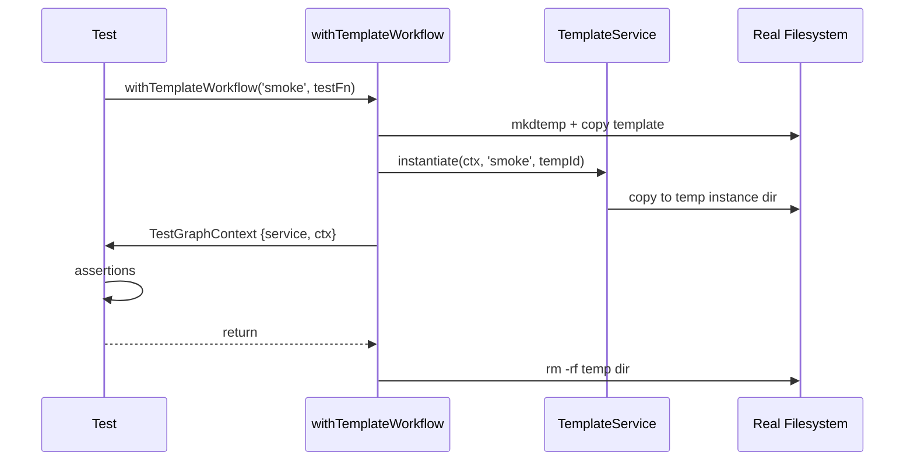

# Phase 4: E2E Test Migration & Documentation

## Executive Briefing

- **Purpose**: Port existing e2e test fixtures to the template system and write user documentation. This closes the loop — fixtures become templates, tests prove the template lifecycle end-to-end, and docs teach users how to use it.
- **What We're Building**: Workflow templates generated from existing fixtures (smoke, simple-serial), a `withTemplateWorkflow()` test helper that instantiates templates instead of copying raw dirs, a lifecycle e2e test, and user-facing documentation.
- **Goals**:
  - ✅ Smoke and simple-serial fixtures converted to workflow templates
  - ✅ `withTemplateWorkflow()` helper for template-based test setup
  - ✅ E2E test validating full template lifecycle (AC-21)
  - ✅ `docs/how/workflow-templates.md` user guide
  - ✅ README quick-start for `cg template` commands
- **Non-Goals**:
  - ❌ Converting ALL 8 fixtures (only smoke + simple-serial — others deferred)
  - ❌ Removing old `withTestGraph()` helper (parallel paths during migration)
  - ❌ Removing old `dev/test-graphs/` fixtures (they stay as source material)
  - ❌ Changes to CLI, service, or adapter code

## Prior Phase Context

### Phase 1: Domain Finalization & Template Schema (Complete — 6/6)

**A. Deliverables**: Zod schemas, interfaces (ITemplateService, IInstanceService), fakes, 8 contract tests.
**B. Dependencies**: TemplateManifest, InstanceMetadata types, Result pattern, fakes with return builders.
**C. Gotchas**: Templates reuse graph.yaml + node.yaml format (Workshop 002). No new YAML parser.
**D. Incomplete**: None.
**E. Patterns**: Zod-first, interface-first, fakes over mocks, contract parity, Result pattern.

### Phase 2: Template/Instance Service + CLI (Complete — 19/19)

**A. Deliverables**: TemplateService (6 methods), TemplateAdapter, InstanceAdapter, InstanceWorkUnitAdapter, 6 CLI commands, advanced-pipeline template, 24 unit + 3 integration tests.
**B. Dependencies**: Real TemplateService, path adapters, DI tokens, InstanceWorkUnitAdapter(basePath).
**C. Gotchas**: Unified instance storage (Workshop 003). Script chmod no-op with FakeFS. InstanceWorkUnitAdapter DI factory deferred.
**D. Incomplete**: None.
**E. Patterns**: TDD, useFactory DI, WorkspaceDataAdapterBase override, single-destination instances, glob discovery.

### Phase 3: Integration Testing & Instance Validation (Complete — 7/7)

**A. Deliverables**: InstanceGraphAdapter, 6 unit tests, 5 integration tests (real filesystem).
**B. Dependencies**: InstanceGraphAdapter (pre-resolved basePath, Liskov-substitutable).
**C. Gotchas**: listGraphSlugs() overridden to return [] (single-instance scope). State.json shape differs between engine and template service.
**D. Incomplete**: None.
**E. Patterns**: Adapter substitution via DI child container, real filesystem for integration tests, three-stage verification.

## Pre-Implementation Check

| File | Exists? | Domain Check | Notes |
|------|---------|-------------|-------|
| `.chainglass/templates/workflows/smoke/` | ❌ | ✅ | New — generated from dev/test-graphs/smoke/ |
| `.chainglass/templates/workflows/simple-serial/` | ❌ | ✅ | New — generated from dev/test-graphs/simple-serial/ |
| `dev/test-graphs/shared/template-test-runner.ts` | ❌ | ✅ | New — withTemplateWorkflow() helper |
| `test/e2e/template-lifecycle.e2e.test.ts` | ❌ | ✅ | New — e2e lifecycle test |
| `docs/how/workflow-templates.md` | ❌ | ✅ | New — user guide |
| `docs/how/workflows/2-template-authoring.md` | ✅ | N/A | Existing — documents OLD wf.yaml system, needs update or replacement |
| `.chainglass/templates/workflows/advanced-pipeline/` | ✅ | N/A | Already exists from Phase 2 T012 |

## Architecture Map



## Tasks

| Status | ID | Task | Domain | Path(s) | Done When | Notes |
|--------|-----|------|--------|---------|-----------|-------|
| [ ] | T001 | Generate `smoke` workflow template from fixture | _platform/positional-graph | `.chainglass/templates/workflows/smoke/` | Template dir contains: graph.yaml (1 line, 1 node), nodes/*/node.yaml, units/ping/ with unit.yaml + scripts/ping.sh. Graph built imperatively via script, saved with saveFrom(). No state.json. | Simplest fixture — proves template generation pattern. Plan task 4.1. |
| [ ] | T002 | Generate `simple-serial` workflow template from fixture | _platform/positional-graph | `.chainglass/templates/workflows/simple-serial/` | Template dir contains: graph.yaml (2 lines, 2 nodes: setup → worker), nodes/*/node.yaml with input wiring, units/setup/ + units/worker/ with unit.yaml + scripts/. | Second fixture, tests input wiring preservation. Plan task 4.2. |
| [ ] | T003 | Create `withTemplateWorkflow()` test helper | _platform/positional-graph | `dev/test-graphs/shared/template-test-runner.ts` | Helper that: takes template slug, creates temp dir, wires TemplateService with real FS, calls instantiate(), returns TestGraphContext with service + ctx pointing at instance. Cleanup in finally block. Coexists with existing withTestGraph(). | Plan task 4.4. Follows withTestGraph() pattern. |
| [ ] | T004 | E2E test: template lifecycle | _platform/positional-graph | `test/e2e/template-lifecycle.e2e.test.ts` | Test flow: use withTemplateWorkflow('smoke') to instantiate, verify graph ready (pending state, node present), modify template unit, verify instance unchanged, refresh, verify instance updated, create second instance, verify independent. Test Doc format. | Plan task 4.5. Proves AC-21. |
| [ ] | T005 | Write `docs/how/workflow-templates.md` | _platform/positional-graph | `docs/how/workflow-templates.md` | Covers: template/instance concepts, directory layout (.chainglass/templates/ and .chainglass/instances/), CLI commands (save-from, list, show, instantiate, refresh, instances), refresh workflow, Git integration, relationship to old wf.yaml system (deprecated). | Plan task 4.6. Spec documentation strategy. |
| [ ] | T006 | Update README with template CLI quick-start | consumer | `README.md` | Add section with 6 `cg template` commands: save-from, list, show, instantiate, refresh, instances. Brief usage examples. Link to full docs/how/ guide. | Plan task 4.7. Spec documentation strategy. |

## Context Brief

**Key findings from plan**:
- Finding 06 (Medium): Test fixtures in dev/test-graphs/ hardcode `.chainglass/units/` in graph-test-runner.ts — withTemplateWorkflow() sidesteps this by using template instantiation
- Finding 01 (Critical, mitigated): Script paths validated in Phase 2 T019 and Phase 3 integration tests

**Domain dependencies** (contracts this phase consumes):
- `_platform/positional-graph`: `IPositionalGraphService` — build graphs for fixture conversion
- `_platform/positional-graph`: `TemplateService` (saveFrom, instantiate) — template operations
- `_platform/file-ops`: `NodeFileSystemAdapter` — real filesystem for template generation and e2e tests

**Domain constraints**:
- Templates are committed artifacts — generated files go into `.chainglass/templates/workflows/`
- Old fixtures in `dev/test-graphs/` are NOT removed — parallel paths during migration
- Documentation covers the NEW positional graph template system, not the old wf.yaml/phases system

**Reusable from prior phases**:
- `TemplateService` (Phase 2) — saveFrom, instantiate
- `withTestGraph()` from `dev/test-graphs/shared/graph-test-runner.ts` — pattern reference for withTemplateWorkflow()
- `advanced-pipeline` template at `.chainglass/templates/workflows/advanced-pipeline/` — existing committed template
- Integration test infrastructure from Phase 3 (`setupTestWorkspace()` pattern)

**Mermaid flow diagram** (fixture → template → test):


**Mermaid sequence diagram** (withTemplateWorkflow helper):


## Discoveries & Learnings

_Populated during implementation by plan-6._

| Date | Task | Type | Discovery | Resolution | References |
|------|------|------|-----------|------------|------------|

---

```
docs/plans/048-wf-web/
  ├── wf-web-plan.md
  ├── wf-web-spec.md
  ├── research-dossier.md
  ├── workshops/
  │   ├── 001-template-instance-directory-layout.md
  │   ├── 002-template-creation-flow-and-node-identity.md
  │   └── 003-instance-unified-storage.md
  └── tasks/
      ├── phase-1-schema-and-interfaces/ (complete)
      ├── phase-2-template-service-and-cli/ (complete)
      ├── phase-3-integration-and-validation/ (complete)
      └── phase-4-e2e-and-docs/
          ├── tasks.md                    ← this file
          ├── tasks.fltplan.md            ← flight plan
          └── execution.log.md           # created by plan-6
```
