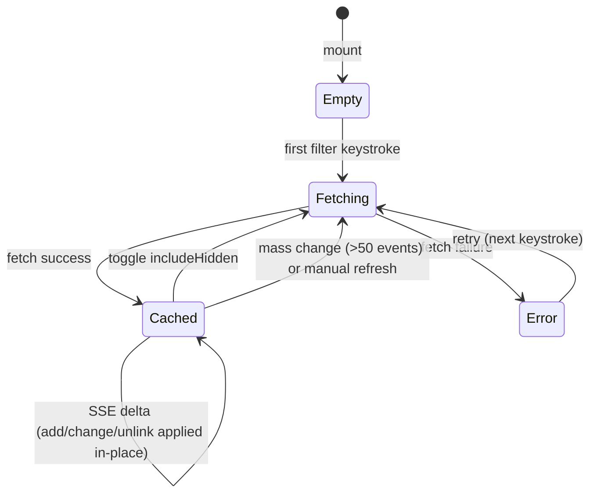

# Workshop: File Scanner Cache & Event Integration

**Type**: Integration Pattern
**Plan**: 049-ux-enhancements
**Spec**: [ux-enhancements-spec.md](../ux-enhancements-spec.md) (Feature 2: File Tree Quick Filter)
**Created**: 2026-02-26
**Status**: Draft

**Related Documents**:
- [research-feature2-filter.md](../research-feature2-filter.md)
- [045 live-file-events spec](../../045-live-file-events/live-file-events-spec.md)

**Domain Context**:
- **Primary Domain**: `file-browser` — owns the cache service + filter hook
- **Related Domains**: `_platform/events` — provides `useFileChanges` for cache invalidation

---

## Purpose

Design the file list cache that powers the quick filter — how it populates, how it stays fresh via file change events, and how it interplays with existing caching patterns in the browser page. This answers the key question: **cache once and invalidate, or scan on every filter?**

## Key Questions Addressed

- How does the file list cache populate (git ls-files vs readDir)?
- When and how does it invalidate (event-driven vs TTL vs manual)?
- How does it integrate with the existing `useFileChanges('*')` → `handleRefreshChanges()` pipeline?
- Where does the cache live (server-side service vs client-side state)?
- How does the "include hidden / obey gitignore" toggle affect the cache?

---

## Decision: Client-Side Cache with Event Invalidation

**One git call → cache all paths → filter client-side.**

### Cache Source

```bash
# Default (includeHidden=false):
git ls-files --cached --others --exclude-standard
# → tracked + untracked, excluding gitignored

# With toggle (includeHidden=true):
git ls-files --cached --others
# → everything including gitignored (node_modules/, dist/, etc.)
```

One call per toggle state. Dot-path filtering (`.github/`, `.env`) is pure client-side string check — no extra git calls, no gitignore parsing, no libraries.

### Why Client-Side Cache?

The codebase has **zero server-side caching** for file operations. All git commands run fresh every time. Client-side state is the established pattern:
- `childEntries` (directory cache) — `useState` + ref mirror
- `workingChanges`, `changedFiles`, `diffStats` — `useState` in `usePanelState`
- `diffCache` (per-file diff) — `useState` in `useFileNavigation`

All use the same lifecycle: **fetch → store in state → invalidate via event → re-fetch**.

---

## Architecture

### Cache Entry Type

```typescript
export interface CachedFileEntry {
  path: string;
  /** Filesystem mtime (unix seconds) — from stat() on cache population */
  mtime: number;
  /** Event-derived modification flag — set true on SSE 'change'/'add' events */
  modified: boolean;
  /** Timestamp of last observed change (from SSE event) */
  lastChanged: number | null;
  // Extensible — future fields: size, language, gitStatus, etc.
}

export type FileListCache = Map<string, CachedFileEntry>;
```

The cache is a `Map` keyed by relative path. Each entry carries **real filesystem mtime** from server (populated via `stat()` alongside `git ls-files`). This means:
- **"Recently changed" sort works from first keystroke** — sort by `mtime` descending, no need to wait for SSE events (DYK-01)
- **SSE events update `lastChanged`** for real-time delta tracking after page load
- **Sort priority**: files with `lastChanged` (SSE-observed) sort first by `lastChanged`, then remaining files sort by `mtime`

### Data Flow

```
┌──────────────────────────────────────────────────────────────────┐
│ SERVER (server action)                                           │
│                                                                  │
│  fetchFileList(worktreePath, includeHidden)                      │
│    → git ls-files --cached --others [--exclude-standard]         │
│    → returns string[] of relative paths                          │
│                                                                  │
└──────────────────────────┬───────────────────────────────────────┘
                           │ called on:
                           │  1. First filter keystroke (lazy)
                           │  2. After cache invalidation + next filter
                           ▼
┌──────────────────────────────────────────────────────────────────┐
│ CLIENT (useFileFilter hook)                                      │
│                                                                  │
│  ┌─────────────────────────────────────────────────────┐         │
│  │ fileListCache: Map<string, CachedFileEntry>         │         │
│  │                                                     │         │
│  │ Populated by: fetchFileList() → wrap in entries     │         │
│  │ Updated by:   SSE events → set modified/lastChanged │         │
│  │ Queried by:   glob match → dot filter → sort        │         │
│  └──────────────┬──────────────────────────────────────┘         │
│                 │                                                 │
│  SSE event flow:                                                 │
│  useFileChanges('*', { debounce: 500, mode: 'accumulate' })     │
│    → 'change' event: entry.modified = true, lastChanged = now    │
│    → 'add' event:    insert new entry (modified=true)            │
│    → 'unlink' event: delete entry from cache                     │
│    → 'addDir'/'unlinkDir': ignored (we only cache files)        │
│                                                                  │
│  On full invalidation (toggle change, manual refresh):           │
│    → Re-fetch from git, rebuild entire Map                       │
│                                                                  │
│  ┌──────────────────────────────────────────────────────┐        │
│  │ filteredResults: CachedFileEntry[]                    │        │
│  │   = glob match → dot filter → sort by mode            │        │
│  └──────────────────────────────────────────────────────┘        │
└──────────────────────────────────────────────────────────────────┘
```

### Event-Driven Cache Updates (Delta Mode)

Instead of re-fetching the entire file list on every file change, the cache applies **deltas** from SSE events:

```typescript
// Inside useFileFilter, on file change events:
useEffect(() => {
  if (!filterChanges.hasChanges) return;

  setCache(prev => {
    if (!prev) return prev;  // No cache yet, nothing to update
    const next = new Map(prev);
    for (const change of filterChanges.changes) {
      switch (change.eventType) {
        case 'change': {
          const entry = next.get(change.path);
          if (entry) {
            next.set(change.path, { ...entry, modified: true, lastChanged: change.timestamp });
          }
          break;
        }
        case 'add': {
          next.set(change.path, { path: change.path, modified: true, lastChanged: change.timestamp });
          break;
        }
        case 'unlink': {
          next.delete(change.path);
          break;
        }
        // addDir/unlinkDir: no-op for file cache
      }
    }
    return next;
  });

  filterChanges.clearChanges();
}, [filterChanges.hasChanges]);
```

**Key**: Use `mode: 'accumulate'` on the subscription so we don't miss events between debounce windows. Apply all accumulated changes in one state update.

**When to full-refresh instead of delta**:
- Toggle `includeHidden` → different git flag → full re-fetch
- Manual refresh button → full re-fetch
- Branch switch (mass changes) → `changes.length > 50` threshold → full re-fetch instead of 50 individual deltas
```

### State Machine



| State | cache | Behavior |
|-------|-------|----------|
| **Empty** | `null` | No cache. Filter input visible but no results until first keystroke. |
| **Fetching** | `null` or stale Map | Loading spinner. |
| **Cached** | `Map<string, CachedFileEntry>` | Filter matches instantly. SSE deltas applied in-place (no re-fetch). |
| **Error** | `null` | Show error. Retry on next keystroke. |

---

## Service: `getFileList()`

```typescript
// apps/web/src/features/041-file-browser/services/file-list.ts

import { execFile } from 'node:child_process';
import { stat } from 'node:fs/promises';
import { join } from 'node:path';
import { promisify } from 'node:util';

const execFileAsync = promisify(execFile);

export interface FileListEntry {
  path: string;
  mtime: number;  // Unix ms from fs.stat()
}

export interface FileListOptions {
  worktreePath: string;
  includeHidden?: boolean;  // Include gitignored files (default: false)
}

export type FileListResult =
  | { ok: true; files: FileListEntry[] }
  | { ok: false; error: 'not-git' | 'command-failed' };

export async function getFileList(options: FileListOptions): Promise<FileListResult> {
  const { worktreePath, includeHidden = false } = options;
  try {
    const args = ['ls-files', '--full-name', '--cached', '--others'];
    if (!includeHidden) {
      args.push('--exclude-standard');
    }
    const { stdout } = await execFileAsync('git', args, { cwd: worktreePath });
    const paths = stdout.trim().split('\n').filter(Boolean);

    // Batch stat via Node fs.stat — no ARG_MAX limit, ~40ms/10K files sync
    // Use Promise.all with natural concurrency (Node threadpool handles backpressure)
    const files = await Promise.all(
      paths.map(async (p) => {
        try {
          const s = await stat(join(worktreePath, p));
          return { path: p, mtime: s.mtimeMs };
        } catch {
          // File may have been deleted between ls-files and stat — skip
          return null;
        }
      })
    );
    return { ok: true, files: files.filter((f): f is FileListEntry => f !== null) };
  } catch {
    return { ok: false, error: 'not-git' };
  }
}
```

**Performance** (benchmarked):
- `git ls-files`: ~5ms
- `fs.stat()` × 2.6K files (Promise.all): ~95ms
- **Total: ~100ms** — well within the 300ms debounce window
- 50K files: ~500ms — acceptable with spinner + lazy loading
- No shell `stat` command → no ARG_MAX limit, no platform dependency

### Server Action Wrapper

```typescript
// apps/web/app/actions/file-actions.ts

export async function fetchFileList(worktreePath: string, includeHidden = false) {
  const { getFileList } = await import(
    '../../src/features/041-file-browser/services/file-list'
  );
  return getFileList({ worktreePath, includeHidden });
}
```

---

## Hook: `useFileFilter()`

The core client-side hook that manages the cache and filter state.

```typescript
// apps/web/src/features/041-file-browser/hooks/use-file-filter.ts

interface UseFileFilterOptions {
  worktreePath: string;
  isGit: boolean;
  includeHidden: boolean;
  fetchFileList: (worktreePath: string, includeHidden?: boolean) => Promise<FileListResult>;
}

interface UseFileFilterReturn {
  filterText: string;
  setFilterText: (text: string) => void;
  results: CachedFileEntry[];  // Filtered + sorted entries with metadata
  isLoading: boolean;
  isFiltering: boolean;        // filterText.length > 0
  cacheSize: number;           // For debug/display
  sortMode: 'recent' | 'alpha-asc' | 'alpha-desc';
  setSortMode: (mode: SortMode) => void;
  refresh: () => void;         // Force full re-fetch
}
```

### Cache Lifecycle (Pseudo-Code)

```typescript
function useFileFilter(options: UseFileFilterOptions) {
  const { worktreePath, isGit, includeHidden, fetchFileList } = options;

  // --- Cache State ---
  const [cache, setCache] = useState<Map<string, CachedFileEntry> | null>(null);
  const [isLoading, setIsLoading] = useState(false);
  const [filterText, setFilterText] = useState('');
  const [sortMode, setSortMode] = useState<SortMode>('recent');

  // --- Event-Driven Delta Updates ---
  // Use 'accumulate' mode so we don't miss events between debounce windows
  const filterChanges = useFileChanges('*', { debounce: 500, mode: 'accumulate' });

  useEffect(() => {
    if (!filterChanges.hasChanges || !cache) return;

    const changes = filterChanges.changes;
    // Mass change (branch switch, git checkout) → full re-fetch
    if (changes.length > 50) {
      populateCache();
      filterChanges.clearChanges();
      return;
    }

    // Apply deltas in-place
    setCache(prev => {
      if (!prev) return prev;
      const next = new Map(prev);
      for (const change of changes) {
        switch (change.eventType) {
          case 'change': {
            const entry = next.get(change.path);
            if (entry) next.set(change.path, { ...entry, modified: true, lastChanged: change.timestamp });
            break;
          }
          case 'add':
            next.set(change.path, { path: change.path, modified: true, lastChanged: change.timestamp });
            break;
          case 'unlink':
            next.delete(change.path);
            break;
        }
      }
      return next;
    });
    filterChanges.clearChanges();
  }, [filterChanges.hasChanges]);

  // --- Lazy Population ---
  async function populateCache() {
    if (!isGit) return;
    setIsLoading(true);
    const result = await fetchFileList(worktreePath, includeHidden);
    if (result.ok) {
      const map = new Map<string, CachedFileEntry>();
      for (const entry of result.files) {
        map.set(entry.path, {
          path: entry.path,
          mtime: entry.mtime,
          modified: false,
          lastChanged: null,
        });
      }
      setCache(map);
    }
    setIsLoading(false);
  }

  // Populate on first keystroke if cache is empty
  useEffect(() => {
    if (filterText.length > 0 && cache === null) {
      populateCache();
    }
  }, [filterText]);

  // Re-fetch when includeHidden toggles (different git flag)
  useEffect(() => {
    if (cache !== null) populateCache();
  }, [includeHidden]);

  // --- In-Memory Filtering (instant) ---
  const results = useMemo(() => {
    if (!cache || filterText.length === 0) return [];
    const entries = Array.from(cache.values());
    // 1. Dot-path filter (unless includeHidden)
    const visible = includeHidden
      ? entries
      : entries.filter(e => !e.path.split('/').some(s => s.startsWith('.')));
    // 2. Glob match
    const matched = filterWithGlob(visible, filterText);
    // 3. Sort
    return sortEntries(matched, sortMode);
  }, [cache, filterText, sortMode, includeHidden]);

  return { filterText, setFilterText, results, isLoading, ... };
}
```

---

## Event Integration: Delta Updates vs Full Refresh

### How SSE Events Keep the Cache Fresh

The cache applies **deltas** from file change events rather than re-fetching. This means:
- Single file edit → one Map entry updated (~0ms)
- New file created → one Map entry inserted (~0ms)  
- File deleted → one Map entry removed (~0ms)
- No git subprocess spawned

### When to Delta vs Full Refresh

| Trigger | Action | Why |
|---------|--------|-----|
| SSE event (≤50 changes) | Apply deltas in-place | Fast, no git call |
| SSE event (>50 changes) | Full re-fetch from git | Branch switch / mass operation — deltas would be inaccurate |
| Toggle includeHidden | Full re-fetch from git | Different git flag, different file set |
| Manual refresh button | Full re-fetch from git | User wants ground truth |

### What Modified Entries Enable

The `modified: true` flag and `lastChanged` timestamp on cache entries power:
1. **Sort by recently changed** — entries with `lastChanged != null` sort first by timestamp desc
2. **Amber highlighting in filter results** — same as tree view uses `changedFiles`
3. **Future: change indicators without git calls** — the cache tracks modifications in real-time from events

### Limitation: Pre-Load Changes Not Tracked

Events only fire after the page loads. Changes made before the page loaded (e.g., agent edits while browser was closed) aren't reflected in `modified` flags. The initial `git diff --name-only` call (existing `changedFiles` in `usePanelState`) covers that gap. Future optimization: merge `changedFiles` into the cache on population.

---

## Dot Files & Gitignore: Simple Toggle

**Single toggle controls git flag. Dot-path filtering is always client-side.**

| Toggle | Git Command | Client Filter |
|--------|------------|---------------|
| **OFF** (default) | `--exclude-standard` (hides gitignored) | Also hide `.`-prefixed path segments |
| **ON** | No `--exclude-standard` (shows gitignored) | Show all paths including `.`-prefixed |

Toggling invalidates the cache (different git flag = different results). Re-fetches on next interaction.

Dot-path filter is a simple client-side check:
```typescript
const hideDotPaths = (paths: string[]) =>
  paths.filter(p => !p.split('/').some(seg => seg.startsWith('.')));
```

No gitignore parsing libraries needed. No set-diffing. One git call per toggle state.

---

## Performance Characteristics

| Operation | Cost | When |
|-----------|------|------|
| `git ls-files` (full worktree) | ~5ms | First keystroke, after toggle |
| `fs.stat()` × N files (Promise.all) | ~95ms for 10K, ~500ms for 50K | During cache population |
| `micromatch(10K paths, pattern)` | ~1-3ms | Every keystroke (after 300ms debounce) |
| `sort(10K entries)` | ~5ms | On sort mode change |
| SSE event → delta update | ~0ms (just mutates Map) | On any file change |
| Re-fetch after toggle | ~100ms (2.6K files) | On hidden toggle |

### Worst Case: 50K File Repo

```
First keystroke:  300ms debounce + 80ms git ls-files = 380ms (show spinner)
Subsequent keys:  300ms debounce + 3ms filter = 303ms (instant-feeling)
File change:      Set stale flag (0ms), re-fetch on next filter (80ms)
```

### Optimization: Pre-Warm Cache?

**No.** Lazy population is better because:
- Most page loads don't use the filter
- 50ms cost is invisible when debounce already adds 300ms
- Pre-warming wastes a git subprocess for every page view

---

## Open Questions

### Q1: Should we deduplicate the `useFileChanges('*')` subscription?

**RESOLVED**: No dedup needed. FileChangeHub handles multiple subscribers to `'*'` efficiently — each gets the same event batch. The cost is one additional callback invocation per change event, which is negligible. BrowserClient's `allChanges` and useFileFilter's `filterChanges` are separate subscriptions with separate debounce timers and separate clearChanges() calls.

### Q2: Should the cache survive mode switches (tree ↔ changes)?

**RESOLVED**: Yes. The cache is in a hook that persists as long as BrowserClient is mounted. Switching panel modes doesn't unmount the filter — it just hides the results. Cache stays warm.

### Q3: What about non-git workspaces?

**RESOLVED**: Fallback to recursive `readDir` with depth limit (10 levels). Same service, different code path. Cache lifecycle is identical — just slower population (~200ms for filesystem walk vs ~50ms for git).

### Q4: Should the filter text be URL-persisted?

**RESOLVED → SUPERSEDED by Workshop 003**: ~~Yes — add `filter` to `fileBrowserParams`.~~ Filter is now transient (like command palette). No URL param. Search text lives in ExplorerPanel input state only.

---

## Summary: Implementation Checklist

| Component | Location | Domain | Pattern |
|-----------|----------|--------|---------|
| `getFileList()` service | `041-file-browser/services/file-list.ts` | file-browser | Follow `changed-files.ts` (execFileAsync → parse → union result) |
| `fetchFileList()` server action | `app/actions/file-actions.ts` | file-browser | Lazy import wrapper |
| `useFileFilter()` hook | `041-file-browser/hooks/use-file-filter.ts` | file-browser | Own `useFileChanges('*')` subscription, lazy cache, debounced filter |
| Glob matching | `micromatch` (new dep) or hand-rolled | file-browser | `micromatch(cache, pattern)` |
| Dot filter | Inside `useFileFilter` | file-browser | `path.split('/').some(s => s.startsWith('.'))` |
| Cache invalidation | Via `useFileChanges('*')` | _platform/events | Separate subscription from BrowserClient's `allChanges` |
