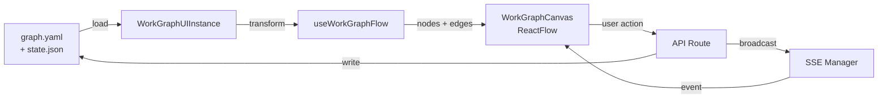

# Research Report: Workflow Page UX

**Generated**: 2026-02-26T04:00:00Z
**Research Query**: "Workflow Page UX — positional graph visualization, drag-and-drop, templates, events, Q&A flows, undo/redo, deprecating workgraph"
**Mode**: Pre-Plan (new plan folder: 050-workflow-page-ux)
**Location**: docs/plans/050-workflow-page-ux/research-dossier.md
**FlowSpace**: Available
**Findings**: 73 across 8 subagents

## Executive Summary

### What It Does
The Workflow Page UX is a new business domain providing a visual editor for the positional graph system — lines containing nodes (work units) that users drag-and-drop, configure, and observe executing. It replaces the deprecated workgraph UI (Plan 022) with a line-based positional model, integrates the template/instance system (Plan 048), and delivers real-time updates via the events domain.

### Business Purpose
Enable users to visually construct, monitor, and interact with agentic workflows through a web interface. Users drag work units (agent, code, human-input) onto numbered lines, configure context sharing and input wiring, ask/answer questions, and observe execution — all with immediate filesystem persistence and undo/redo.

### Key Insights
1. **Existing infrastructure is rich**: ReactFlow 12, dnd-kit, SSE events, PanelShell, SDK commands, DI container, template service — all already wired. This is primarily a UI integration and domain creation effort.
2. **Positional model is fundamentally different from DAG**: Lines are visual containers, topology is implicit from ordering, input resolution searches predecessors by name — no edge wiring. The UX must reflect this mental model.
3. **File-browser domain is the reference implementation**: Identical architecture pattern (PanelShell + ExplorerPanel + LeftPanel + MainPanel, URL param state, SDK contributions, server actions, toast feedback).

### Quick Stats
- **Existing Components**: ~40 reusable files across 022-workgraph-ui (pattern source), panel-layout, events, SDK
- **Dependencies**: @xyflow/react 12.10, @dnd-kit/core 6.3 + sortable 10.0, sonner, tsyringe — all installed
- **Test Coverage**: 17 existing workgraph-ui test files (100+ tests), template e2e helpers, 3 committed templates
- **Complexity**: High — 6+ domain integrations, real-time events, filesystem persistence, undo/redo
- **Prior Learnings**: 15 relevant discoveries from Plans 039-049
- **Domains**: 5 infrastructure domains consumed, 1 new business domain created, 1 deprecated

## How It Currently Works

### Entry Points

| Entry Point | Type | Location | Purpose |
|------------|------|----------|---------|
| `/workflow` (deprecated) | Page | `apps/web/app/(dashboard)/workflow/page.tsx` | Old demo page with DEMO_FLOW fixture |
| `/workflows` | Page | `apps/web/app/(dashboard)/workflows/page.tsx` | Workflow list (cards, status) |
| `/workflows/[slug]` | Page | `apps/web/app/(dashboard)/workflows/[slug]/page.tsx` | Single workflow detail (phases, checkpoints) |
| `/workflows/[slug]/runs/[runId]` | Page | `.../runs/[runId]/page.tsx` | Run detail with phase cards + Q&A |
| `/workspaces/[slug]/workgraphs/*` | Pages | `apps/web/app/(dashboard)/workspaces/[slug]/workgraphs/` | Legacy workgraph editor (Plan 022, deprecated) |
| WorkflowContent | Component | `apps/web/src/components/workflow/workflow-content.tsx` | ReactFlow wrapper with SSE |
| WorkGraphCanvas | Component | `apps/web/src/features/022-workgraph-ui/workgraph-canvas.tsx` | Editable graph canvas (deprecated) |

### Core Execution Flow (Current Workgraph UI — To Be Replaced)

1. **DI Resolution**: Container resolves `IWorkGraphUIService` → creates `WorkGraphUIInstance` per (worktreePath, graphSlug)
2. **Load**: Instance loads `work-graph.yaml` + `state.json` → computes node statuses (pending/ready = computed, running/complete = stored)
3. **Transform**: `useWorkGraphFlow()` hook converts to ReactFlow nodes/edges format
4. **Render**: `WorkGraphCanvas` renders ReactFlow with custom `WorkGraphNode` components, status indicators
5. **Mutations**: Drag-drop → `createDropHandler()` → API POST → `broadcastGraphUpdated()` → SSE → all clients refresh
6. **Auto-save**: 500ms debounce coalesces rapid changes into single write

### Data Flow


### State Management
- **Graph definition**: `graph.yaml` on disk (source of truth)
- **Runtime state**: `state.json` on disk (node statuses, questions, events)
- **UI state**: React state (selected node, zoom, pan) + URL params (graph slug, active line)
- **Persistence**: Auto-save on every mutation with 500ms debounce
- **Real-time**: SSE notification-fetch pattern (hint → REST query → update)

## Architecture & Design

### Component Map

#### Infrastructure Domains Consumed

| Domain | Components Used | Purpose |
|--------|----------------|---------|
| `_platform/positional-graph` | IPositionalGraphService, ITemplateService, IInstanceService, schemas | Graph CRUD, templates, instances |
| `_platform/events` | useSSE, useFileChanges, FileChangeProvider, toast() | Real-time updates, notifications |
| `_platform/panel-layout` | PanelShell, ExplorerPanel, LeftPanel, MainPanel, PanelHeader | Page layout structure |
| `_platform/sdk` | IUSDK, ICommandRegistry, IKeybindingService | Commands (save, run, undo), shortcuts |
| `_platform/workspace-url` | workspaceHref, paramsCaches | Deep-linking, URL state |
| `_platform/file-ops` | IFileSystem, IPathResolver | Server-side file operations |

#### Existing Reusable Components (from Plan 022)

| Component | Location | Reuse Assessment |
|-----------|----------|------------------|
| `WorkGraphCanvas` | `features/022-workgraph-ui/workgraph-canvas.tsx` | **Pattern reference** — ReactFlow setup, minimap, controls. Rebuild for positional model |
| `WorkGraphNode` | `features/022-workgraph-ui/workgraph-node.tsx` | **Pattern reference** — status indicators, selection. Rebuild for positional nodes |
| `WorkUnitToolbox` | `features/022-workgraph-ui/workunit-toolbox.tsx` | **Pattern reference** — dnd-kit drag source. Rebuild for work unit menu |
| `drop-handler.ts` | `features/022-workgraph-ui/drop-handler.ts` | **Reusable** — viewport transform calculations for drop positioning |
| `auto-save` logic | `features/022-workgraph-ui/` (tested) | **Pattern reference** — 500ms debounce pattern |
| `status-computation` | `features/022-workgraph-ui/` (tested) | **Rebuild** — positional model has different readiness gates |
| `question-input.tsx` | `components/phases/question-input.tsx` | **Pattern reference** — supports single_choice, multi_choice, free_text, confirm |
| `FakeWorkGraphUIInstance` | `features/022-workgraph-ui/fake-workgraph-ui-instance.ts` | **Pattern reference** — builder pattern for test fakes |

### Design Patterns Identified

1. **Notification-Fetch (ADR-0010)**: SSE sends minimal hints → client fetches full state via REST
2. **Consumer Domain (ADR-0012)**: UI is thin wrapper calling service methods — no business logic in components
3. **Fake-First Testing (Constitution P4)**: FakeTemplateService, FakeWorkGraphUIInstance — call tracking + return builders
4. **Server Actions**: `'use server'` functions for all file I/O, DI resolution via `getContainer()`
5. **DI Factory (ADR-0004)**: `useFactory` registration, no decorators (RSC compatible)
6. **URL State**: nuqs library for URL params (panel mode, selected node, active line)
7. **SDK Contributions**: Commands + settings + keybindings registered per domain

### System Boundaries
- **Internal Boundary**: Workflow page owns visualization, selection, editing UX. Does NOT own graph engine logic.
- **External Interfaces**: Consumes positional-graph via server actions (not direct imports in client components)
- **Integration Points**: SSE for real-time, ITemplateService for templates, IWorkUnitService for unit catalog

## Dependencies & Integration

### What This Depends On

#### Internal Dependencies

| Dependency | Type | Purpose | Risk if Changed |
|------------|------|---------|-----------------|
| IPositionalGraphService | Required | All graph operations | High — core contract |
| ITemplateService | Required | Template/instance lifecycle | Medium — Plan 048 stable |
| IWorkUnitService | Required | Unit catalog, type resolution | Medium |
| Events domain | Required | SSE real-time updates | Low — stable ADR-0010 |
| Panel layout domain | Required | Page structure | Low — stable |
| SDK domain | Required | Commands, shortcuts, settings | Low — stable |

#### External Dependencies (npm)

| Library | Version | Purpose | Criticality |
|---------|---------|---------|-------------|
| @xyflow/react | ^12.10.0 | Graph visualization canvas | High — core UI |
| @dnd-kit/core | ^6.3.1 | Drag-and-drop | High — core interaction |
| @dnd-kit/sortable | ^10.0.0 | Sortable lists | Medium — unit reordering |
| sonner | installed | Toast notifications | Low — stable |
| nuqs | installed | URL state management | Low — stable |

### What Depends on This

Nothing yet — this is a new leaf domain (consumer only).

## Quality & Testing

### Current Test Coverage
- **Workgraph UI tests**: 17 files, 100+ tests in `test/unit/web/features/022-workgraph-ui/`
- **Template e2e**: 5 tests in `test/integration/template-lifecycle-e2e.test.ts`
- **3 committed templates**: smoke, simple-serial, advanced-pipeline
- **Test helpers**: `withTemplateWorkflow()`, `buildDiskWorkUnitLoader()`, `FakeWorkGraphUIInstance`

### Test Strategy for New Page
- **Unit**: Fake services, hook tests with `renderHook()`, component tests with RTL
- **Integration**: Real filesystem with `withTemplateWorkflow()` helper
- **E2E**: CLI-driven scenario setup + browser verification

### Known Issues & Technical Debt

| Issue | Severity | Location | Impact |
|-------|----------|----------|--------|
| react-resizable-panels broken | Medium | PL-05 discovery | Use CSS resize instead |
| Workgraph UI not formalized as domain | Low | 022 feature folder | Will be deprecated |
| Per-instance work unit config not designed | Medium | IC-07 gap | Need workshop |
| Context flow visualization not designed | High | New requirement | Need workshop |

## Prior Learnings (From Previous Implementations)

### 📚 PL-01: Icon-Only Buttons in Narrow Panels
**Source**: Plan 043 (Panel Layout)
**Action**: Workflow toolbar must use icon+tooltip, not icon+label

### 📚 PL-02: autoSaveId for Panel Resize Persistence  
**Source**: Plan 043
**Action**: `<ResizablePanelGroup autoSaveId="workflow-panels">`

### 📚 PL-05: DO NOT Use react-resizable-panels
**Source**: Plan 043 Phase 3
**Action**: Use native CSS `resize: horizontal` or @tanstack/react-resizable

### 📚 PL-06: Optimistic Concurrency with mtime Conflict Detection
**Source**: Plan 041 (File Browser)
**Action**: Track mtime on graph.yaml reads, compare before writes

### 📚 PL-08: Server Actions + DI Container via getContainer()
**Source**: Plan 041
**Action**: All workflow file ops as `'use server'` actions resolving from DI

### 📚 PL-09: SSE Notification-Fetch Pattern
**Source**: Plan 045 (Live File Events)
**Action**: Broadcast `{ slug, changeType }` only, fetch full state on hint

### 📚 PL-11: Reuse CentralWatcherService (Don't Reinvent)
**Source**: Plan 045
**Action**: Create WorkflowFileWatcherAdapter implementing IWatcherAdapter

### 📚 PL-13: Three-Tier Testing Pattern
**Source**: Plans 039, 048
**Action**: Unit (fakes) → Integration (real FS) → E2E (CLI + browser)

### 📚 PL-14: TemplateService Already Complete
**Source**: Plan 048
**Action**: Use existing instantiate()/saveFrom() — no new service needed

### 📚 PL-15: Sonner Toast for All Feedback
**Source**: Plan 042
**Action**: `toast.success()` / `toast.error()` — no inline banners

## Domain Context

### Existing Domains Relevant

| Domain | Relationship | Key Contracts | Status |
|--------|-------------|---------------|--------|
| _platform/positional-graph | Primary provider | IPositionalGraphService, ITemplateService, IInstanceService | Active |
| _platform/events | Real-time transport | useSSE, useFileChanges, toast() | Active |
| _platform/panel-layout | Page structure | PanelShell, ExplorerPanel, Panels | Active |
| _platform/sdk | Commands/shortcuts | IUSDK, ICommandRegistry | Active |
| _platform/workgraph | Being deprecated | IWorkGraphService (legacy) | Deprecated |

### Domain Map Position

New `workflow-ui` business domain will be a **leaf consumer** consuming 5 infrastructure domains. No circular dependency risk. Follows file-browser pattern exactly.

### Domain Actions Required

1. **Extract new domain**: `workflow-ui` — formalize as business domain with domain.md
2. **Deprecate**: Plan 022 workgraph UI pages + API routes
3. **Extend**: Events domain with workflow-specific watcher adapter
4. **Formalize**: SDK contribution for workflow commands

## Critical Discoveries

### 🚨 Critical 01: Positional Model Requires Different UX Than DAG
**Impact**: Critical
**Source**: IA-02, DE-02, IC-01
**What**: Lines are visual containers with implicit topology. No edge-wiring — input resolution searches predecessors by name. The entire canvas metaphor changes from "connect nodes with arrows" to "drop units into lines."
**Required Action**: Workshop needed on line-based visual design

### 🚨 Critical 02: Context Flow Visualization Is Uncharted
**Impact**: Critical  
**Source**: IC-03, IC-04
**What**: The 5-gate readiness model (preceding lines, transition, serial neighbor, contextFrom, inputs) needs visual representation. No existing UI pattern exists for showing context inheritance, noContext isolation, or input availability indicators.
**Required Action**: Workshop needed on context flow indicator design

### 🚨 Critical 03: Per-Instance Work Unit Config Gap
**Impact**: High
**Source**: IC-07, IC-08, DB-04
**What**: Same work unit in two workflows needs different context/parallel settings. Currently node.yaml stores these per-graph, but when templates are instantiated, per-instance overrides may be needed. InstanceWorkUnitAdapter exists but config storage isn't designed.
**Required Action**: Workshop needed on instance-local config storage

### 🚨 Critical 04: Undo/Redo Architecture Not Designed
**Impact**: High
**Source**: DC-05, PL-06
**What**: User expects Ctrl+Z to unwind filesystem changes immediately. This requires a mutation stack tracking graph.yaml + state.json changes with ability to restore previous versions. No existing pattern in the codebase.
**Required Action**: Workshop needed on undo/redo stack design

### 🚨 Critical 05: Event Domain Integration for Workflow State Changes
**Impact**: High
**Source**: DC-03, PL-11, DE-06
**What**: Need a WorkflowWatcherAdapter + WorkflowDomainEventAdapter for the positional graph system. The existing watcher watches `.chainglass/data/` but workflow instances live at `.chainglass/instances/` (Plan 048 unified storage). Need to decide which paths to watch.
**Required Action**: Design decision needed — may be part of implementation, not a full workshop

## Workshop Opportunities

Based on critical discoveries, the following workshops would de-risk implementation:

### Workshop 001: Line-Based Canvas UX Design
**Why**: Positional model is fundamentally different from DAG. How do lines render? How do users interact with numbered rows? How do nodes show their position context?
**Scope**: Visual mockup of line containers, node cards, spacing, scroll, active line indicator
**Complexity**: High — defines the core visual paradigm

### Workshop 002: Context Flow Indicator Design  
**Why**: Users need visual indication of which context each node receives. The 5-gate model, noContext badge, contextFrom arrows, and input wire colors need concrete UX decisions.
**Scope**: Color scheme, indicator placement (corner badge), wire visualization, legend
**Complexity**: Medium — constrained by existing graph data

### Workshop 003: Per-Instance Work Unit Configuration
**Why**: Same unit in different workflows may need different parallel/noContext/contextFrom settings. Where does this config live? How does it interact with template refresh?
**Scope**: Schema design, storage location, refresh behavior, UI editing
**Complexity**: Medium — schema + persistence design

### Workshop 004: Undo/Redo Stack Architecture
**Why**: Filesystem persistence on every mutation + Ctrl+Z undo requires tracking change history. Options: in-memory stack, git stash, snapshot files, or command pattern.
**Scope**: Stack design, filesystem rollback strategy, scope (per-session vs persistent)
**Complexity**: High — crosses UI + filesystem boundary

### Workshop 005: Sample Workflow & Doping System
**Why**: Need repeatable justfile commands to populate development worktrees with sample workflows in various states (blank, in-progress, completed, errored, with questions). Similar to Plan 039 e2e but for UI development.
**Scope**: Sample agent definitions (spec, dev, review), fixture workflows, `just dope-workflows` command
**Complexity**: Medium — builds on Plan 048 template generation script

## External Research Opportunities

### Research Opportunity 1: ReactFlow 12 Line-Based Layout Patterns
**Why Needed**: ReactFlow is designed for freeform node placement. We need a constrained line-based layout where nodes snap to rows. Need current best practices for custom layouts in @xyflow/react v12.
**Impact on Plan**: Determines whether we use ReactFlow or build custom canvas

**Ready-to-use prompt:**
```
/deepresearch "ReactFlow (@xyflow/react v12) custom layout constraints:
- Can nodes be constrained to horizontal lanes/rows (swimlane pattern)?
- How to implement snap-to-row behavior during drag?
- Best practices for custom node positioning algorithms in ReactFlow 12
- Alternatives to ReactFlow for lane-based workflow visualization
- Performance with 50-100 nodes across 10-20 lanes"
```

### Research Opportunity 2: Undo/Redo Patterns for File-Persisted State
**Why Needed**: Need a battle-tested pattern for undoing filesystem writes from a web app, with session-scoped history
**Impact on Plan**: Determines undo architecture

**Ready-to-use prompt:**
```
/deepresearch "Undo/redo patterns for web applications with filesystem persistence:
- Command pattern vs snapshot pattern for undo in file-backed state
- How to roll back file writes (graph.yaml) on Ctrl+Z
- Best practices for undo stack scope (session-only vs persistent)
- React undo libraries compatible with external state (not just React state)
- Integration with optimistic concurrency / mtime conflict detection"
```

## Appendix: File Inventory

### Core Files (To Create)

| File | Purpose |
|------|---------|
| `apps/web/app/(dashboard)/workspaces/[slug]/workflows/` | New workflow page routes |
| `apps/web/src/features/050-workflow-page/` | Feature folder |
| `apps/web/app/actions/workflow-actions.ts` | Server actions for graph ops |
| `docs/domains/workflow-ui/domain.md` | New business domain |
| `scripts/dope-workflows.ts` | Sample workflow generator |

### Core Files (To Deprecate)

| File | Purpose |
|------|---------|
| `apps/web/app/(dashboard)/workflow/page.tsx` | Old demo page |
| `apps/web/app/(dashboard)/workspaces/[slug]/workgraphs/` | Legacy workgraph pages |
| `apps/web/app/api/workspaces/[slug]/workgraphs/` | Legacy API routes |
| `apps/web/src/features/022-workgraph-ui/` | Legacy workgraph UI (pattern reference only) |

## Next Steps

**Workshops identified (5 total):**
1. **Workshop 001**: Line-Based Canvas UX Design (HIGH — defines visual paradigm)
2. **Workshop 002**: Context Flow Indicator Design (MEDIUM — constrained by data model)
3. **Workshop 003**: Per-Instance Work Unit Configuration (MEDIUM — schema + storage)
4. **Workshop 004**: Undo/Redo Stack Architecture (HIGH — crosses UI + filesystem)
5. **Workshop 005**: Sample Workflow & Doping System (MEDIUM — builds on Plan 048 scripts)

**After workshops**: Run `/plan-1b-v2-specify` to create feature specification.

---

**Research Complete**: 2026-02-26T04:00:00Z
**Report Location**: docs/plans/050-workflow-page-ux/research-dossier.md
