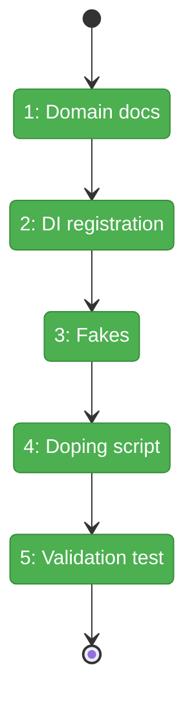
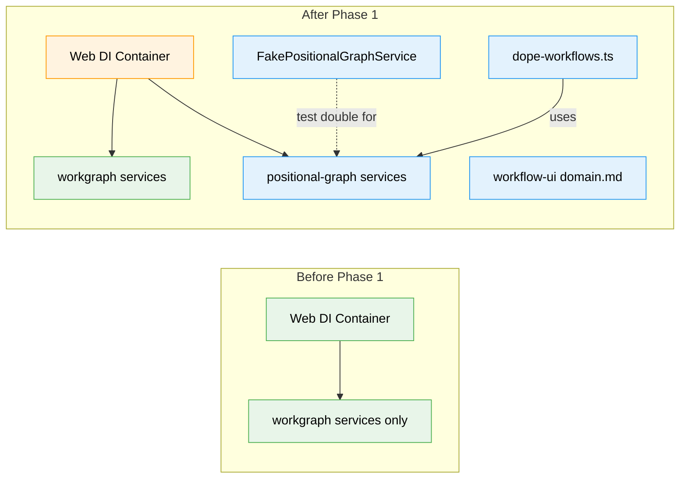

# Flight Plan: Phase 1 — Domain Setup + Foundations

**Plan**: [workflow-page-ux-plan.md](../../workflow-page-ux-plan.md)
**Phase**: Phase 1: Domain Setup + Foundations
**Generated**: 2026-02-26
**Status**: Landed

---

## Departure → Destination

**Where we are**: No workflow-ui domain exists. IPositionalGraphService is not registered in the web DI container. No fakes exist for TDD. No demo workflows can be generated for UI development. The Plan 050 spec and 5 workshops are complete.

**Where we're going**: A developer can run `just dope` and see 7 demo workflows appear in `.chainglass/data/workflows/` covering all 8 node status states. The web DI container can resolve IPositionalGraphService, ITemplateService, and IWorkUnitService. FakePositionalGraphService is ready for TDD in all subsequent phases. The workflow-ui domain is formalized in docs.

---

## Domain Context

### Domains We're Changing

| Domain | What Changes | Key Files |
|--------|-------------|-----------|
| workflow-ui (NEW) | Domain created — docs only, no code yet | `docs/domains/workflow-ui/domain.md`, `registry.md`, `domain-map.md` |
| _platform/positional-graph | Register in web DI + create fakes dir | `apps/web/src/lib/di-container.ts`, `packages/positional-graph/src/fakes/` |

### Domains We Depend On (no changes)

| Domain | What We Consume | Contract |
|--------|----------------|----------|
| _platform/positional-graph | Graph CRUD, status, templates | `IPositionalGraphService`, `ITemplateService` |
| _platform/file-ops | Filesystem I/O | `IFileSystem`, `IPathResolver` |
| @chainglass/shared | YAML, DI tokens, Result types | `IYamlParser`, `POSITIONAL_GRAPH_DI_TOKENS` |

---

## Flight Status

<!-- Updated by /plan-6-v2: pending → active → done. Use blocked for problems/input needed. -->

**Legend**: grey = pending | yellow = active | red = blocked/needs input | green = done

---

## Stages

<!-- Updated by /plan-6-v2 during implementation: [ ] → [~] → [x] -->

- [x] **Stage 1: Domain formalization** — Create workflow-ui domain.md, update registry and domain-map (`docs/domains/`)
- [x] **Stage 2: DI wiring** — Register positional-graph services in web DI container (`di-container.ts`)
- [x] **Stage 3: Build fakes** — FakePositionalGraphService + verify FakeWorkUnitService (`packages/positional-graph/src/fakes/`)
- [x] **Stage 4: Doping system** — Create dope-workflows.ts with 7 scenarios + justfile commands (`scripts/`, `justfile`)
- [x] **Stage 5: Validation** — Integration test proving all 7 scenarios create valid graphs (`test/integration/`)

---

## Architecture: Before & After

**Legend**: existing (green, unchanged) | changed (orange, modified) | new (blue, created)

---

## Acceptance Criteria

- [x] AC-28: `just dope` creates 7+ demo workflows
- [x] AC-29: `just dope clean`, `just dope <name>`, `just redope` all work
- [x] AC-30: Demo workflows cover all 8 node status states
- [x] AC-37: Doping script validation test passes

## Goals & Non-Goals

**Goals**:
- workflow-ui domain formalized
- Backend services resolvable from web DI
- FakePositionalGraphService ready for TDD
- `just dope` creates demo workflows in <5s
- Automated test validates all scenarios

**Non-Goals**:
- No UI components (Phase 2)
- No pages or routes (Phase 2)
- No drag-and-drop (Phase 3)
- No full 54-method fake body — only UI-critical methods get real logic

---

## Checklist

- [x] T001: Domain docs (domain.md + registry + domain-map)
- [x] T002: DI registration (registerPositionalGraphServices in web container)
- [x] T003: FakePositionalGraphService (call tracking + return builders)
- [x] T004: Verify FakeWorkUnitService exists and is exportable
- [x] T005: Doping script (7 demo scenarios)
- [x] T006: Justfile commands (dope/redope/clean/name)
- [x] T007: Doping validation test (integration test for all 7 scenarios)
