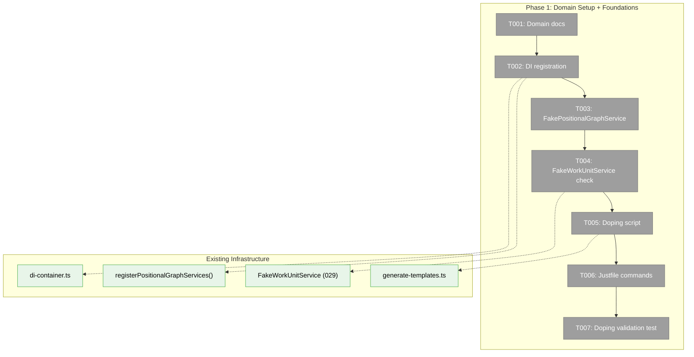
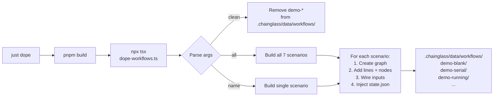
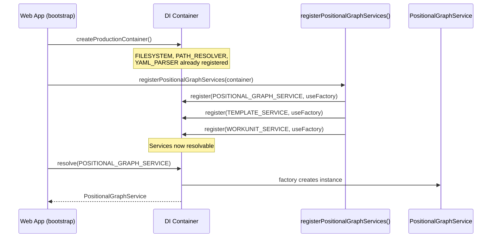

# Phase 1: Domain Setup + Foundations — Tasks

**Plan**: [workflow-page-ux-plan.md](../../workflow-page-ux-plan.md)
**Phase**: Phase 1: Domain Setup + Foundations
**Generated**: 2026-02-26
**Status**: Ready for implementation

---

## Executive Briefing

- **Purpose**: Establish the workflow-ui business domain, wire backend services into the web DI container, build test fakes for TDD, and create the doping system for populating demo workflows during UI development.
- **What We're Building**: Domain documentation, DI registrations, FakePositionalGraphService (54-method fake with call tracking), FakeWorkUnitService (if needed), a doping script that creates 7 demo workflows covering all 8 node status states, justfile commands, and an automated validation test.
- **Goals**:
  - ✅ workflow-ui domain formalized with domain.md, registry entry, domain-map node
  - ✅ IPositionalGraphService + ITemplateService + IWorkUnitService resolvable from web DI container
  - ✅ FakePositionalGraphService ready for TDD in all future phases
  - ✅ `just dope` creates 7 demo workflows with various states in <5s
  - ✅ Automated test validates all demo scenarios create valid graphs
- **Non-Goals**:
  - ❌ No UI components in this phase — pure foundation
  - ❌ No pages or routes — those come in Phase 2
  - ❌ No drag-and-drop — Phase 3
  - ❌ Not building the full 54-method fake body — only UI-critical methods get real logic, rest return sensible defaults

---

## Prior Phase Context

_Phase 1 — no prior phases._

---

## Pre-Implementation Check

| File | Exists? | Domain | Action | Notes |
|------|---------|--------|--------|-------|
| `docs/domains/workflow-ui/domain.md` | ❌ No | workflow-ui | CREATE | Follow file-browser domain.md as template |
| `docs/domains/registry.md` | ✅ Yes | cross-domain | MODIFY | Add workflow-ui row |
| `docs/domains/domain-map.md` | ✅ Yes | cross-domain | MODIFY | Add workflow-ui node + edges to posGraph, events, panels, sdk |
| `apps/web/src/lib/di-container.ts` | ✅ Yes | cross-domain | MODIFY | Add `registerPositionalGraphServices()` call. Prerequisites (FILESYSTEM, PATH_RESOLVER, YAML_PARSER) already registered. |
| `packages/positional-graph/src/container.ts` | ✅ Yes | _platform/positional-graph | READ ONLY | Exports `registerPositionalGraphServices()` — ready to call |
| `packages/positional-graph/src/fakes/` | ❌ No | _platform/positional-graph | CREATE dir | No fakes directory exists yet |
| `packages/positional-graph/src/fakes/fake-positional-graph-service.ts` | ❌ No | _platform/positional-graph | CREATE | 54-method interface, UI-critical methods with real logic |
| FakeWorkUnitService | ✅ Exists (2 copies) | _platform/positional-graph | REUSE | At `packages/positional-graph/src/features/029-agentic-work-units/fake-workunit.service.ts` and `packages/workgraph/src/fakes/`. Use existing. |
| `scripts/dope-workflows.ts` | ❌ No | workflow-ui | CREATE | Model after `scripts/generate-templates.ts` but use DI container pattern from bootstrap-singleton |
| `justfile` | ✅ Yes | cross-domain | MODIFY | Add dope/redope/dope-clean recipes. No existing "dope" command. |
| `test/integration/dope-workflows.test.ts` | ❌ No | workflow-ui | CREATE | Validates all 7 scenarios |

### Concept Duplication Check

- **FakePositionalGraphService**: No existing fake — confirmed via search. Must build.
- **FakeWorkUnitService**: Already exists at `029-agentic-work-units/fake-workunit.service.ts` — **reuse, don't rebuild**.
- **Doping script**: No existing concept — `generate-templates.ts` is similar but focused on templates not demo scenarios.

---

## Architecture Map



---

## Tasks

| Status | ID | Task | Domain | Path(s) | Done When | Notes |
|--------|-----|------|--------|---------|-----------|-------|
| [ ] | T001 | Create workflow-ui domain docs: domain.md + update registry.md + update domain-map.md | workflow-ui | `docs/domains/workflow-ui/domain.md`<br/>`docs/domains/registry.md`<br/>`docs/domains/domain-map.md` | domain.md exists with Purpose, Boundary, Contracts, Composition, Source Location, Dependencies, History. Registry has workflow-ui row. Domain-map has workflow-ui node with edges to posGraph, events, panel-layout, sdk, workspace-url. | Follow file-browser domain as template. Leaf consumer — no contracts exported. |
| [ ] | T002 | Register positional-graph services in web DI container | _platform/positional-graph | `apps/web/src/lib/di-container.ts` | `getContainer().resolve(POSITIONAL_GRAPH_DI_TOKENS.POSITIONAL_GRAPH_SERVICE)` returns real PositionalGraphService. ITemplateService and IWorkUnitService also resolvable. Existing workgraph registrations still work (coexistence). | Finding 01. Call `registerPositionalGraphServices(container)`. Prerequisites (FILESYSTEM, PATH_RESOLVER, YAML_PARSER) already registered. Test both old workgraph and new positional-graph resolve from same container. |
| [ ] | T003 | Build FakePositionalGraphService with call tracking + return builders | _platform/positional-graph | `packages/positional-graph/src/fakes/fake-positional-graph-service.ts`<br/>`packages/positional-graph/src/fakes/index.ts` | Fake implements IPositionalGraphService. Call tracking arrays for all 54 methods. `with*Result()` builders for UI-critical methods (create, load, list, addLine, addNode, moveNode, removeNode, getStatus, getNodeStatus, getLineStatus, collateInputs, askQuestion, answerQuestion). Default returns for non-critical methods. `reset()` clears all state. Barrel exported. | Finding 02. Follow FakeTemplateService pattern (Plan 048). 54 methods — UI-critical ones get real return builders, rest return `{data: null, errors: []}` stubs. TDD: write contract test first, then fake. |
| [ ] | T004 | Verify FakeWorkUnitService exists and is usable; export if needed | _platform/positional-graph | `packages/positional-graph/src/features/029-agentic-work-units/fake-workunit.service.ts` | FakeWorkUnitService is importable from `@chainglass/positional-graph` (or wherever the UI will import from). Has `list()` and `load()` fakes with call tracking. | Already exists at 029 feature folder. Check if it's barrel-exported. If not, add to exports. Don't rebuild. |
| [ ] | T005 | Create doping script with 7 demo scenarios | workflow-ui | `scripts/dope-workflows.ts` | `npx tsx scripts/dope-workflows.ts` creates 7 graphs in `.chainglass/data/workflows/demo-*`. Each scenario has correct graph.yaml + nodes/*/node.yaml + state.json. Covers all 8 node status states across scenarios. Script runs in <5s. | AC-28, AC-30. Use DI container pattern (bootstrap-singleton), not manual wiring. Scenarios: blank, serial, running, question, error, complete, complex. Inject state.json directly for non-pending states (bypass orchestration). See W005 for scenario details. |
| [ ] | T006 | Add justfile commands: dope, redope, dope clean, dope \<name\> | workflow-ui | `justfile` | `just dope` creates all 7, `just dope clean` removes demo-* workflows, `just dope demo-question` creates single scenario, `just redope` cleans + recreates. All commands work from repo root. | AC-29. Build step needed first: `pnpm build --filter @chainglass/positional-graph --filter @chainglass/workflow --filter @chainglass/shared`. |
| [ ] | T007 | Automated test validating all 7 doping scenarios | workflow-ui | `test/integration/dope-workflows.test.ts` | Test creates temp workspace, runs doping script logic, loads each of 7 graphs via PositionalGraphService, verifies: correct line count, correct node count, correct state (pending/running/error/question/complete as expected per scenario). | AC-37. Use real filesystem (integration test). Create temp dir, run scenarios, validate, cleanup. Follow `withTestGraph()` pattern from Plan 048. |

---

## Context Brief

### Key Findings from Plan

- **Finding 01** (Critical): IPositionalGraphService NOT registered in web DI → T002 registers it. Prerequisites already in container.
- **Finding 02** (Critical): FakePositionalGraphService doesn't exist → T003 builds it. 54-method interface, pattern from FakeTemplateService.
- **Finding 08** (Medium): Existing API routes follow `container.resolve → service.method` pattern → doping script should follow DI pattern too.

### Domain Dependencies (contracts consumed)

- `_platform/positional-graph`: `IPositionalGraphService` (graph CRUD, status), `ITemplateService` (template lifecycle), `IWorkUnitService` (unit catalog) — via `registerPositionalGraphServices()`
- `_platform/file-ops`: `IFileSystem`, `IPathResolver` — already in web DI, used by positional-graph services
- `@chainglass/shared`: `IYamlParser`, DI tokens, Result types — already in web DI

### Domain Constraints

- Constitution P2: Interface-first — build fake before real usage (T003 before Phase 2)
- Constitution P4: Fakes over mocks — FakePositionalGraphService uses call tracking arrays + return builders, not `vi.fn()`
- ADR-0004: DI via `useFactory` — registration in di-container.ts uses factory pattern, no decorators
- ADR-0012: Consumer domain — workflow-ui is a thin consumer, no business logic in domain docs

### Reusable from Existing

- `FakeTemplateService` (Plan 048): Pattern template for building FakePositionalGraphService
- `FakeWorkUnitService` (029): Already exists, reuse directly
- `scripts/generate-templates.ts`: Reference for imperative graph building (but use DI pattern instead)
- `withTestGraph()` helper: For integration test temp workspace setup
- `buildDiskWorkUnitLoader()`: For loading units from disk in doping script

### System Flow: Doping Script



### DI Registration Flow



---

## Discoveries & Learnings

_Populated during implementation by plan-6._

| Date | Task | Type | Discovery | Resolution | References |
|------|------|------|-----------|------------|------------|

---

## Directory Layout

```
docs/plans/050-workflow-page-ux/
  ├── workflow-page-ux-spec.md
  ├── workflow-page-ux-plan.md
  ├── research-dossier.md
  ├── workshops/
  │   ├── 001-line-based-canvas-ux-design.md
  │   ├── 002-context-flow-indicator-design.md
  │   ├── 003-per-instance-work-unit-configuration.md
  │   ├── 004-undo-redo-stack-architecture.md
  │   └── 005-sample-workflow-doping-system.md
  └── tasks/phase-1-domain-setup-foundations/
      ├── tasks.md                    ← this file
      ├── tasks.fltplan.md            ← flight plan (below)
      └── execution.log.md            ← created by plan-6
```
