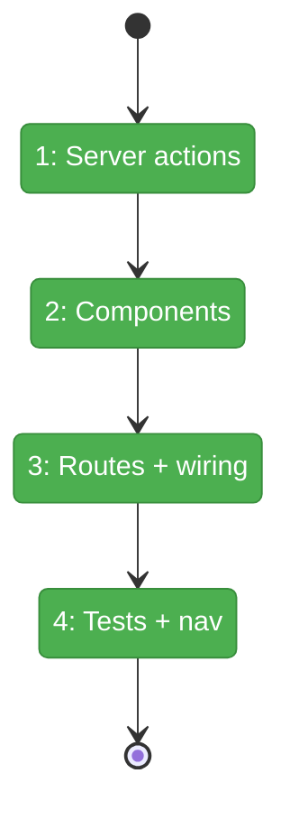
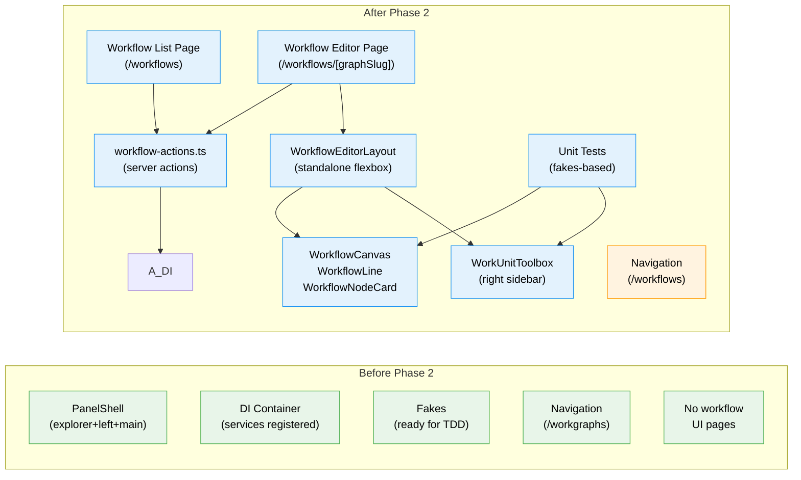

# Flight Plan: Phase 2 — Canvas Core + Layout

**Plan**: [workflow-page-ux-plan.md](../../workflow-page-ux-plan.md)
**Phase**: Phase 2: Canvas Core + Layout
**Generated**: 2026-02-26
**Status**: Landed

---

## Departure → Destination

**Where we are**: Phase 1 established the workflow-ui domain (docs, DI registration, fakes, doping system). Backend services are resolvable from the web DI container. FakePositionalGraphService is ready for TDD. 8 demo workflows can be generated via `just dope`. But there are zero UI components — no pages, no routes, no visual rendering.

**Where we're going**: A developer can navigate to `/workspaces/[slug]/workflows`, see a list of available workflows, click one to open the editor at `/workspaces/[slug]/workflows/[graphSlug]`, and see lines rendered as horizontal rows with node cards showing status, type icons, and context badges. The right panel shows available work units grouped by type. Empty states guide the user. All rendering is backed by unit tests using fakes.

---

## Domain Context

### Domains We're Changing

| Domain | What Changes | Key Files |
|--------|-------------|-----------|
| workflow-ui | New feature folder with 10+ components, 2 routes, server actions, unit tests | `apps/web/src/features/050-workflow-page/`, `apps/web/app/(dashboard)/workspaces/[slug]/workflows/`, `apps/web/app/actions/workflow-actions.ts` |
| cross-domain | Update navigation sidebar href | `apps/web/src/lib/navigation-utils.ts` |

### Domains We Depend On (no changes)

| Domain | What We Consume | Contract |
|--------|----------------|----------|
| _platform/positional-graph | IPositionalGraphService (list, load, create, getStatus) | DI tokens via `POSITIONAL_GRAPH_DI_TOKENS` |
| _platform/positional-graph | IWorkUnitService (list) | DI tokens |
| _platform/positional-graph | FakePositionalGraphService, FakeWorkUnitService | Test fakes |
| _platform/file-ops | IFileSystem, IPathResolver | Consumed indirectly via positional-graph |
| _platform/workspace-url | workspaceHref() | URL construction |
| @chainglass/shared | WorkspaceContext, DI tokens, Result types | Types + DI |

---

## Flight Status

<!-- Updated by /plan-6-v2: pending → active → done. Use blocked for problems/input needed. -->

**Legend**: grey = pending | yellow = active | red = blocked/needs input | green = done

---

## Stages

<!-- Updated by /plan-6-v2 during implementation: [ ] → [~] → [x] -->

- [x] **Stage 1: Server actions** — Create `workflow-actions.ts` with loadWorkflow, listWorkflows, createWorkflow, listWorkUnits (`workflow-actions.ts` — new file)
- [x] **Stage 2: Build components** — WorkflowEditorLayout, WorkflowCanvas, WorkflowLine, WorkflowNodeCard, WorkUnitToolbox, WorkflowTempBar, empty states (`050-workflow-page/components/` — new files)
- [x] **Stage 3: Wire routes** — Create list page + editor page, compose with standalone layout + components (`workflows/page.tsx`, `workflows/[graphSlug]/page.tsx` — new files)
- [x] **Stage 4: Tests + nav update** — Unit tests for all components + rendering states, update sidebar href (`test/unit/web/features/050-workflow-page/`, `navigation-utils.ts`)

---

## Architecture: Before & After

**Legend**: existing (green, unchanged) | changed (orange, modified) | new (blue, created)

---

## Acceptance Criteria

- [ ] AC-01: Workflow page at workspace-scoped routes with PanelShell + temp bar
- [ ] AC-02: Lines as horizontal rows, numbered, left-to-right nodes
- [ ] AC-03: Empty states (no lines, empty line)
- [ ] AC-04: Add Line button with immediate persistence
- [ ] AC-05: Line header (label, settings, transition, delete)
- [ ] AC-06: Right panel toolbox grouped by type with search
- [ ] AC-10: Node cards with type icon, name, status, context badge
- [ ] AC-11: 8 node status colors
- [ ] AC-20: Template/instance breadcrumb in temp bar
- [ ] AC-22b: New Blank + New from Template buttons side by side
- [ ] AC-35: Unit tests with fakes (partial — rendering + states)

## Goals & Non-Goals

**Goals**:
- Workflow pages render and display graph data correctly
- PanelShell extended without breaking existing pages
- All 8 node status states render with correct visual treatment
- Unit tests prove rendering correctness with fakes

**Non-Goals**:
- No drag-and-drop (Phase 3)
- No node selection or context flow indicators (Phase 4)
- No modals (Phase 3 naming, Phase 5 Q&A/properties)
- No SSE live updates (Phase 6)
- No workgraph removal (Phase 7)

---

## Checklist

- [x] T001: Create workflow list page + WorkflowListClient
- [x] T002: Create workflow editor page with standalone layout
- [x] T003: Create server actions (loadWorkflow, listWorkflows, createWorkflow, listWorkUnits)
- [x] T004: Build WorkflowTempBar
- [x] T005: Build WorkflowCanvas + WorkflowLine + LineTransitionGate
- [x] T006: Build WorkflowNodeCard (all 8 status states)
- [x] T007: Build WorkUnitToolbox (grouped by type, search)
- [x] T008: Build empty states
- [x] T009: Unit tests for all components
- [x] T010: Update navigation sidebar href
