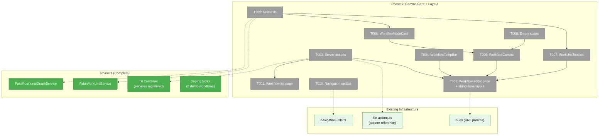
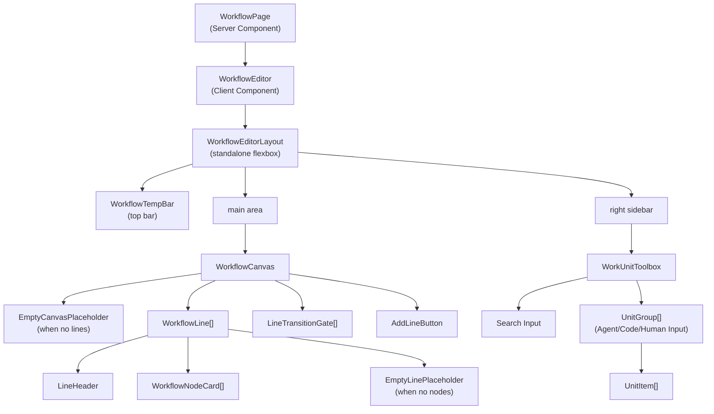

# Phase 2: Canvas Core + Layout — Tasks

**Plan**: [workflow-page-ux-plan.md](../../workflow-page-ux-plan.md)
**Phase**: Phase 2: Canvas Core + Layout
**Generated**: 2026-02-26
**Status**: Ready for implementation

---

## Executive Briefing

- **Purpose**: Build the workflow editor page shell — routes, server actions, canvas with line/node rendering, and the work unit toolbox. This phase gets pixels on screen: a user can navigate to `/workspaces/[slug]/workflows`, see a list of workflows, open one, and see lines with node cards rendered from graph.yaml + state.json. No drag-and-drop yet — that's Phase 3.
- **What We're Building**: Two new routes (list + editor), standalone editor layout (no PanelShell — own flexbox layout), WorkflowCanvas rendering lines and node cards, WorkUnitToolbox in a right sidebar, WorkflowTempBar with placeholder Run button + template breadcrumb, empty states, server actions for loadWorkflow/listWorkflows/createWorkflow, navigation sidebar update, and unit tests with fakes for all rendering states.
- **Goals**:
  - ✅ Workflow list page renders at `/workspaces/[slug]/workflows`
  - ✅ Workflow editor page renders at `/workspaces/[slug]/workflows/[graphSlug]`
  - ✅ Canvas renders lines as horizontal rows with numbered headers
  - ✅ Node cards display type icon, name, status dot (all 8 colors), context badge
  - ✅ Right panel shows work unit toolbox grouped by type with search
  - ✅ Navigation sidebar "Workflows" link points to new route
  - ✅ Unit tests cover all rendering states using FakePositionalGraphService
- **Non-Goals**:
  - ❌ No drag-and-drop (Phase 3)
  - ❌ No node selection or properties panel (Phase 4)
  - ❌ No context flow indicators or gate chips (Phase 4)
  - ❌ No Q&A modal or undo/redo (Phase 5)
  - ❌ No SSE live updates (Phase 6)
  - ❌ No workgraph removal (Phase 7 — opportunistic cleanup only)

---

## Prior Phase Context

### Phase 1: Domain Setup + Foundations (Complete)

**A. Deliverables**:
- `docs/domains/workflow-ui/domain.md` — New leaf business domain, no contracts exported
- `docs/domains/registry.md` — workflow-ui row added
- `docs/domains/domain-map.md` — workflow-ui node with 6 edges (posGraph, fileOps, events, panels, sdk, workspace-url)
- `apps/web/src/lib/di-container.ts` — `registerPositionalGraphServices()` + `WORK_UNIT_LOADER` bridge + `TemplateService` registered
- `apps/web/tsconfig.json` — `@chainglass/positional-graph` path mapped to `dist/`
- `packages/positional-graph/src/fakes/fake-positional-graph-service.ts` — 54-method fake, call tracking, 12 return builders
- `packages/positional-graph/src/fakes/index.ts` — Barrel export
- `scripts/dope-workflows.ts` — 8 scenarios using `sample-*` work units
- `justfile` — `dope`, `redope` commands
- `test/integration/dope-workflows.test.ts` — 10 tests (8 scenarios + ready status + script-path)

**B. Dependencies Exported**:
- `FakePositionalGraphService` — importable from `@chainglass/positional-graph` via fakes barrel
  - Key return builders: `withCreateResult()`, `withLoadResult()`, `withListResult()`, `withGetStatusResult()`, `withGetNodeStatusResult()`, `withGetLineStatusResult()`, `withCollateInputsResult()`, `withAddNodeResult()`, `withMoveNodeResult()`, `withRemoveNodeResult()`, `withAskQuestionResult()`, `withAnswerQuestionResult()`
  - Call tracking: `calls` Map with method name → args arrays
  - `reset()` clears all state
- `FakeWorkUnitService` — already existed at `029-agentic-work-units/fake-workunit.service.ts`, exported via barrel
  - `addUnit(config)` to configure fake units
  - `list()` returns configured units, `load()` returns by slug
- DI tokens: `POSITIONAL_GRAPH_DI_TOKENS.POSITIONAL_GRAPH_SERVICE`, `.TEMPLATE_SERVICE`, `.WORK_UNIT_LOADER`
- Sample work units at `.chainglass/units/`: `sample-coder` (agent), `sample-pr-creator` (code), `sample-input` (user-input)

**C. Gotchas & Debt**:
- `WORK_UNIT_LOADER` bridge registration was needed but not obvious — `registerPositionalGraphServices()` doesn't register it, but `PositionalGraphService` factory depends on it
- Web `tsconfig.json` needed `@chainglass/positional-graph` mapped to `dist/` — Turbopack resolves from source via root tsconfig paths and can't handle `.js` extensions
- Dope script `create()` fails silently if graph slug already exists — always `clean` first
- `BaseResult` has no `data` field (just `errors` and optional `wasNoOp`)

**D. Incomplete Items**: None — all 7 tasks complete + 6 fix tasks applied.

**E. Patterns to Follow**:
- Server Component fetches data via DI → passes to Client Component (see file-browser `page.tsx`)
- Server actions: `'use server'` → `getContainer()` → `resolve()` → delegate to service → return Result
- Feature folder at `src/features/050-workflow-page/` — all components, hooks, services, SDK contributions
- Use nuqs for URL param state (`useQueryStates`)
- PanelShell composition: `explorer` + `left` + `main` (+ `right` once extended)
- `FakePositionalGraphService` for TDD: configure returns with `with*Result()`, verify calls via `calls` Map

---

## Pre-Implementation Check

| File | Exists? | Domain | Action | Notes |
|------|---------|--------|--------|-------|
| `apps/web/app/(dashboard)/workspaces/[slug]/workflows/page.tsx` | ❌ No | workflow-ui | CREATE | Workspace-scoped workflow list page |
| `apps/web/app/(dashboard)/workspaces/[slug]/workflows/[graphSlug]/page.tsx` | ❌ No | workflow-ui | CREATE | Workspace-scoped workflow editor page |
| `apps/web/src/features/050-workflow-page/` | ❌ No | workflow-ui | CREATE dir | New feature folder |
| `apps/web/src/features/050-workflow-page/components/workflow-canvas.tsx` | ❌ No | workflow-ui | CREATE | Main canvas component |
| `apps/web/src/features/050-workflow-page/components/workflow-editor-layout.tsx` | ❌ No | workflow-ui | CREATE | Standalone flexbox layout: temp bar + main (canvas) + right sidebar (toolbox). No PanelShell dependency. |
| `apps/web/src/features/050-workflow-page/components/workflow-line.tsx` | ❌ No | workflow-ui | CREATE | Line container component |
| `apps/web/src/features/050-workflow-page/components/workflow-node-card.tsx` | ❌ No | workflow-ui | CREATE | Node card component |
| `apps/web/src/features/050-workflow-page/components/work-unit-toolbox.tsx` | ❌ No | workflow-ui | CREATE | Right panel toolbox |
| `apps/web/src/features/050-workflow-page/components/workflow-temp-bar.tsx` | ❌ No | workflow-ui | CREATE | Temporary top bar |
| `apps/web/src/features/050-workflow-page/components/workflow-list.tsx` | ❌ No | workflow-ui | CREATE | List page client component |
| `apps/web/app/actions/workflow-actions.ts` | ❌ No | workflow-ui | CREATE | Server actions for graph ops |
| `apps/web/src/lib/navigation-utils.ts` | ✅ Yes | cross-domain | MODIFY | Update `/workgraphs` → `/workflows` href |
| `test/unit/web/features/050-workflow-page/` | ❌ No | workflow-ui | CREATE dir | Unit test directory |

### Concept Duplication Check

- **WorkflowCanvas**: No existing concept — the old workgraph UI (022) uses ReactFlow, which is fundamentally different. Building fresh with HTML/CSS + flexbox per W001.
- **WorkUnitToolbox**: No existing concept — workgraph UI has no toolbox concept.
- **WorkflowNodeCard**: No existing concept — workgraph uses ReactFlow nodes.
- **WorkflowTempBar**: No existing concept — file-browser uses ExplorerPanel but per Q7, workflow page uses a temp bar instead.
- **Server actions (workflow)**: Existing `file-actions.ts` is the pattern to follow.

---

## Architecture Map



---

## Tasks

| Status | ID | Task | Domain | Path(s) | Done When | Notes |
|--------|-----|------|--------|---------|-----------|-------|
| [ ] | T001 | Create workflow list page + WorkflowListClient at `/workspaces/[slug]/workflows/page.tsx` | workflow-ui | `apps/web/app/(dashboard)/workspaces/[slug]/workflows/page.tsx`<br/>`apps/web/src/features/050-workflow-page/components/workflow-list.tsx` | Page renders list of workflows from `IPositionalGraphService.list()`; shows name, description, line count, node count, status; "New Blank" and "New from Template" buttons render (disabled — wired in Phase 3); empty state when no workflows | AC-01 (list), AC-22b (buttons). Follow file-browser page.tsx pattern: server component resolves DI, fetches data, passes to client. |
| [ ] | T002 | Create workflow editor page at `/workspaces/[slug]/workflows/[graphSlug]/page.tsx` with standalone layout | workflow-ui | `apps/web/app/(dashboard)/workspaces/[slug]/workflows/[graphSlug]/page.tsx`<br/>`apps/web/src/features/050-workflow-page/components/workflow-editor.tsx`<br/>`apps/web/src/features/050-workflow-page/components/workflow-editor-layout.tsx` | Page loads graph via `loadWorkflow` server action, renders standalone layout with temp bar (top), main area (canvas), right sidebar (toolbox); shows loading and error states. Layout is a simple flexbox component — no PanelShell. | AC-01 (editor). Server component fetches graph + state + units, passes to client. Uses `graphSlug` from async params. |
| [ ] | T003 | Create server actions: `loadWorkflow`, `listWorkflows`, `createWorkflow`, `listWorkUnits` | workflow-ui | `apps/web/app/actions/workflow-actions.ts` | `loadWorkflow(slug, graphSlug)` returns definition + state + nodeConfigs; `listWorkflows(slug)` returns summary list with line/node counts; `createWorkflow(slug, graphSlug)` creates empty graph; `listWorkUnits(slug)` returns units grouped by type. All resolve DI, call IPositionalGraphService/IWorkUnitService, return typed results. | Follow file-actions.ts pattern. WorkspaceContext built from workspace slug via `workspaceService.getInfo()`. |
| [ ] | T004 | Build WorkflowTempBar with placeholder Run button + template/instance breadcrumb | workflow-ui | `apps/web/src/features/050-workflow-page/components/workflow-temp-bar.tsx` | Temp bar renders: graph name on left; template breadcrumb ("Template > Instance") when viewing instance; disabled Run button with tooltip "Coming in future plan" on right. Minimal styling — will be replaced by shared ExplorerBar domain later. | AC-01, AC-20, Q7. Check `instance.yaml` for `template_source` to determine if breadcrumb should show. |
| [ ] | T005 | Build WorkflowCanvas — renders lines as horizontal rows with numbered headers | workflow-ui | `apps/web/src/features/050-workflow-page/components/workflow-canvas.tsx`<br/>`apps/web/src/features/050-workflow-page/components/workflow-line.tsx`<br/>`apps/web/src/features/050-workflow-page/components/line-transition-gate.tsx` | Lines render top-to-bottom; each line shows: circled number, editable label (click-to-edit), settings gear (placeholder), transition badge (auto/manual), delete button (placeholder — wired Phase 3). Line containers are flexbox rows. Between lines: transition gate shows down-arrow (auto) or lock (manual). Add Line button at bottom. | AC-02, AC-04, AC-05. W001 layout. No drag support yet — just rendering. Line states: empty, has-nodes, active (blue border), complete (green border), error (red border). |
| [ ] | T006 | Build WorkflowNodeCard — renders node with type icon, name, status dot, context badge | workflow-ui | `apps/web/src/features/050-workflow-page/components/workflow-node-card.tsx` | Cards render all 8 status states with correct colors (W001 color table): pending(gray), ready(blue), starting(blue-pulse), agent-accepted(blue-animated), waiting-question(purple), blocked-error(red), restart-pending(amber), complete(green). Type icon: agent/code/user-input. Description truncated to 2 lines. Context badge as colored corner square (placeholder color — full logic Phase 4). | AC-10, AC-11. Card minimum 120x100px. Hover shows drag handle (grayed out — Phase 3) and actions menu (placeholder). |
| [ ] | T007 | Build WorkUnitToolbox (right sidebar) — grouped by type with search | workflow-ui | `apps/web/src/features/050-workflow-page/components/work-unit-toolbox.tsx` | Toolbox loads units from `listWorkUnits` server action; groups by type (Agent, Code, Human Input); collapsible groups; search input filters across all groups; each unit item shows type icon + name + description. Drag behavior wired in Phase 3 — just render as static list for now. Empty state when no units found. | AC-06. |
| [ ] | T008 | Build empty states (no-lines placeholder, empty-line drop zone) | workflow-ui | `apps/web/src/features/050-workflow-page/components/empty-canvas-placeholder.tsx`<br/>`apps/web/src/features/050-workflow-page/components/empty-line-placeholder.tsx` | Empty workflow: centered "+" button with "Create your first line" text + "Drag work units from the right panel". Empty line: dashed border with "Drop work units here from the right panel" text. Both render correctly in canvas. | AC-03. W001 empty states. |
| [ ] | T009 | Unit tests for canvas rendering, node card states (all 8), toolbox, list page | workflow-ui | `test/unit/web/features/050-workflow-page/workflow-canvas.test.tsx`<br/>`test/unit/web/features/050-workflow-page/workflow-node-card.test.tsx`<br/>`test/unit/web/features/050-workflow-page/work-unit-toolbox.test.tsx`<br/>`test/unit/web/features/050-workflow-page/workflow-list.test.tsx` | Tests pass using FakePositionalGraphService + FakeWorkUnitService. Canvas test: renders correct number of lines and nodes from fake data. Node card test: all 8 status states render correct color + label + icon. Toolbox test: groups units by type, search filters. List test: renders workflow names, empty state. | AC-35 (partial). TDD: write tests first, then make them pass. Use vitest + React Testing Library. |
| [ ] | T010 | Update navigation sidebar href from `/workgraphs` to `/workflows` | workflow-ui | `apps/web/src/lib/navigation-utils.ts` | Workspace sidebar "Workflows" item points to `/workflows` instead of `/workgraphs`; mobile and dev navigation also updated. Old workgraph pages still accessible via direct URL (removal in Phase 7). | Finding 07. Simple string replacement. |

---

## Context Brief

### Key Findings from Plan

- **Finding 04** (High): PanelShell only has left+main — no right panel. T001 extends it with optional `right` prop. Risk: may break existing pages. Mitigate: test file-browser after change.
- **Finding 05** (High): @xyflow/react used by 13+ files (Plan 011) — can't remove ReactFlow yet. Don't import it; build custom HTML/CSS canvas.
- **Finding 07** (High): Navigation sidebar "Workflows" → `/workgraphs`. T011 updates href. Simple change.
- **Finding 08** (Medium): Existing API routes follow `container.resolve → service.method` pattern. Server actions should follow same pattern.

### Domain Dependencies (contracts consumed)

- `_platform/positional-graph`: `IPositionalGraphService` (list, load, create, getStatus, getNodeStatus, getLineStatus), `IWorkUnitService` (list), `ITemplateService` (for instance breadcrumb) — resolved via DI tokens
- `_platform/file-ops`: `IFileSystem`, `IPathResolver` — consumed indirectly via positional-graph services
- `_platform/workspace-url`: `workspaceHref()` — for link construction
- `_platform/sdk`: Not consumed yet in Phase 2 (keybindings come in Phase 5)
- `@chainglass/shared`: `SHARED_DI_TOKENS`, `WORKSPACE_DI_TOKENS`, `WorkspaceContext` — for DI resolution

### Domain Constraints

- Constitution P2: Interface-first — use fakes in tests, not real services
- Constitution P4: Fakes over mocks — `FakePositionalGraphService` with call tracking, not `vi.fn()`
- ADR-0004: DI via `useFactory` — server actions resolve from container, don't instantiate directly
- workflow-ui is a leaf consumer — no contracts exported, no other domain should import from `050-workflow-page/`
- Standalone layout — no PanelShell dependency; own flexbox layout inside the feature folder

### Reusable from Phase 1

- `FakePositionalGraphService` — configure with `withLoadResult()`, `withListResult()`, `withGetStatusResult()` etc.
- `FakeWorkUnitService` — configure with `addUnit()` for each sample unit type
- Doped demo workflows (via `just dope`) for manual visual testing during development
- DI registration pattern in `di-container.ts` for how services are resolved
- Server action pattern in `file-actions.ts` for getContainer → resolve → delegate flow

### System Flow: Page Load

```mermaid
flowchart LR
    A[User navigates to<br/>/workspaces/slug/workflows/graphSlug] --> B[Server Component<br/>page.tsx]
    B --> C[getContainer().resolve<br/>IPositionalGraphService]
    C --> D[service.load<br/>ctx, graphSlug]
    D --> E[Return definition<br/>+ state + nodeConfigs]
    E --> F[WorkflowEditor<br/>client component]
    F --> G[PanelShell]
    G --> H[WorkflowCanvas<br/>main panel]
    G --> I[WorkUnitToolbox<br/>right panel]
    H --> J[WorkflowLine[]<br/>+ WorkflowNodeCard[]]
```

### Component Hierarchy



---

## Discoveries & Learnings

_Populated during implementation by plan-6._

| Date | Task | Type | Discovery | Resolution | References |
|------|------|------|-----------|------------|------------|

---

## Directory Layout

```
docs/plans/050-workflow-page-ux/
  ├── workflow-page-ux-spec.md
  ├── workflow-page-ux-plan.md
  ├── research-dossier.md
  ├── workshops/
  │   ├── 001-line-based-canvas-ux-design.md
  │   ├── 002-context-flow-indicator-design.md
  │   ├── 003-per-instance-work-unit-configuration.md
  │   ├── 004-undo-redo-stack-architecture.md
  │   └── 005-sample-workflow-doping-system.md
  ├── tasks/phase-1-domain-setup-foundations/
  │   ├── tasks.md
  │   ├── tasks.fltplan.md
  │   └── execution.log.md
  └── tasks/phase-2-canvas-core-layout/
      ├── tasks.md                    ← this file
      ├── tasks.fltplan.md            ← flight plan (below)
      └── execution.log.md            ← created by plan-6
```
