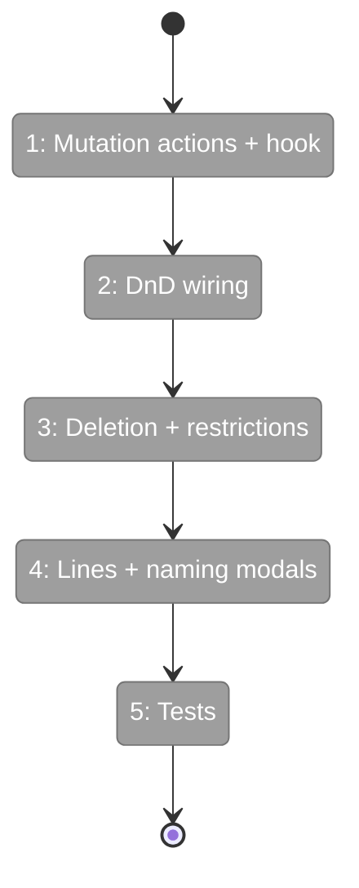
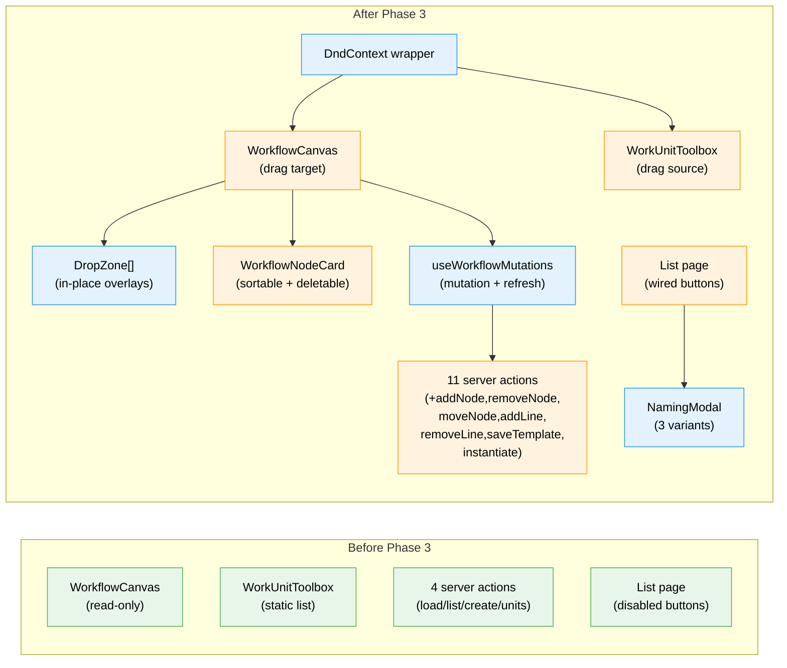

# Flight Plan: Phase 3 — Drag-and-Drop + Persistence

**Plan**: [workflow-page-ux-plan.md](../../workflow-page-ux-plan.md)
**Phase**: Phase 3: Drag-and-Drop + Persistence
**Generated**: 2026-02-26
**Status**: Ready for takeoff

---

## Departure → Destination

**Where we are**: Phase 2 delivered the visual shell — a user can navigate to the workflow list, click a workflow, and see lines with node cards rendered. But the page is read-only: no drag-and-drop, no adding/removing nodes, no creating workflows. The Add Line button, New Blank button, and New from Template button are all disabled placeholders.

**Where we're going**: A developer can drag a work unit from the right toolbox onto a line, see it appear at the drop position with state persisted to disk. They can reorder nodes within a line or move them between lines. They can delete nodes. They can add lines, edit line labels inline. They can create new blank workflows or instantiate from templates, with proper kebab-case naming modals. Running/complete lines are locked from editing.

---

## Domain Context

### Domains We're Changing

| Domain | What Changes | Key Files |
|--------|-------------|-----------|
| workflow-ui | DnD wiring, mutation hooks, drop zones, naming modals, server actions, tests | `050-workflow-page/components/`, `050-workflow-page/hooks/`, `workflow-actions.ts`, `test/unit/web/features/050-workflow-page/` |

### Domains We Depend On (no changes)

| Domain | What We Consume | Contract |
|--------|----------------|----------|
| _platform/positional-graph | addNode, removeNode, moveNode, addLine, removeLine, getStatus | IPositionalGraphService |
| _platform/positional-graph | saveFrom, instantiate, list | ITemplateService |
| @dnd-kit/core | DndContext, useDraggable, useDroppable, sensors | npm package (installed) |
| @dnd-kit/sortable | SortableContext, useSortable | npm package (installed) |

---

## Flight Status

<!-- Updated by /plan-6-v2: pending → active → done. Use blocked for problems/input needed. -->

**Legend**: grey = pending | yellow = active | red = blocked/needs input | green = done

---

## Stages

<!-- Updated by /plan-6-v2 during implementation: [ ] → [~] → [x] -->

- [ ] **Stage 1: Mutation actions + hook** — Add 7 mutation server actions + useWorkflowMutations hook (`workflow-actions.ts`, `use-workflow-mutations.ts` — new hook)
- [ ] **Stage 2: DnD wiring** — Wrap editor in DndContext, make toolbox items draggable, add drop zones, make nodes sortable (`workflow-canvas.tsx`, `work-unit-toolbox.tsx`, `drop-zone.tsx` — new, `workflow-line.tsx`, `workflow-node-card.tsx`)
- [ ] **Stage 3: Deletion + restrictions** — Node deletion via context menu/Backspace, running-line lock logic (`workflow-node-card.tsx`, `workflow-canvas.tsx`, `workflow-line.tsx`)
- [ ] **Stage 4: Lines + naming modals** — Wire Add Line, inline label editing, three naming modals (`naming-modal.tsx` — new, `workflows/page.tsx`)
- [ ] **Stage 5: Tests** — DnD handler tests, restriction tests, naming validation tests (`test/unit/web/features/050-workflow-page/`)

---

## Architecture: Before & After

**Legend**: existing (green, unchanged) | changed (orange, modified) | new (blue, created)

---

## Acceptance Criteria

- [ ] AC-04: Add Line button with immediate persistence
- [ ] AC-07: Drag toolbox → line with in-place drop zones
- [ ] AC-08: Drag reorder within/between lines, running-line restriction
- [ ] AC-09: Node deletion via context menu/Backspace
- [ ] AC-21: New from Template with composite slug modal
- [ ] AC-22: Save as Template with pre-filled slug modal
- [ ] AC-22b: New Blank + New from Template buttons side by side
- [ ] AC-35: Unit tests with fakes (partial — DnD + naming)

## Goals & Non-Goals

**Goals**:
- Every mutation persists to disk immediately
- DnD feels natural (toolbox → canvas, reorder, cross-line)
- Running/complete lines are locked
- Proper naming validation on all creation flows

**Non-Goals**:
- No undo/redo (Phase 5)
- No context indicators on drop (Phase 4)
- No SSE broadcast of changes (Phase 6)

---

## Checklist

- [ ] T001: Mutation server actions (addNode, removeNode, moveNode, addLine, removeLine, saveAsTemplate, instantiateTemplate)
- [ ] T002: useWorkflowMutations hook
- [ ] T003: DnD toolbox → line with drop zones
- [ ] T004: DnD node reorder within/between lines
- [ ] T005: Node deletion (context menu + Backspace)
- [ ] T006: Running-line restriction
- [ ] T007: Add Line + inline label editing
- [ ] T008: Naming modals (3 variants)
- [ ] T009: Unit tests
