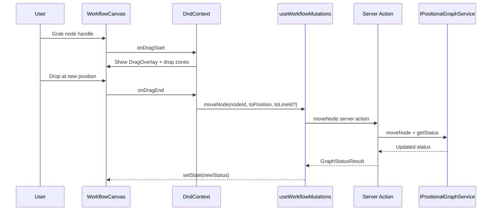

# Phase 3: Drag-and-Drop + Persistence — Tasks

**Plan**: [workflow-page-ux-plan.md](../../workflow-page-ux-plan.md)
**Phase**: Phase 3: Drag-and-Drop + Persistence
**Generated**: 2026-02-26
**Status**: Ready for implementation

---

## Executive Briefing

- **Purpose**: Make the workflow editor interactive — users can add nodes by dragging from the toolbox, reorder nodes within/between lines, delete nodes, manage lines, and create/name workflows. Every mutation persists immediately to disk.
- **What We're Building**: DnD from toolbox to canvas with drop zones, node reorder/move with dnd-kit, node deletion (context menu + Backspace), line management (add/remove/label edit), running-line restrictions, naming modals (new blank, new from template, save as template), 5 new server actions, and unit tests for all interactions.
- **Goals**:
  - ✅ Drag from toolbox onto lines with in-place drop zones (no layout shift)
  - ✅ Reorder nodes within a line and move between lines
  - ✅ Delete nodes via context menu or Backspace
  - ✅ Running/complete lines are locked — cannot add/remove/reorder
  - ✅ Add Line wires to server action and persists
  - ✅ Inline label editing on lines
  - ✅ Three naming modals with kebab-case validation
  - ✅ All mutations persist immediately via server actions
  - ✅ Unit tests for DnD handlers, restrictions, naming validation
- **Non-Goals**:
  - ❌ No node selection or properties panel (Phase 4)
  - ❌ No context indicators or gate chips (Phase 4)
  - ❌ No undo/redo (Phase 5)
  - ❌ No SSE live updates (Phase 6)

---

## Prior Phase Context

### Phase 1: Domain Setup + Foundations (Complete)

**A. Deliverables**: Domain docs, DI registration (IPositionalGraphService + IWorkUnitService + ITemplateService in web container), FakePositionalGraphService (54 methods, call tracking, 12 return builders), FakeWorkUnitService, doping script (8 scenarios), justfile commands, integration tests.

**B. Dependencies Exported**: `FakePositionalGraphService` with `withAddNodeResult()`, `withMoveNodeResult()`, `withRemoveNodeResult()` return builders — ready for Phase 3 drag tests.

**C. Gotchas**: `WORK_UNIT_LOADER` bridge registration needed but not obvious. Turbopack needs `@chainglass/positional-graph` mapped to `dist/` in tsconfig. Dope script `create()` fails silently if graph slug already exists — always clean first.

**D. Incomplete Items**: None.

**E. Patterns to Follow**: DI resolution via `getContainer().resolve()`. Fakes with call tracking arrays + return builders (not `vi.fn()`).

### Phase 2: Canvas Core + Layout (Complete)

**A. Deliverables**:
- `apps/web/app/actions/workflow-actions.ts` — 4 server actions (listWorkflows, loadWorkflow, createWorkflow, listWorkUnits) with worktree-aware context
- `apps/web/src/features/050-workflow-page/types.ts` — Shared types
- `apps/web/src/features/050-workflow-page/components/workflow-canvas.tsx` — Canvas renders from GraphStatusResult
- `apps/web/src/features/050-workflow-page/components/workflow-line.tsx` — Line with numbered header, state borders
- `apps/web/src/features/050-workflow-page/components/workflow-node-card.tsx` — 8 status states, type icons, context badge
- `apps/web/src/features/050-workflow-page/components/work-unit-toolbox.tsx` — Grouped by type, search, collapsible
- `apps/web/src/features/050-workflow-page/components/workflow-editor.tsx` — Composes layout + temp bar + canvas + toolbox
- `apps/web/src/features/050-workflow-page/components/workflow-editor-layout.tsx` — Standalone flexbox (no PanelShell)
- `apps/web/src/features/050-workflow-page/components/workflow-temp-bar.tsx` — Graph name + disabled Run
- `apps/web/src/features/050-workflow-page/components/empty-states.tsx` — EmptyCanvasPlaceholder, EmptyLinePlaceholder
- `apps/web/src/features/050-workflow-page/components/line-transition-gate.tsx` — Auto/manual gates
- Routes: `workflows/page.tsx` (list), `workflows/[graphSlug]/page.tsx` (editor)
- `apps/web/src/lib/navigation-utils.ts` — `/workflows` href

**B. Dependencies Exported**:
- `WorkflowSummary`, `LoadWorkflowResult`, `ListWorkflowsResult` types from `types.ts`
- `WorkflowNodeCardProps`, `nodeStatusToCardProps()` from `workflow-node-card.tsx`
- `WorkflowCanvasProps` from `workflow-canvas.tsx`
- `WorkUnitToolboxProps` from `work-unit-toolbox.tsx`
- Server actions: `loadWorkflow(slug, graphSlug, worktreePath?)`, `listWorkflows(slug, worktreePath?)`, `createWorkflow(slug, graphSlug, worktreePath?)`, `listWorkUnits(slug, worktreePath?)`

**C. Gotchas**: Import paths with `(dashboard)` route group — use `@/` alias for `src/features/`, relative for `actions/`. Worktree param must flow through list links to editor. `getStatus()` throws if graph not found — load first and check errors before calling getStatus.

**D. Incomplete Items**: Template breadcrumb not wired (no instance data path yet). Line label not editable yet (just renders). Settings gear and delete are placeholders.

**E. Patterns to Follow**: Standalone editor layout (not PanelShell). Server actions accept optional `worktreePath`, validate against known worktrees. Components accept `GraphStatusResult` prop and render from it. Tests use `@/` alias imports.

---

## Pre-Implementation Check

| File | Exists? | Domain | Action | Notes |
|------|---------|--------|--------|-------|
| `apps/web/app/actions/workflow-actions.ts` | ✅ Yes | workflow-ui | MODIFY | Add 5 new mutation actions (addNode, removeNode, moveNode, addLine, removeLine) + template actions |
| `apps/web/src/features/050-workflow-page/components/workflow-canvas.tsx` | ✅ Yes | workflow-ui | MODIFY | Wrap with DndContext, add drag handlers |
| `apps/web/src/features/050-workflow-page/components/workflow-line.tsx` | ✅ Yes | workflow-ui | MODIFY | Add SortableContext, drop zones, line glow, restriction logic |
| `apps/web/src/features/050-workflow-page/components/workflow-node-card.tsx` | ✅ Yes | workflow-ui | MODIFY | Make sortable with useSortable |
| `apps/web/src/features/050-workflow-page/components/work-unit-toolbox.tsx` | ✅ Yes | workflow-ui | MODIFY | Make items draggable with useDraggable |
| `apps/web/src/features/050-workflow-page/components/workflow-editor.tsx` | ✅ Yes | workflow-ui | MODIFY | Wire mutation callbacks, refresh after mutations |
| `apps/web/src/features/050-workflow-page/components/empty-states.tsx` | ✅ Yes | workflow-ui | MODIFY | Wire Add Line button to server action |
| `apps/web/src/features/050-workflow-page/components/drop-zone.tsx` | ❌ No | workflow-ui | CREATE | In-place drop zone between nodes |
| `apps/web/src/features/050-workflow-page/components/naming-modal.tsx` | ❌ No | workflow-ui | CREATE | New blank + new from template + save as template modals |
| `apps/web/src/features/050-workflow-page/hooks/use-workflow-mutations.ts` | ❌ No | workflow-ui | CREATE | Hook centralizing mutation calls + optimistic refresh |
| `apps/web/app/(dashboard)/workspaces/[slug]/workflows/page.tsx` | ✅ Yes | workflow-ui | MODIFY | Wire New Blank + New from Template buttons |
| `test/unit/web/features/050-workflow-page/` | ✅ Yes | workflow-ui | MODIFY + CREATE | Add DnD handler tests, naming modal tests |

### Concept Duplication Check

- **DnD pattern**: Existing kanban uses `DndContext` + `useSortable` + `useDroppable` in `apps/web/src/features/`. Our usage is similar but horizontal (not vertical). Reference pattern, don't import from kanban.
- **Naming modal**: No existing naming modal concept. `apps/web/src/features/` has no kebab-case validation modal.
- **Drop zones**: No existing drop zone concept. The kanban doesn't use in-place drop zones.

---

## Architecture Map

```mermaid
flowchart TD
    classDef pending fill:#9E9E9E,stroke:#757575,color:#fff
    classDef existing fill:#E8F5E9,stroke:#4CAF50,color:#000
    classDef phase2 fill:#4CAF50,stroke:#388E3C,color:#fff

    subgraph Phase3["Phase 3: Drag-and-Drop + Persistence"]
        T001["T001: Mutation server actions"]:::pending
        T002["T002: useWorkflowMutations hook"]:::pending
        T003["T003: DnD toolbox → line"]:::pending
        T004["T004: DnD node reorder/move"]:::pending
        T005["T005: Node deletion"]:::pending
        T006["T006: Running-line restriction"]:::pending
        T007["T007: Add Line + label editing"]:::pending
        T008["T008: Naming modals"]:::pending
        T009["T009: Unit tests"]:::pending

        T001 --> T002
        T002 --> T003
        T002 --> T004
        T002 --> T005
        T002 --> T007
        T003 --> T006
        T004 --> T006
        T008 --> T009
    end

    subgraph Phase2Done["Phase 2 (Complete)"]
        Canvas["WorkflowCanvas"]:::phase2
        Line["WorkflowLine"]:::phase2
        Card["WorkflowNodeCard"]:::phase2
        Toolbox["WorkUnitToolbox"]:::phase2
        Actions["workflow-actions.ts"]:::phase2
    end

    subgraph Existing["Existing Infrastructure"]
        DndKit["@dnd-kit/core + sortable"]:::existing
        PGS["IPositionalGraphService"]:::existing
        TplSvc["ITemplateService"]:::existing
    end

    T001 -.-> Actions
    T003 -.-> DndKit
    T003 -.-> Toolbox
    T003 -.-> Canvas
    T004 -.-> Card
    T004 -.-> Line
    T001 -.-> PGS
    T008 -.-> TplSvc
```



---

## Tasks

| Status | ID | Task | Domain | Path(s) | Done When | Notes |
|--------|-----|------|--------|---------|-----------|-------|
| [ ] | T001 | Create mutation server actions: addNode, removeNode, moveNode, addLine, removeLine, setLineLabel, setLineDescription, updateLineOrchestratorSettings, saveAsTemplate, instantiateTemplate, listTemplates | workflow-ui | `apps/web/app/actions/workflow-actions.ts` | All actions resolve DI, call IPositionalGraphService/ITemplateService, return typed results with reloaded GraphStatusResult. addNode returns nodeId. moveNode accepts toLineId + toPosition. | AC-04, AC-07, AC-08, AC-09, AC-21, AC-22. Follow existing action pattern. Each mutation action reloads status after mutation for immediate UI refresh. |
| [ ] | T002 | Build useWorkflowMutations hook — centralizes mutation calls + state refresh | workflow-ui | `apps/web/src/features/050-workflow-page/hooks/use-workflow-mutations.ts` | Hook accepts graphSlug + worktreePath, exposes addNode/removeNode/moveNode/addLine/removeLine methods. Each method calls server action and returns updated GraphStatusResult. Manages loading state. | Keeps DnD handlers thin — they call hook methods, not server actions directly. |
| [ ] | T003 | Build DnD: toolbox → line with in-place drop zones | workflow-ui | `apps/web/src/features/050-workflow-page/components/workflow-canvas.tsx`<br/>`apps/web/src/features/050-workflow-page/components/work-unit-toolbox.tsx`<br/>`apps/web/src/features/050-workflow-page/components/drop-zone.tsx`<br/>`apps/web/src/features/050-workflow-page/components/workflow-line.tsx` | Wrap canvas in DndContext. Toolbox items are draggable (useDraggable). During drag: editable lines glow, `[+]` drop zones appear between nodes and at end (overlay, no layout shift). On drop: calls addNode via hook. | AC-07, W001. Use `@dnd-kit/core` DndContext + useDraggable for toolbox items. Drop zones use useDroppable. dnd-kit already installed. |
| [ ] | T004 | Build DnD: node reorder within line + cross-line move | workflow-ui | `apps/web/src/features/050-workflow-page/components/workflow-node-card.tsx`<br/>`apps/web/src/features/050-workflow-page/components/workflow-line.tsx` | Nodes are sortable within lines (useSortable). Cross-line drag uses DragOverlay. On drop: calls moveNode via hook with toPosition and optional toLineId. Position updates persist immediately. | AC-08. Use `@dnd-kit/sortable` SortableContext per line with horizontalListSortingStrategy. Cross-line requires detecting target line from collision detection. |
| [ ] | T005 | Build node deletion (context menu + Backspace) | workflow-ui | `apps/web/src/features/050-workflow-page/components/workflow-node-card.tsx`<br/>`apps/web/src/features/050-workflow-page/components/workflow-canvas.tsx` | Selected node: Backspace triggers removeNode. Context menu (right-click or actions menu) → Delete option. Removal persists immediately. | AC-09. Need selection state (simple useState in canvas — full select-to-reveal is Phase 4). |
| [ ] | T006 | Implement running-line restriction (lock active/complete lines) | workflow-ui | `apps/web/src/features/050-workflow-page/components/workflow-line.tsx`<br/>`apps/web/src/features/050-workflow-page/components/workflow-canvas.tsx` | Lines with runningNodes.length > 0 or complete === true: no drop zones during drag, no glow, no delete on nodes, drag handle disabled. Future (not-yet-started) lines always editable. | AC-08 (restriction), W001. Check line status from GraphStatusResult to determine editability. |
| [ ] | T007 | Wire Add Line button + inline label editing | workflow-ui | `apps/web/src/features/050-workflow-page/components/workflow-canvas.tsx`<br/>`apps/web/src/features/050-workflow-page/components/workflow-line.tsx`<br/>`apps/web/src/features/050-workflow-page/components/empty-states.tsx` | Add Line button calls addLine via hook, new line appears. Click line label enters inline edit mode (contentEditable or input). Blur/Enter saves label change. Empty canvas "+" also calls addLine. | AC-04, AC-05. Label update needs a setLineLabel server action or reuse addLine with label option. |
| [ ] | T008 | Build naming modals: new blank, new from template, save as template | workflow-ui | `apps/web/src/features/050-workflow-page/components/naming-modal.tsx`<br/>`apps/web/app/(dashboard)/workspaces/[slug]/workflows/page.tsx` | Three modal variants: (1) New blank — empty slug input, kebab-case validation, calls createWorkflow. (2) New from template — template picker then composite slug `{template}-{editable}-{hash}`. (3) Save as template — pre-filled slug, overwrite warning, calls saveAsTemplate. All validate `^[a-z][a-z0-9-]*$`. List page buttons wired. | AC-21, AC-22, AC-22b, W001 naming. Use dialog element or simple modal overlay. |
| [ ] | T009 | Unit tests for DnD handlers, drop zones, restrictions, naming validation | workflow-ui | `test/unit/web/features/050-workflow-page/workflow-dnd.test.tsx`<br/>`test/unit/web/features/050-workflow-page/naming-modal.test.tsx`<br/>`test/unit/web/features/050-workflow-page/use-workflow-mutations.test.tsx` | Tests cover: drop zone visibility during drag, running-line restriction, node deletion handler, naming validation (valid/invalid slugs), all 3 modal flows, mutation hook calls correct server actions. | AC-35 (partial). Use FakePositionalGraphService for mutation round-trip verification. |

---

## Context Brief

### Key Findings from Plan

- **Risk**: dnd-kit cross-container drag (toolbox → canvas) may need custom sensors — kanban pattern uses single DndContext wrapping both source and target.
- **Finding 04**: PanelShell not used — standalone layout. DndContext must wrap the entire editor layout (both toolbox and canvas).
- **W001**: Drop zones appear without shifting existing node layout (overlay positioning).

### Domain Dependencies (contracts consumed)

- `_platform/positional-graph`: `IPositionalGraphService.addNode()`, `.removeNode()`, `.moveNode()`, `.addLine()`, `.removeLine()` — graph mutation API
- `_platform/positional-graph`: `ITemplateService.saveFrom()`, `.instantiate()`, `.list()` — template lifecycle for naming modals
- `@dnd-kit/core`: `DndContext`, `useDraggable`, `useDroppable`, `useSensors`, `PointerSensor`, `KeyboardSensor` — drag infrastructure
- `@dnd-kit/sortable`: `SortableContext`, `useSortable`, `horizontalListSortingStrategy` — sortable nodes within lines

### Domain Constraints

- All mutations must persist immediately — no "save" button
- workflow-ui is a leaf consumer — don't export DnD internals
- Running/complete lines are locked — this is a business rule, not a UX preference
- Fakes over mocks for all tests

### Reusable from Prior Phases

- `FakePositionalGraphService` with `withAddNodeResult()`, `withMoveNodeResult()`, `withRemoveNodeResult()` return builders
- Server action pattern in `workflow-actions.ts` — add new actions to same file
- `WorkflowCanvas` / `WorkflowLine` / `WorkflowNodeCard` — modify in place, don't recreate
- Kanban DnD pattern for reference: `DndContext` → `SortableContext` → `useSortable` items

### System Flow: Toolbox → Line Drop

```mermaid
flowchart LR
    A[User drags unit<br/>from toolbox] --> B[DndContext<br/>detects drag]
    B --> C[Lines glow<br/>drop zones appear]
    C --> D[User drops on<br/>drop zone]
    D --> E[onDragEnd handler]
    E --> F[useWorkflowMutations<br/>.addNode]
    F --> G[Server action<br/>addNode]
    G --> H[IPositionalGraphService<br/>.addNode + .getStatus]
    H --> I[Return updated<br/>GraphStatusResult]
    I --> J[Canvas re-renders<br/>with new node]
```



### System Flow: Node Reorder



---

## Discoveries & Learnings

_Populated during implementation by plan-6._

| Date | Task | Type | Discovery | Resolution | References |
|------|------|------|-----------|------------|------------|

---

## Directory Layout

```
docs/plans/050-workflow-page-ux/
  ├── workflow-page-ux-spec.md
  ├── workflow-page-ux-plan.md
  ├── tasks/phase-1-domain-setup-foundations/
  │   ├── tasks.md
  │   ├── tasks.fltplan.md
  │   └── execution.log.md
  ├── tasks/phase-2-canvas-core-layout/
  │   ├── tasks.md
  │   ├── tasks.fltplan.md
  │   ├── execution.log.md
  │   └── dyk.phase-2.md
  └── tasks/phase-3-drag-drop-persistence/
      ├── tasks.md                    ← this file
      ├── tasks.fltplan.md            ← flight plan (below)
      └── execution.log.md            ← created by plan-6
```
