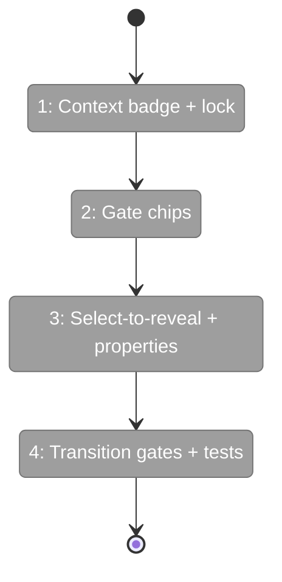

# Flight Plan: Phase 4 — Context Indicators + Select-to-Reveal

**Plan**: [workflow-page-ux-plan.md](../../workflow-page-ux-plan.md)
**Phase**: Phase 4: Context Indicators + Select-to-Reveal
**Generated**: 2026-02-26
**Status**: Ready for takeoff

---

## Departure → Destination

**Where we are**: Phase 3 delivered drag-and-drop from toolbox to canvas, node deletion, line management, and naming modals. Users can build workflows interactively. But node cards show placeholder context badges, no gate chips explain why nodes are blocked, and selecting a node doesn't reveal its dependency neighborhood.

**Where we're going**: Every node card shows its real context badge color (green/blue/purple/gray), blocked nodes display gate chips explaining the blocking reason, selecting a node dims unrelated nodes and shows a properties panel with inputs/outputs/status. Line transition gates are interactive.

---

## Flight Status

---

## Stages

- [ ] **Stage 1: Context badge + lock** — Pure computation function + wire into node cards + noContext lock icon (T001, T002, T003)
- [ ] **Stage 2: Gate chips** — GateChip component + wire into node cards for blocked nodes (T004)
- [ ] **Stage 3: Select-to-reveal + properties** — Node dimming + properties panel replacing toolbox on select (T005, T006)
- [ ] **Stage 4: Transition gates + tests** — Interactive manual gates + unit tests for all visual states (T007, T008)

---

## Acceptance Criteria

- [ ] AC-12: Gate chips on blocked nodes (5 gate types)
- [ ] AC-13: Context badges (green/blue/purple/gray)
- [ ] AC-14: noContext lock icon
- [ ] AC-15: Select-to-reveal: upstream traces, downstream muted, unrelated dim, properties panel
- [ ] AC-17: Line transition gates (auto/manual)
- [ ] AC-35: Unit tests with fakes (partial — context + gates + properties)

---

## Checklist

- [ ] T001: Context badge computation (pure function)
- [ ] T002: Wire real context badges into node cards
- [ ] T003: noContext lock icon
- [ ] T004: GateChip component with expandable gate list
- [ ] T004b: Context flow indicators between adjacent nodes (arrow/X/dots)
- [ ] T005: Select-to-reveal dimming (computeRelatedNodes)
- [ ] T006: Node properties panel
- [ ] T007: Interactive line transition gates
- [ ] T008: Unit tests
