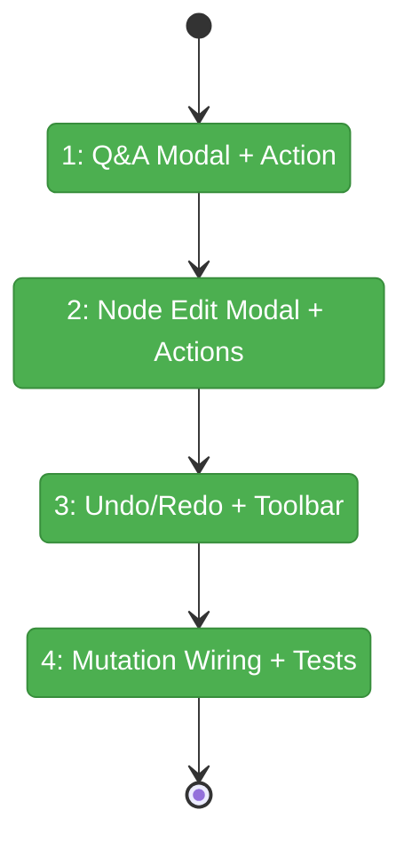
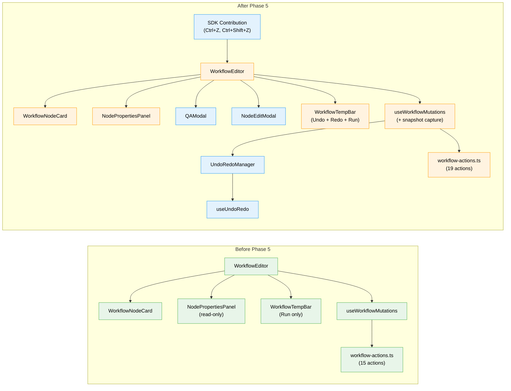

# Flight Plan: Phase 5 — Q&A + Node Properties Modal + Undo/Redo

**Plan**: [workflow-page-ux-plan.md](../../workflow-page-ux-plan.md)
**Phase**: Phase 5: Q&A + Node Properties Modal + Undo/Redo
**Generated**: 2026-02-26
**Status**: Landed

---

## Departure → Destination

**Where we are**: The workflow editor renders lines with node cards, supports drag-and-drop mutations, shows context badges, gate chips, and a read-only node properties panel. Users can add/remove/reorder nodes and lines with immediate filesystem persistence. The "Edit Properties..." button is disabled. Nodes in `waiting-question` state show a purple badge but clicking it does nothing. There is no undo/redo capability.

**Where we're going**: A developer can click a waiting-question badge to open a Q&A modal supporting 4 question types with freeform text. Double-clicking a node opens an edit modal for description, orchestrator settings, and input wiring. Every mutation is undoable via Ctrl+Z with toolbar buttons showing stack depth. The workflow editor feels complete for structural editing.

---

## Domain Context

### Domains We're Changing

| Domain | What Changes | Key Files |
|--------|-------------|-----------|
| workflow-ui | Q&A modal, node edit modal, undo/redo manager, SDK keybindings, toolbar buttons, mutation snapshot wrappers | `components/qa-modal.tsx`, `components/node-edit-modal.tsx`, `lib/undo-redo-manager.ts`, `hooks/use-undo-redo.ts`, `sdk/contribution.ts`, `sdk/register.ts` |
| workflow-ui (server) | 4 new server actions | `app/actions/workflow-actions.ts` |

### Domains We Depend On (no changes)

| Domain | What We Consume | Contract |
|--------|----------------|----------|
| _platform/positional-graph | `answerQuestion()`, `setInput()`, `setNodeDescription()`, `updateNodeOrchestratorSettings()` | IPositionalGraphService |
| _platform/positional-graph | `QuestionTypeSchema`, `Question`, `InputResolution`, `NodeConfig`, `NodeOrchestratorSettings` | Type exports |
| _platform/sdk | `ICommandRegistry`, `IKeybindingService`, `SDKContribution` | SDK registration API |

---

## Flight Status

<!-- Updated by /plan-6-v2: pending → active → done. Use blocked for problems/input needed. -->

**Legend**: grey = pending | yellow = active | red = blocked/needs input | green = done

---

## Stages

<!-- Updated by /plan-6-v2 during implementation: [ ] → [~] → [x] -->

- [x] **Stage 1: Q&A Read Contract + Modal + Action** — Fix `pendingQuestion` population in `getNodeStatus()` (cross-domain: `_platform/positional-graph`); build Q&A modal component with 4 question types and freeform text; create `answerQuestion` server action with answer→restart handshake (`positional-graph.service.ts`, `qa-modal.tsx`, `workflow-actions.ts`)
- [x] **Stage 2: Node Edit Modal + Server Actions** — Build node properties edit modal with description, orchestrator settings, and input wiring; create `updateNodeConfig` and `setInput` server actions; enable "Edit Properties..." button (`node-edit-modal.tsx`, `workflow-actions.ts`, `node-properties-panel.tsx`)
- [x] **Stage 3: Undo/Redo Manager + Toolbar** — Build `UndoRedoManager` class with snapshot/undo/redo/invalidate; create `useUndoRedo` React hook; create `restoreSnapshot` server action; add undo/redo arrow buttons to temp bar with stack depth badges; add `WorkflowSnapshot` type (`undo-redo-manager.ts`, `use-undo-redo.ts`, `workflow-actions.ts`, `types.ts`, `workflow-temp-bar.tsx`)
- [x] **Stage 4: Mutation Wiring + Tests** — Wrap all mutations in `useWorkflowMutations` with pre-mutation snapshot capture; wire modals into `workflow-editor.tsx`; write unit tests for Q&A modal, node edit modal, and undo manager (`use-workflow-mutations.ts`, `workflow-editor.tsx`, `workflow-node-card.tsx`, test files)

---

## Architecture: Before & After

**Legend**: existing (green, unchanged) | changed (orange, modified) | new (blue, created)

---

## Acceptance Criteria

- [ ] AC-16: Node properties edit modal with description, orchestratorSettings, input wiring — save persists to node.yaml
- [ ] AC-18: Q&A modal supports text, single-choice, multi-choice, confirm — answer submits via answerQuestion()
- [ ] AC-19: Freeform text input always available alongside structured question input
- [ ] AC-23: Ctrl+Z undoes last mutation via snapshot restore; Ctrl+Shift+Z redoes; max 50 snapshots
- [ ] AC-24: Undo/redo toolbar buttons show stack depth; disabled when empty

## Goals & Non-Goals

**Goals**:
- ✅ Q&A modal handles all 4 question types with freeform text
- ✅ Node edit modal edits description, orchestratorSettings, input wiring
- ✅ In-memory snapshot undo/redo with 50-snapshot cap
- ✅ Toolbar arrow buttons for undo/redo with stack depth display

**Non-Goals**:
- ❌ Persistent undo history across sessions
- ❌ Undoing runtime execution state changes
- ❌ SSE-triggered undo invalidation (Phase 6)
- ❌ Auto-wiring inputs (manual wiring via modal only)

---

## Checklist

- [x] T000: Fix `pendingQuestion` read contract in `getNodeStatus()`
- [x] T001: Q&A modal with 4 question types + freeform text
- [x] T002: answerQuestion server action + restart handshake
- [x] T003: Node properties edit modal (description, settings, inputs)
- [x] T004: updateNodeConfig + setInput server actions
- [x] T005: UndoRedoManager (in-memory snapshot pattern)
- [x] T006: restoreSnapshot server action
- [x] T007: ~~SDK keybindings~~ DROPPED — toolbar buttons only
- [x] T008: Toolbar undo/redo buttons with stack depth
- [x] T009: Wire mutations with snapshot capture
- [x] T010: Unit tests for Q&A, node edit, undo manager
