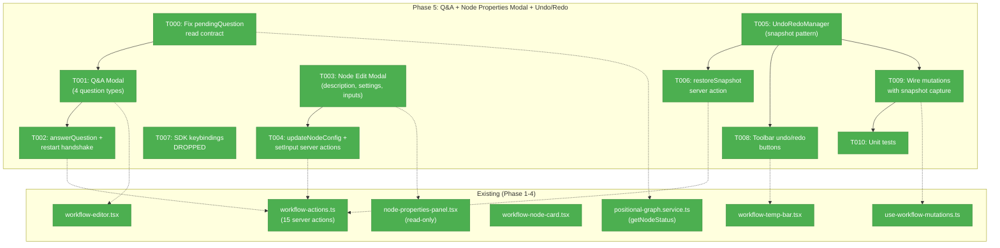
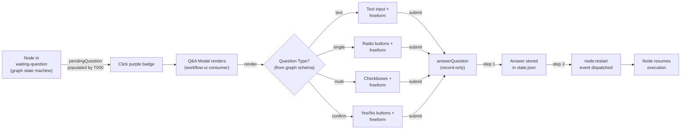
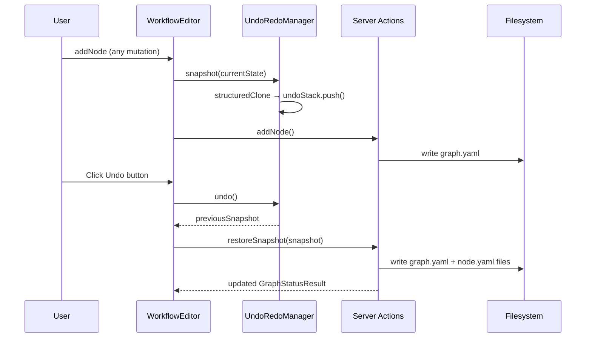
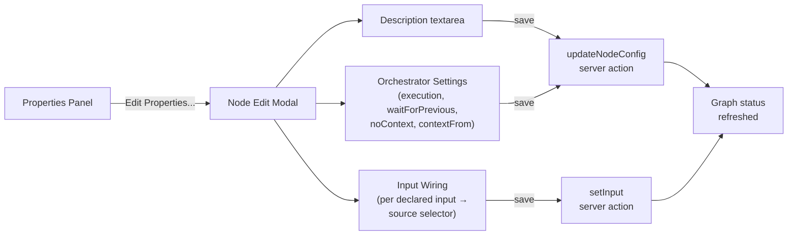

# Phase 5: Q&A + Node Properties Modal + Undo/Redo — Tasks Dossier

## Executive Briefing

- **Purpose**: Deliver user interaction modals and state management that let users answer workflow questions, edit node configuration, and undo/redo mutations — completing the workflow editor's core editing experience.
- **What We're Building**: A Q&A modal supporting 4 question types with always-on freeform text, a node properties edit modal with input wiring configuration, an in-memory snapshot undo/redo manager with keyboard shortcuts and toolbar buttons.
- **Goals**:
  - ✅ Q&A modal handles text, single-choice, multi-choice, and confirm question types
  - ✅ Freeform text input available alongside all question types
  - ✅ Node properties modal edits description, orchestratorSettings, and input wiring
  - ✅ In-memory snapshot undo/redo with 50-snapshot cap
  - ✅ Ctrl+Z / Ctrl+Shift+Z keybindings via SDK registration
  - ✅ Toolbar undo/redo buttons showing stack depth
- **Non-Goals**:
  - ❌ Persistent undo history (undo is session-scoped, lost on refresh)
  - ❌ Undoing runtime execution state changes (undo is structural only)
  - ❌ SSE-triggered undo invalidation (Phase 6 concern)
  - ❌ Node deletion from properties modal (already exists via Backspace/context menu)

---

## Prior Phase Context

### Phase 1: Domain Setup + Foundations

**Deliverables**: Domain docs (`docs/domains/workflow-ui/domain.md`), DI registration (`registerPositionalGraphServices()` + `WORK_UNIT_LOADER` bridge + `TemplateService`), `FakePositionalGraphService` (54 methods, 12 return builders), `FakeWorkUnitService`, doping script (8 scenarios), justfile commands, integration tests.

**Dependencies Exported**: `FakePositionalGraphService` with `withAnswerQuestionResult()` return builder — directly relevant for Q&A modal testing. DI tokens for service resolution in server actions.

**Gotchas**: Web tsconfig needs `@chainglass/positional-graph` mapped to `dist/` (Turbopack can't resolve `.js` extensions). `BaseResult` has no `data` field (only `errors` + optional `wasNoOp`).

**Patterns**: Server actions: `'use server'` → `getContainer()` → `resolve()` → delegate → return Result. Feature folder isolation at `src/features/050-workflow-page/`.

### Phase 2: Canvas Core + Layout

**Deliverables**: Workflow list page, editor page, 9 components (canvas, line, node card, toolbox, temp bar, empty states, transition gate), 4 server actions (listWorkflows, loadWorkflow, createWorkflow, listWorkUnits), navigation update, standalone flexbox layout (no PanelShell), 32 unit tests.

**Dependencies Exported**: Standalone editor layout (temp bar + canvas + right sidebar). All 8 node status states rendered. `WorkflowEditor` manages `selectedNodeId` state — Phase 5 hooks into this for modal triggers.

**Gotchas**: Standalone layout used instead of PanelShell — workflow editor has different panel needs.

### Phase 3: Drag-and-Drop + Persistence

**Deliverables**: 11 additional server actions (addNode, removeNode, moveNode, addLine, removeLine, setLineLabel, setLineDescription, updateLineSettings, saveAsTemplate, instantiateTemplate, listTemplates), `useWorkflowMutations` hook, DnD with drop zones, naming modals, node deletion.

**Dependencies Exported**: `useWorkflowMutations` hook — Phase 5 undo/redo wraps this to capture pre-mutation snapshots. All mutation server actions return `MutationResult` with updated `GraphStatusResult`.

**Gotchas**: Running-line restriction is a business rule (not UX preference) — active/complete lines block all mutations.

### Phase 4: Context Indicators + Select-to-Reveal

**Deliverables**: `gate-chip.tsx`, `node-properties-panel.tsx` (read-only), `context-flow-indicator.tsx`, `context-badge.ts`, `related-nodes.ts`, PCB trace visualization, node dimming on selection.

**Dependencies Exported**: `node-properties-panel.tsx` has disabled "Edit Properties..." button with `/* Coming in Phase 5 */` comment — Phase 5 enables this. `InputSourceDetail` component shows input status (available/waiting/error with E160 wiring guidance).

**Gotchas**: Manual gate action needs wiring to server action. Properties panel edit button is intentionally disabled.

**Incomplete Items**: Dimming tests flagged incomplete (AC-35 partial).

---

## Pre-Implementation Check

| File | Exists? | Domain Check | Notes |
|------|---------|-------------|-------|
| `packages/positional-graph/src/services/positional-graph.service.ts` | Yes — modify | _platform/positional-graph | T000: Populate `pendingQuestion` field in `getNodeStatus()` |
| `apps/web/src/features/050-workflow-page/components/qa-modal.tsx` | No — create | workflow-ui | New Q&A modal component |
| `apps/web/src/features/050-workflow-page/components/node-edit-modal.tsx` | No — create | workflow-ui | New node properties edit modal |
| `apps/web/src/features/050-workflow-page/lib/undo-redo-manager.ts` | No — create | workflow-ui | New undo/redo state manager |
| `apps/web/src/features/050-workflow-page/hooks/use-undo-redo.ts` | No — create | workflow-ui | React hook wrapping UndoRedoManager |
| `apps/web/src/features/050-workflow-page/sdk/contribution.ts` | ~~No — create~~ DROPPED | workflow-ui | ~~SDK contribution manifest~~ Not needed — toolbar buttons only |
| `apps/web/src/features/050-workflow-page/sdk/register.ts` | ~~No — create~~ DROPPED | workflow-ui | ~~SDK register function~~ Not needed — toolbar buttons only |
| `apps/web/app/actions/workflow-actions.ts` | Yes — modify | workflow-ui | Add getQuestion, answerQuestion, updateNodeConfig, restoreSnapshot, setInput |
| `apps/web/src/features/050-workflow-page/components/node-properties-panel.tsx` | Yes — modify | workflow-ui | Enable "Edit Properties..." button |
| `apps/web/src/features/050-workflow-page/components/workflow-node-card.tsx` | Yes — modify | workflow-ui | Add Q&A badge click handler |
| `apps/web/src/features/050-workflow-page/components/workflow-editor.tsx` | Yes — modify | workflow-ui | Wire modals, undo/redo, SDK registration |
| `apps/web/src/features/050-workflow-page/components/workflow-temp-bar.tsx` | Yes — modify | workflow-ui | Add undo/redo toolbar buttons |
| `apps/web/src/features/050-workflow-page/hooks/use-workflow-mutations.ts` | Yes — modify | workflow-ui | Add snapshot capture before mutations |
| `apps/web/src/features/050-workflow-page/types.ts` | Yes — modify | workflow-ui | Add snapshot types |

---

## Architecture Map



---

## Tasks

| Status | ID | Task | Domain | Path(s) | Done When | Notes |
|--------|-----|------|--------|---------|-----------|-------|
| [x] | T000 | Fix `pendingQuestion` population in `getNodeStatus()` + add `getQuestion` server action | _platform/positional-graph + workflow-ui | `packages/positional-graph/src/services/positional-graph.service.ts`, `apps/web/app/actions/workflow-actions.ts` | `getNodeStatus()` populates `pendingQuestion` field by looking up `pending_question_id` in `state.questions[]`; OR new `getQuestion(graphSlug, nodeId)` server action returns the `Question` object for a waiting node. Q&A modal can retrieve question payload. | **Prerequisite for T001.** Currently `NodeStatusResult.pendingQuestion` is defined in the interface but never populated. The graph system owns the event protocol (question:ask / question:answer) and state machine — questions are a higher-order concept consumed by workflow-ui. The read contract must be fulfilled in `_platform/positional-graph` so consumers can render Q&A UI. Prefer populating the existing interface field over adding a new method. |
| [x] | T001 | Build Q&A modal with 4 question types + always-on freeform text | workflow-ui | `apps/web/src/features/050-workflow-page/components/qa-modal.tsx` | Modal renders text input, radio (single), checkboxes (multi), yes/no (confirm); freeform text area always visible; Submit calls `answerQuestion` action; waiting-question nodes show clickable purple badge | AC-18, AC-19. **Domain note**: workflow-ui is a *consumer* of the question protocol owned by `_platform/positional-graph`. The modal only adds UX on top of the graph event system — it does not own question execution logic. Props: `question: PendingQuestion` (from `NodeStatusResult.pendingQuestion`), `onAnswer`, `onClose`. Show `options` for single/multi, `default` pre-filled. Question types from graph schema: text, single, multi, confirm. |
| [x] | T002 | Create server action: `answerQuestion` + trigger restart | workflow-ui | `apps/web/app/actions/workflow-actions.ts` | Action calls `IPositionalGraphService.answerQuestion(ctx, graphSlug, nodeId, questionId, answer)` to record the answer, then triggers `node:restart` to resume the node. Returns updated `GraphStatusResult` | **Two-step handshake**: `answerQuestion()` is record-only (stores answer, node stays in `waiting-question`). The node must then be restarted via `node:restart` event to resume execution. Verify the restart mechanism exists in the service — if not, this is a gap to raise. Follow existing server action pattern. |
| [x] | T003 | Build node properties edit modal (description, orchestratorSettings, input wiring) | workflow-ui | `apps/web/src/features/050-workflow-page/components/node-edit-modal.tsx`, `apps/web/src/features/050-workflow-page/lib/compute-available-sources.ts` | Modal shows: read-only unit info, editable description (textarea), orchestratorSettings (execution: serial/parallel select, waitForPrevious: checkbox, noContext: checkbox, contextFrom: text input), input wiring table (each declared input → source selector). Save persists all changes | AC-16. Enable "Edit Properties..." button in `node-properties-panel.tsx`. InputResolution supports `from_unit` (unit slug + output) and `from_node` (node ID + output) modes. **Reusable helper**: Create `compute-available-sources.ts` in `lib/` (alongside `related-nodes.ts`, `context-badge.ts`) — pure function that takes graph line/node data and returns valid upstream nodes+outputs for a given node position. The scope algorithms already exist privately in `input-resolution.ts` (`findSourcesByUnit`, `isInScope`) — reimplement client-side from loaded `GraphStatusResult` data to stay within `workflow-ui` domain. |
| [x] | T004 | Create server actions: `updateNodeConfig`, `setInput` | workflow-ui | `apps/web/app/actions/workflow-actions.ts` | `updateNodeConfig` calls `setNodeDescription()` + `updateNodeOrchestratorSettings()`. `setInput` calls `IPositionalGraphService.setInput(ctx, graphSlug, nodeId, inputName, source)`. Both return updated `GraphStatusResult` | Three service methods: `setNodeDescription()`, `updateNodeOrchestratorSettings()`, `setInput()`. InputResolution: `{ from_unit, from_output }` or `{ from_node, from_output }` |
| [x] | T005 | Build UndoRedoManager (in-memory snapshot pattern) | workflow-ui | `apps/web/src/features/050-workflow-page/lib/undo-redo-manager.ts`, `apps/web/src/features/050-workflow-page/hooks/use-undo-redo.ts` | `snapshot(state)` deep-clones and pushes to undo stack; `undo()` pops undo → pushes to redo → returns snapshot; `redo()` pops redo → pushes to undo → returns snapshot; `invalidate()` clears both stacks; max 50 snapshots; `undoDepth`/`redoDepth` accessors | AC-23. Per W004: snapshot `PositionalGraphDefinition` + all `NodeConfig` objects (NOT `state.json`). Use `structuredClone()` for isolation. Add to types.ts: `WorkflowSnapshot = { definition: PositionalGraphDefinition; nodeConfigs: Record<string, NodeConfig> }` |
| [x] | T006 | Create server action: `restoreSnapshot` | workflow-ui | `apps/web/app/actions/workflow-actions.ts` | Action writes `graph.yaml` (definition) + all `node.yaml` files from snapshot atomically, returns updated `GraphStatusResult`. **Blocks if any line is running/active** — returns error + toast "Cannot undo while workflow is running" | Per W004: write all files in sequence with error handling. Use `IPositionalGraphService` methods or direct file ops for atomic restore. **Guard**: check `GraphStatusResult` for any active/running lines before restoring — if found, reject with clear error. This prevents fighting the orchestrator which watches the same files. |
| [x] | T007 | ~~SDK keybindings~~ | workflow-ui | — | DROPPED: Toolbar arrow buttons sufficient; no keyboard shortcuts needed | Eliminated to avoid Ctrl+Z conflicts with text inputs in modals |
| [x] | T008 | Build undo/redo toolbar buttons with stack depth display | workflow-ui | `apps/web/src/features/050-workflow-page/components/workflow-temp-bar.tsx` | Undo button (↶) and Redo button (↷) in temp bar; disabled when respective stack empty; tooltip shows "Undo" / "Redo"; badge shows depth count when > 0 | AC-24. Add to right side of temp bar before Run button |
| [x] | T009 | Wire mutations with snapshot capture (wrap useWorkflowMutations) | workflow-ui | `apps/web/src/features/050-workflow-page/hooks/use-workflow-mutations.ts`, `apps/web/src/features/050-workflow-page/components/workflow-editor.tsx` | Every mutation (addNode, removeNode, moveNode, addLine, removeLine, setLineLabel, setLineDescription, updateLineSettings, answerQuestion, updateNodeConfig, setInput) captures pre-mutation snapshot before executing; snapshot includes current definition + all nodeConfigs | Per W004: snapshot BEFORE mutation, not after. `useWorkflowMutations` calls `undoManager.snapshot(currentState)` as first step of each mutation wrapper |
| [x] | T010 | Unit tests for Q&A modal (all 4 types), node edit modal, undo manager | workflow-ui | `test/unit/web/features/050-workflow-page/qa-modal.test.tsx`, `test/unit/web/features/050-workflow-page/node-edit-modal.test.tsx`, `test/unit/web/features/050-workflow-page/undo-redo-manager.test.ts` | Q&A: renders each question type correctly, freeform always visible, submit calls handler. Node edit: renders all fields, saves changes, input wiring selectors work. Undo manager: push/undo/redo/invalidate, max 50 cap, structuredClone isolation | AC-35 (partial). Use factory functions (`makeQuestion()`, `makeNodeConfig()`) and `FakePositionalGraphService` |

---

## Context Brief

### Key findings from plan

- **Finding 01** (Critical): IPositionalGraphService registered in DI — resolved in Phase 1. Phase 5 server actions can `resolve()` it.
- **Finding 02** (Critical): `FakePositionalGraphService` has `withAnswerQuestionResult()` return builder — ready for Q&A modal testing.
- **Finding 08** (Medium): Server actions follow container.resolve → service.method pattern — Phase 5 actions follow same pattern.

### Domain dependencies

- `_platform/positional-graph`: **Owns the question event protocol** (`question:ask` / `question:answer` events, state machine transitions). The graph system is agnostic to what questions *are* — it provides the event plumbing and state transitions. `workflow-ui` is a **consumer** of this protocol.
- `_platform/positional-graph`: `IPositionalGraphService.answerQuestion()` — record-only (stores answer, node stays in `waiting-question`). Node must be restarted separately via `node:restart` event to resume execution. Two-step handshake.
- `_platform/positional-graph`: `NodeStatusResult.pendingQuestion` — defined in interface but **not currently populated** by `getNodeStatus()`. T000 fixes this read contract gap.
- `_platform/positional-graph`: `.setInput()`, `.setNodeDescription()`, `.updateNodeOrchestratorSettings()` — node config mutation APIs for edit modal
- `_platform/positional-graph`: `QuestionTypeSchema` (text/single/multi/confirm), `Question` type, `InputResolution` type, `NodeConfig`, `NodeOrchestratorSettings` — type imports
- `_platform/events`: Transport layer only — routes events, does not understand question semantics

### Domain constraints

- **Question protocol ownership**: `_platform/positional-graph` owns the event protocol and state machine. `workflow-ui` only consumes it — no question execution logic in the web UI domain.
- All new UI files go in `apps/web/src/features/050-workflow-page/` (feature folder isolation)
- No cross-feature imports — workflow-ui components don't import from other feature folders
- Server actions follow existing pattern in `workflow-actions.ts`
- T000 touches `_platform/positional-graph` (the only cross-domain code change in this phase) — keep the change minimal: populate an existing interface field, don't add new methods

### Reusable from prior phases

- `FakePositionalGraphService` with 12 return builders (especially `withAnswerQuestionResult()`)
- `makeNode()` factory function in tests for creating realistic `NodeStatusResult` objects
- `useWorkflowMutations` hook — extend with snapshot capture
- `naming-modal.tsx` — reference for modal patterns (dialog, form validation, submit)
- `node-properties-panel.tsx` — reference for node data display patterns

### System flow — Q&A Modal

**Domain separation**: The graph system owns the event protocol (`question:ask`/`question:answer`, state transitions). `workflow-ui` is a consumer — it provides UX (badge, modal) and calls the graph service's API. It does NOT own question execution logic.



### System flow — Undo/Redo



### System flow — Node Edit Modal



---

## Discoveries & Learnings

_Populated during implementation by plan-6._

| Date | Task | Type | Discovery | Resolution | References |
|------|------|------|-----------|------------|------------|

---

## Directory Layout

```
docs/plans/050-workflow-page-ux/
  ├── workflow-page-ux-plan.md
  ├── workflow-page-ux-spec.md
  ├── research-dossier.md
  ├── workshops/
  └── tasks/
      ├── phase-1-domain-setup-foundations/
      ├── phase-2-canvas-core-layout/
      ├── phase-3-drag-drop-persistence/
      ├── phase-4-context-indicators/
      └── phase-5-qa-node-properties-undo-redo/
          ├── tasks.md              ← this file
          ├── tasks.fltplan.md      ← flight plan
          └── execution.log.md     ← created by plan-6
```
