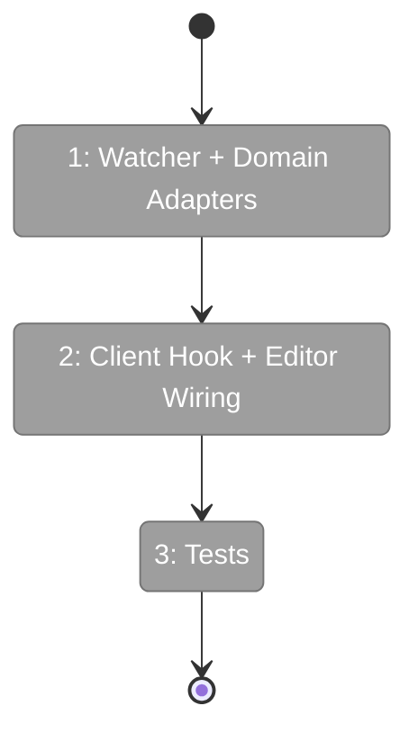
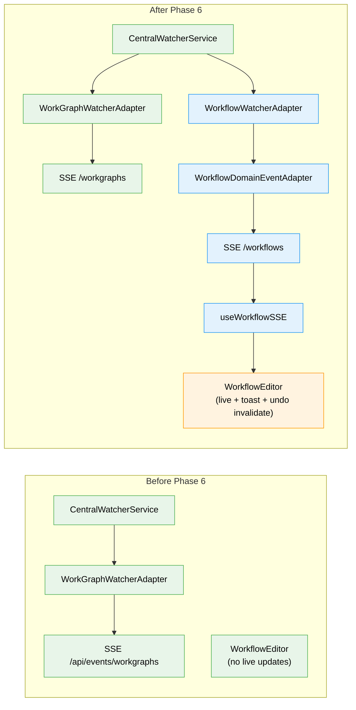

# Flight Plan: Phase 6 — Real-Time SSE Updates

**Plan**: [workflow-page-ux-plan.md](../../workflow-page-ux-plan.md)
**Phase**: Phase 6: Real-Time SSE Updates
**Generated**: 2026-02-27
**Status**: Ready for takeoff

---

## Departure → Destination

**Where we are**: The workflow editor renders and edits graphs with full CRUD, context indicators, Q&A modals, node properties editing, and in-memory undo/redo. But changes made externally (CLI, agents, other tabs) are invisible until manual page refresh.

**Where we're going**: A developer working in the editor sees the canvas auto-update within ~500ms when the CLI or an agent modifies the workflow. A toast says "Workflow changed externally", and the undo stack is invalidated to prevent conflicts. Own mutations are silently suppressed from triggering unnecessary refreshes.

---

## Domain Context

### Domains We're Changing

| Domain | What Changes | Key Files |
|--------|-------------|-----------|
| _platform/events | New WorkflowWatcherAdapter + WorkflowDomainEventAdapter, register in bootstrap | `workflow-watcher.adapter.ts`, `workflow-domain-event-adapter.ts`, `start-central-notifications.ts` |
| workflow-ui | New useWorkflowSSE hook, editor wiring for invalidation + toast + self-suppression | `use-workflow-sse.ts`, `workflow-editor.tsx` |

### Domains We Depend On (no changes)

| Domain | What We Consume | Contract |
|--------|----------------|----------|
| _platform/events | CentralWatcherService, IWatcherAdapter, DomainEventAdapter, useSSE, SSE route | Existing SSE pipeline |
| _platform/events | ICentralEventNotifier, ISSEBroadcaster | Event routing contracts |
| workflow-ui | UndoRedoManager.invalidate(), loadWorkflow action | Phase 5 deliverables |

---

## Flight Status

**Legend**: grey = pending | yellow = active | red = blocked/needs input | green = done

---

## Stages

- [ ] **Stage 1: Watcher + Domain Adapters + Registration** — Create `WorkflowWatcherAdapter` (self-filter, 200ms debounce), `WorkflowDomainEventAdapter` (SSE routing), register in `startCentralNotificationSystem()` (`workflow-watcher.adapter.ts`, `workflow-domain-event-adapter.ts`, `start-central-notifications.ts`)
- [ ] **Stage 2: Client Hook + Editor Wiring** — Build `useWorkflowSSE` hook (SSE subscription, graphSlug filter, self-event suppression), wire into editor with undo invalidation + sonner toast + auto re-fetch (`use-workflow-sse.ts`, `workflow-editor.tsx`)
- [ ] **Stage 3: Tests** — Watcher adapter unit test (path filtering, debounce), hook unit test (SSE handling, self-suppression) (`workflow-watcher-adapter.test.ts`, `use-workflow-sse.test.ts`)

---

## Architecture: Before & After

**Legend**: existing (green, unchanged) | changed (orange, modified) | new (blue, created)

---

## Acceptance Criteria

- [ ] AC-25: External changes invalidate undo stack + toast
- [ ] AC-26: SSE live updates for active workflow editor
- [ ] AC-27: WorkflowWatcherAdapter for graph file changes

## Goals & Non-Goals

**Goals**:
- ✅ External file changes trigger SSE → editor refresh within ~500ms
- ✅ Undo stack invalidated + toast on external change
- ✅ Self-event suppression (no refresh from own mutations)

**Non-Goals**:
- ❌ Real-time conflict resolution
- ❌ Granular diff-based updates (full reload per change)
- ❌ SSE for workflow list page

---

## Checklist

- [ ] T001: WorkflowWatcherAdapter (self-filter, debounce)
- [ ] T002: WorkflowDomainEventAdapter (SSE routing)
- [ ] T003: Register adapters in bootstrap
- [ ] T004: useWorkflowSSE hook
- [ ] T005: Undo invalidation + toast
- [ ] T006: Self-event suppression
- [ ] T007: Unit + integration tests
