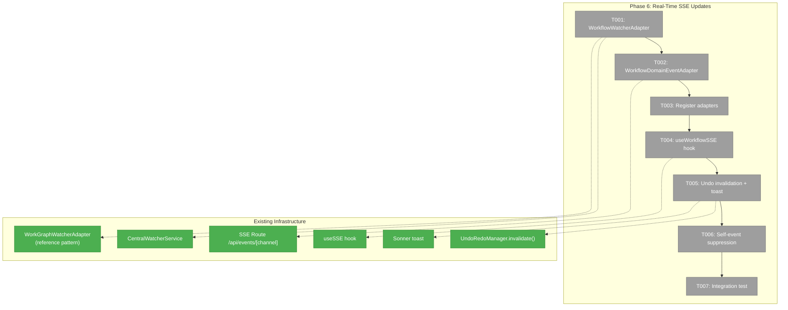
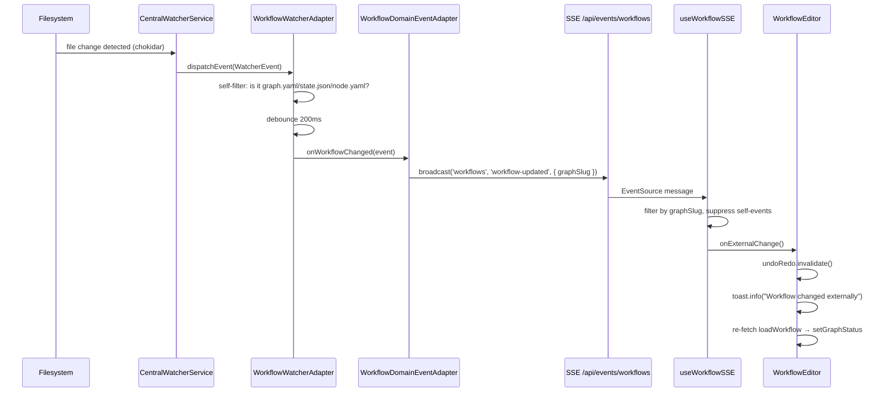
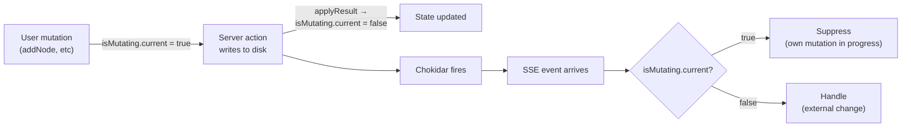

# Phase 6: Real-Time SSE Updates — Tasks Dossier

## Executive Briefing

- **Purpose**: Wire SSE events so the workflow editor automatically refreshes when graph files change on disk — from CLI mutations, agent orchestration, or other browser tabs — completing the real-time collaboration story.
- **What We're Building**: A `WorkflowWatcherAdapter` that detects graph file changes, a `WorkflowDomainEventAdapter` that routes them to SSE, a `useWorkflowSSE` hook for client subscription, external change → undo invalidation + toast, and self-event suppression to avoid reacting to our own mutations.
- **Goals**:
  - ✅ Filesystem changes to graph.yaml, state.json, node.yaml trigger SSE events
  - ✅ Active workflow editor auto-refreshes on external changes
  - ✅ External changes invalidate undo/redo stack with toast notification
  - ✅ Own mutations don't trigger SSE refresh (self-event suppression)
- **Non-Goals**:
  - ❌ Real-time collaborative editing (no conflict resolution)
  - ❌ Granular diff-based updates (full reload on any change)
  - ❌ SSE for graph list page (editor only)

---

## Prior Phase Context

### Phase 5: Q&A + Node Properties Modal + Undo/Redo

**Deliverables**: Q&A modal (4 question types + freeform), node edit modal (description, settings, input wiring), UndoRedoManager (50-snapshot cap, structuredClone), undo/redo toolbar buttons, snapshot capture before mutations, 5 new server actions (answerQuestion, restoreSnapshot, updateNodeConfig, setNodeInput, loadSnapshotData).

**Dependencies Exported**: `UndoRedoManager.invalidate()` — clears both stacks. Phase 6 calls this when external SSE events arrive. `useUndoRedo` hook exposes `invalidate` callback. `WorkflowSnapshot` type. `loadSnapshotData` server action for fetching current state.

**Gotchas**: Undo blocked while workflow is running (guard in restoreSnapshot). Keyboard shortcuts dropped (toolbar only). `getNodeStatus` now fault-tolerant for missing node configs (returns degraded status instead of throwing).

**Patterns**: Server actions follow `getContainer()` → `resolve()` → delegate pattern. Feature isolation in `src/features/050-workflow-page/`. Toast available via `import { toast } from 'sonner'`.

---

## Pre-Implementation Check

| File | Exists? | Domain Check | Notes |
|------|---------|-------------|-------|
| `packages/workflow/src/features/023-central-watcher-notifications/workflow-watcher.adapter.ts` | No — create | _platform/events | New watcher adapter — follow `workgraph-watcher.adapter.ts` pattern |
| `apps/web/src/features/027-central-notify-events/workflow-domain-event-adapter.ts` | No — create | _platform/events | New domain adapter — follow `workgraph-domain-event-adapter.ts` pattern |
| `apps/web/src/features/027-central-notify-events/start-central-notifications.ts` | Yes — modify | _platform/events | Register new adapters alongside existing ones |
| `apps/web/src/features/050-workflow-page/hooks/use-workflow-sse.ts` | No — create | workflow-ui | New SSE subscription hook |
| `apps/web/src/features/050-workflow-page/components/workflow-editor.tsx` | Yes — modify | workflow-ui | Wire SSE hook, undo invalidation, toast |
| `packages/workflow/src/features/023-central-watcher-notifications/index.ts` | Yes — modify | _platform/events | Export new adapter |

---

## Architecture Map



---

## Tasks

| Status | ID | Task | Domain | Path(s) | Done When | Notes |
|--------|-----|------|--------|---------|-----------|-------|
| [ ] | T001 | Create WorkflowWatcherAdapter (filters for graph.yaml, state.json, node.yaml) | _platform/events | `packages/workflow/src/features/023-central-watcher-notifications/workflow-watcher.adapter.ts` | Adapter receives all `WatcherEvent`s, self-filters for `.chainglass/data/workflows/{slug}/` paths matching `graph.yaml`, `state.json`, or `nodes/*/node.yaml`; emits **two event types**: `WorkflowStructureChangedEvent` (graph.yaml, node.yaml) and `WorkflowStatusChangedEvent` (state.json); 200ms debounce per event type to coalesce rapid writes | AC-27. Follow `workgraph-watcher.adapter.ts` pattern: implements `IWatcherAdapter`, callback-set subscriber pattern, error isolation per subscriber. **Critical distinction**: structural changes (graph.yaml, node.yaml) invalidate undo + toast. Runtime changes (state.json) silently refresh status only — orchestrator writes state.json many times/sec during execution. |
| [ ] | T002 | Create WorkflowDomainEventAdapter (routes to SSE channel) | _platform/events | `apps/web/src/features/027-central-notify-events/workflow-domain-event-adapter.ts` | Events broadcast on `'workflows'` SSE channel with `{ graphSlug, changeType: 'structure' | 'status' }` payload; extends `DomainEventAdapter<WorkflowChangedEvent>` | Follow `workgraph-domain-event-adapter.ts` pattern. Per ADR-0007: SSE carries only identifiers + changeType discriminator, client fetches full state via REST. Add `'workflows'` to `WorkspaceDomain` channel registry. |
| [ ] | T003 | Register new adapters in notification bootstrap | _platform/events | `apps/web/src/features/027-central-notify-events/start-central-notifications.ts`, `packages/workflow/src/features/023-central-watcher-notifications/index.ts` | WorkflowWatcherAdapter + WorkflowDomainEventAdapter created and registered alongside existing workgraph/file adapters; auto-start with `startCentralNotificationSystem()` | Export from package barrel. Follow existing registration pattern: create adapter → register with watcher → subscribe to adapter events → wire to domain adapter. |
| [ ] | T004 | Build useWorkflowSSE hook (client-side subscription) | workflow-ui | `apps/web/src/features/050-workflow-page/hooks/use-workflow-sse.ts` | Hook subscribes to `/api/events/workflows` SSE channel, filters by active `graphSlug`, calls `onExternalChange(changeType)` callback with `'structure'` or `'status'` discriminator; returns `{ isConnected }` | Use existing `useSSE` hook as foundation. Filter messages by `graphSlug` match. **Debounce**: 300ms for structural changes, 1500ms for status changes (state.json writes many times/sec during orchestration). |
| [ ] | T005 | Wire external change → undo invalidation + toast (structural only) | workflow-ui | `apps/web/src/features/050-workflow-page/components/workflow-editor.tsx` | **Structural changes** (`changeType: 'structure'`): call `undoRedo.invalidate()`, re-fetch, show toast "Workflow changed externally". **Runtime changes** (`changeType: 'status'`): silent re-fetch only, NO undo invalidation, NO toast — normal orchestration status transitions | Import `toast` from `sonner`. Discriminate on `changeType` from SSE payload. Use `loadWorkflow` server action to refresh `graphStatus`. |
| [ ] | T006 | Self-event suppression (mutation lock pattern) | workflow-ui | `apps/web/src/features/050-workflow-page/hooks/use-workflow-sse.ts`, `apps/web/src/features/050-workflow-page/components/workflow-editor.tsx` | Use `isMutating` ref: set `true` before mutation starts, `false` after `applyResult`. Hook ignores ALL SSE events while `isMutating` is true. Covers any mutation duration regardless of file count (restoreSnapshot writes graph.yaml + N node.yaml sequentially). | Per W004. Mutation lock is more robust than timestamp window — no risk of tail-end writes from multi-file operations being treated as external changes. |
| [ ] | T007 | Unit test for watcher adapter + integration test for SSE pipeline | workflow-ui + _platform/events | `test/unit/workflow/workflow-watcher-adapter.test.ts`, `test/unit/web/features/050-workflow-page/use-workflow-sse.test.ts` | Watcher adapter: filters correct paths, debounces, emits events. Hook test: receives SSE message, calls onExternalChange, suppresses self-events | Use `FakeWatcherAdapter` pattern from existing tests. For hook test, mock EventSource. |

---

## Context Brief

### Key findings from plan

- **Finding 06** (High): SSE watcher only has WorkGraphWatcherAdapter — need new WorkflowWatcherAdapter for positional graph file changes. This is the primary motivation for Phase 6.
- **Finding 05** (High): @xyflow/react still used by Plan 011 — workgraph SSE must remain alongside new workflow SSE until Phase 7 removes it.

### Domain dependencies

- `_platform/events`: `CentralWatcherService`, `IWatcherAdapter`, `DomainEventAdapter<T>`, `ICentralEventNotifier`, `WorkspaceDomain` channel registry — the entire SSE pipeline infrastructure
- `_platform/events`: `ISSEBroadcaster.broadcast(channel, eventType, data)` — server-side broadcast to connected clients
- `_platform/events`: Existing `useSSE<T>(url)` hook — generic SSE client subscription
- `workflow-ui`: `UndoRedoManager.invalidate()` — Phase 5 undo stack clearing
- `workflow-ui`: `loadWorkflow` server action — re-fetch graph status after external change
- Toast: `sonner` (`toast.info()`) — already mounted in `<Providers>`, available globally

### Domain constraints

- WorkflowWatcherAdapter goes in `packages/workflow/` (watcher layer is in the workflow package)
- WorkflowDomainEventAdapter goes in `apps/web/src/features/027-central-notify-events/` (domain adapter layer is web-specific)
- useWorkflowSSE goes in `apps/web/src/features/050-workflow-page/hooks/` (feature isolation)
- SSE carries only identifiers (ADR-0007) — client fetches full state via REST
- Debounce: 200ms at watcher layer, 300ms at client hook — prevents event storms from rapid file writes

### Reusable from prior phases

- `WorkGraphWatcherAdapter` — direct pattern to follow for `WorkflowWatcherAdapter`
- `WorkgraphDomainEventAdapter` — direct pattern for `WorkflowDomainEventAdapter`
- `start-central-notifications.ts` — registration bootstrap pattern
- `useSSE` hook — generic SSE subscription, reuse as foundation
- `useFileChanges` / `FileChangeHub` — pattern reference for debounced event handling
- `FakeWatcherAdapter`, `FakeCentralWatcherService` — test infrastructure

### System flow — SSE Pipeline



### System flow — Self-Event Suppression



---

## Discoveries & Learnings

_Populated during implementation by plan-6._

| Date | Task | Type | Discovery | Resolution | References |
|------|------|------|-----------|------------|------------|

---

## Directory Layout

```
docs/plans/050-workflow-page-ux/
  ├── workflow-page-ux-plan.md
  ├── workflow-page-ux-spec.md
  ├── research-dossier.md
  ├── workshops/
  └── tasks/
      ├── phase-1-domain-setup-foundations/
      ├── phase-2-canvas-core-layout/
      ├── phase-3-drag-drop-persistence/
      ├── phase-4-context-indicators/
      ├── phase-5-qa-node-properties-undo-redo/
      └── phase-6-real-time-sse-updates/
          ├── tasks.md              ← this file
          ├── tasks.fltplan.md      ← flight plan
          └── execution.log.md     ← created by plan-6
```
