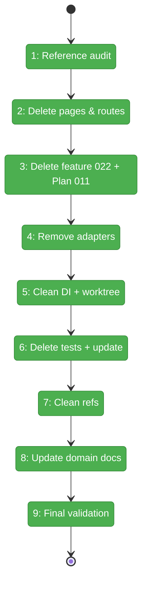
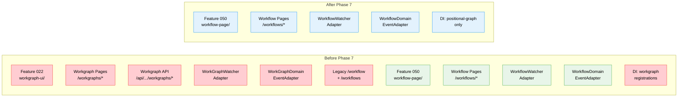

# Flight Plan: Phase 7 — Workgraph Deprecation + Cleanup

**Plan**: [../../workflow-page-ux-plan.md](../../workflow-page-ux-plan.md)
**Phase**: Phase 7: Workgraph Deprecation + Cleanup
**Generated**: 2026-02-27
**Status**: Landed

---

## Departure → Destination

**Where we are**: Phases 1–6 built a complete positional-graph-based workflow editor at `/workspaces/[slug]/workflows/`. The old Plan 022 workgraph UI (ReactFlow-based) still exists at `/workspaces/[slug]/workgraphs/` with 17 feature files, 4 API routes, 18 test files, event adapters, and DI registrations. Legacy Plan 011 demo pages at `/workflow` and `/workflows` also remain. Both old and new systems coexist — workgraph watchers and workflow watchers run in parallel.

**Where we're going**: Zero workgraph references in `apps/web/`. All Plan 022 UI code deleted. Legacy Plan 011 workflow pages removed. Event adapters cleaned. DI container streamlined. Only the new workflow editor remains. `just fft` passes cleanly.

---

## Domain Context

### Domains We're Changing

| Domain | What Changes | Key Files |
|--------|-------------|-----------|
| _platform/workgraph | Remove ALL web UI presence (pages, API routes, feature folder, DI) | `apps/web/src/features/022-workgraph-ui/`, `app/(dashboard)/workspaces/[slug]/workgraphs/`, `app/api/workspaces/[slug]/workgraphs/` |
| _platform/events | Remove WorkGraphWatcherAdapter + WorkGraphDomainEventAdapter; deprecate `WorkspaceDomain.Workgraphs` | `workgraph-watcher.adapter.ts`, `workgraph-domain-event-adapter.ts`, `workspace-domain.ts` |
| workflow-ui | Remove legacy Plan 011 pages; finalize as sole workflow UI | `app/(dashboard)/workflow/`, `app/(dashboard)/workflows/` |

### Domains We Depend On (no changes)

| Domain | What We Consume | Contract |
|--------|----------------|----------|
| _platform/positional-graph | Existing workflow editor services | IPositionalGraphService, ITemplateService |
| _platform/file-ops | Server action filesystem access | IFileSystem, IPathResolver |

---

## Flight Status

<!-- Updated by /plan-6-v2: pending → active → done. Use blocked for problems/input needed. -->

**Legend**: grey = pending | yellow = active | red = blocked/needs input | green = done

---

## Stages

<!-- Updated by /plan-6-v2 during implementation: [ ] → [~] → [x] -->

- [x] **Stage 1: Audit** — Formalize workgraph blast radius map with per-file disposition
- [x] **Stage 2: Delete pages & routes** — Remove workgraph pages, API routes, legacy workflow pages (~16 files)
- [x] **Stage 3: Delete feature 022 + Plan 011** — Remove feature folder + orphaned components (~30 files)
- [x] **Stage 4: Remove adapters** — Delete WorkGraph*Adapter files + unregister from central notifications
- [x] **Stage 5: Clean DI + worktree** — Remove workgraph DI registrations + update worktree page
- [x] **Stage 6: Delete tests** — Remove Plan 022 test files + update cross-referencing tests
- [x] **Stage 7: Clean references** — Remove remaining workgraph comments, imports, domain channel
- [x] **Stage 8: Update domain docs** — Update domain-map, registry, workflow-ui domain
- [x] **Stage 9: Final validation** — `just fft` passes + zero workgraph grep in apps/web/

---

## Architecture: Before & After

**Legend**: green = existing (unchanged) | red = being removed | blue = kept/finalized

---

## Acceptance Criteria

- [ ] AC-31: Remove workgraph UI pages
- [ ] AC-32: Remove legacy API routes
- [ ] AC-33: Remove legacy workflow/workflows pages
- [ ] AC-34: Remove workgraph event adapters

## Goals & Non-Goals

**Goals**: Zero workgraph imports in web app. All legacy pages deleted. Event adapters cleaned. DI streamlined. Tests pass.
**Non-Goals**: Not deleting @chainglass/workgraph package. Not removing @xyflow/react dependency. Not migrating any workgraph data.

---

## Checklist

- [x] T001: Execute workgraph reference audit
- [x] T002: Delete workgraph pages + API routes + legacy workflow pages
- [~] T003: Delete Feature 022 folder + orphaned Plan 011 components
- [ ] T004: Remove WorkGraph*Adapter + unregister from central notifications
- [ ] T005: Remove workgraph DI registrations + update worktree page
- [ ] T006: Delete Plan 022 test files + update cross-referencing tests
- [ ] T007: Clean up remaining workgraph references
- [ ] T008: Update domain-map + registry + workflow-ui domain
- [ ] T009: Final validation: `just fft` + zero workgraph grep
