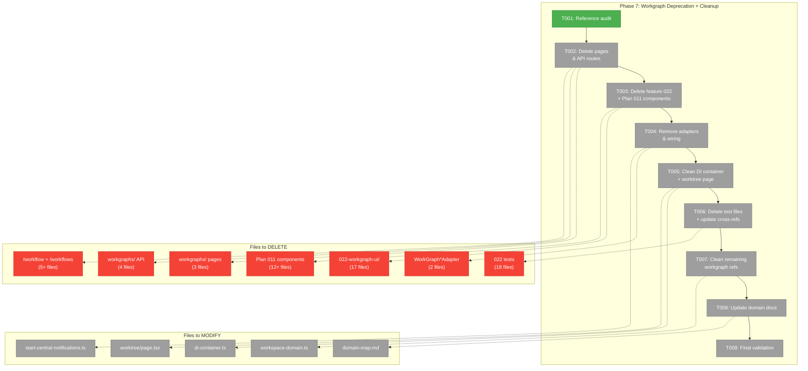
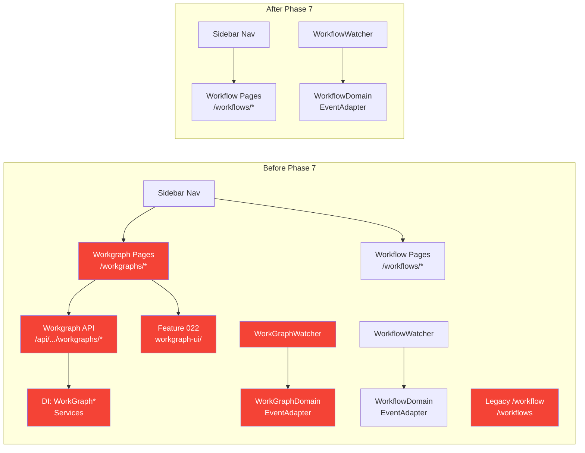
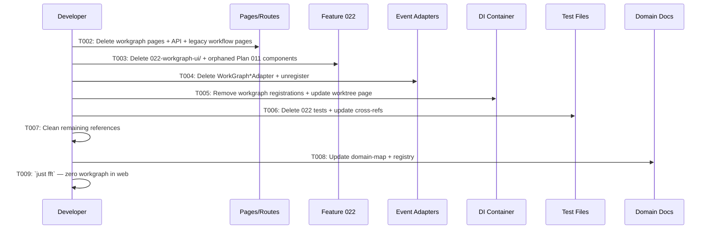

# Phase 7: Workgraph Deprecation + Cleanup — Tasks & Context Brief

**Plan**: [workflow-page-ux-plan.md](../../workflow-page-ux-plan.md)
**Phase**: Phase 7: Workgraph Deprecation + Cleanup
**Generated**: 2026-02-27

---

## Executive Briefing

- **Purpose**: Remove all deprecated Plan 022 workgraph UI code from the web app, including pages, API routes, feature folder, event adapters, DI registrations, and associated tests. This completes the migration from the old ReactFlow-based workgraph editor to the new positional-graph-based workflow editor built in Phases 1–6.
- **What We're Building**: Nothing new — this is pure deletion and cleanup. Every workgraph reference in `apps/web/` gets removed or replaced. The `@chainglass/workgraph` package itself stays (CLI and other consumers remain).
- **Goals**: ✅ Zero workgraph imports in `apps/web/` ✅ All workgraph pages/routes deleted ✅ Plan 022 feature folder deleted ✅ Legacy Plan 011 workflow pages deleted ✅ Event adapters removed ✅ DI container cleaned ✅ `just fft` passes
- **Non-Goals**: ❌ Deleting the `@chainglass/workgraph` package (CLI still uses it) ❌ Removing `@xyflow/react` dependency (Plan 011 components outside web may use it) ❌ Migrating any workgraph functionality — new workflow editor already built in Phases 1–6

---

## Prior Phase Context

### Phase 1–2: Domain Setup + Canvas Core

**Deliverables**: workflow-ui domain, DI registration, FakePositionalGraphService, doping system, workflow list/editor pages at `/workspaces/[slug]/workflows/`, server actions, canvas/node card/toolbox components.
**Dependencies Exported**: DI tokens, server action signatures, feature folder convention at `050-workflow-page/`.
**Gotchas**: Web tsconfig needs `@chainglass/positional-graph` → `dist/` mapping. Standalone layout used instead of PanelShell.
**Patterns**: Server Component → Client Component; `getContainer().resolve()` for server actions; `050-workflow-page/` feature folder.

### Phase 3–4: DnD + Context Indicators

**Deliverables**: Drag-and-drop (toolbox→line, reorder, cross-line), node deletion, naming modals, context badges, gate chips, select-to-reveal traces, node properties panel.
**Dependencies Exported**: `useWorkflowMutations` hook, `WorkflowDragData` type, `computeRelatedNodes()`, context badge computation.
**Gotchas**: Empty lines marked "complete" by graph engine — check `nodes.length === 0`. dnd-kit drop zones must always be mounted.

### Phase 5–6: Q&A + Undo/Redo + SSE

**Deliverables**: Q&A modal, node edit modal, UndoRedoManager, undo/redo toolbar buttons, SSE watcher/adapter/hook, mutation lock, structural vs runtime change discrimination.
**Dependencies Exported**: `UndoRedoManager`, `useUndoRedo`, `useWorkflowSSE`, `WorkflowSnapshot` type.
**Gotchas**: Undo blocked during execution. Two-step Q&A handshake. State.json write storms need 1500ms debounce. Mutation lock via `isMutating` ref.
**Incomplete**: SDK keybindings dropped (toolbar-only), `use-workflow-sse.test.ts` not written (FT-003).

---

## Pre-Implementation Check

| File/Dir | Exists? | Action | Domain Check | Notes |
|----------|---------|--------|-------------|-------|
| `apps/web/src/features/022-workgraph-ui/` | ✅ Yes (17 files) | DELETE entire dir | _platform/workgraph | Plan 022 feature folder |
| `apps/web/app/(dashboard)/workspaces/[slug]/workgraphs/` | ✅ Yes (3 files) | DELETE entire dir | _platform/workgraph | Workgraph list + detail pages |
| `apps/web/app/api/workspaces/[slug]/workgraphs/` | ✅ Yes (4 files) | DELETE entire dir | _platform/workgraph | 4 API route files |
| `apps/web/app/(dashboard)/workflow/page.tsx` | ✅ Yes | DELETE | workflow-ui | Plan 011 demo page |
| `apps/web/app/(dashboard)/workflows/` | ✅ Yes (4+ files) | DELETE entire dir | workflow-ui | Plan 011 legacy pages |
| `packages/workflow/src/.../workgraph-watcher.adapter.ts` | ✅ Yes | DELETE | _platform/events | Watcher adapter |
| `apps/web/src/features/027-central-notify-events/workgraph-domain-event-adapter.ts` | ✅ Yes | DELETE | _platform/events | Domain event adapter |
| `apps/web/src/lib/di-container.ts` | ✅ Yes | MODIFY | cross-domain | Remove workgraph DI registrations |
| `apps/web/app/(dashboard)/workspaces/[slug]/worktree/page.tsx` | ✅ Yes | MODIFY | cross-domain | Uses WorkGraphUIService — remove card |
| `apps/web/src/features/027-central-notify-events/start-central-notifications.ts` | ✅ Yes | MODIFY | _platform/events | Unregister workgraph adapters |
| `apps/web/src/features/027-central-notify-events/index.ts` | ✅ Yes | MODIFY | _platform/events | Remove workgraph exports |
| `packages/workflow/src/features/023-central-watcher-notifications/index.ts` | ✅ Yes | MODIFY | _platform/events | Remove WorkGraphWatcherAdapter export |
| `packages/workflow/src/index.ts` | ✅ Yes | MODIFY | _platform/events | Remove WorkGraphWatcherAdapter re-export |
| `packages/shared/src/.../workspace-domain.ts` | ✅ Yes | MODIFY | _platform/events | Deprecate `Workgraphs` channel |
| `test/unit/web/features/022-workgraph-ui/` | ✅ Yes (18 files) | DELETE entire dir | test | Plan 022 unit tests |
| `test/unit/web/027-central-notify-events/workgraph-domain-event-adapter.test.ts` | ✅ Yes | DELETE | test | Workgraph adapter test |
| `test/unit/web/features/042-global-toast/toast-integration.test.ts` | ✅ Yes | MODIFY | test | Remove workgraph toast test |
| `test/unit/web/027-central-notify-events/central-event-notifier.service.test.ts` | ✅ Yes | MODIFY | test | Remove workgraph channel assertions |
| `docs/domains/domain-map.md` | ✅ Yes | MODIFY | docs | Remove workgraph node |
| `docs/domains/registry.md` | ✅ Yes | MODIFY | docs | Mark workgraph removed |
| `apps/web/src/components/workflow/` | ✅ Yes (11 files) | DELETE if orphaned | workflow-ui | Plan 011 ReactFlow components |
| `apps/web/src/components/workflows/` | ✅ Yes (1 file) | DELETE if orphaned | workflow-ui | Plan 011 workflow card |
| `apps/web/src/components/ui/workflow-breadcrumb.tsx` | ✅ Yes | DELETE if orphaned | workflow-ui | Only used by legacy pages |

---

## Architecture Map



---

## Tasks

| Status | ID | Task | Domain | Path(s) | Done When | Notes |
|--------|-----|------|--------|---------|-----------|-------|
| [x] | T001 | Execute workgraph reference audit — produce per-file disposition map (DELETE vs MODIFY) | _platform/workgraph | `apps/web/`, `packages/workflow/`, `packages/shared/`, `test/` | Printed reference map with action per file; no orphan imports remain undiscovered | Per finding 03. Validates blast radius before deletion. |
| [x] | T002 | Delete workgraph dashboard pages, workgraph API routes, legacy Plan 011 workflow pages | _platform/workgraph + workflow-ui | `apps/web/app/(dashboard)/workspaces/[slug]/workgraphs/` (DELETE dir), `apps/web/app/api/workspaces/[slug]/workgraphs/` (DELETE dir), `apps/web/app/(dashboard)/workflow/` (DELETE dir), `apps/web/app/(dashboard)/workflows/` (DELETE dir) | All 4 directories deleted; no remaining route handlers for workgraph or legacy workflow | AC-31, AC-33. Removes 12+ files. |
| [x] | T003 | Delete Plan 022 feature folder + orphaned Plan 011 components and fixtures | _platform/workgraph + workflow-ui | `apps/web/src/features/022-workgraph-ui/` (DELETE dir), `apps/web/src/components/workflow/` (DELETE if orphaned), `apps/web/src/components/workflows/` (DELETE if orphaned), `apps/web/src/components/ui/workflow-breadcrumb.tsx` (DELETE if orphaned), `apps/web/src/data/fixtures/workflows.fixture.ts` (DELETE if orphaned), `apps/web/src/data/fixtures/runs.fixture.ts` (DELETE if orphaned) | Feature 022 folder deleted; orphaned Plan 011 components removed; no dangling imports | AC-31. Check each component for remaining importers before deletion. |
| [~] | T004 | Remove WorkGraphWatcherAdapter + WorkGraphDomainEventAdapter + unregister from central notifications | _platform/events | `packages/workflow/src/features/023-central-watcher-notifications/workgraph-watcher.adapter.ts` (DELETE), `apps/web/src/features/027-central-notify-events/workgraph-domain-event-adapter.ts` (DELETE), `packages/workflow/src/features/023-central-watcher-notifications/index.ts` (MODIFY), `packages/workflow/src/index.ts` (MODIFY), `apps/web/src/features/027-central-notify-events/start-central-notifications.ts` (MODIFY), `apps/web/src/features/027-central-notify-events/index.ts` (MODIFY) | Both adapters deleted; exports removed; central notification startup no longer references workgraph | AC-34. Workflow adapters (Phase 6) remain operational. |
| [ ] | T005 | Remove workgraph DI registrations + update worktree page | cross-domain | `apps/web/src/lib/di-container.ts` (MODIFY — remove WORKGRAPH_DI_TOKENS, registerWorkgraphServices, WorkGraphUIService registrations), `apps/web/app/(dashboard)/workspaces/[slug]/worktree/page.tsx` (MODIFY — remove workgraph card/imports) | DI container has zero workgraph imports; worktree page renders without workgraph section | Remove ~20 lines of workgraph DI. Worktree page loses the "WorkGraphs" card. |
| [ ] | T006 | Delete Plan 022 test files + update cross-referencing tests | test | `test/unit/web/features/022-workgraph-ui/` (DELETE dir, 18 files), `test/unit/web/027-central-notify-events/workgraph-domain-event-adapter.test.ts` (DELETE), `test/unit/web/features/042-global-toast/toast-integration.test.ts` (MODIFY — remove workgraph toast test), `test/unit/web/027-central-notify-events/central-event-notifier.service.test.ts` (MODIFY — remove workgraph channel assertions) | All Plan 022 test files deleted; cross-referencing tests updated; no test references to deleted features | 18+ test files deleted. Modify 2 tests. |
| [ ] | T007 | Clean up remaining workgraph references (comments, domain channel, stale imports) | cross-domain | `packages/shared/src/features/027-central-notify-events/workspace-domain.ts` (MODIFY — deprecate or remove `Workgraphs`), `apps/web/src/lib/params/workspace.params.ts` (MODIFY — update comment), `apps/web/src/features/027-central-notify-events/file-change-domain-event-adapter.ts` (MODIFY — update comment) | `grep -ri workgraph apps/web/src/` returns zero hits; shared package channel marked deprecated | Conservative: deprecate `WorkspaceDomain.Workgraphs` rather than delete (shared package). |
| [ ] | T008 | Update domain-map.md + registry.md + workflow-ui/domain.md | docs | `docs/domains/domain-map.md` (MODIFY — remove workgraph node + edges), `docs/domains/registry.md` (MODIFY — mark workgraph removed), `docs/domains/workflow-ui/domain.md` (MODIFY — update history) | Domain map shows no workgraph node; registry marks workgraph as removed; workflow-ui history updated | |
| [ ] | T009 | Final validation: `just fft` passes + zero workgraph references in `apps/web/` | cross-domain | Entire repo | `just fft` passes (lint + format + test); `grep -ri workgraph apps/web/src/` returns 0 results; build succeeds | AC-31, AC-32, AC-33, AC-34. May need to fix cascading import errors. |

---

## Context Brief

### Key Findings from Plan

- **Finding 03 (Critical)**: Workgraph blast radius: 18+ files outside Plan 022 feature folder reference workgraph (DI container, event adapters, navigation, params) → Full audit in T001 before any deletion
- **Finding 05 (High)**: @xyflow/react used by 13+ files (Plan 011 workflow components beyond Plan 022) → Keep `@xyflow/react` dependency; only remove Plan 022 usage. Check if Plan 011 components become orphaned after page deletion.
- **Finding 07 (High)**: Navigation sidebar already updated to `/workflows` in Phase 2 → No nav change needed in Phase 7

### Domain Dependencies

- `_platform/workgraph`: Being removed from web app only. Package stays for CLI.
- `_platform/events`: Losing WorkGraphWatcherAdapter + WorkGraphDomainEventAdapter. WorkflowWatcherAdapter + WorkflowDomainEventAdapter (Phase 6) remain.
- `workflow-ui`: Finalizing — no functional changes, just removal of deprecated predecessor.

### Domain Constraints

- Do NOT delete the `@chainglass/workgraph` package — `apps/cli` and integration tests consume it
- Do NOT delete `packages/workgraph/` test files (`test/unit/workgraph/`, `test/contracts/workgraph-*`) — they test the package, not the web UI
- Do NOT remove `@xyflow/react` from package.json — other Plan 011 components may still use it
- `WorkspaceDomain.Workgraphs` is in shared package — deprecate, don't delete (may have other consumers)
- Integration test files (`test/integration/workgraph/`) stay — they test the package

### Reusable from Prior Phases

- Phase 2: Navigation sidebar already points to `/workflows`
- Phase 6: WorkflowWatcherAdapter + WorkflowDomainEventAdapter already operational as replacements
- Phase 6: `WorkspaceDomain.Workflows` channel already registered

### System Flow: Before → After



### Deletion Sequence Diagram



---

## Discoveries & Learnings

_Populated during implementation by plan-6._

| Date | Task | Type | Discovery | Resolution | References |
|------|------|------|-----------|------------|------------|

---

## Directory Layout

```
docs/plans/050-workflow-page-ux/
  ├── workflow-page-ux-plan.md
  └── tasks/phase-7-workgraph-deprecation-cleanup/
      ├── tasks.md                  ← this file
      ├── tasks.fltplan.md          ← flight plan
      └── execution.log.md          # created by plan-6
```
