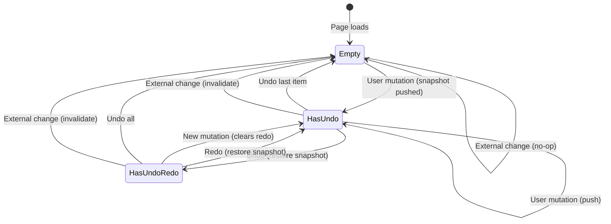

# Workshop: Undo/Redo Stack Architecture

**Type**: Integration Pattern / State Machine
**Plan**: 050-workflow-page-ux
**Spec**: (pending — pre-spec workshop)
**Created**: 2026-02-26
**Status**: Draft

**Related Documents**:
- [Workshop 001: Line-Based Canvas UX Design](./001-line-based-canvas-ux-design.md)
- [Research Dossier — PL-06: Optimistic Concurrency](../research-dossier.md)
- [SDK Domain: IKeybindingService](../../../domains/_platform/sdk/domain.md)

**Domain Context**:
- **Primary Domain**: `workflow-ui` (owns undo/redo UX and state)
- **Related Domains**: `_platform/positional-graph` (graph mutations write to disk), `_platform/sdk` (keybindings)

---

## Purpose

Design the undo/redo system for the workflow editor. Every mutation (add node, move node, delete, reorder, edit config) persists immediately to `graph.yaml` and `node.yaml` on disk. Ctrl+Z must revert both the UI state and the filesystem state. This workshop defines the architecture for tracking changes and rolling them back.

## Key Questions Addressed

- How do we track mutations for undo?
- How do we revert filesystem writes on Ctrl+Z?
- Is the undo stack in-memory (session-scoped) or persistent?
- How does undo interact with SSE events from external changes?
- What's the scope — per-graph? per-session? per-user?

---

## Design Decision: In-Memory Snapshot Pattern

### Options Considered

| Approach | Pros | Cons | Decision |
|----------|------|------|----------|
| **A: Snapshot Pattern** | Dead simple — no per-operation logic. Every future operation gets undo for free. ~5MB max for 50 snapshots of 100KB data. | Slightly more memory than minimal delta approach | ✅ **Selected** |
| **B: Git-based** | Leverages existing tooling | Slow, complex, conflicts with user's git state | ❌ Rejected |
| **C: Command Pattern** | Precise, minimal memory per operation | **Every new operation needs an inverse function** — high maintenance tax that compounds. Breaks open/closed principle. | ❌ Rejected |
| **D: In-memory React state only** | Simplest | Doesn't undo filesystem writes | ❌ Rejected (incomplete) |
| **E: Diff/patch** | Efficient storage | Computing reverse patches is complex, fragile with concurrent changes | ❌ Rejected |

### Why Snapshot Pattern (Revised 2026-02-26)

Original design chose Command Pattern. After review, **rejected it** because:
- Every new operation (reorder lines, bulk delete, property change, input wiring, etc.) would need a hand-written inverse
- Inverse correctness is hard to verify — subtle bugs appear when operations interact
- The maintenance tax compounds as the editor gains features

**Snapshot wins because:**
- Workflow data is tiny: ~10-100KB total (graph.yaml + nodes/*/node.yaml)
- 50 snapshots × 100KB = **5MB max** in memory — trivial
- **Zero per-operation code** — any mutation gets undo for free
- Undo = write previous snapshot back to disk via the same server actions
- No inverse logic, no operation-type registry, no edge cases
- Real-world editors (React Flow, Excalidraw, Figma) use snapshot/state-based undo for the same reasons

---

## Snapshot Stack Design

### What We Snapshot

```typescript
interface WorkflowSnapshot {
  timestamp: number;
  description: string;  // Human-readable ("Added spec-writer to Line 1")
  
  // The full parsed state — everything needed to restore
  definition: PositionalGraphDefinition;  // From graph.yaml
  nodeConfigs: Record<string, NodeConfig>;  // From nodes/*/node.yaml
}
```

We do **NOT** snapshot `state.json` (runtime execution state) — undo is for structural edits only, not for reverting agent progress.

### UndoRedoManager

```typescript
class UndoRedoManager {
  private undoStack: WorkflowSnapshot[] = [];
  private redoStack: WorkflowSnapshot[] = [];
  private maxStackSize = 50;
  
  // Called BEFORE every mutation
  snapshot(current: WorkflowSnapshot): void {
    this.undoStack.push(structuredClone(current));
    this.redoStack = [];  // New action clears redo
    if (this.undoStack.length > this.maxStackSize) {
      this.undoStack.shift();  // Drop oldest
    }
  }
  
  // Ctrl+Z — returns the state to restore
  undo(current: WorkflowSnapshot): WorkflowSnapshot | null {
    const previous = this.undoStack.pop();
    if (!previous) return null;
    this.redoStack.push(structuredClone(current));
    return previous;
  }
  
  // Ctrl+Shift+Z — returns the state to restore
  redo(current: WorkflowSnapshot): WorkflowSnapshot | null {
    const next = this.redoStack.pop();
    if (!next) return null;
    this.undoStack.push(structuredClone(current));
    return next;
  }
  
  canUndo(): boolean { return this.undoStack.length > 0; }
  canRedo(): boolean { return this.redoStack.length > 0; }
  
  // External change — invalidate everything
  invalidate(): void {
    this.undoStack = [];
    this.redoStack = [];
  }
}
```

### Execution Flow

```
User drags spec-writer onto Line 1
    │
    ├── BEFORE mutation: undoManager.snapshot(currentState)
    │   └── Deep clone of definition + nodeConfigs pushed to undoStack
    │
    ├── Execute: addNode(ctx, graphSlug, lineId, unitSlug)
    │   └── Server action writes graph.yaml + nodes/nodeId/node.yaml
    │
    └── UI updates with new state

User presses Ctrl+Z
    │
    ├── previous = undoManager.undo(currentState)
    │   └── Current state pushed to redoStack, previous popped from undoStack
    │
    ├── Write previous.definition → graph.yaml (server action)
    ├── Write previous.nodeConfigs → nodes/*/node.yaml (server action)
    │   └── Filesystem now matches the previous snapshot exactly
    │
    ├── UI updates to show previous state
    └── toast.info("Undid: Added spec-writer to Line 1")
```

**Key insight**: The "restore snapshot" server action writes the entire definition + node configs. This is the same code path as loading a graph — we already have it. No new write logic needed.

---

## Keyboard Integration

### SDK Command Registration

```typescript
{
  id: 'workflow.undo',
  title: 'Undo',
  keybinding: '$mod+z',
  when: 'workflowEditorFocused',
  handler: async () => {
    const previous = undoManager.undo(currentState);
    if (previous) await restoreSnapshot(previous);
    else toast.info('Nothing to undo');
  }
},
{
  id: 'workflow.redo',
  title: 'Redo',
  keybinding: '$mod+shift+z',
  when: 'workflowEditorFocused',
  handler: async () => {
    const next = undoManager.redo(currentState);
    if (next) await restoreSnapshot(next);
    else toast.info('Nothing to redo');
  }
}
```

### UI Buttons (Toolbar)

```
[← Undo (Ctrl+Z)] [→ Redo (Ctrl+Shift+Z)]
```

- Disabled when stack is empty
- Tooltip shows description of next undo/redo action
- Badge shows stack depth (e.g., "Undo (3)")

---

## Scope & Lifecycle

| Property | Decision | Rationale |
|----------|----------|-----------|
| Scope | Per-graph, per-browser-tab | Different graphs have independent histories |
| Persistence | In-memory only (session-scoped) | Survives SPA navigation, lost on page refresh |
| Max depth | 50 snapshots | ~5MB max memory. Prevents unbounded growth |
| On page load | Empty stack | No persistent undo across sessions |
| On graph switch | Clear stack | Different graph = different undo history |
| On external change | Invalidate stack | Can't safely undo against unknown state |

---

## State Diagram



---

## Edge Cases

| Scenario | Behavior |
|----------|----------|
| Rapid Ctrl+Z (multiple undos) | Queue restores — execute sequentially, each awaits server action completion |
| Undo during SSE event processing | Undo takes priority — SSE refresh happens after restore completes |
| Page refresh mid-stack | Stack lost — user starts fresh (session-scoped) |
| External change while stack has items | Invalidate both stacks + toast notification |
| Very large graph (>100KB) | 50 × 100KB = 5MB — still fine. If graphs grow beyond 500KB, revisit. |
| Snapshot includes node that was externally deleted | Restore writes it back — filesystem always matches snapshot exactly |

---

## Open Questions

### Q1: Should undo persist across page refreshes?

**RESOLVED**: No. Session-scoped (in-memory). Simple and sufficient.

### Q2: Should we support compound undo?

**DEFERRED**: For v1, each mutation is one undo step. Future enhancement could batch rapid changes (e.g., multi-select delete) into a single snapshot.

---

## Summary

Undo/redo uses **in-memory snapshots** of the parsed workflow state (definition + node configs). Before each mutation, deep-clone and push to undo stack (max 50, ~5MB). Ctrl+Z restores the previous snapshot by writing it all back to disk. Zero per-operation logic — every new feature gets undo for free. External changes invalidate the stack. Keybindings via SDK.
