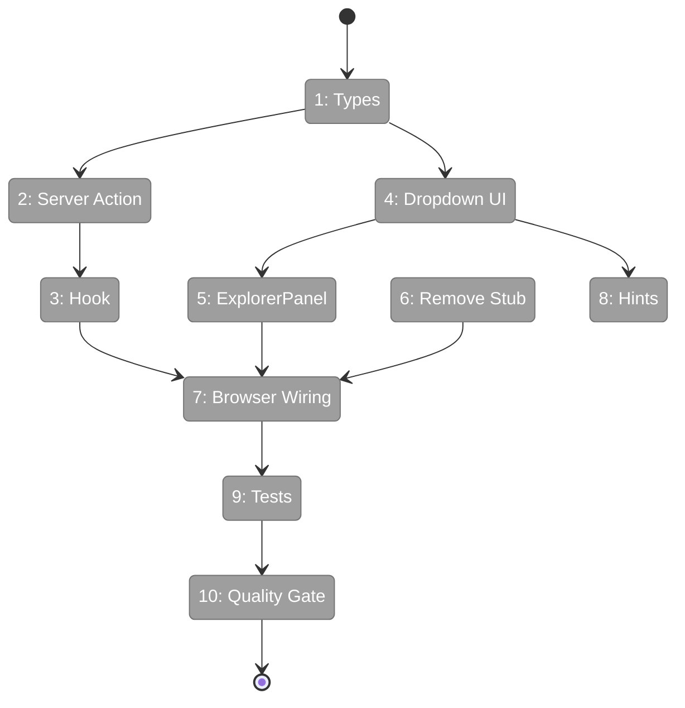
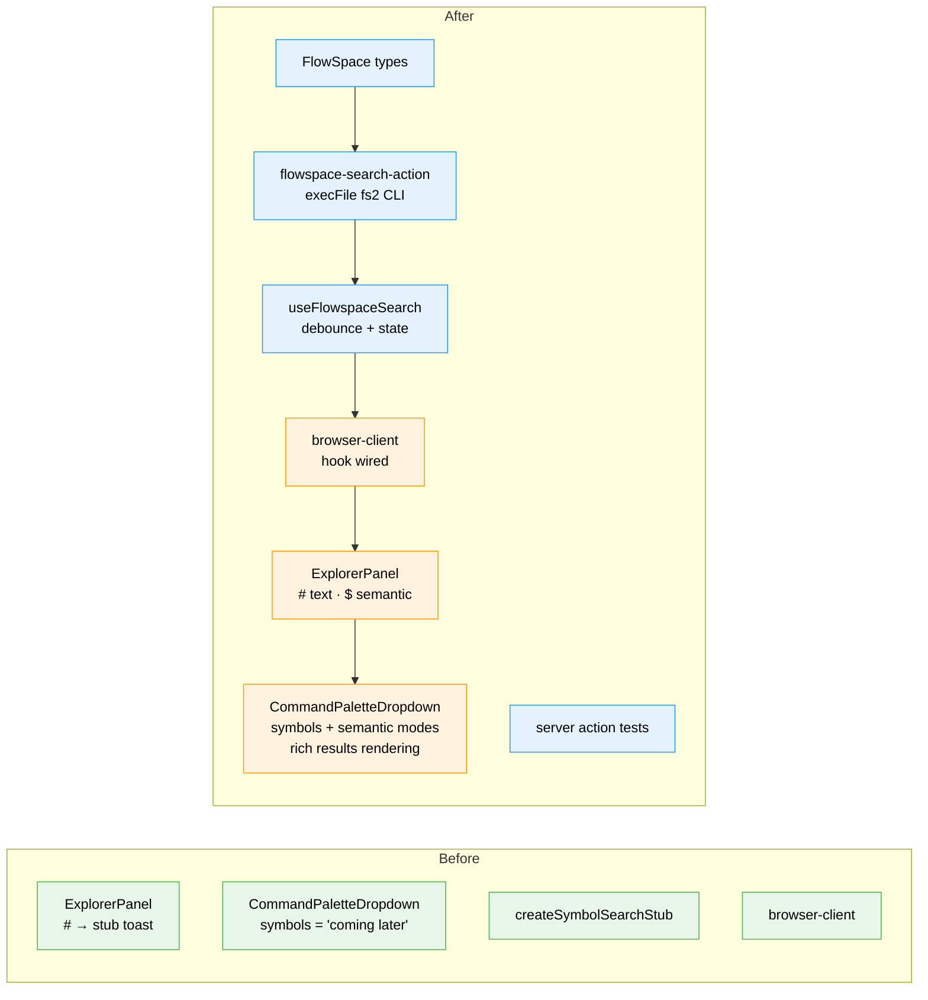

# Flight Plan: Simple Implementation — FlowSpace Code Search

**Plan**: [flowspace-search-plan.md](../../flowspace-search-plan.md)
**Phase**: Simple Implementation
**Generated**: 2026-02-26
**Status**: Ready for takeoff

---

## Departure → Destination

**Where we are**: The command palette has three working modes: `>` for commands, plain text for file search, and `#` which shows a "coming later" stub toast. FlowSpace (fs2) is installed and the codebase is indexed with ~10,000+ nodes including semantic embeddings.

**Where we're going**: A developer can type `# useFileFilter` to instantly find code by name (text search, ~200ms), or `$ error handling` to find code by concept (semantic search, ~500ms). Results show category icons, file paths, line numbers, and AI summaries. Context menu provides copy/download. When fs2 isn't installed, the UI shows the install URL with a copy button.

---

## Domain Context

### Domains We're Changing

| Domain | What Changes | Key Files |
|--------|-------------|-----------|
| _platform/panel-layout | Add FlowSpace types, enhance dropdown with `symbols`+`semantic` modes, add `$` detection to ExplorerPanel, remove stub handler, update Quick Access hints | `types.ts`, `command-palette-dropdown.tsx`, `explorer-panel.tsx`, `stub-handlers.ts`, `index.ts` |
| file-browser | Add FlowSpace search hook, wire through browser-client | `use-flowspace-search.ts` (new), `browser-client.tsx` |

### Domains We Depend On (no changes)

| Domain | What We Consume | Contract |
|--------|----------------|----------|
| _platform/sdk | IUSDK, ICommandRegistry | Command palette infrastructure |
| _platform/events | toast() | Removed (was used by stub) |

---

## Flight Status

<!-- Updated by /plan-6-v2: pending → active → done. Use blocked for problems/input needed. -->

**Legend**: grey = pending | yellow = active | red = blocked/needs input | green = done

---

## Stages

<!-- Updated by /plan-6-v2 during implementation: [ ] → [~] → [x] -->

- [ ] **Stage 1: Foundation** — Add FlowSpace types to panel-layout (`types.ts`)
- [ ] **Stage 2: Server Action** — Create fs2 CLI wrapper with availability detection (`flowspace-search-action.ts` — new file)
- [ ] **Stage 3: Hook** — Create useFlowspaceSearch with debounce and state management (`use-flowspace-search.ts` — new file)
- [ ] **Stage 4: Dropdown UI** — Enhance symbols + semantic modes with result rendering (`command-palette-dropdown.tsx`)
- [ ] **Stage 5: ExplorerPanel** — Add `$` mode detection and prop threading (`explorer-panel.tsx`)
- [ ] **Stage 6: Cleanup** — Remove createSymbolSearchStub (`stub-handlers.ts`, `index.ts`)
- [ ] **Stage 7: Wiring** — Connect hook → ExplorerPanel → Dropdown in browser-client (`browser-client.tsx`)
- [ ] **Stage 8: Hints** — Update Quick Access with `#` and `$` labels (`command-palette-dropdown.tsx`)
- [ ] **Stage 9: Tests** — Server action JSON parsing + availability detection (`flowspace-search-action.test.ts` — new file)
- [ ] **Stage 10: Gate** — `just fft` passes, zero new failures

---

## Architecture: Before & After

**Legend**: 🟢 existing (unchanged) | 🟠 changed (modified) | 🔵 new (created) | 🔴 removed

---

## Acceptance Criteria

- [ ] AC-01: `# useFileFilter` shows text results within 1 second
- [ ] AC-02: Results show category icon, name, file path, line range
- [ ] AC-03: Smart content shown as one-line summary
- [ ] AC-05: Arrow keys navigate, Enter selects, Escape exits
- [ ] AC-06: 300ms debounce
- [ ] AC-07: "FlowSpace not installed" + URL with copy button
- [ ] AC-09: Quick Access hints: `#` = code search, `$` = semantic
- [ ] AC-10: Stub removed, no toast
- [ ] AC-13: `#` = text mode, regex auto-upgrade
- [ ] AC-15: Folder distribution in header
- [ ] AC-16: Context menu (Copy Path, Copy Content, Download)
- [ ] AC-17: Graph age ("indexed 19 mins ago")
- [ ] AC-18: `$` = semantic mode
- [ ] AC-19: 🧠 semantic badge
- [ ] AC-20: Empty prefix hints + install URL with copy

## Goals & Non-Goals

**Goals**: Fast text code search (`#`), semantic code search (`$`), graceful degradation, rich result rendering
**Non-Goals**: Graph management, real-time updates, tree navigation, Wormhole/LSP

---

## Checklist

- [ ] T001: Add FlowSpace types to panel-layout
- [ ] T002: Create server-side fs2 search action
- [ ] T003: Create useFlowspaceSearch hook
- [ ] T004: Enhance dropdown for symbols + semantic modes
- [ ] T005: Wire ExplorerPanel with `$` detection + props
- [ ] T006: Remove createSymbolSearchStub
- [ ] T007: Wire browser-client with useFlowspaceSearch
- [ ] T008: Update Quick Access hints
- [ ] T009: Write tests for server action
- [ ] T010: Verify `just fft` passes
