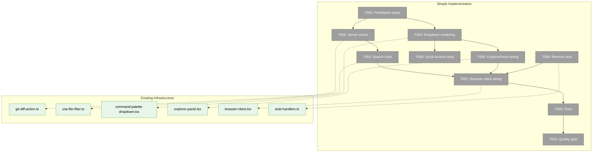
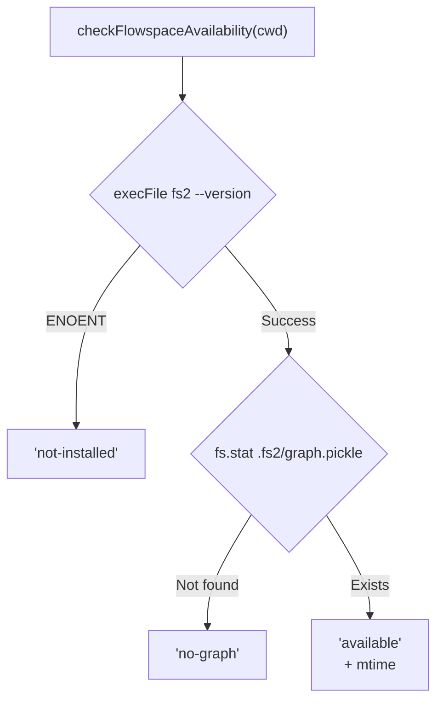

# Simple Implementation — Tasks

**Plan**: [flowspace-search-plan.md](../../flowspace-search-plan.md)
**Phase**: Simple Implementation (single phase)
**Generated**: 2026-02-26
**Status**: Ready for implementation

---

## Executive Briefing

- **Purpose**: Replace the `#` stub and add `$` prefix in the command palette with live FlowSpace code search via the `fs2` CLI, providing developers with fast code intelligence directly in the browser.
- **What We're Building**: A server action that calls `fs2 search` via `execFile`, a React hook that debounces queries and manages state, and enhanced dropdown rendering for two new modes: `#` (text/regex, fast, free) and `$` (semantic, embedding API). Graceful degradation when fs2 is not installed.
- **Goals**:
  - ✅ `#` prefix → fast text/regex code search via fs2 CLI
  - ✅ `$` prefix → semantic/conceptual search via fs2 CLI
  - ✅ Rich results: category icons, names, paths, line ranges, AI summaries
  - ✅ Graceful degradation: install URL with copy button when fs2 missing
  - ✅ Context menu on results (same as file search)
  - ✅ Graph age display ("indexed 19 mins ago")
- **Non-Goals**:
  - ❌ No graph building/management from within the app
  - ❌ No real-time graph updates
  - ❌ No tree navigation or get_node source retrieval
  - ❌ No Wormhole/LSP bridge

---

## Prior Phase Context

_Phase 1 — no prior phases._

---

## Pre-Implementation Check

| File | Exists? | Domain | Action | Notes |
|------|---------|--------|--------|-------|
| `apps/web/src/features/_platform/panel-layout/types.ts` | ✅ Yes | _platform/panel-layout | MODIFY | Add FlowSpace types |
| `apps/web/src/lib/server/flowspace-search-action.ts` | ❌ No | _platform/panel-layout | CREATE | New server action alongside git-diff-action.ts |
| `apps/web/src/features/041-file-browser/hooks/use-flowspace-search.ts` | ❌ No | file-browser | CREATE | New hook alongside use-file-filter.ts |
| `apps/web/src/features/_platform/panel-layout/components/command-palette-dropdown.tsx` | ✅ Yes | _platform/panel-layout | MODIFY | Add symbols + semantic mode rendering |
| `apps/web/src/features/_platform/panel-layout/components/explorer-panel.tsx` | ✅ Yes | _platform/panel-layout | MODIFY | Add `$` mode detection + FlowSpace props |
| `apps/web/src/features/_platform/panel-layout/stub-handlers.ts` | ✅ Yes | _platform/panel-layout | MODIFY | Remove createSymbolSearchStub |
| `apps/web/src/features/_platform/panel-layout/index.ts` | ✅ Yes | _platform/panel-layout | MODIFY | Remove createSymbolSearchStub export |
| `apps/web/app/(dashboard)/workspaces/[slug]/browser/browser-client.tsx` | ✅ Yes | file-browser | MODIFY | Wire useFlowspaceSearch hook |
| `test/unit/web/features/041-file-browser/flowspace-search-action.test.ts` | ❌ No | file-browser | CREATE | Tests for server action |

### Concept Duplication Check

- **FlowSpace integration**: No existing fs2 code in codebase — safe to build fresh.
- **CLI wrapper pattern**: `git-diff-action.ts` is the exemplar — `execFileAsync` + array args + timeout.
- **Hook pattern**: `use-file-filter.ts` is the exemplar — debounce + loading/error/results state.

---

## Architecture Map



---

## Tasks

| Status | ID | Task | Domain | Path(s) | Done When | Notes |
|--------|-----|------|--------|---------|-----------|-------|
| [ ] | T001 | Add FlowSpace types to panel-layout | _platform/panel-layout | `apps/web/src/features/_platform/panel-layout/types.ts` | `FlowSpaceSearchResult` type exported with: `nodeId`, `name`, `category`, `filePath`, `startLine`, `endLine`, `smartContent`, `snippet`, `score`, `matchField`. `FlowSpaceAvailability` type: `'available' \| 'not-installed' \| 'no-graph' \| 'no-embeddings'`. `FlowSpaceSearchMode` type: `'text' \| 'semantic'`. Category icon map constant exported. | Category icons: file→📄, callable→ƒ, type→📦, section→📝, block→🏗️. `'no-embeddings'` for `$` mode without embeddings configured. |
| [ ] | T002 | Create server-side fs2 search action | _platform/panel-layout | `apps/web/src/lib/server/flowspace-search-action.ts` | `'use server'` action exports `checkFlowspaceAvailability(cwd)` → `{ availability: FlowSpaceAvailability, graphMtime?: number }` and `flowspaceSearch(query, mode, cwd)` → `{ results: FlowSpaceSearchResult[], folders: Record<string,number> } \| { error: string }`. Text mode: `--mode text` (auto-upgrade to `--mode regex` if metacharacters). Semantic mode: `--mode semantic`. Timeout 5s. JSON parsed from stdout. File path extracted from `node_id.split(':')[1]`. Each result verified via `fs.access()` — stale files filtered out. | Follow `git-diff-action.ts` pattern: `execFileAsync` + array args. Per DYK-01: text=free, semantic=API. Per DYK-04: node_id format `{category}:{filepath}:{qualname}`. |
| [ ] | T003 | Create useFlowspaceSearch hook | file-browser | `apps/web/src/features/041-file-browser/hooks/use-flowspace-search.ts` | Hook exports: `results: FlowSpaceSearchResult[] \| null`, `loading: boolean`, `error: string \| null`, `availability: FlowSpaceAvailability`, `graphAge: string \| null`, `folders: Record<string,number> \| null`, `setQuery(query: string, mode: FlowSpaceSearchMode): void`. 300ms debounce. Availability checked once on mount (cached). `fetchInProgressRef` guard prevents concurrent requests. `graphAge` computed as relative time from mtime. | Follow `use-file-filter.ts` debounce pattern. No cache/SSE (simpler than file filter). Relative time: "just now" (<1m), "X mins ago" (<1h), "X hours ago" (<1d), "X days ago". |
| [ ] | T004 | Enhance CommandPaletteDropdown for `symbols` and `semantic` modes | _platform/panel-layout | `apps/web/src/features/_platform/panel-layout/components/command-palette-dropdown.tsx` | `DropdownMode` union updated to include `'semantic'`. Both `symbols` and `semantic` modes render: (a) not-installed → install URL with copy button, (b) no-graph → "Run fs2 scan" message, (c) no-embeddings (`$` only) → "Run fs2 scan --embed", (d) loading → AsciiSpinner, (e) error → error message, (f) empty query → "FlowSpace text search" / "FlowSpace semantic search" hint (AC-20), (g) results header with folder distribution + graph age + mode badge (🧠 for semantic), (h) result rows with category icon, name, truncated file path, line range `Lstart-end`, smart_content one-liner, (i) context menu (Copy Full Path, Copy Relative Path, Copy Content, Download). New props: `symbolSearchResults`, `symbolSearchLoading`, `symbolSearchError`, `symbolSearchAvailability`, `symbolSearchGraphAge`, `symbolSearchFolders`, `symbolSearchMode`, `onSymbolSelect(filePath, startLine)`. Reuses existing keyboard nav (selectedIndex/handleKeyDown). | Shared rendering for both modes — only header badge and availability messages differ. Context menu reuses existing ContextMenu from Radix (already imported). |
| [ ] | T005 | Wire ExplorerPanel with `$` mode detection + FlowSpace props | _platform/panel-layout | `apps/web/src/features/_platform/panel-layout/components/explorer-panel.tsx` | Add `semanticMode = editing && inputValue.startsWith('$')`. Update `dropdownMode` derivation: `semanticMode ? 'semantic' : symbolMode ? 'symbols' : ...`. Add all FlowSpace props to `ExplorerPanelProps` interface and pass through to CommandPaletteDropdown. Add `onFlowspaceQueryChange(query: string, mode: FlowSpaceSearchMode)` callback — called when `dropdownMode` is `symbols` or `semantic` with prefix stripped and mode inferred. | Same prop-threading pattern as file search (Plan 049). `$` detection mirrors `#` detection at line 121. |
| [ ] | T006 | Remove createSymbolSearchStub | _platform/panel-layout | `apps/web/src/features/_platform/panel-layout/stub-handlers.ts`<br/>`apps/web/src/features/_platform/panel-layout/index.ts`<br/>`apps/web/app/(dashboard)/workspaces/[slug]/browser/browser-client.tsx` | `createSymbolSearchStub` function deleted from stub-handlers.ts. Export removed from index.ts barrel. Registration removed from browser-client.tsx handlers array. Typing `#` no longer triggers toast. If stub-handlers.ts becomes empty, delete the file and remove from barrel. | AC-10. Check if any other code imports createSymbolSearchStub before removing. |
| [ ] | T007 | Wire browser-client with useFlowspaceSearch | file-browser | `apps/web/app/(dashboard)/workspaces/[slug]/browser/browser-client.tsx` | `useFlowspaceSearch` hook called with `worktreePath` from workspace context. Results, loading, error, availability, graphAge, folders, searchMode passed to ExplorerPanel via props. `onFlowspaceQueryChange` wired: strips `#`/`$` prefix, passes query + mode to hook's `setQuery`. `onSymbolSelect(filePath, startLine)` navigates to file at line — reuse existing navigation pattern (likely `navigateToFile` with line param or URL param). Context menu callbacks reuse existing `clipboard.handleCopyFullPath` etc. | Same wiring pattern as `useFileFilter` in Plan 049. |
| [ ] | T008 | Update Quick Access hints for both modes | _platform/panel-layout | `apps/web/src/features/_platform/panel-layout/components/command-palette-dropdown.tsx` | Quick Access section (empty input, search mode): `#` row label → "Code search (FlowSpace)" (was "Symbol search (coming soon)"). Add new `$` row: `<span className="font-mono text-xs bg-muted px-1 rounded">$</span> Semantic search (FlowSpace)`. When not installed, append "(install FlowSpace)" to both labels. | AC-09. Quick Access section is at lines ~430-447 in current file. |
| [ ] | T009 | Write tests for server action | file-browser | `test/unit/web/features/041-file-browser/flowspace-search-action.test.ts` | Tests cover: (a) parse valid fs2 JSON output fixture → correct FlowSpaceSearchResult array with filePath extracted, (b) availability: ENOENT error → `'not-installed'`, missing graph.pickle → `'no-graph'`, (c) timeout/error → `{ error: "..." }` string, (d) malformed JSON → `{ error: "..." }`. Use captured JSON fixtures (real fs2 output). No vi.fn() — use fakes per doctrine. | Lightweight testing strategy. Fixture: capture output of `fs2 search "ExplorerPanel" --mode text --limit 3` to a JSON file. |
| [ ] | T010 | Verify `just fft` passes | cross-domain | — | `just fft` passes with zero new failures. All existing tests still pass. Build passes. Typecheck passes. | Quality gate per constitution. |

---

## Context Brief

### Key Findings from Plan

- **DYK-01** (Critical): `#` = text mode (free/fast), `$` = semantic (embedding API). Split prevents accidental API costs.
- **Finding 01**: Subprocess pattern — `git-diff-action.ts` uses `execFileAsync` with array args + timeout. Follow exactly.
- **Finding 02**: PATH resolution — `fs2` may not be in PATH. Availability check via `execFile('fs2', ['--version'])`, catch ENOENT.
- **Finding 03**: Race condition guard — use `fetchInProgressRef` (skip, don't abort). Same as use-file-filter.ts.
- **Finding 04**: Graph cwd — pass `{ cwd: worktreePath }` to `execFile`.
- **DYK-04**: File path extraction — `node_id.split(':')[1]` gives file path. Verify existence with `fs.access()`.

### Domain Dependencies (contracts consumed)

- `_platform/panel-layout`: `BarHandler`, `BarContext`, `ExplorerPanelHandle`, `CommandPaletteDropdown` — we modify these
- `_platform/sdk`: `IUSDK`, `ICommandRegistry` — consumed by ExplorerPanel (unchanged)
- `_platform/events`: `toast()` — currently used by stub (will be removed)
- `file-browser`: navigation utilities — consumed for file+line navigation on select

### Domain Constraints

- `_platform/panel-layout` is infrastructure — types defined here are consumed by business domains
- `file-browser` is business — the hook lives here because it's the consumer
- No vi.fn() in tests (R-TEST-007 doctrine)
- Server actions must be `'use server'` decorated
- `execFile` with array args only (no shell interpolation)

### Reusable from Existing

- `git-diff-action.ts`: exact pattern for `execFileAsync` + timeout + error handling
- `use-file-filter.ts`: debounce pattern, `fetchInProgressRef` guard, loading/error/results state shape
- `ContextMenu` components: already imported in command-palette-dropdown.tsx (Plan 049 Feature 2 AC-13)
- `AsciiSpinner`: already imported for loading states
- `clipboard.handleCopyFullPath/RelativePath/Content/Download`: already wired in browser-client.tsx

### System Flow: `#` Text Search

```mermaid
flowchart LR
    A["User types<br/># useFileFilter"] --> B["ExplorerPanel<br/>detects symbolMode"]
    B --> C["onFlowspaceQueryChange<br/>(query, 'text')"]
    C --> D["useFlowspaceSearch<br/>300ms debounce"]
    D --> E["flowspaceSearch<br/>server action"]
    E --> F["execFile fs2 search<br/>--mode text --limit 20"]
    F --> G["Parse JSON<br/>extract filePaths<br/>verify existence"]
    G --> H["Return results<br/>to hook state"]
    H --> I["CommandPaletteDropdown<br/>renders symbols mode"]
    I --> J["User selects →<br/>navigate to file:line"]
```



### System Flow: `$` Semantic Search

```mermaid
flowchart LR
    A["User types<br/>$ error handling"] --> B["ExplorerPanel<br/>detects semanticMode"]
    B --> C["onFlowspaceQueryChange<br/>(query, 'semantic')"]
    C --> D["useFlowspaceSearch<br/>300ms debounce"]
    D --> E["flowspaceSearch<br/>server action"]
    E --> F["execFile fs2 search<br/>--mode semantic --limit 20"]
    F --> G["Parse JSON<br/>extract filePaths<br/>verify existence"]
    G --> H["Return results +<br/>folders to hook"]
    H --> I["CommandPaletteDropdown<br/>renders semantic mode<br/>🧠 badge"]
    I --> J["User selects →<br/>navigate to file:line"]
```



### Availability Detection Flow



---

## Discoveries & Learnings

_Populated during implementation by plan-6._

| Date | Task | Type | Discovery | Resolution | References |
|------|------|------|-----------|------------|------------|

---

## Directory Layout

```
docs/plans/051-flowspace-search/
  ├── flowspace-search-spec.md
  ├── flowspace-search-plan.md
  ├── research-dossier.md
  └── tasks/simple-implementation/
      ├── tasks.md                    ← this file
      ├── tasks.fltplan.md            ← flight plan
      └── execution.log.md            ← created by plan-6
```
