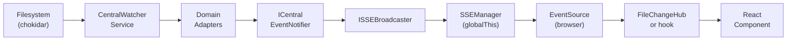
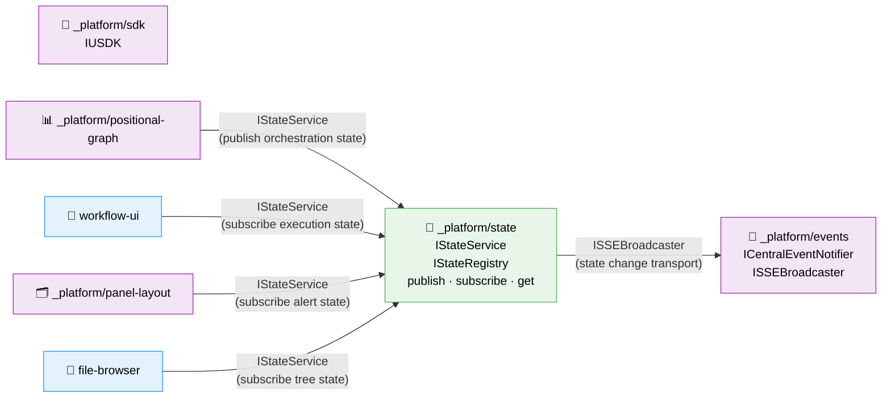

# Research Report: GlobalStateSystem

**Generated**: 2026-02-26T21:30:00Z
**Research Query**: "Centralized runtime state management system with pub/sub on change — GlobalStateSystem"
**Mode**: Pre-Plan
**Location**: docs/plans/053-global-state-system/research-dossier.md
**FlowSpace**: Available
**Findings**: 76 total (IA-10, DC-10, PS-10, QT-10, IC-13, DE-10, PL-15, DB-08)

## Executive Summary

### What It Does
A GlobalStateSystem provides centralized, ephemeral runtime state management for the Chainglass application. Domains (worktree, workflow, agents) publish state changes to a central registry; consumers subscribe to state slices via path-based patterns and receive reactive updates. State is readable at any time, changes propagate as events.

### Business Purpose
Currently, runtime state (workflow execution status, alert flags, file changes, agent activity) is scattered across ad-hoc React hooks, SSE connections, and polling intervals. Components that need cross-cutting state (e.g., a menu item blinking when an agent needs attention) must understand internal implementation details of the publishing domain. GlobalStateSystem provides a product-like API: publishers declare state contracts, consumers subscribe without coupling to implementation details.

### Key Insights
1. **The codebase already has all building blocks** — three-layer event pipeline (adapters → notifier → SSE), FileChangeHub (pattern-based client subscriptions), SDK settings (useSyncExternalStore + onChange), DI container with fakes. GlobalStateSystem is a composition of existing patterns, not a new invention.
2. **`_platform/state` should be a separate infrastructure domain** — it wraps events (not replaces them), is consumed by all business domains, and is architecturally distinct from SDK settings (ephemeral vs persisted, hierarchical vs flat).
3. **Multi-instance state domains are the hard problem** — many workflows running simultaneously, many agents per workflow. Hierarchical path-based addressing (`worktree:ws-1:workflow:wf-123:status`) with pattern matching (`worktree:ws-1:workflow:*:status`) solves this.

### Quick Stats
- **Components to compose**: ~8 existing patterns (FileChangeHub, SettingsStore, SSE hooks, DI tokens)
- **Dependencies**: Events domain (ISSEBroadcaster, ICentralEventNotifier), SDK domain (useSyncExternalStore pattern)
- **Consumers**: workflow-ui, panel-layout, file-browser, future agent-ui
- **Test Infrastructure**: Contract tests, FakeX pattern, vitest with jsdom — all proven
- **Prior Learnings**: 15 relevant discoveries from Plans 019-047
- **Domains**: 1 new (`_platform/state`), 0 modified, 4+ consumers

---

## How It Currently Works (State Management Today)

### Entry Points for Runtime State

| Entry Point | Type | Location | Purpose |
|-------------|------|----------|---------|
| FileChangeHub | Client-side dispatcher | `features/045-live-file-events/file-change-hub.ts` | Pattern-based file change subscriptions |
| ICentralEventNotifier | Server-side emitter | `features/027-central-notify-events/` | Domain event → SSE broadcast |
| ISDKSettings | Client-side store | `lib/sdk/settings-store.ts` | Settings with onChange + persistence |
| IContextKeyService | Client-side store | `lib/sdk/context-key-service.ts` | Ephemeral context keys for when-clauses |
| useWorkspaceSSE | Hook | `hooks/useSSE.ts` | Workspace-scoped SSE subscription |

### Core Execution Flow — Event Pipeline (Plan 027)

1. **Filesystem event captured** (chokidar via CentralWatcherService)
   - File: `packages/workflow/src/features/023-central-watcher-notifications/central-watcher.service.ts`
   - Receives raw filesystem events, dispatches to registered IWatcherAdapters

2. **Domain adapter filters & transforms**
   - File: `packages/shared/src/features/027-central-notify-events/domain-event-adapter.ts`
   - Abstract `extractData(event)` converts domain events to minimal payloads
   - Example: `WorkgraphDomainEventAdapter` → `{ graphSlug }`

3. **Central notifier routes to SSE**
   - File: `apps/web/src/features/027-central-notify-events/central-event-notifier.service.ts`
   - `emit(domain, eventType, data)` → `broadcaster.broadcast(domain, eventType, data)`

4. **SSEManager broadcasts to clients**
   - File: `apps/web/src/lib/sse-manager.ts`
   - Channel-based broadcast via ReadableStream controllers

5. **Client-side hub dispatches to subscribers**
   - File: `apps/web/src/features/045-live-file-events/file-change-hub.ts`
   - Pattern-matched callback fan-out (subscribe/unsubscribe)

### Data Flow



### State Management Gaps

Currently each consumer wires its own state watching:
- **Polling**: `AgentListLive` uses `setInterval(60s)` for relative time updates
- **Direct SSE**: `useWorkspaceSSE` per component (each opens EventSource)
- **FileChangeHub**: Pattern-based but only for file changes
- **SDK Settings**: Key-value with onChange, but only for settings

**Missing**: A unified state layer where domains publish runtime state and any consumer can subscribe without knowing implementation details.

---

## Architecture & Design

### Component Map

#### Existing Components (to compose)

| Component | Purpose | File | Reuse for GSS |
|-----------|---------|------|---------------|
| FileChangeHub | Pattern-based pub/sub | `features/045-live-file-events/file-change-hub.ts` | Subscription pattern model |
| SettingsStore | Key-value with onChange | `lib/sdk/settings-store.ts` | useSyncExternalStore pattern |
| ICentralEventNotifier | Server-side event emission | `features/027-central-notify-events/` | Event transport |
| SSEManager | Channel-based SSE broadcast | `lib/sse-manager.ts` | State change transport |
| DI Container | Service registration | `lib/di-container.ts` | IGlobalStateSystem registration |
| ContainerContext | React DI bridge | `contexts/ContainerContext.tsx` | Provider pattern |
| bootstrapSDK | Factory function | `lib/sdk/sdk-bootstrap.ts` | Bootstrap pattern |

#### Proposed Components (to build)

| Component | Purpose | Location |
|-----------|---------|----------|
| IGlobalStateSystem | Core interface: publish, subscribe, get, list | `packages/shared/src/interfaces/` |
| GlobalStateSystem | Implementation with Map<path, StateEntry> | `apps/web/src/lib/state/` or `packages/shared/src/state/` |
| FakeGlobalStateSystem | Test double with inspection methods | co-located or `test/fakes/` |
| useGlobalState | React hook (useSyncExternalStore) | `apps/web/src/lib/state/` |
| GlobalStateProvider | React context provider | `apps/web/src/lib/state/` |
| State domain registrations | Domain-specific publish contracts | per publishing domain |

### Design Patterns Identified

1. **Observer/Pub-Sub** (PS-01): `Map<path, Set<callbacks>>` with `subscribe() → unsubscribe()` return
2. **Registry** (PS-02): `Map<domainType, StateEntry[]>` with type validation
3. **Instance Management** (PS-03): `Map<instanceId, StateSnapshot>` for multi-instance scenarios
4. **Pattern Matching** (PS-05, DC-06): Path-based subscription patterns like FileChangeHub
5. **Factory Bootstrap** (IA-08): `bootstrapGlobalState()` with DI wiring
6. **Discriminated Union Events** (PS-05): Zod schemas for state change payloads

### System Boundaries

- **Internal Boundary**: GlobalStateSystem owns state storage, subscription management, change notification
- **Does NOT own**: Event transport (events domain), persistence (SDK/workspace domain), domain-specific business logic
- **Extension Point**: Domains register state schemas; consumers subscribe to paths

---

## Dependencies & Integration

### What This Depends On

#### Internal Dependencies

| Dependency | Type | Purpose | Risk if Changed |
|------------|------|---------|-----------------|
| `_platform/events` (ICentralEventNotifier, ISSEBroadcaster) | Required | State change transport to clients | High — transport layer |
| `_platform/sdk` (useSyncExternalStore pattern) | Pattern only | React hook model | Low — pattern not import |

#### External Dependencies

| Service/Library | Version | Purpose | Criticality |
|-----------------|---------|---------|-------------|
| React 19 | 19.x | useSyncExternalStore, Context | High |
| None additional | — | No new npm deps needed | — |

### What Depends on This (Consumers)

| Consumer | How It Uses State | Contract |
|----------|-------------------|----------|
| workflow-ui | Subscribe to workflow execution state | `worktree:*:workflow:*:status` |
| panel-layout | Subscribe to alert/notification state | `worktree:*:alerts` |
| file-browser | Subscribe to tree state, file changes | `worktree:*:files` |
| Left menu items | Subscribe to agent "needs attention" state | `worktree:*:agents:*:status` |
| Future agent-ui | Subscribe to per-agent run state | `worktree:*:agents:*:*` (out of scope) |

### What Publishes to This (Publishers)

| Publisher | What It Publishes | Trigger |
|-----------|-------------------|---------|
| Workflow orchestration | Execution status, node states | After orchestration.run() |
| File change watcher | File change events (mirrors FileChangeHub) | On filesystem events |
| Future: Agent manager | Agent status, intent | On agent state transitions |
| Workflow manager | Active workflow count, global status | On workflow lifecycle events |

---

## Quality & Testing

### Testing Strategy (from QT findings)

| Layer | Pattern | Proven By |
|-------|---------|-----------|
| Contract tests | `globalStateContractTests(factory)` runs against real + fake | FileChangeHub, SDK settings |
| Unit tests | State store operations, pattern matching, error isolation | FileChangeHub tests |
| Hook tests | Parameter injection, useSyncExternalStore | useSDKSetting, useFileChanges |
| Integration tests | Full pipeline: publish → store → notify → hook update | watcher-to-file-change-notifier |
| Fake pattern | FakeGlobalStateSystem with `getPublished()`, `getSubscribers()` | FakeUSDK, FakeCentralEventNotifier |

### Test Infrastructure Available

- Vitest with globals, jsdom environment matching
- vi.useFakeTimers for debounce testing
- FakeEventSource for SSE hook testing
- Contract test factory pattern proven
- No vi.mock — parameter injection pattern (PL-14)

---

## Prior Learnings (From Previous Implementations)

### Critical Prior Learnings

#### PL-01: Storage-First Pattern is Mandatory
**Source**: Plans 019, 023
**What They Found**: Events MUST be persisted/stored BEFORE broadcasting to subscribers
**Action**: GlobalStateSystem must update its internal Map BEFORE notifying subscribers. Never reverse this order.

#### PL-02: Subscription Cleanup is Critical
**Source**: Plans 045, 047
**What They Found**: `subscribe() → unsubscribe()` pattern needs explicit cleanup in React; strict mode calls effects twice
**Action**: Every state subscription returns unsubscribe function. Test mount/unmount cycles.

#### PL-03: Stateful Services = useValue Singleton in DI
**Source**: Plan 027
**What They Found**: Services holding mutable registries/maps must use `useValue` (not `useFactory`) in DI to maintain identity
**Action**: Register GlobalStateSystem as `useValue` singleton in DI container.

#### PL-07: Error Isolation per Subscriber
**Source**: Plans 023, 027, 045
**What They Found**: Throwing subscriber must NOT block others; wrap each callback in try/catch
**Action**: Dispatch loop wraps each subscriber call in try/catch, logs error, continues.

#### PL-08: No Circular Notifier ↔ Subscriber
**Source**: Plan 019
**What They Found**: Notifier calling back into subscriber creates infinite loops
**Action**: GlobalStateSystem dispatch is strictly unidirectional — never calls back into publishers.

#### PL-10: Hydrate Before Contributions
**Source**: Plan 047
**What They Found**: Store must be seeded with persisted values BEFORE domain contributions register defaults
**Action**: Boot sequence: create store → hydrate persisted state → register domain state schemas.

#### PL-12: Stable References for useSyncExternalStore
**Source**: Plan 047
**What They Found**: `getSnapshot()` must return same object reference for unchanged state
**Action**: GlobalStateSystem.get(path) returns structurally-stable references.

#### PL-13: Bootstrap Must Survive Errors
**Source**: Plan 047
**What They Found**: If bootstrap throws inside useState initializer, entire provider tree crashes
**Action**: Wrap bootstrap in try/catch, return fallback no-op store on failure.

### Prior Learnings Summary

| ID | Type | Source Plan | Key Insight | Priority |
|----|------|-------------|-------------|----------|
| PL-01 | gotcha | 019, 023 | Store-first, then broadcast | CRITICAL |
| PL-02 | gotcha | 045, 047 | Cleanup subscriptions on unmount | HIGH |
| PL-03 | decision | 027 | useValue singleton for stateful services | HIGH |
| PL-04 | decision | 019, 027 | Single SSE channel + client routing | MEDIUM |
| PL-05 | insight | 045 | Pattern matching over exact subscriptions | MEDIUM |
| PL-06 | gotcha | 023 | Atomic rescan on registry change | HIGH |
| PL-07 | gotcha | 023, 045 | Error isolation per subscriber | HIGH |
| PL-08 | gotcha | 019 | No circular notifier ↔ subscriber | CRITICAL |
| PL-09 | decision | 047 | React context + imperative setup | HIGH |
| PL-10 | gotcha | 047 | Hydrate before contributions | MEDIUM |
| PL-11 | decision | 047 | Server actions for persistence | MEDIUM |
| PL-12 | gotcha | 047 | Stable references for useSyncExternalStore | HIGH |
| PL-13 | gotcha | 047 | Bootstrap must survive errors | HIGH |
| PL-14 | decision | all | Test fakes with assertion helpers | HIGH |
| PL-15 | decision | all | Contract tests against both fake and real | HIGH |

---

## Domain Context

### Existing Domains Relevant to This Research

| Domain | Relationship | Relevant Contracts | Key Components |
|--------|-------------|-------------------|----------------|
| `_platform/events` | Foundation — GSS wraps events | ICentralEventNotifier, ISSEBroadcaster, FileChangeHub, useFileChanges | SSE transport, client-side hub |
| `_platform/sdk` | Pattern exemplar — not a dependency | ISDKSettings (contribute/get/set/onChange), useSyncExternalStore | Settings store, React hooks |
| `_platform/positional-graph` | Publisher — orchestration state | IOrchestrationService, IInstanceService | Workflow execution status |
| `workflow-ui` | Consumer — needs workflow state | (leaf domain, no contracts out) | Canvas, toolbox, properties |
| `_platform/panel-layout` | Consumer — needs alert/UI state | PanelShell, ExplorerPanel | Menu, panels |
| `file-browser` | Consumer — needs file/tree state | (leaf domain) | FileTree, CodeEditor |

### Domain Map Position



### Potential Domain Actions

- **Extract new domain**: `_platform/state` — new infrastructure domain for centralized runtime state
- **No changes needed**: Events domain, SDK domain remain unchanged
- **New contract edges**: positional-graph → state (publisher), workflow-ui/panel-layout/file-browser → state (consumers)

---

## Modification Considerations

### Safe to Modify
1. **Adding new DI tokens** (`STATE_DI_TOKENS`): Low risk, additive only
2. **Adding new React context provider** (`GlobalStateProvider`): Wraps existing tree, no breaking changes
3. **Adding new hooks** (`useGlobalState`): New exports, no existing API changes

### Modify with Caution
1. **WorkspaceDomain const**: Adding new domain values is safe, but must not change existing values (SSE channel names are the values)
2. **Provider hierarchy**: GlobalStateProvider must be placed correctly — after SDKProvider, before feature providers
3. **Bootstrap sequence**: GlobalStateSystem init must be added to instrumentation.ts with HMR-safe guard

### Danger Zones
1. **Events domain internals**: Do NOT modify ICentralEventNotifier or ISSEBroadcaster contracts — GlobalStateSystem consumes them as-is
2. **FileChangeHub**: Do NOT merge into GlobalStateSystem — it works well and has established consumers. Mirror the pattern instead.
3. **SSEManager**: Shared singleton — do not change broadcast semantics

### Extension Points
1. **State domain registration**: Domains declare state schemas → GlobalStateSystem validates published values
2. **Pattern-based subscriptions**: Consumers subscribe to hierarchical paths with wildcards
3. **Multi-instance addressing**: `domain:instanceId:property` path format

---

## Critical Discoveries

### Discovery 01: All Building Blocks Already Exist
**Impact**: Critical (reduces implementation risk)
**Source**: IA-01 through IA-10, DC-01 through DC-10
**What**: The codebase has FileChangeHub (pattern pub/sub), SettingsStore (onChange + useSyncExternalStore), DI container (service registration), SSE transport (event delivery), and bootstrap patterns (factory + HMR guard). GlobalStateSystem is a composition, not an invention.
**Required Action**: Follow existing patterns. Do not introduce new architectural concepts.

### Discovery 02: Multi-Instance State is the Novel Challenge
**Impact**: Critical (design decision)
**Source**: IA-06, IA-07, PS-03, DB-04
**What**: Workflows and agents have many concurrent instances (10+ workflows, each with agents). State must be addressable by `domain:instanceId:property` and subscribable by pattern (`workflow:*:status` for all workflow statuses).
**Required Action**: Design hierarchical path scheme with colon delimiters and pattern matching (exact, wildcard, recursive).

### Discovery 03: State vs Events Distinction
**Impact**: High (architecture)
**Source**: DB-01, DB-02, DE-07
**What**: GlobalStateSystem is NOT events. Events are fire-and-forget notifications. State is always-readable, has a current value, and notifies on change. Events domain provides transport; GlobalStateSystem provides the state abstraction on top.
**Required Action**: Clear conceptual separation — `publish()` sets state AND notifies; events flow through existing SSE.

### Discovery 04: Denormalized Multi-Domain Publishing
**Impact**: High (design)
**Source**: User requirements
**What**: A single system action may publish to multiple state domains. E.g., workflow manager publishes `globalWorkflowState.activeCount = 5` AND `worktree:ws-1:workflow:wf-123:status = 'running'`. This is intentional denormalization for consumer convenience.
**Required Action**: Support multiple `publish()` calls per action with no transactional requirement between them.

---

## Key Interface Sketches (from IC findings)

### Core Interface — IStateService

```typescript
// Modeled after ISDKSettings + FileChangeHub patterns
export interface IStateService {
  // Publishers
  publish<T>(path: string, value: T): void;
  remove(path: string): void;

  // Consumers
  get<T>(path: string): T | undefined;
  subscribe(pattern: string, callback: StateChangeCallback): () => void;

  // Iteration
  list(pattern?: string): StateEntry[];
  listDomains(): StateDomainDescriptor[];
}

export interface StateChangeCallback {
  (change: StateChange): void;
}

export interface StateChange {
  path: string;
  value: unknown;
  previousValue: unknown | undefined;
  timestamp: number;
}

export interface StateEntry {
  path: string;
  value: unknown;
  updatedAt: number;
}

export interface StateDomainDescriptor {
  domain: string;
  description: string;
  paths: string[];
}
```

### React Hook — useGlobalState

```typescript
// Modeled after useSDKSetting (useSyncExternalStore pattern)
export function useGlobalState<T>(path: string): T | undefined;
export function useGlobalState<T>(path: string, defaultValue: T): T;

// Pattern subscription (returns all matching state entries)
export function useGlobalStateList(pattern: string): StateEntry[];
```

### Path Addressing Scheme

```
// Format: domain:instance-id:property
worktree:default:active-file           // Which file is open
worktree:default:dirty-files           // List of unsaved files
workflow:wf-123:status                 // Single workflow status
workflow:wf-123:current-phase          // Current execution phase
workflow:*:status                      // All workflow statuses (pattern)
agents:agent-456:status                // Single agent status (future)
alerts:worktree:default                // Alert state for worktree
```

---

## External Research Opportunities

### Research Opportunity 1: Client-Side State Management Patterns for Hierarchical State

**Why Needed**: While the codebase has mature event patterns, hierarchical path-based state with pattern subscriptions is novel. Understanding prior art (Recoil atom families, Zustand slices, MobX observable maps) could inform the path scheme design.

**Impact on Plan**: Affects core data structure choice (Map vs tree, path parsing strategy)

**Ready-to-use prompt:**
```
/deepresearch "Compare hierarchical state management approaches for a TypeScript application:
1. Map<string, value> with path-based keys and pattern matching (like filesystem paths)
2. Tree structure with node subscriptions
3. Observable Map (MobX-style) with computed derivations
4. Atom families (Recoil-style) with parameterized selectors

Context: Building a centralized state system for a Next.js 16 app where:
- State domains (worktree, workflow, agent) publish ephemeral runtime state
- Multiple instances of same domain (10 workflows, each with agents)
- Consumers subscribe by path pattern (workflow:*:status gets all workflow statuses)
- State is always-readable (get), changes notify subscribers
- Must work with React 19 useSyncExternalStore
- No external state library desired (building in-house)

Questions:
1. What's the most performant approach for path-pattern matching on state reads?
2. How do atom families handle the N-instance problem?
3. What garbage collection strategy works for ephemeral state (instances that are destroyed)?
4. How to handle structural sharing for stable references with hierarchical state?"
```

**Results location**: `docs/plans/053-global-state-system/external-research/hierarchical-state-patterns.md`

---

## Appendix: File Inventory

### Core Files (Existing — to compose from)

| File | Purpose | Lines |
|------|---------|-------|
| `apps/web/src/features/045-live-file-events/file-change-hub.ts` | Pattern-based pub/sub model | ~73 |
| `packages/shared/src/interfaces/sdk.interface.ts` | ISDKSettings (onChange pattern) | ~219 |
| `packages/shared/src/features/027-central-notify-events/central-event-notifier.interface.ts` | ICentralEventNotifier | ~45 |
| `packages/shared/src/features/027-central-notify-events/domain-event-adapter.ts` | DomainEventAdapter base | ~40 |
| `packages/shared/src/features/027-central-notify-events/workspace-domain.ts` | WorkspaceDomain const | ~28 |
| `apps/web/src/lib/sse-manager.ts` | SSEManager singleton | ~146 |
| `apps/web/src/lib/sdk/sdk-bootstrap.ts` | bootstrapSDK factory | ~102 |
| `apps/web/src/lib/sdk/use-sdk-setting.ts` | useSyncExternalStore hook | ~65 |
| `apps/web/src/lib/di-container.ts` | DI registration | ~725 |
| `apps/web/instrumentation.ts` | Bootstrap entry point | ~25 |
| `apps/web/src/features/045-live-file-events/use-file-changes.ts` | Pattern subscription hook | ~86 |

### Test Files (Existing — to mirror)

| File | Purpose |
|------|---------|
| `test/contracts/file-change-hub.contract.ts` | Contract test factory |
| `test/unit/web/features/045-live-file-events/file-change-hub.test.ts` | Unit tests with error isolation |
| `test/unit/web/features/045-live-file-events/use-file-changes.test.ts` | Hook tests with fake timers |
| `test/unit/web/027-central-notify-events/central-event-notifier.service.test.ts` | SSE broadcasting tests |
| `test/unit/web/sdk/settings-store.test.ts` | Settings store tests |
| `test/integration/045-live-file-events/watcher-to-file-change-notifier.integration.test.ts` | Full pipeline test |

---

## Next Steps

**No external research needed** — the codebase has sufficient precedent.

- **Next step**: Run `/plan-1b-v2-specify "GlobalStateSystem — centralized runtime state management"` to create the feature specification
- **Alternative**: Run `/plan-2c-v2-workshop` to deep-dive the hierarchical path scheme and multi-instance addressing before specifying

---

**Research Complete**: 2026-02-26T21:30:00Z
**Report Location**: docs/plans/053-global-state-system/research-dossier.md
