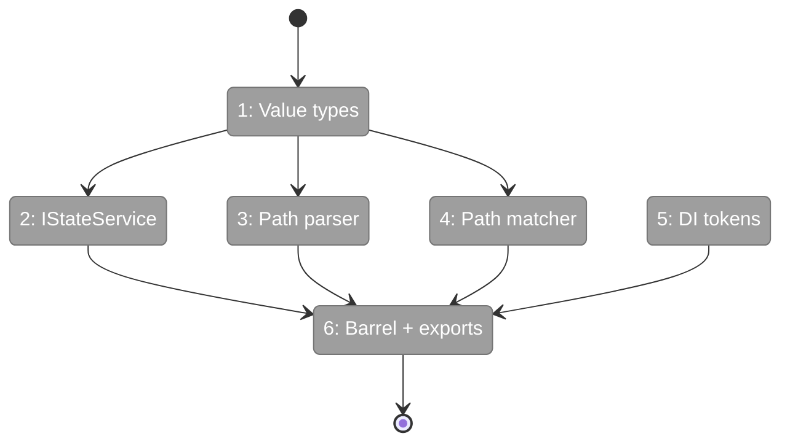
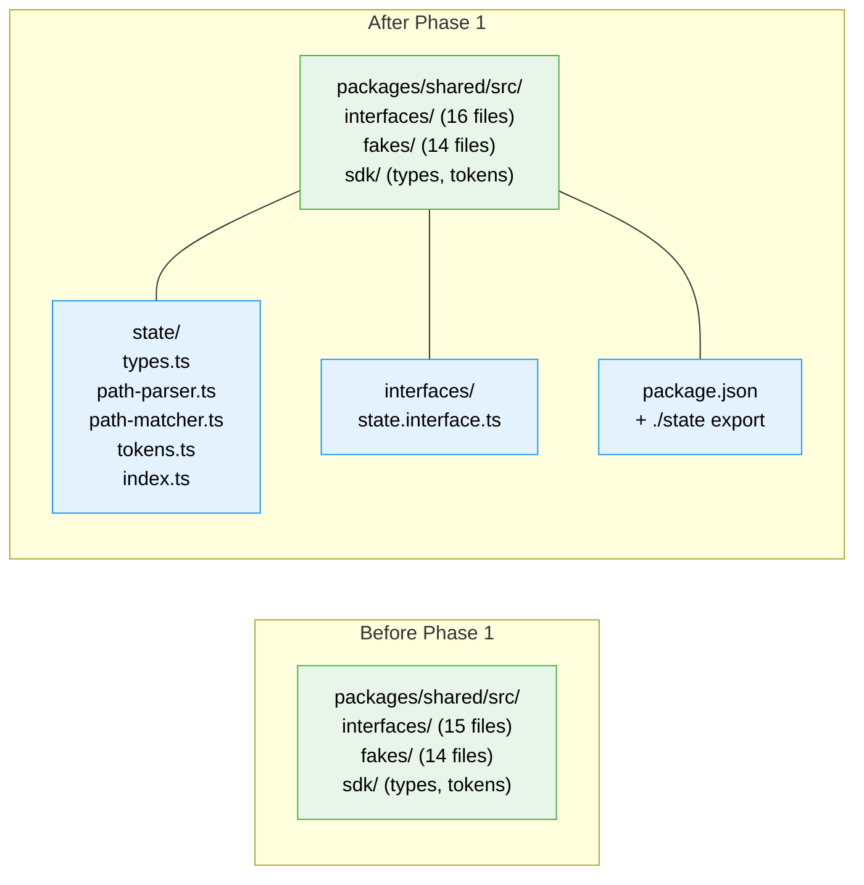

# Flight Plan: Phase 1 — Types, Interface & Path Engine

**Plan**: [global-state-system-plan.md](../../global-state-system-plan.md)
**Phase**: Phase 1: Types, Interface & Path Engine
**Generated**: 2026-02-26
**Status**: Landed

---

## Departure → Destination

**Where we are**: The `_platform/state` domain exists only as documentation — domain.md, registry entry, domain-map edges. No source code, no types, no interfaces. `packages/shared/` has no `state/` directory or `./state` export.

**Where we're going**: A developer can `import { IStateService, StateChange, parsePath, createStateMatcher } from '@chainglass/shared/state'` and use fully-typed state path addressing with pattern matching. The public API surface is defined and importable from any package.

---

## Domain Context

### Domains We're Changing

| Domain | What Changes | Key Files |
|--------|-------------|-----------|
| `_platform/state` | Create entire shared contract layer — types, interface, path engine, tokens, barrel | `packages/shared/src/state/*`, `packages/shared/src/interfaces/state.interface.ts` |

### Domains We Depend On (no changes)

| Domain | What We Consume | Contract |
|--------|----------------|----------|
| _(none)_ | Phase 1 has no dependencies | — |

---

## Flight Status

**Legend**: grey = pending | yellow = active | red = blocked/needs input | green = done

---

## Stages

- [x] **Stage 1: Define value types** — StateChange, StateEntry, StateDomainDescriptor, ParsedPath in `types.ts` (new file)
- [x] **Stage 2: Define IStateService interface** — Full API surface in `state.interface.ts` (new file)
- [x] **Stage 3: Implement path parser** — parsePath() for 2 and 3 segment paths with validation in `path-parser.ts` (new file)
- [x] **Stage 4: Implement path matcher** — createStateMatcher() for 5 pattern types in `path-matcher.ts` (new file)
- [x] **Stage 5: Create DI tokens** — STATE_DI_TOKENS in `tokens.ts` (new file)
- [x] **Stage 6: Wire exports** — Barrel `index.ts` + add `./state` to `package.json` exports map (new file + modify)

---

## Architecture: Before & After

**Legend**: existing (green, unchanged) | new (blue, created)

---

## Acceptance Criteria

- [ ] AC-11: Paths use colon-delimited segments (2, 3, or 5)
- [ ] AC-12: Path segments validated against regex patterns
- [ ] AC-15: Maximum path depth is 5 segments
- [ ] AC-16: Exact pattern matches only that path
- [ ] AC-17: Domain wildcard `domain:*:property` matches any instance
- [ ] AC-18: Instance wildcard `domain:id:*` matches all properties
- [ ] AC-19: Domain-all `domain:**` matches everything in domain
- [ ] AC-20: Global wildcard `*` matches all changes

## Goals & Non-Goals

**Goals**:
- ✅ Complete shared contract layer for GlobalStateSystem
- ✅ Importable from any package via `@chainglass/shared/state`
- ✅ Pure functions (path parser + matcher) with no side effects
- ✅ Type-safe API surface with JSDoc documentation

**Non-Goals**:
- ❌ No implementation (Phase 3)
- ❌ No tests (Phase 2 — TDD)
- ❌ No React hooks (Phase 4)
- ❌ No fake/test double (Phase 3)

---

## Checklist

- [x] T001: Create state value types
- [x] T002: Create IStateService interface
- [x] T003: Create path parser
- [x] T004: Create path matcher
- [x] T005: Create DI tokens
- [x] T006: Create barrel exports + package.json export entry
