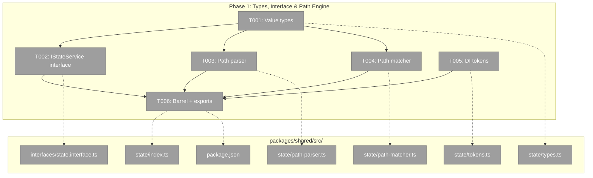
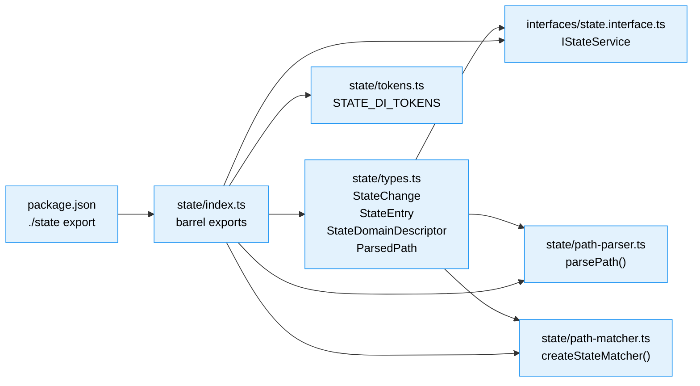

# Phase 1: Types, Interface & Path Engine — Tasks & Brief

**Plan**: [global-state-system-plan.md](../../global-state-system-plan.md)
**Phase**: Phase 1: Types, Interface & Path Engine
**Generated**: 2026-02-26
**Status**: Ready

---

## Executive Briefing

**Purpose**: Define the public API surface and path matching engine for GlobalStateSystem in `packages/shared`. This phase creates the foundation that all subsequent phases build on — the IStateService interface, value types, path parsing, pattern matching, DI tokens, and barrel exports.

**What We're Building**: The shared contract layer that enables any package (web, CLI, tests) to consume the state system. All files are new — clean slate with no migration.

**Goals**:
- ✅ IStateService interface with full publish/subscribe/get/list/registerDomain/removeInstance API
- ✅ Value types: StateChange, StateEntry, StateDomainDescriptor, StateChangeCallback, ParsedPath
- ✅ Path parser handling 2 and 3 segment colon-delimited paths with validation (4+ rejected per DYK-01)
- ✅ Pattern matcher with 5 types: exact, domain wildcard, instance wildcard, domain-all, global
- ✅ DI tokens for container registration
- ✅ `./state` export entry in package.json (Critical Finding 01)

**Non-Goals**:
- ❌ No implementation of GlobalStateSystem (Phase 3)
- ❌ No fake/test double (Phase 3)
- ❌ No React hooks or provider (Phase 4)
- ❌ No tests (Phase 2 — TDD: tests come next, then implementation)

---

## Prior Phase Context

_Phase 1 — no prior phases._

---

## Pre-Implementation Check

| File | Exists? | Domain Check | Notes |
|------|---------|-------------|-------|
| `packages/shared/src/interfaces/state.interface.ts` | ❌ Create | `_platform/state` ✅ | 15 existing .interface.ts files in same dir — follows convention |
| `packages/shared/src/state/types.ts` | ❌ Create | `_platform/state` ✅ | New directory `src/state/` needed |
| `packages/shared/src/state/path-parser.ts` | ❌ Create | `_platform/state` ✅ | |
| `packages/shared/src/state/path-matcher.ts` | ❌ Create | `_platform/state` ✅ | Adapted from Plan 045 `path-matcher.ts` pattern |
| `packages/shared/src/state/tokens.ts` | ❌ Create | `_platform/state` ✅ | Follows SDK_DI_TOKENS pattern |
| `packages/shared/src/state/index.ts` | ❌ Create | `_platform/state` ✅ | Barrel exports |
| `packages/shared/package.json` | ✅ Modify | `_platform/state` ✅ | Add `"./state"` export entry — Critical Finding 01 |

**Concept search**: No existing `IStateService`, `GlobalState`, or state management system found — **clean slate**.

---

## Architecture Map



---

## Tasks

| Status | ID | Task | Domain | Path(s) | Done When | Notes |
|--------|-----|------|--------|---------|-----------|-------|
| [x] | T001 | Create state value types: StateChange, StateEntry, StateDomainDescriptor, StatePropertyDescriptor, StateChangeCallback, ParsedPath | `_platform/state` | `packages/shared/src/state/types.ts` | Types compile, all fields per Workshop 001 §7 — StateChange has path, domain, instanceId, property, value, previousValue, timestamp, removed?; StateEntry has path, value, updatedAt; StateDomainDescriptor has domain, description, multiInstance, properties; ParsedPath has domain, instanceId, property, raw (no subDomain/subInstanceId — DYK-01) | Foundation for all other tasks |
| [x] | T002 | Create IStateService interface with full API | `_platform/state` | `packages/shared/src/interfaces/state.interface.ts` | Interface has: publish, subscribe, get, remove, removeInstance, registerDomain, listDomains, listInstances, list, subscriberCount, entryCount. JSDoc per Workshop 002 §7 API descriptions. Imports types from T001. | AC-01 through AC-37 define behavioral expectations; interface declares the shape |
| [x] | T003 | Create path parser: parsePath(path) → ParsedPath | `_platform/state` | `packages/shared/src/state/path-parser.ts` | Handles 2 segments (singleton `domain:property`) and 3 segments (multi-instance `domain:id:property`). Rejects 4+ segments with descriptive error. Validates segment format: domains/properties match `[a-z][a-z0-9-]*`, instance IDs match `[a-zA-Z0-9_-]+`. Throws on invalid format, empty segments. | AC-11, AC-12, AC-15. DYK-01: 5-segment nested support dropped. Pure function. |
| [x] | T004 | Create path matcher: createStateMatcher(pattern) → (path) => boolean | `_platform/state` | `packages/shared/src/state/path-matcher.ts` | 5 pattern types: exact (`workflow:wf-1:status`), domain wildcard (`workflow:*:status`), instance wildcard (`workflow:wf-1:*`), domain-all (`workflow:**`), global (`*`). Returns a matcher function. | AC-16 through AC-20. Adapted from Plan 045 `path-matcher.ts` but for colon-delimited paths. Pure function. |
| [x] | T005 | Create DI tokens: STATE_DI_TOKENS | `_platform/state` | `packages/shared/src/state/tokens.ts` | Exports `STATE_DI_TOKENS` const with `STATE_SERVICE: 'IStateService'` (minimum). Follows SDK_DI_TOKENS pattern. | |
| [x] | T006 | Create barrel exports + add `./state` export to package.json | `_platform/state` | `packages/shared/src/state/index.ts`, `packages/shared/package.json` | Barrel re-exports all types, IStateService, parsePath, createStateMatcher, STATE_DI_TOKENS. package.json exports map includes `"./state": { "import": "./dist/state/index.js", "types": "./dist/state/index.d.ts" }`. `import { IStateService } from '@chainglass/shared/state'` resolves in both dev and build. | Critical Finding 01 — must add export entry or production imports fail silently. |

---

## Context Brief

### Key Findings from Plan

| # | Impact | Finding | Action for Phase 1 |
|---|--------|---------|---------------------|
| 01 | Critical | `packages/shared/package.json` has no `./state` export. Import fails in production if missing. | T006: Add export entry. |
| 02 | Critical | Clean slate — no pre-existing state code. FileChangeHub + SettingsStore are reference patterns. | Use path-matcher.ts from Plan 045 as structural model for T004. |
| 04 | High | `list()` needs stable array references for useSyncExternalStore. | Informational for Phase 1 — types must support caching (StateEntry has `updatedAt` for version tracking). |

### Domain Dependencies

| Domain | Contract | Used For |
|--------|----------|----------|
| _(none)_ | — | Phase 1 has no domain dependencies — it creates the foundation |

### Domain Constraints

- `packages/shared/` is the correct location for interfaces, types, and pure functions — shared across all packages (web, CLI, MCP)
- Files must use `.ts` extension (not `.tsx`) — no React in shared package
- Follow existing naming conventions: `state.interface.ts` (I-prefix interface), `types.ts`, `path-matcher.ts` (kebab-case)
- DI tokens follow `SCREAMING_SNAKE_CASE` const pattern (see `SDK_DI_TOKENS`)
- Barrel exports use `export type { ... }` for type-only exports, `export { ... }` for values

### Reusable Patterns

| Source | Pattern | Usage |
|--------|---------|-------|
| `packages/shared/src/interfaces/sdk.interface.ts` | Interface with JSDoc, method signatures, DYK references | Model for IStateService |
| `apps/web/src/features/045-live-file-events/path-matcher.ts` | `createMatcher(pattern) → PathMatcher` pure function | Structural model for createStateMatcher |
| `apps/web/src/features/045-live-file-events/file-change.types.ts` | Change event types with path, eventType, timestamp | Structural model for StateChange |
| `packages/shared/src/sdk/tokens.ts` | `const SDK_DI_TOKENS = { ... } as const` | Model for STATE_DI_TOKENS |
| `packages/shared/package.json` `"./sdk"` export | `{ "import": "./dist/sdk/index.js", "types": "./dist/sdk/index.d.ts" }` | Exact format for `"./state"` export |

### Architectural Flow



### Path Addressing Quick Reference (from Workshop 001)

```
StatePath = Domain ":" Property                                    (singleton: 2 segments)
          | Domain ":" InstanceId ":" Property                     (multi-instance: 3 segments)

Domain     = [a-z][a-z0-9-]*
InstanceId = [a-zA-Z0-9_-]+
Property   = [a-z][a-z0-9-]*
```

### Pattern Matching Quick Reference (from Workshop 001)

| Pattern | Syntax | Matches |
|---------|--------|---------|
| Exact | `workflow:wf-1:status` | Only that path |
| Domain wildcard | `workflow:*:status` | Any instance, one property |
| Instance wildcard | `workflow:wf-1:*` | One instance, all properties |
| Domain-all | `workflow:**` | Everything in domain |
| Global | `*` | Everything |

---

## Discoveries & Learnings

_Populated during implementation by plan-6._

| Date | Task | Type | Discovery | Resolution | References |
|------|------|------|-----------|------------|------------|

---

## Directory Layout

```
docs/plans/053-global-state-system/
  ├── global-state-system-spec.md
  ├── global-state-system-plan.md
  ├── research-dossier.md
  ├── workshops/
  │   ├── 001-hierarchical-state-addressing.md
  │   └── 002-developer-experience.md
  └── tasks/phase-1-types-interface-path-engine/
      ├── tasks.md                    ← you are here
      ├── tasks.fltplan.md            ← flight plan
      └── execution.log.md           # created by plan-6
```
