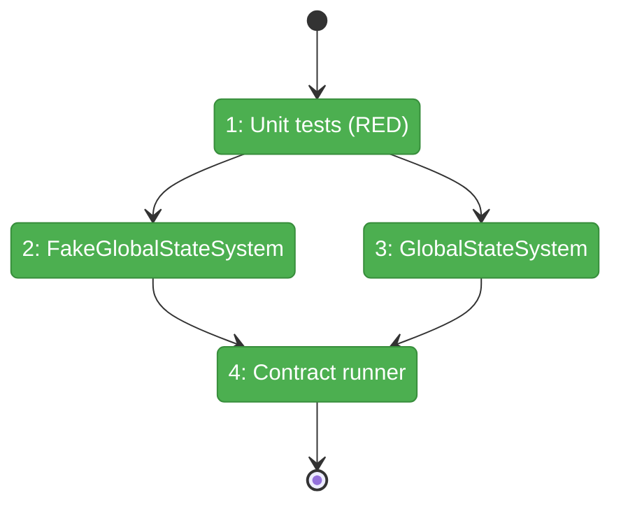
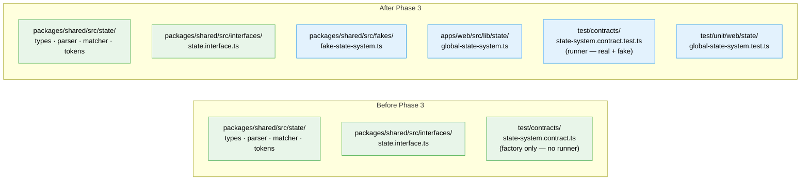

# Flight Plan: Phase 3 — Implementation + Fake

**Plan**: 053-global-state-system
**Phase**: Phase 3: Implementation + Fake
**Generated**: 2026-02-27
**Status**: Landed

---

## Departure → Destination

**Where we are**: IStateService interface defined. 47 unit tests pass (parser + matcher). 19 contract cases defined but have no implementations to run against. No GlobalStateSystem class. No FakeGlobalStateSystem.

**Where we're going**: Both `GlobalStateSystem` (real) and `FakeGlobalStateSystem` (fake) pass all 19 contract tests. All store operations are unit-tested. The state system is fully functional — just not wired into React yet.

---

## Domain Context

### Domains We're Changing

| Domain | What Changes | Key Files |
|--------|-------------|-----------|
| `_platform/state` | Create real implementation + fake test double | `apps/web/src/lib/state/global-state-system.ts`, `packages/shared/src/fakes/fake-state-system.ts` |

### Domains We Depend On (no changes)

| Domain | What We Consume | Contract |
|--------|----------------|----------|
| `_platform/state` (Phase 1) | IStateService, types, parsePath, createStateMatcher | Shared contract layer |

---

## Flight Status

---

## Architecture: Before & After

---

## Stages

- [x] **Stage 1: TDD unit tests** — Write RED tests for GlobalStateSystem store operations (T001)
- [x] **Stage 2: FakeGlobalStateSystem** — Build fake with inspection methods, must pass contracts (T002)
- [x] **Stage 3: GlobalStateSystem** — Build real implementation, all tests GREEN (T003)
- [x] **Stage 4: Contract runner** — Wire runner against both, all 19 contracts pass for both (T004)

## Acceptance Criteria

- [ ] AC-01: publish stores + notifies
- [ ] AC-02: get returns value or undefined
- [ ] AC-03: get returns stable references
- [ ] AC-04: remove notifies with removed flag
- [ ] AC-05: removeInstance removes all entries
- [ ] AC-06: registerDomain registers descriptor
- [ ] AC-07: Duplicate registerDomain throws
- [ ] AC-08: publish to unregistered domain throws
- [ ] AC-09: listDomains returns descriptors
- [ ] AC-10: listInstances returns IDs
- [ ] AC-13: Singleton with instance ID throws
- [ ] AC-14: Multi-instance without instance ID throws
- [ ] AC-21: subscribe returns unsubscribe fn
- [ ] AC-22: Error isolation
- [ ] AC-23: StateChange shape
- [ ] AC-24: Store-first ordering
- [ ] AC-25: list returns matching entries
- [ ] AC-26: list returns stable array ref
- [ ] AC-33: FakeGlobalStateSystem with inspection methods
- [ ] AC-34: Contract tests pass for both real and fake
- [ ] AC-35: Unit tests for all core operations
- [ ] AC-36: subscriberCount
- [ ] AC-37: entryCount

## DYK Items

| ID | What | Impact |
|----|------|--------|
| DYK-11 | Fake must implement list() caching to pass C15 | Use dirty-flag cache |
| DYK-12 | Fake is a full behavioral implementation, not a stub | Standalone class with parsePath/createStateMatcher |
| DYK-13 | listCache.clear() on every publish is correct at scale | Simple invalidation |
| DYK-14 | Contract runner imports real impl via relative path | Follow file-change-hub pattern |
| DYK-15 | Fake must be exported from fakes barrel | Add to fakes/index.ts |

## Checklist

- [x] T001: TDD unit tests for store operations
- [x] T002: FakeGlobalStateSystem
- [x] T003: GlobalStateSystem implementation
- [x] T004: Contract test runner (real + fake)
