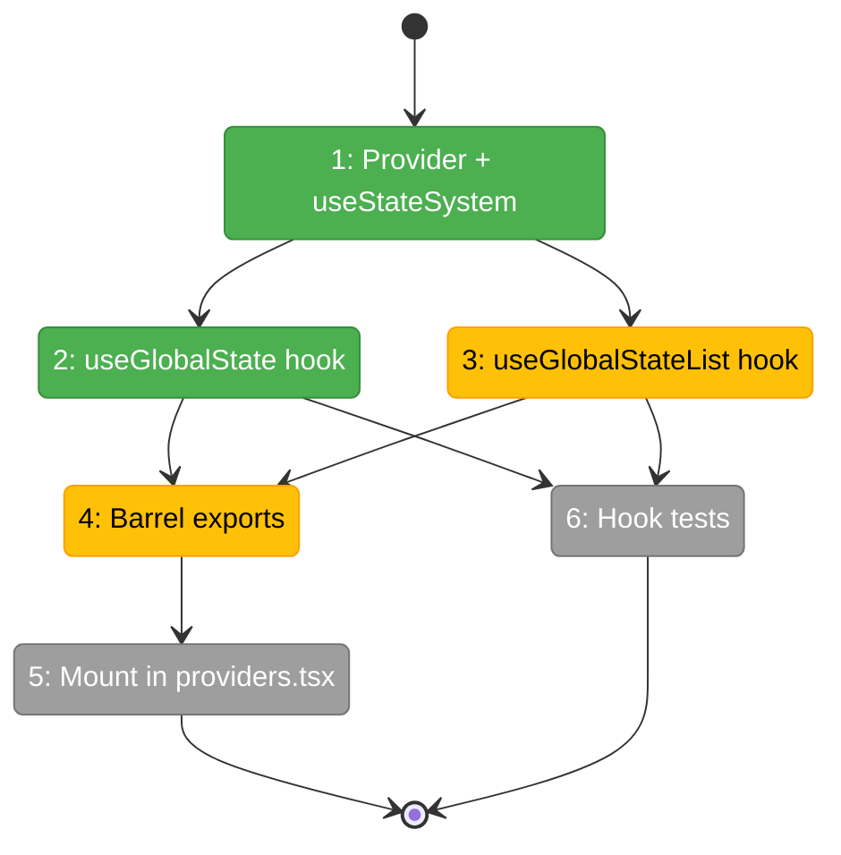
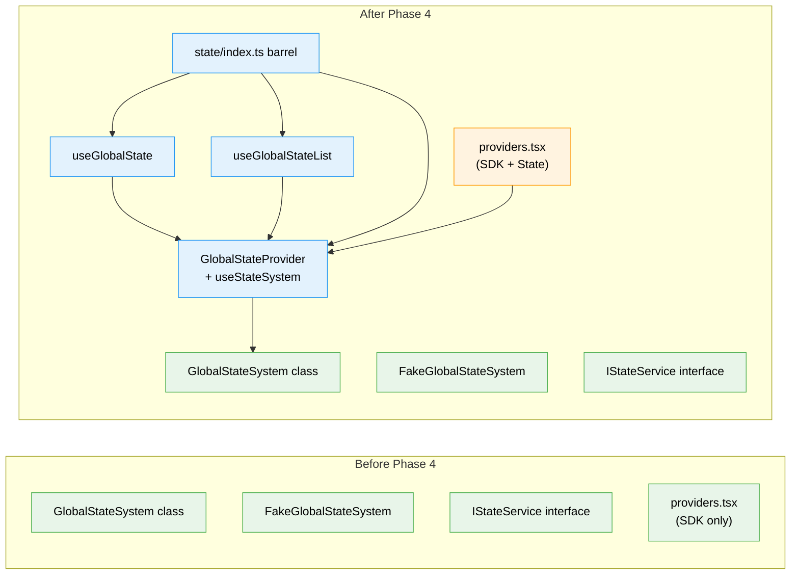

# Flight Plan: Phase 4 — React Integration

**Plan**: 053-global-state-system
**Phase**: Phase 4: React Integration
**Generated**: 2026-02-27
**Status**: Landed

---

## Departure → Destination

**Where we are**: GlobalStateSystem and FakeGlobalStateSystem are fully implemented and pass 128 tests (37 unit + 44 contract + 47 Phase 2). The state system is a standalone class with no React awareness — you must instantiate it directly and call subscribe/get manually.

**Where we're going**: A developer can call `useGlobalState<T>('workflow:wf-1:status', 'idle')` in any component inside the provider tree and get a reactive value that re-renders on change. `useGlobalStateList('workflow:**')` returns all entries matching a pattern. The provider is mounted app-wide in `providers.tsx`.

---

## Domain Context

### Domains We're Changing

| Domain | What Changes | Key Files |
|--------|-------------|-----------|
| `_platform/state` | Add React hooks, provider, barrel exports | `apps/web/src/lib/state/use-global-state.ts`, `state-provider.tsx`, `use-global-state-list.ts`, `index.ts` |
| Cross-domain | Mount GlobalStateProvider in provider tree | `apps/web/src/components/providers.tsx` |

### Domains We Depend On (no changes)

| Domain | What We Consume | Contract |
|--------|----------------|----------|
| `_platform/state` (Phase 3) | GlobalStateSystem class, IStateService, StateEntry | Implemented in Phase 3 |
| `_platform/sdk` | SDKProvider pattern (architecture reference only) | No code dependency |

---

## Flight Status

**Legend**: grey = pending | yellow = active | red = blocked/needs input | green = done

---

## Stages

- [x] **Stage 1: Provider** — GlobalStateProvider + useStateSystem (`state-provider.tsx` — new file)
- [x] **Stage 2: Hooks** — useGlobalState + useGlobalStateList (`use-global-state.ts`, `use-global-state-list.ts` — new files)
- [x] **Stage 3: Barrel + Mount** — App-side barrel exports + mount in providers.tsx (`index.ts` — new, `providers.tsx` — modify)
- [x] **Stage 4: Tests** — Hook tests with FakeGlobalStateSystem injection (`use-global-state.test.tsx` — new file)

---

## Architecture: Before & After

**Legend**: existing (green, unchanged) | changed (orange, modified) | new (blue, created)

---

## Acceptance Criteria

- [ ] AC-27: useGlobalState returns value, re-renders on change
- [ ] AC-28: useGlobalState returns default when no value published
- [ ] AC-29: useGlobalStateList returns matching entries, re-renders on change
- [ ] AC-30: GlobalStateProvider creates system once
- [ ] AC-31: Graceful degradation on bootstrap error
- [ ] AC-32: useStateSystem throws outside provider

## Goals & Non-Goals

**Goals**:
- ✅ React hooks for reading state (single value + pattern list)
- ✅ Provider with once-only creation and error resilience
- ✅ Mounted in app provider tree
- ✅ Tests with fake injection

**Non-Goals**:
- ❌ Domain registration or publishers
- ❌ SSE-to-state wiring / GlobalStateConnector
- ❌ Any UI changes

---

## DYK Items

| ID | What | Impact |
|----|------|--------|
| DYK-11 | Fake must implement list() caching to pass C15 | Already done — Phase 3 |
| DYK-12 | Fake is full behavioral implementation | Already done — use for test injection |

---

## Checklist

- [x] T001: useGlobalState<T> hook
- [x] T002: useGlobalStateList hook
- [x] T003: GlobalStateProvider + useStateSystem
- [x] T004: Barrel exports
- [x] T005: Mount in providers.tsx
- [x] T006: Hook tests
