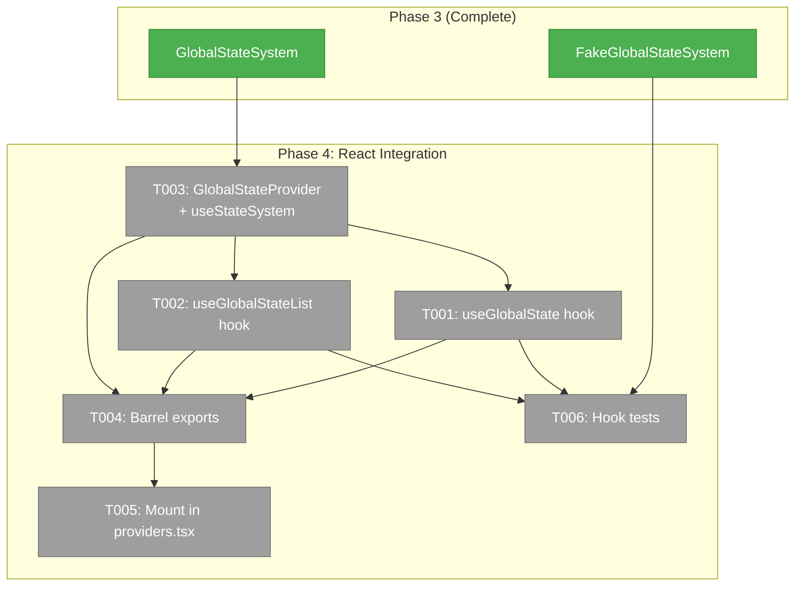
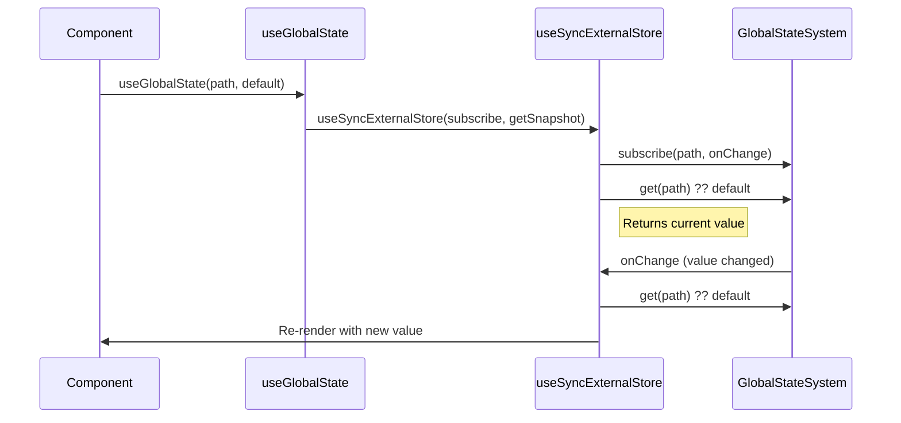
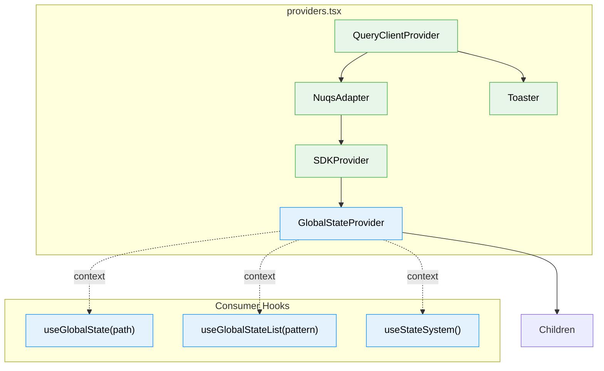

# Phase 4: React Integration — Tasks & Brief

**Plan**: [global-state-system-plan.md](../../global-state-system-plan.md)
**Phase**: Phase 4: React Integration
**Generated**: 2026-02-27
**Status**: Complete

---

## Executive Briefing

**Purpose**: Build the React layer that makes GlobalStateSystem usable from components — hooks for reading state, a context provider for the component tree, and mounting in the app's provider hierarchy.

**What We're Building**:
- `useGlobalState<T>(path, default?)` — single-value subscription hook via `useSyncExternalStore`
- `useGlobalStateList(pattern)` — multi-value pattern subscription hook via `useSyncExternalStore`
- `GlobalStateProvider` + `useStateSystem()` — React context that creates GlobalStateSystem once and provides it to the tree
- Barrel exports from `apps/web/src/lib/state/index.ts`
- Provider mounted in `providers.tsx` after SDKProvider
- Hook tests with FakeGlobalStateSystem injection

**Goals**:
- ✅ Components can read state values with `useGlobalState<T>(path, default)`
- ✅ Components can list state entries with `useGlobalStateList(pattern)`
- ✅ Provider creates system once per mount (no re-creation on re-render)
- ✅ Bootstrap error produces no-op stub, never crashes the tree
- ✅ Using hooks outside provider throws with descriptive message

**Non-Goals**:
- ❌ Domain registration or publishers (Phase 5)
- ❌ SSE-to-state wiring / GlobalStateConnector (Phase 5)
- ❌ Any UI changes (Phase 5)

---

## Prior Phase Context

### Phase 1: Types, Interface & Path Engine (✅ Complete)

**A. Deliverables**: `packages/shared/src/state/` — types.ts (7 types), state.interface.ts (IStateService), path-parser.ts, path-matcher.ts, tokens.ts, index.ts. Package.json `./state` export.
**B. Dependencies Exported**: IStateService interface (11 methods + 2 properties), ParsedPath, StateChange, StateEntry, StateChangeCallback, StateDomainDescriptor, parsePath(), createStateMatcher(), STATE_DI_TOKENS
**C. Gotchas**: Path parser is syntax-only (no domain awareness). StateEntry.updatedAt is number (Unix ms).
**D. Incomplete**: None
**E. Patterns**: Barrel re-exports use `export type {}` for types. Package.json export needs both `import` and `types` conditions.

### Phase 2: TDD — Path Engine & Contract Tests (✅ Complete)

**A. Deliverables**: 25 parser tests, 22 matcher tests, 19 contract cases (C01–C19)
**B. Dependencies Exported**: `globalStateContractTests(name, factory)` factory function
**C. Gotchas**: Domain wildcard on singleton paths silently returns no match (DYK-06). C06 requires get() inside subscriber callback (store-first). Every contract test needs registerTestDomain() first.
**D. Incomplete**: None
**E. Patterns**: Contract tests test both real and fake with identical factory. Test Doc blocks required on anchor tests.

### Phase 3: Implementation + Fake (✅ Complete)

**A. Deliverables**: `apps/web/src/lib/state/global-state-system.ts` (real), `packages/shared/src/fakes/fake-state-system.ts` (fake), contract runner (44 tests), unit tests (37 tests). Total: 128 state tests.
**B. Dependencies Exported**: `GlobalStateSystem` class (new-able, implements IStateService), `FakeGlobalStateSystem` class (implements IStateService + inspection methods: getPublished, getSubscribers, wasPublishedWith, reset)
**C. Gotchas**: Stable get() — no defensive copies. List() uses pattern-scoped cache invalidation. Error isolation via try/catch per subscriber with console.warn.
**D. Incomplete**: None
**E. Patterns**: Store-first ordering (Map updated before dispatch). FakeGlobalStateSystem is a full behavioral implementation, not a stub. Import real from relative path, fake from `@chainglass/shared/fakes`.

---

## Pre-Implementation Check

| File | Exists? | Domain Check | Notes |
|------|---------|-------------|-------|
| `apps/web/src/lib/state/use-global-state.ts` | ❌ Create | `_platform/state` ✅ | New hook file |
| `apps/web/src/lib/state/use-global-state-list.ts` | ❌ Create | `_platform/state` ✅ | New hook file |
| `apps/web/src/lib/state/state-provider.tsx` | ❌ Create | `_platform/state` ✅ | New provider file |
| `apps/web/src/lib/state/index.ts` | ❌ Create | `_platform/state` ✅ | New barrel file |
| `apps/web/src/components/providers.tsx` | ✅ Exists | Cross-domain | Modify: add GlobalStateProvider wrapping |
| `test/unit/web/state/use-global-state.test.tsx` | ❌ Create | `_platform/state` ✅ | New test file (.tsx for JSX) |

---

## Architecture Map



---

## Tasks

| Status | ID | Task | Domain | Path(s) | Done When | Notes |
|--------|-----|------|--------|---------|-----------|-------|
| [x] | T001 | Create useGlobalState<T> hook | `_platform/state` | `apps/web/src/lib/state/use-global-state.ts` | Hook uses useSyncExternalStore. subscribe(path, cb) → unsubscribe. getSnapshot returns get<T>(path) ?? pinnedDefault. Pin default with useRef (DYK-16). Wrap subscribe+getSnapshot in useCallback (DYK-19). Re-renders on change. Returns T (read-only, not tuple). | AC-27, AC-28. Follow useSDKSetting pattern. Same fn for client+server snapshot. |
| [x] | T002 | Create useGlobalStateList hook | `_platform/state` | `apps/web/src/lib/state/use-global-state-list.ts` | Hook uses useSyncExternalStore. subscribe(pattern, cb) for pattern-scoped notification (NOT '*' — per DYK-17). getSnapshot calls list(pattern). Returns StateEntry[]. Stable ref when no matching changes. | AC-29. list() already provides stable refs (Phase 3). Per DYK-17: subscribe with actual pattern. |
| [x] | T003 | Create GlobalStateProvider + useStateSystem | `_platform/state` | `apps/web/src/lib/state/state-provider.tsx` | Provider creates GlobalStateSystem once via useState initializer. No try/catch — let errors propagate (DYK-18: AC-31 dropped). useStateSystem() returns IStateService from context, throws outside provider. Export StateContext for test injection (DYK-20). 'use client' directive. | AC-30, AC-32. Follow SDKProvider pattern. |
| [x] | T004 | Create barrel exports | `_platform/state` | `apps/web/src/lib/state/index.ts` | Exports: useGlobalState, useGlobalStateList, useStateSystem, GlobalStateProvider, GlobalStateSystem class. | App-side barrel for Phase 5+ consumers. |
| [x] | T005 | Mount GlobalStateProvider in providers.tsx | `_platform/state` | `apps/web/src/components/providers.tsx` | GlobalStateProvider wraps children, placed after SDKProvider (inside it). No render regressions. App boots normally. | Per Finding 03. Cross-domain file. |
| [x] | T006 | Create hook tests | `_platform/state` | `test/unit/web/state/use-global-state.test.tsx` | Tests useGlobalState: returns default when no value, returns published value, re-renders on change. Tests useGlobalStateList: returns matching entries, re-renders on matching change. Tests useStateSystem: throws outside provider. Uses FakeGlobalStateSystem injected via exported StateContext (DYK-20). | AC-27-30, AC-32 coverage. Needs renderHook from @testing-library/react. |

---

## Context Brief

### Key Findings from Plan

- **Finding 03**: GlobalStateProvider must wrap children inside SDKProvider (after it in nesting order, meaning deeper in the tree). SDKProvider creates the SDK; GlobalStateProvider creates the state system. Both are independent context providers.
- **PL-03**: Stateful services = useValue singleton in DI. GlobalStateSystem will use `useValue` DI registration in Phase 5, but Phase 4 creates via `useState` in the provider (DI wiring is Phase 5).
- **PL-13**: Bootstrap error must not crash — return no-op stub (same pattern as SDKProvider's `createNoOpSDK()`).

### Domain Dependencies

- `_platform/state` (Phase 1-3): IStateService interface, StateChange type, StateEntry type, GlobalStateSystem class, FakeGlobalStateSystem
- `_platform/sdk`: SDKProvider pattern (createContext, useState initializer, try/catch, useContext with throw)

### Domain Constraints

- `apps/web/src/lib/state/` belongs to `_platform/state` domain
- Hooks must be `'use client'` (they use React hooks)
- Provider must be `'use client'` (it renders JSX and uses hooks)
- `providers.tsx` is cross-domain — minimal changes (just add import + wrap)

### Reusable from Prior Phases

- `GlobalStateSystem` class — directly instantiable with `new GlobalStateSystem()`
- `FakeGlobalStateSystem` — for test injection, imported from `@chainglass/shared/fakes`
- `IStateService` interface — for context typing
- `StateEntry` type — return type of list()
- `useSDKSetting` pattern — proven useSyncExternalStore pattern to follow
- `SDKProvider` pattern — proven context + try/catch + throw-on-missing pattern

### useSyncExternalStore Pattern (from useSDKSetting)



### Provider Flow



### No-Op State System (AC-31)

For graceful degradation, the provider needs a `createNoOpStateSystem()` that returns an IStateService where all methods are no-ops. This prevents crashes when GlobalStateSystem construction fails. Follow the `createNoOpSDK()` pattern.

---

## Discoveries & Learnings

| Date | Task | Type | Discovery | Resolution | References |
|------|------|------|-----------|------------|------------|
| 2026-02-27 | T001 | DYK-16 | Inline default values (e.g. `useGlobalState('path', { count: 0 })`) create new object identity each render → useCallback deps change → useSyncExternalStore detects "change" → infinite re-render loop | Pin default with `useRef(defaultValue).current` inside the hook | AC-27, AC-28 |
| 2026-02-27 | T002 | DYK-17 | Dossier said `subscribe('*', cb)` for useGlobalStateList — wrong. Global subscribe causes unnecessary getSnapshot calls on every publish across all domains/workspaces. Pattern matcher already handles new instances. | Subscribe with the actual pattern: `subscribe(pattern, onStoreChange)` | AC-29, T002 |
| 2026-02-27 | T003 | DYK-18 (SPEC CHANGE) | AC-31 (graceful degradation with no-op fallback) dropped. Silent failure obscures errors during development. Fail-fast is better. | No `createNoOpStateSystem()`. Provider does `new GlobalStateSystem()` directly — errors propagate. AC-31 removed. | AC-31 dropped |
| 2026-02-27 | T001/T002 | DYK-19 | subscribe and getSnapshot passed to useSyncExternalStore must be wrapped in useCallback with stable deps. Otherwise React unsubscribes/resubscribes every render, risking missed updates in the gap. | Both hooks wrap subscribe and getSnapshot in useCallback with `[system, path]` or `[system, pattern]` deps. Follow useSDKSetting pattern. | AC-27, AC-29 |
| 2026-02-27 | T006 | DYK-20 | Provider creates system internally via useState — tests can't inject FakeGlobalStateSystem. | Export StateContext from state-provider.tsx. Tests wrap with `<StateContext.Provider value={fake}>`. Follows SDKContext export pattern. | AC-33, T006 |

---

## Directory Layout

```
docs/plans/053-global-state-system/
  ├── global-state-system-plan.md
  └── tasks/phase-4-react-integration/
      ├── tasks.md
      ├── tasks.fltplan.md
      └── execution.log.md   # created by plan-6
```
