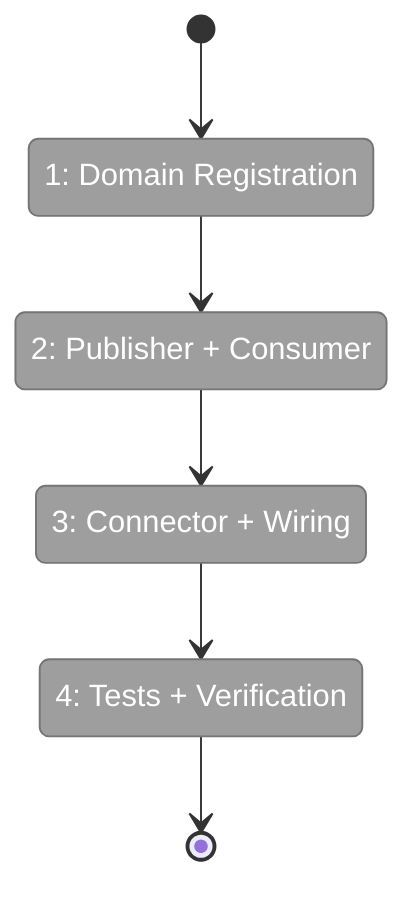
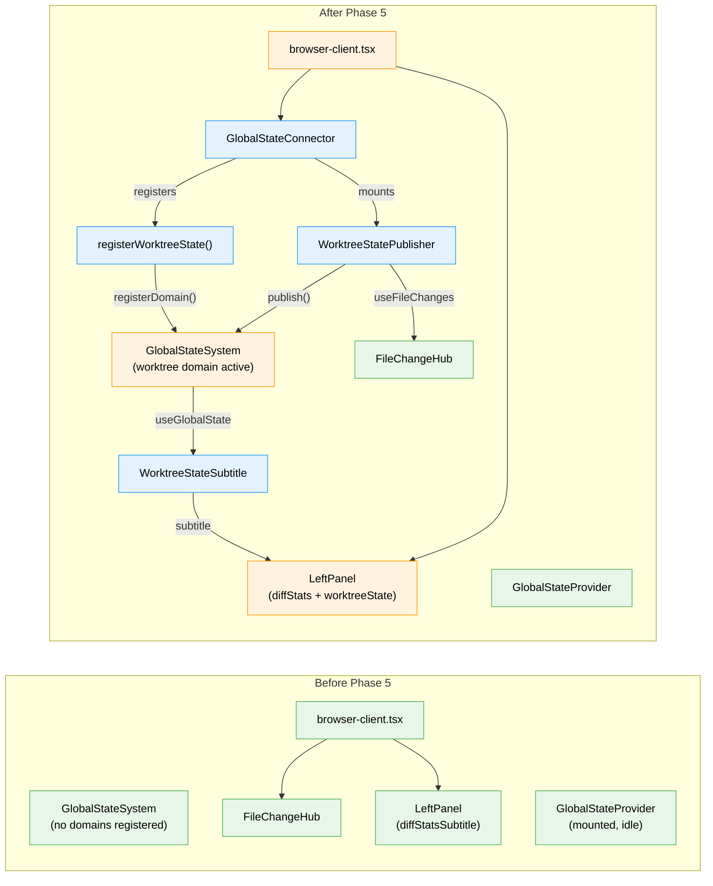

# Flight Plan: Phase 5 — Worktree Exemplar

**Plan**: [global-state-system-plan.md](../../global-state-system-plan.md)
**Phase**: Phase 5: Worktree Exemplar
**Generated**: 2026-02-27
**Status**: Ready for takeoff

---

## Departure → Destination

**Where we are**: Phases 1–4 delivered a complete GlobalStateSystem with types, interface, path engine, real + fake implementations (44 contract tests passing), React hooks (`useGlobalState`, `useGlobalStateList`), and a `GlobalStateProvider` mounted in the app tree. The infrastructure works — but no domain actually uses it yet. The state system has zero registered domains and zero published values in production.

**Where we're going**: A developer opening a workspace browser page sees live worktree state in the left panel — file change count updates instantly on save, branch name displays without refresh. This proves the full loop: domain registration → publisher → GlobalStateSystem → hook → React render. Future domains (workflow status, agent heartbeats) follow this exact pattern.

---

## Domain Context

### Domains We're Changing

| Domain | What Changes | Key Files |
|--------|-------------|-----------|
| `file-browser` | New `state/` directory with domain registration, publisher component, and subtitle consumer. Modify browser-client.tsx to wire connector + subtitle. | `features/041-file-browser/state/register.ts`, `state/worktree-publisher.ts`, `components/worktree-state-subtitle.tsx`, `browser-client.tsx` |
| `_platform/state` | New GlobalStateConnector wiring component. Update barrel exports. | `lib/state/state-connector.tsx`, `lib/state/index.ts` |

### Domains We Depend On (no changes)

| Domain | What We Consume | Contract |
|--------|----------------|----------|
| `_platform/events` | File change events | `useFileChanges(pattern, options)` from `FileChangeProvider` |
| `_platform/panel-layout` | Left panel subtitle slot | `LeftPanel` component, `subtitle?: ReactNode` prop |
| `_platform/state` (existing) | State system infrastructure | `IStateService`, `useStateSystem()`, `useGlobalState<T>()`, `GlobalStateProvider` |
| `file-browser` (existing) | Workspace identity | `useWorkspaceContext().worktreeIdentity.branch` |

---

## Flight Status

<!-- Updated by /plan-6-v2: pending → active → done. Use blocked for problems/input needed. -->

**Legend**: grey = pending | yellow = active | red = blocked/needs input | green = done

---

## Stages

<!-- Updated by /plan-6-v2 during implementation: [ ] → [~] → [x] -->

- [ ] **Stage 1: Register worktree domain** — Create `state/register.ts` with `registerWorktreeState()` declaring singleton domain with `changed-file-count` and `branch` properties (`register.ts` — new file)
- [ ] **Stage 2: Build publisher** — Create `WorktreeStatePublisher` that subscribes to FileChangeHub and publishes worktree state to GlobalStateSystem (`worktree-publisher.ts` — new file)
- [ ] **Stage 3: Build consumer** — Create `WorktreeStateSubtitle` reading worktree state via `useGlobalState` and rendering branch + file count (`worktree-state-subtitle.tsx` — new file)
- [ ] **Stage 4: Build connector** — Create `GlobalStateConnector` that registers domain and mounts publisher (`state-connector.tsx` — new file)
- [ ] **Stage 5: Wire in browser-client** — Mount connector inside FileChangeProvider, compose subtitle alongside existing diffStatsSubtitle (`browser-client.tsx` — modified)
- [ ] **Stage 6: Tests + verification** — Publisher unit tests with FakeGlobalStateSystem, manual live verification (`worktree-publisher.test.ts` — new file)

---

## Architecture: Before & After

**Legend**: existing (green, unchanged) | changed (orange, modified) | new (blue, created)

---

## Acceptance Criteria

- [ ] AC-38: worktree domain registered with `changed-file-count` and `branch` properties
- [ ] AC-39: Publisher updates live from file changes — `worktree:changed-file-count` reflects FileChangeHub state
- [ ] AC-40: Consumer displays in left panel subtitle, updates live without page refresh
- [ ] AC-41: Exemplar demonstrates both publisher and consumer patterns via GlobalStateConnector

## Goals & Non-Goals

**Goals**:
- ✅ First real domain using GlobalStateSystem end-to-end
- ✅ Live file change count in left panel
- ✅ Git branch name in left panel
- ✅ Pattern exemplar for future domain onboarding

**Non-Goals**:
- ❌ Multi-instance worktree support
- ❌ Persisted state
- ❌ Replacing existing diffStatsSubtitle
- ❌ SSE integration (client-side only)

---

## Checklist

- [ ] T001: Create `registerWorktreeState()` domain registration
- [ ] T002: Create `WorktreeStatePublisher` component
- [ ] T003: Create `WorktreeStateSubtitle` consumer component
- [ ] T004: Create `GlobalStateConnector` wiring component
- [ ] T005: Wire into `browser-client.tsx`
- [ ] T006: Publisher unit tests
- [ ] T007: Manual verification — live state updates
