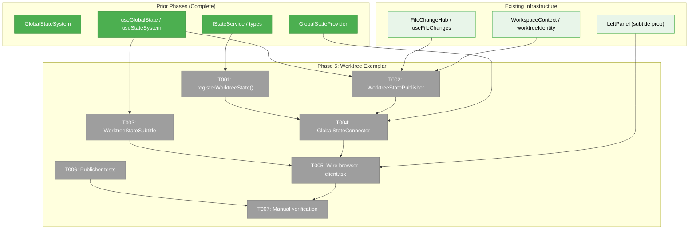
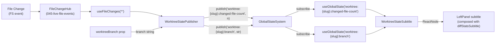
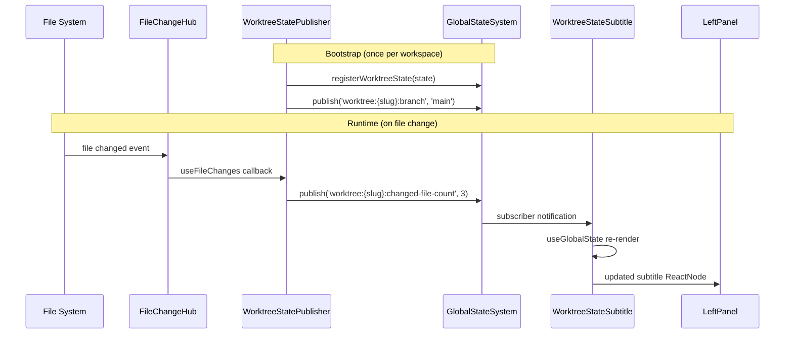

# Phase 5: Worktree Exemplar — Tasks & Context Brief

**Plan**: [global-state-system-plan.md](../../global-state-system-plan.md)
**Phase**: Phase 5: Worktree Exemplar
**Generated**: 2026-02-27
**Status**: Pending

---

## Executive Briefing

**Purpose**: Build the first real consumer of the GlobalStateSystem — a worktree state domain that publishes live file-change counts and git branch info from FileChangeHub, consumed by a subtitle component in the left panel. This proves the full publish → subscribe → render loop end-to-end.

**What We're Building**: A `worktree` singleton state domain with a publisher component (wired to FileChangeHub + WorkspaceContext), a consumer subtitle component (wired to useGlobalState), and a GlobalStateConnector that bridges domain registration and publisher mounting in the workspace layout.

**Goals**:
- ✅ Register `worktree` as a **multi-instance** state domain keyed by workspace `slug`, with `changed-file-count` (number) and `branch` (string) properties
- ✅ Publish live worktree state from FileChangeHub events and `worktreeBranch` prop using 3-segment paths: `worktree:{slug}:changed-file-count`, `worktree:{slug}:branch`
- ✅ Display live worktree state in the left panel subtitle, **composed alongside** existing `diffStatsSubtitle`
- ✅ Wire via GlobalStateConnector in browser-client.tsx, passing `slug` for instance scoping
- ✅ Demonstrate the GlobalStateSystem multi-instance producer/consumer pattern for future domain adoption

**Non-Goals**:
- ❌ Persisting worktree state (ephemeral only)
- ❌ Server-side state or SSE integration (purely client-side file change subscription)

### DYK Resolutions (Phase 5)

| ID | Insight | Resolution |
|----|---------|------------|
| **DYK-21** | Singleton paths leak across workspaces/tabs | Use **multi-instance** 3-segment paths: `worktree:{slug}:changed-file-count`. Each consumer subscribes only to its own workspace's instance. |
| **DYK-22** | worktreePath contains `/` (illegal in instance IDs) | Use BrowserClient's `slug` prop directly as instance ID — already valid `[a-zA-Z0-9_-]+` format. |
| **DYK-23** | LeftPanel subtitle slot already occupied by diffStatsSubtitle | **Compose both** in a flex container: `<>{diffStatsSubtitle}{worktreeSubtitle}</>`. Do NOT replace existing. |
| **DYK-24** | Branch info not available from FileChangeHub | Branch comes from `worktreeBranch` prop on BrowserClient, not the hub. Publisher receives it as a prop and publishes on mount + prop change. |
| **DYK-25** | Changed file count derived from hub subscription | Use `useFileChanges('*')` to get changes, publish `changes.length` to state each time the change set updates. |

---

## Prior Phase Context

### Phase 1: Types, Interface & Path Engine (✅ Complete)

**A. Deliverables**: Created all types, IStateService interface, path parser, path matcher, DI tokens, barrel exports, and package.json `./state` export entry in `packages/shared/src/state/`.

**B. Dependencies Exported**:
- `IStateService` (11 methods + 2 properties) — the core contract Phase 5 consumes
- `StateDomainDescriptor` — Phase 5 uses this for `registerWorktreeState()`
- `parsePath()` + `createStateMatcher()` — used internally by the system
- `STATE_DI_TOKENS` — available if DI container registration needed
- Import via `@chainglass/shared/state`

**C. Gotchas**:
- DYK-01: Flat path model only (2-3 segments). Worktree paths: `worktree:{slug}:changed-file-count` and `worktree:{slug}:branch` (both 3-segment multi-instance, keyed by workspace slug — per DYK-21/22).
- DYK-03: Parser is domain-unaware — domain existence checked at publish/subscribe time.

**D. Incomplete Items**: None.

**E. Patterns**: Interface + Types split, colon-delimited paths, barrel exports with type-only.

### Phase 2: TDD — Path Engine & Contract Tests (✅ Complete)

**A. Deliverables**: 25 path-parser tests, 22 path-matcher tests, 19 contract test cases in `globalStateContractTests` factory.

**B. Dependencies Exported**: `globalStateContractTests(name, factory)` — available for any new IStateService implementation.

**C. Gotchas**:
- DYK-07: Store-first ordering enforced — `get()` returns value inside publish callback.
- DYK-08: All contract tests call `registerTestDomain()` first — domain registration mandatory before publish.

**D. Incomplete Items**: None.

**E. Patterns**: RED-first TDD, decision table tests, helper functions for test prerequisites.

### Phase 3: Implementation + Fake (✅ Complete)

**A. Deliverables**: `GlobalStateSystem` (real implementation), `FakeGlobalStateSystem` (test double), 31 unit tests, 44 contract tests passing.

**B. Dependencies Exported**:
- `GlobalStateSystem` class — the real implementation Phase 5 uses via provider
- `FakeGlobalStateSystem` — with `getPublished()`, `getSubscribers()`, `wasPublishedWith()`, `reset()` — available for Phase 5 tests
- Both exported via `@chainglass/shared/state` and `apps/web/src/lib/state/index.ts`

**C. Gotchas**:
- Store-first ordering (PL-01): Map updates before subscriber notification.
- List cache invalidation: Deletes ALL cache entries on publish/remove (acceptable at scale).
- No defensive copies — `get()` returns same object identity (callers must respect immutability).

**D. Incomplete Items**: None.

**E. Patterns**: Map + Set subscribers, error isolation (try/catch per subscriber), behavioral fakes (not stubs).

### Phase 4: React Integration (✅ Complete)

**A. Deliverables**: `useGlobalState<T>`, `useGlobalStateList`, `GlobalStateProvider` + `useStateSystem`, barrel exports, mounted in `providers.tsx`, 9 hook tests.

**B. Dependencies Exported**:
- `useGlobalState<T>(path, default?) → T` — Phase 5 consumer uses this
- `useGlobalStateList(pattern) → StateEntry[]` — available for multi-value consumption
- `useStateSystem() → IStateService` — Phase 5 publisher/connector uses this for `registerDomain()` and `publish()`
- `GlobalStateProvider` — already mounted in providers.tsx
- `StateContext` — exported for test injection (DYK-20)

**C. Gotchas**:
- DYK-16: Inline defaults create new object identity → pin with `useRef(defaultValue).current`
- DYK-17: Don't subscribe with `'*'` — use actual pattern to avoid over-notification
- DYK-19: Wrap subscribe/getSnapshot in `useCallback` with stable deps
- DYK-18: No graceful degradation — fail-fast on provider errors

**D. Incomplete Items**: None.

**E. Patterns**: `useSyncExternalStore` wiring, `useRef` for default pinning, context export for test injection, pattern-scoped subscriptions.

---

## Pre-Implementation Check

| File | Exists? | Domain Check | Notes |
|------|---------|-------------|-------|
| `apps/web/src/features/041-file-browser/state/register.ts` | ❌ Create | `file-browser` ✅ | New directory `state/` needed under 041-file-browser |
| `apps/web/src/features/041-file-browser/state/worktree-publisher.ts` | ❌ Create | `file-browser` ✅ | Publisher component — consumes `_platform/events` + `_platform/state` |
| `apps/web/src/features/041-file-browser/components/worktree-state-subtitle.tsx` | ❌ Create | `file-browser` ✅ | Consumer component — consumes `_platform/state` |
| `apps/web/src/lib/state/state-connector.tsx` | ❌ Create | `_platform/state` ✅ | Cross-domain wiring component — listed in domain.md |
| `apps/web/app/(dashboard)/workspaces/[slug]/browser/browser-client.tsx` | ✅ Modify | `file-browser` ✅ | Wire GlobalStateConnector + pass subtitle. **Subtitle slot occupied** — compose with existing `diffStatsSubtitle` |
| `test/unit/web/state/worktree-publisher.test.ts` | ❌ Create | `file-browser` ✅ | Unit tests for publisher logic |

**Concept Duplication Check**: All 4 new concepts (`registerWorktreeState`, `GlobalStateConnector`, `WorktreeStateSubtitle`, `WorktreeStatePublisher`) confirmed genuinely new — no existing implementations found.

**⚠️ Integration Risk**: The `subtitle` prop on `<LeftPanel>` is currently wired to `diffStatsSubtitle` (Plan 049 diff stats). Phase 5 must **compose** both subtitles (e.g., render both in a flex container), NOT replace the existing one.

---

## Architecture Map



---

## Tasks

| Status | ID | Task | Domain | Path(s) | Done When | Notes |
|--------|-----|------|--------|---------|-----------|-------|
| [x] | T001 | Create `registerWorktreeState()` — domain registration function | `file-browser` | `/Users/jordanknight/substrate/chainglass-048/apps/web/src/features/041-file-browser/state/register.ts` | Exports `registerWorktreeState(state: IStateService)` that registers `worktree` as **multi-instance** domain with `changed-file-count` (number) and `branch` (string) properties | DYK-21: multi-instance keyed by slug. Create `state/` directory. |
| [x] | T002 | Create `WorktreeStatePublisher` — React component publishing worktree state | `file-browser` | `/Users/jordanknight/substrate/chainglass-048/apps/web/src/features/041-file-browser/state/worktree-publisher.tsx` | Invisible component accepting `slug` and `worktreeBranch` props. (1) Subscribes to FileChangeHub via `useFileChanges('*')` and publishes `worktree:{slug}:changed-file-count` with count, (2) publishes `worktree:{slug}:branch` from `worktreeBranch` prop. Cleans up on unmount. | DYK-24: Branch from prop, not hub. DYK-22: slug as instance ID. Must mount inside FileChangeProvider scope. |
| [x] | T003 | Create `WorktreeStateSubtitle` — consumer component for left panel | `file-browser` | `/Users/jordanknight/substrate/chainglass-048/apps/web/src/features/041-file-browser/components/worktree-state-subtitle.tsx` | Component accepting `slug` prop. Uses `useGlobalState<number>('worktree:${slug}:changed-file-count', 0)` and `useGlobalState<string>('worktree:${slug}:branch', '')` to render branch name and file count. Tailwind-styled matching `diffStatsSubtitle` pattern (text-xs, text-muted-foreground). | DYK-21: 3-segment paths with slug instance. |
| [x] | T004 | Create `GlobalStateConnector` — invisible wiring component | `_platform/state` | `/Users/jordanknight/substrate/chainglass-048/apps/web/src/lib/state/state-connector.tsx` | Component accepting `slug` and `worktreeBranch` props. (1) calls `useStateSystem()` to get IStateService, (2) calls `registerWorktreeState(state)` once via `useEffect`, (3) renders `<WorktreeStatePublisher slug={slug} worktreeBranch={worktreeBranch} />` as child. Returns no visible UI. Export from barrel. | Registration in useEffect to avoid render-phase side effects. |
| [x] | T005 | Wire into `browser-client.tsx` — mount connector + compose subtitle | `file-browser` | `/Users/jordanknight/substrate/chainglass-048/apps/web/app/(dashboard)/workspaces/[slug]/browser/browser-client.tsx` | (1) Mount `<GlobalStateConnector slug={slug} worktreeBranch={worktreeBranch} />` inside `<FileChangeProvider>`. (2) Compose `<WorktreeStateSubtitle slug={slug} />` alongside existing `diffStatsSubtitle` in LeftPanel subtitle — render both in a flex container. No regressions to existing diff stats display. | DYK-23: compose, not replace. ⚠️ Subtitle slot occupied. |
| [x] | T006 | Create publisher unit tests | `file-browser` | `/Users/jordanknight/substrate/chainglass-048/test/unit/web/state/worktree-publisher.test.ts` | Tests with FakeGlobalStateSystem: (1) publishes `worktree:{slug}:changed-file-count` from file changes, (2) publishes `worktree:{slug}:branch` from prop, (3) updates on new file changes, (4) cleans up on unmount | Use StateContext.Provider for fake injection (DYK-20). Mock useFileChanges. |
| [x] | T007 | Manual verification — live state updates | `file-browser` | — | File save in browser → `worktree:{slug}:changed-file-count` updates in left panel subtitle without page refresh. Branch name displays correctly. Existing diff stats subtitle still works. | CS 1 — verify in dev environment. |

---

## Context Brief

### Key Findings from Plan

- **Finding 03** (High): FileChangeProvider is mounted in BrowserClient (page-level). GlobalStateProvider is app-level (providers.tsx). The publisher must sit **inside** FileChangeProvider scope to access `useFileChanges()`. Solution: `WorktreeStatePublisher` renders inside `<FileChangeProvider>`, wired by `GlobalStateConnector` which also mounts inside the provider.
- **Finding 05** (High): LeftPanel accepts `subtitle` as `ReactNode`. The worktree consumer should be a `<WorktreeStateSubtitle>` component. browser-client.tsx is `'use client'` so hooks work. **Integration note**: existing `diffStatsSubtitle` already uses this slot — compose both.
- **Finding 06** (High): FakeGlobalStateSystem follows behavioral fake pattern with inspection methods. Use for publisher tests.

### Domain Dependencies (contracts this phase consumes)

- `_platform/state`: `IStateService.registerDomain()`, `IStateService.publish()`, `useStateSystem()`, `useGlobalState<T>()` — core state system contracts for registration, publishing, and consumption
- `_platform/events`: `useFileChanges(pattern, options)` from `FileChangeProvider` — file change events that drive worktree publisher
- `_platform/panel-layout`: `LeftPanel` component with `subtitle?: ReactNode` prop — render target for consumer component
- `file-browser`: BrowserClient props `slug` (instance key per DYK-22) and `worktreeBranch` (branch source per DYK-24)

### Domain Constraints

- **`file-browser` → `_platform/state`**: Consumer direction. file-browser publishes TO and reads FROM state system. Allowed per domain-map.md edge `fileBrowser -->|"useGlobalState (subscribe worktree)"| state`.
- **`file-browser` → `_platform/events`**: Existing edge. file-browser already consumes `useFileChanges` and `FileChangeProvider`.
- **`_platform/state` domain owns `state-connector.tsx`**: The connector is cross-domain wiring — it imports from file-browser's `register.ts` and `worktree-publisher.ts`. This is intentional per domain.md — connector orchestrates domain publishers.
- **No new domain edges**: All dependencies are already in domain-map.md.

### Reusable from Prior Phases

- `FakeGlobalStateSystem` with `getPublished()`, `wasPublishedWith()`, `reset()` — for publisher tests (T006)
- `StateContext` export — for test injection without mounting full provider tree (DYK-20)
- `useRef(defaultValue).current` pattern — for stable default values in hooks (DYK-16)
- `useSyncExternalStore` wiring pattern — already proven in useGlobalState/useGlobalStateList
- `diffStatsSubtitle` useMemo pattern — reference for WorktreeStateSubtitle styling

### System Flow Diagram



### Sequence Diagram (actor interactions)



---

## Discoveries & Learnings

_Populated during implementation by plan-6._

| Date | Task | Type | Discovery | Resolution | References |
|------|------|------|-----------|------------|------------|
| 2026-02-27 | T004 | gotcha | `useEffect` registration fires after child effects — "domain not registered" error | Switched to `useState` initializer for synchronous registration before children render | DYK-18 (fail-fast) |
| 2026-02-27 | T001 | gotcha | React Strict Mode + HMR re-run `useState` initializers — "already registered" error | Made `registerWorktreeState()` idempotent with `listDomains().some()` guard | React 19 Strict Mode |

**Types**: `gotcha` | `research-needed` | `unexpected-behavior` | `workaround` | `decision` | `debt` | `insight`

---

## Directory Layout

```
docs/plans/053-global-state-system/
  ├── global-state-system-plan.md
  └── tasks/phase-5-worktree-exemplar/
      ├── tasks.md                    ← this file
      ├── tasks.fltplan.md            ← flight plan
      └── execution.log.md           # created by plan-6
```
