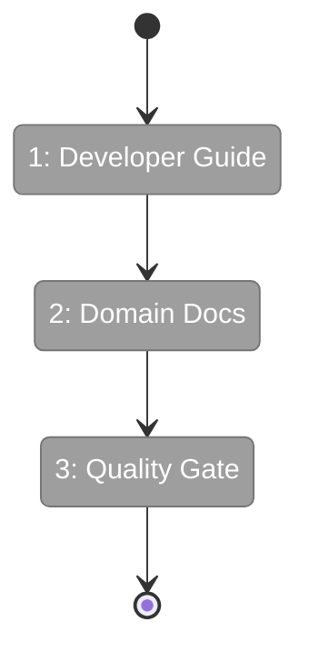
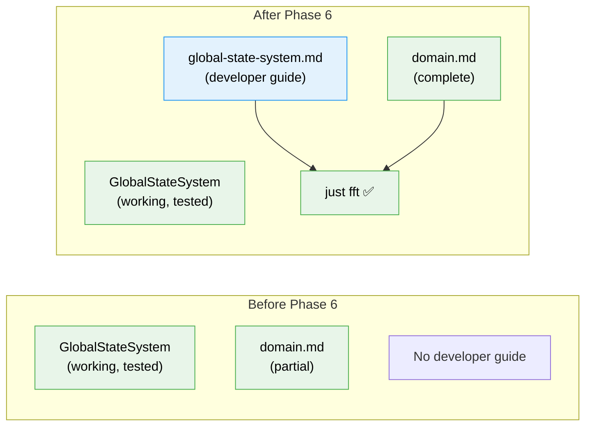

# Flight Plan: Phase 6 — Documentation & Quality Gate

**Plan**: [global-state-system-plan.md](../../global-state-system-plan.md)
**Phase**: Phase 6: Documentation & Quality Gate
**Generated**: 2026-02-27
**Status**: Ready for takeoff

---

## Departure → Destination

**Where we are**: Phases 1–5 delivered a complete GlobalStateSystem — types, interface, path engine, real + fake implementations, React hooks, provider, and a working worktree exemplar with live state in the sidebar. 145 tests pass. The system works end-to-end but has no developer-facing documentation.

**Where we're going**: A developer wanting to publish or consume runtime state can read `docs/how/global-state-system.md`, follow a quick-start, and wire up their domain in minutes. Domain docs are complete. `just fft` passes clean. Plan 053 is done.

---

## Domain Context

### Domains We're Changing

| Domain | What Changes | Key Files |
|--------|-------------|-----------|
| `_platform/state` | New developer guide, domain.md completeness check | `docs/how/global-state-system.md`, `docs/domains/_platform/state/domain.md` |

### Domains We Depend On (no changes)

| Domain | What We Consume | Contract |
|--------|----------------|----------|
| `file-browser` | Worktree exemplar code — referenced in guide | Phase 5 source files |

---

## Flight Status

<!-- Updated by /plan-6-v2: pending → active → done. Use blocked for problems/input needed. -->

**Legend**: grey = pending | yellow = active | red = blocked/needs input | green = done

---

## Stages

<!-- Updated by /plan-6-v2 during implementation: [ ] → [~] → [x] -->

- [ ] **Stage 1: Write developer guide** — Create `docs/how/global-state-system.md` with vibe, quick-starts, cheatsheet, exemplar walkthrough (`global-state-system.md` — new file)
- [ ] **Stage 2: Update domain docs** — Verify `domain.md` completeness for all Phase 1-5 files and history (`domain.md` — modified)
- [ ] **Stage 3: Quality gate** — Run `just fft`, verify 145 tests pass, lint clean

---

## Architecture: Before & After

**Legend**: existing (green, unchanged) | new (blue, created)

---

## Acceptance Criteria

- [ ] AC-42: Developer guide exists at `docs/how/global-state-system.md` covering consumer quick-start, publisher quick-start, pattern cheatsheet, and worktree exemplar walkthrough

## Goals & Non-Goals

**Goals**:
- ✅ Developer guide for future domain authors
- ✅ Complete domain documentation
- ✅ Clean quality gate pass

**Non-Goals**:
- ❌ No new code or tests
- ❌ No API changes

---

## Checklist

- [ ] T001: Create developer guide `docs/how/global-state-system.md`
- [ ] T002: Update domain docs — verify completeness
- [ ] T003: Quality gate: `just fft` passes
