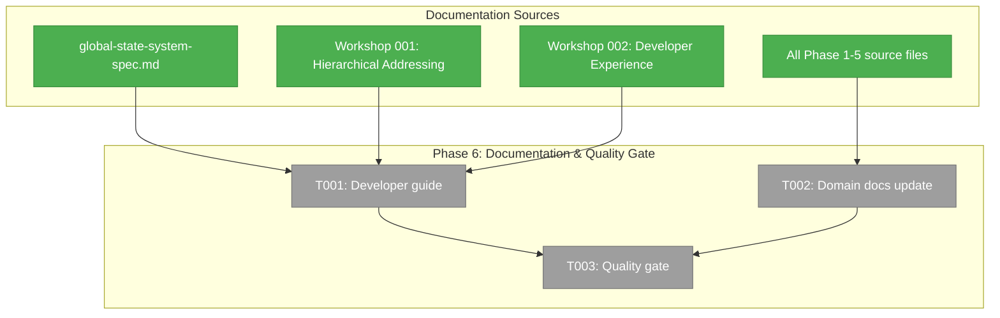

# Phase 6: Documentation & Quality Gate — Tasks & Context Brief

**Plan**: [global-state-system-plan.md](../../global-state-system-plan.md)
**Phase**: Phase 6: Documentation & Quality Gate
**Generated**: 2026-02-27
**Status**: Pending

---

## Executive Briefing

**Purpose**: Create the developer guide that teaches future domain authors how to use the GlobalStateSystem, finalize domain docs, and run the quality gate to close out Plan 053.

**What We're Building**: A comprehensive `docs/how/global-state-system.md` guide covering consumer quick-start, publisher quick-start, pattern cheatsheet, and the worktree exemplar walkthrough. Plus domain doc updates and a clean `just fft` pass.

**Goals**:
- ✅ Developer guide at `docs/how/global-state-system.md` covering all AC-42 sections
- ✅ Domain docs fully up to date with all Phase 1–5 files and history
- ✅ `just fft` passes — zero regressions, all 145 state tests pass

**Non-Goals**:
- ❌ No new code, hooks, or components
- ❌ No API changes
- ❌ No new tests (existing 145 must pass)

### DYK Resolutions (Phase 6)

| ID | Insight | Resolution |
|----|---------|------------|
| **DYK-26** | Idempotent registration is the #1 gotcha — useState + listDomains guard | Add prominent callout box in publisher quick-start showing wrong way (useEffect) vs right way (useState initializer) |
| **DYK-27** | Guide is THE copy-paste template for future domains | Structure worktree exemplar as numbered recipe with full file paths and complete code blocks |
| **DYK-28** | Consumer/publisher examples must be strictly separated | Separate quick-start sections — consumers import hooks, publishers import useStateSystem(). Never mix. |
| **DYK-29** | `just fft` fails due to pre-existing Plan 050 lint errors | Gate defined as: our Plan 053 files lint-clean + `pnpm test` passes. Document pre-existing failures. |
| **DYK-30** | file-browser domain.md also needs Phase 5 source updates | Add to T002 scope — update file-browser domain.md history + source locations |

---

## Prior Phase Context

### Phases 1–5 Summary (all ✅ Complete)

**A. Deliverables**:
- **Phase 1**: Types, IStateService interface, path parser (2/3 segments), path matcher (5 patterns), DI tokens, barrel exports, `./state` package.json entry
- **Phase 2**: 25 parser tests, 22 matcher tests, 19 contract test cases in factory
- **Phase 3**: GlobalStateSystem (real), FakeGlobalStateSystem (fake with inspection methods), 37 unit tests, 44 contract tests
- **Phase 4**: useGlobalState, useGlobalStateList, GlobalStateProvider, useStateSystem, StateContext, mounted in providers.tsx, 10 hook tests
- **Phase 5**: registerWorktreeState (multi-instance), WorktreeStatePublisher (useFileChanges), WorktreeStateSubtitle, GlobalStateConnector, wired in browser-client.tsx + dashboard-sidebar.tsx, 7 publisher tests

**B. Key Patterns to Document**:
- Colon-delimited paths: `domain:property` (singleton) or `domain:instanceId:property` (multi-instance)
- 5 pattern types: exact, domain wildcard, instance wildcard, domain-all, global
- `useSyncExternalStore` for concurrent-safe subscriptions
- `useRef(defaultValue).current` for pinning inline defaults (DYK-16)
- `useCallback` wrapping subscribe/getSnapshot (DYK-19)
- `useState` initializer for synchronous domain registration
- Idempotent registration for StrictMode/HMR
- `StateContext` export for test injection (DYK-20)
- `FakeGlobalStateSystem` behavioral fake pattern

**C. Architecture Decisions**:
- AC-31 dropped (DYK-18): fail-fast, no silent degradation
- Multi-instance paths for cross-workspace isolation (DYK-21)
- Branch from prop, not hub (DYK-24)
- Pattern-scoped list cache invalidation (not global clear)

---

## Pre-Implementation Check

| File | Exists? | Domain Check | Notes |
|------|---------|-------------|-------|
| `docs/how/global-state-system.md` | ❌ Create | `_platform/state` ✅ | New developer guide — follows `file-browser.md` pattern |
| `docs/domains/_platform/state/domain.md` | ✅ Modify | `_platform/state` ✅ | Add Phase 5 file-browser files, verify completeness |

**Concept Duplication Check**: Not applicable — documentation only, no new code.

---

## Architecture Map



---

## Tasks

| Status | ID | Task | Domain | Path(s) | Done When | Notes |
|--------|-----|------|--------|---------|-----------|-------|
| [ ] | T001 | Create developer guide `docs/how/global-state-system.md` | `_platform/state` | `/Users/jordanknight/substrate/chainglass-048/docs/how/global-state-system.md` | Guide covers: (1) vibe/philosophy, (2) consumer quick-start with useGlobalState, (3) publisher quick-start with domain registration + publish, (4) pattern cheatsheet (path syntax, 5 pattern types, hooks), (5) worktree exemplar walkthrough, (6) testing with FakeGlobalStateSystem. Follows `file-browser.md` doc style. | AC-42. Reference Workshop 002 for DX vibe. Include mermaid architecture diagram. |
| [ ] | T002 | Update domain docs — verify completeness | `_platform/state` + `file-browser` | `/Users/jordanknight/substrate/chainglass-048/docs/domains/_platform/state/domain.md`, `/Users/jordanknight/substrate/chainglass-048/docs/domains/file-browser/domain.md` | All Phase 5 files listed in Source Location. History entries for P1-P5 present. file-browser domain.md updated with Phase 5 state files (register.ts, worktree-publisher.tsx, worktree-state-subtitle.tsx). | DYK-30: file-browser domain also needs updating. |
| [ ] | T003 | Quality gate: Plan 053 files lint-clean + tests pass | all | — | Our Plan 053 files pass `npx biome check`. `pnpm test` passes with all 145 state tests. Pre-existing Plan 050 lint failures documented as out-of-scope. | DYK-29: `just fft` fails due to pre-existing issues. Gate is scoped to our files. |

---

## Context Brief

### Key Findings from Plan

- **AC-42**: Developer guide must cover consumer quick-start, publisher quick-start, pattern cheatsheet, and worktree exemplar walkthrough
- **Workshop 002**: DX vibe is "lightweight, read-only consumers, write-only publishers" — consumers never see publish(), publishers never see subscribe()
- **Workshop 001**: Path scheme documentation — colon-delimited, 2-3 segments, 5 pattern types

### Domain Dependencies

- `_platform/state`: All source files from Phases 1-5 — the documentation subject
- `file-browser`: Phase 5 exemplar files — worktree publisher, subtitle, register

### Reusable from Prior Phases

- Workshop 001 + 002 content — reference material for the guide
- Existing `docs/how/file-browser.md` — style template
- Phase 5 execution log — worktree exemplar walkthrough source

---

## Discoveries & Learnings

_Populated during implementation by plan-6._

| Date | Task | Type | Discovery | Resolution | References |
|------|------|------|-----------|------------|------------|

**Types**: `gotcha` | `research-needed` | `unexpected-behavior` | `workaround` | `decision` | `debt` | `insight`

---

## Directory Layout

```
docs/plans/053-global-state-system/
  ├── global-state-system-plan.md
  └── tasks/phase-6-documentation-quality-gate/
      ├── tasks.md                    ← this file
      ├── tasks.fltplan.md            ← flight plan
      └── execution.log.md           # created by plan-6
```
