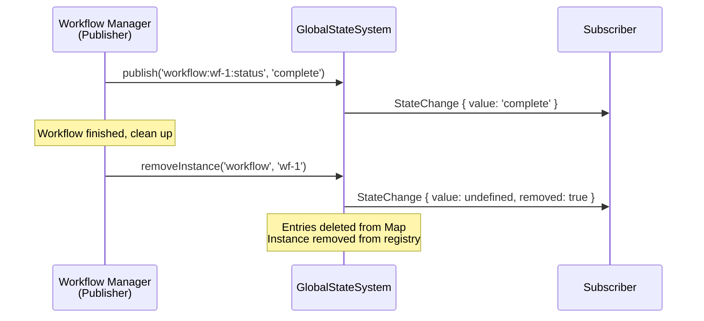

# Workshop: Hierarchical State Addressing & Instance Management

**Type**: Data Model / Integration Pattern
**Plan**: 053-global-state-system
**Spec**: (pre-spec — informing specification)
**Created**: 2026-02-26
**Status**: Draft

**Related Documents**:
- [Research Dossier](../research-dossier.md)
- [FileChangeHub](../../../../apps/web/src/features/045-live-file-events/file-change-hub.ts) — pattern subscription model
- [SettingsStore](../../../../apps/web/src/lib/sdk/settings-store.ts) — onChange + useSyncExternalStore model
- [WorkspaceDomain](../../../../packages/shared/src/features/027-central-notify-events/workspace-domain.ts) — domain identity model

**Domain Context**:
- **Primary Domain**: `_platform/state` (new)
- **Related Domains**: `_platform/events` (transport), `_platform/sdk` (pattern exemplar), `_platform/positional-graph` (publisher), `workflow-ui` (consumer), `_platform/panel-layout` (consumer)

---

## Purpose

Define the core data model for GlobalStateSystem: how state is addressed, how multiple instances of the same concept coexist, how subscribers match state by pattern, and how ephemeral state is cleaned up. This is the architectural cornerstone — every other decision (React hooks, SSE transport, testing) follows from these choices.

## Key Questions Addressed

1. What is the path addressing scheme? Delimiter choice, segment semantics, depth limits.
2. How do multiple instances of the same state domain coexist? (10 workflows, each with agents)
3. What pattern matching semantics does subscription support?
4. What subscription granularity is available? Single value vs subtree vs cross-instance.
5. How is state garbage-collected when instances are destroyed?
6. How does denormalized multi-domain publishing work?

---

## 1. Path Addressing Scheme

### Design Decision: Colon-Delimited Hierarchical Paths

State is addressed by **colon-delimited string paths** with a fixed segment grammar:

```
<domain>:<instance-id>:<property>
<domain>:<instance-id>:<sub-domain>:<sub-instance-id>:<property>
```

**Why colons?**
- Slashes (`/`) conflict with filesystem paths already used in FileChangeHub patterns
- Dots (`.`) conflict with SDK settings keys (`ui.theme`, `editor.fontSize`)
- Colons are unused in existing addressing schemes and visually distinct

### Segment Grammar

```
StatePath = Domain ":" InstanceId ":" Property
           | Domain ":" InstanceId ":" Domain ":" InstanceId ":" Property  
           | Domain ":" Property  (singleton domain — no instance ID)

Domain     = [a-z][a-z0-9-]*     // lowercase kebab-case
InstanceId = [a-zA-Z0-9_-]+      // alphanumeric with dash/underscore
Property   = [a-z][a-z0-9-]*     // lowercase kebab-case
```

### Path Examples

```typescript
// Singleton domains (one instance per worktree)
"worktree:active-file"                           // Which file is currently open
"worktree:dirty-files"                           // List of unsaved files
"worktree:alert-count"                           // Number of active alerts

// Multi-instance domains
"workflow:wf-build-pipeline:status"              // Single workflow's execution status
"workflow:wf-build-pipeline:current-phase"       // Which phase is running
"workflow:wf-deploy-prod:status"                 // Different workflow instance

// Nested instances (future — agent within workflow)
"workflow:wf-build-pipeline:agent:agent-abc:status"    // Agent within a workflow
"workflow:wf-build-pipeline:agent:agent-abc:intent"    // Agent's current intent

// Global aggregates (published by managers, not instances)
"workflow-summary:active-count"                  // How many workflows are running
"workflow-summary:last-completed"                // When the last workflow finished
```

### Path Parsing

```typescript
interface ParsedPath {
  /** Top-level domain (e.g., 'workflow', 'worktree') */
  domain: string;
  /** Instance ID within domain, or null for singletons */
  instanceId: string | null;
  /** Property name */
  property: string;
  /** Sub-domain (for nested instances), or null */
  subDomain: string | null;
  /** Sub-instance ID, or null */
  subInstanceId: string | null;
  /** Original full path string */
  raw: string;
}

function parsePath(path: string): ParsedPath {
  const segments = path.split(':');
  
  if (segments.length === 2) {
    // Singleton: "worktree:active-file"
    return { domain: segments[0], instanceId: null, property: segments[1],
             subDomain: null, subInstanceId: null, raw: path };
  }
  if (segments.length === 3) {
    // Instance: "workflow:wf-123:status"
    return { domain: segments[0], instanceId: segments[1], property: segments[2],
             subDomain: null, subInstanceId: null, raw: path };
  }
  if (segments.length === 5) {
    // Nested: "workflow:wf-123:agent:agent-456:status"
    return { domain: segments[0], instanceId: segments[1], property: segments[4],
             subDomain: segments[2], subInstanceId: segments[3], raw: path };
  }
  
  throw new Error(`Invalid state path: ${path} (expected 2, 3, or 5 segments)`);
}
```

### Validation Rules

1. **Segments must not be empty** — `"workflow::status"` is invalid
2. **Domain must be pre-registered** — publishing to an unregistered domain throws
3. **Max depth is 5 segments** — prevents unbounded nesting
4. **Instance IDs are opaque** — the state system doesn't interpret them, just stores them
5. **Paths are case-sensitive** — `workflow:WF-123:status` ≠ `workflow:wf-123:status`

---

## 2. Multi-Instance State Domains

### The Problem

A "workflow" state domain isn't a single value — it's a template for N concurrent instances:

```
workflow:wf-build-pipeline:status    = "running"
workflow:wf-deploy-staging:status    = "complete"
workflow:wf-run-tests:status         = "pending"
```

Each instance has the same shape but different values and lifecycle.

### Design: State Domain Descriptors

Domains register a **descriptor** that declares what properties they publish:

```typescript
interface StateDomainDescriptor {
  /** Domain name (e.g., 'workflow', 'worktree') */
  domain: string;
  /** Human-readable description */
  description: string;
  /** Whether this domain supports multiple instances */
  multiInstance: boolean;
  /** Property keys this domain publishes */
  properties: StatePropertyDescriptor[];
}

interface StatePropertyDescriptor {
  /** Property key (final segment of path) */
  key: string;
  /** Human-readable description */
  description: string;
  /** TypeScript type hint (for documentation, not runtime validation) */
  typeHint: string;
}
```

### Registration Example

```typescript
// In workflow domain's SDK contribution wiring
stateSystem.registerDomain({
  domain: 'workflow',
  description: 'Workflow execution state per instance',
  multiInstance: true,
  properties: [
    { key: 'status', description: 'Execution status', typeHint: "'pending' | 'running' | 'complete' | 'failed'" },
    { key: 'current-phase', description: 'Currently executing phase name', typeHint: 'string | null' },
    { key: 'progress', description: 'Execution progress 0-100', typeHint: 'number' },
    { key: 'started-at', description: 'When execution began', typeHint: 'number | null' },
  ],
});

// Singleton domain
stateSystem.registerDomain({
  domain: 'worktree',
  description: 'Worktree-level runtime state',
  multiInstance: false,
  properties: [
    { key: 'active-file', description: 'Currently open file path', typeHint: 'string | null' },
    { key: 'dirty-files', description: 'Files with unsaved changes', typeHint: 'string[]' },
    { key: 'alert-count', description: 'Number of active alerts', typeHint: 'number' },
  ],
});
```

### Instance Registry

The state system maintains an internal registry of known instances per domain:

```typescript
// Internal representation
class StateStore {
  /** domain → Set of known instance IDs */
  private instances = new Map<string, Set<string>>();
  
  /** Full path → current value */
  private values = new Map<string, unknown>();
  
  /** Full path → Set of subscriber callbacks */
  private listeners = new Map<string, Set<StateChangeCallback>>();
  
  /** Pattern → Set of pattern subscriber callbacks */
  private patternListeners = new Map<string, Set<PatternSubscription>>();
}
```

### Listing Instances

```typescript
// List all workflow instances
const workflows = stateSystem.listInstances('workflow');
// → ['wf-build-pipeline', 'wf-deploy-staging', 'wf-run-tests']

// Get all state for a specific instance
const state = stateSystem.getInstanceState('workflow', 'wf-build-pipeline');
// → { status: 'running', 'current-phase': 'Phase 2: Build', progress: 45, 'started-at': 1740600000000 }
```

---

## 3. Pattern Matching Semantics

### Design: Four Pattern Types (Mirroring FileChangeHub)

Pattern matching follows FileChangeHub's proven 4-type system, adapted for colon-delimited state paths:

| Pattern | Matches | Example |
|---------|---------|---------|
| Exact | Single path | `workflow:wf-123:status` |
| Domain wildcard | All instances, one property | `workflow:*:status` |
| Instance wildcard | All properties of one instance | `workflow:wf-123:*` |
| Domain-all | Everything in a domain | `workflow:**` |

### Pattern Syntax

```
StatePattern = ExactPath
             | Domain ":*:" Property        // All instances, one property
             | Domain ":" InstanceId ":*"   // All properties of one instance
             | Domain ":**"                 // Everything in domain
             | "*"                          // Everything (all domains)
```

### Matcher Implementation

```typescript
type StateMatcher = (path: string) => boolean;

function createStateMatcher(pattern: string): StateMatcher {
  // Global wildcard
  if (pattern === '*') {
    return () => true;
  }
  
  // Domain-all: "workflow:**" → matches anything starting with "workflow:"
  if (pattern.endsWith(':**')) {
    const domain = pattern.slice(0, -3);
    return (path) => path.startsWith(`${domain}:`);
  }
  
  // Domain wildcard: "workflow:*:status" → any instance, specific property
  if (pattern.includes(':*:')) {
    const [domain, , property] = pattern.split(':');
    return (path) => {
      const segments = path.split(':');
      return segments.length === 3
        && segments[0] === domain
        && segments[2] === property;
    };
  }
  
  // Instance wildcard: "workflow:wf-123:*" → specific instance, any property
  if (pattern.endsWith(':*')) {
    const prefix = pattern.slice(0, -2);
    return (path) => path.startsWith(`${prefix}:`);
  }
  
  // Exact match
  return (path) => path === pattern;
}
```

### Pattern Examples

```typescript
// Subscribe to all workflow statuses (across all instances)
stateSystem.subscribe('workflow:*:status', (change) => {
  console.log(`Workflow ${change.instanceId} is now ${change.value}`);
});
// Fires for: workflow:wf-123:status, workflow:wf-456:status, etc.

// Subscribe to everything about one workflow
stateSystem.subscribe('workflow:wf-123:*', (change) => {
  console.log(`${change.property} = ${change.value}`);
});
// Fires for: workflow:wf-123:status, workflow:wf-123:progress, etc.

// Subscribe to all workflow state changes
stateSystem.subscribe('workflow:**', (change) => {
  // Fires for any workflow:*:* change
});

// Subscribe to one specific value
stateSystem.subscribe('worktree:active-file', (change) => {
  highlightFile(change.value);
});
```

### Pattern Matching Decision Table

| Pattern | `workflow:wf-1:status` | `workflow:wf-2:progress` | `worktree:active-file` |
|---------|----------------------|--------------------------|----------------------|
| `workflow:wf-1:status` | ✅ | ❌ | ❌ |
| `workflow:*:status` | ✅ | ❌ | ❌ |
| `workflow:wf-1:*` | ✅ | ❌ | ❌ |
| `workflow:**` | ✅ | ✅ | ❌ |
| `*` | ✅ | ✅ | ✅ |

---

## 4. Subscription Granularity & Callback Shape

### StateChange Payload

Every subscriber callback receives the same shape, regardless of how they subscribed:

```typescript
interface StateChange {
  /** Full state path that changed */
  path: string;
  /** Parsed path segments for convenience */
  domain: string;
  instanceId: string | null;
  property: string;
  /** New value */
  value: unknown;
  /** Previous value (undefined if first publish) */
  previousValue: unknown | undefined;
  /** When the change was published (Unix ms) */
  timestamp: number;
}
```

### Subscribe Returns Unsubscribe

Following FileChangeHub and SettingsStore patterns:

```typescript
// Subscribe returns unsubscribe function
const unsubscribe = stateSystem.subscribe('workflow:*:status', (change) => {
  updateStatusIndicator(change.instanceId, change.value);
});

// In cleanup
unsubscribe();
```

### React Hook: useGlobalState

For single-value subscriptions — follows `useSDKSetting` pattern:

```typescript
function useGlobalState<T>(path: string): T | undefined;
function useGlobalState<T>(path: string, defaultValue: T): T;

// Usage in component
function WorkflowStatusBadge({ workflowId }: { workflowId: string }) {
  const status = useGlobalState<string>(`workflow:${workflowId}:status`, 'unknown');
  return <Badge variant={statusToVariant(status)}>{status}</Badge>;
}
```

**Implementation** (mirrors useSDKSetting):
```typescript
export function useGlobalState<T>(path: string, defaultValue?: T): T | undefined {
  const stateSystem = useStateSystem(); // from GlobalStateProvider context
  
  const subscribe = useCallback(
    (onStoreChange: () => void) => {
      return stateSystem.subscribe(path, onStoreChange);
    },
    [stateSystem, path]
  );
  
  const getSnapshot = useCallback(
    () => (stateSystem.get(path) as T) ?? defaultValue,
    [stateSystem, path, defaultValue]
  );
  
  return useSyncExternalStore(subscribe, getSnapshot, getSnapshot);
}
```

### React Hook: useGlobalStateList

For pattern subscriptions — returns all matching entries:

```typescript
function useGlobalStateList(pattern: string): StateEntry[];

// Usage: show all workflow statuses
function WorkflowDashboard() {
  const workflows = useGlobalStateList('workflow:*:status');
  // → [{ path: 'workflow:wf-1:status', value: 'running' }, ...]
  
  return (
    <ul>
      {workflows.map(entry => (
        <li key={entry.path}>{entry.path}: {String(entry.value)}</li>
      ))}
    </ul>
  );
}
```

**Implementation challenge**: Pattern subscriptions need stable array references for useSyncExternalStore. Solution: internal version counter incremented on any matching change, snapshot rebuilds array from current store.

```typescript
export function useGlobalStateList(pattern: string): StateEntry[] {
  const stateSystem = useStateSystem();
  
  const subscribe = useCallback(
    (onStoreChange: () => void) => {
      return stateSystem.subscribe(pattern, onStoreChange);
    },
    [stateSystem, pattern]
  );
  
  const getSnapshot = useCallback(
    () => stateSystem.list(pattern),  // Returns new array ref on change
    [stateSystem, pattern]
  );
  
  return useSyncExternalStore(subscribe, getSnapshot, getSnapshot);
}
```

**Note**: `list()` must return a **stable reference** when no values have changed (PL-12). Implementation should cache the result and only rebuild when the internal version counter advances.

---

## 5. Instance Lifecycle & Garbage Collection

### The Problem

When workflow `wf-123` completes, its state entries persist in the Map forever unless cleaned up. With 100 workflow runs per day, this is a memory leak.

### Design: Explicit Disposal by Publisher

The publisher (domain) is responsible for cleaning up its instances. The state system provides a `removeInstance()` method:

```typescript
// Publisher (workflow manager) cleans up after workflow completes
stateSystem.removeInstance('workflow', 'wf-build-pipeline');
// → Removes all entries matching workflow:wf-build-pipeline:*
// → Removes instance from instances registry
// → Notifies subscribers with a special "removed" change
```

### Removal Flow



### StateChange for Removal

```typescript
interface StateChange {
  path: string;
  domain: string;
  instanceId: string | null;
  property: string;
  value: unknown;               // undefined when removed
  previousValue: unknown;       // last known value
  timestamp: number;
  /** True when instance/value is being removed */
  removed?: boolean;
}
```

### Subscriber Behaviour on Removal

Subscribers watching a removed instance receive one final change per property with `removed: true`. After that, no more changes fire. The subscriber's unsubscribe function remains valid (no-op if already unsubscribed).

```typescript
stateSystem.subscribe('workflow:wf-123:*', (change) => {
  if (change.removed) {
    // Instance is gone — clean up local UI state
    removeWorkflowFromDashboard(change.instanceId);
    return;
  }
  updateWorkflowDisplay(change);
});
```

### useGlobalState Hook on Removal

When the underlying value is removed, `useGlobalState` returns `undefined` (or the default value). No crash, no special handling needed:

```typescript
const status = useGlobalState<string>(`workflow:${id}:status`, 'unknown');
// Returns 'unknown' after workflow:wf-123 is removed
```

### No Automatic TTL or Expiry

State is **not** automatically expired. This is a deliberate choice:
- **Why not TTL**: Different domains have different lifecycles. A workflow runs for minutes; a file tree state persists for the session. TTL would be wrong for one of them.
- **Why not reference counting**: Subscribers may come and go (tab switching, component unmount). Zero subscribers doesn't mean the state is invalid.
- **Who cleans up**: The domain that creates the instance is responsible for removing it.

### Edge Case: Subscriber Subscribes to Non-Existent Instance

```typescript
// Subscribe before any workflow publishes
stateSystem.subscribe('workflow:wf-future:status', (change) => {
  // Will fire whenever wf-future publishes status (may never fire)
});

// stateSystem.get('workflow:wf-future:status') → undefined
```

This is valid. Subscribers are pattern matchers, not entity references. They wait passively.

---

## 6. Denormalized Multi-Domain Publishing

### The Problem

A workflow manager knows both global aggregate state ("3 workflows running") and per-instance state ("wf-123 is running"). These are different domains consumed by different components:

- **Left menu badge**: wants `workflow-summary:active-count` (don't care about individual workflows)
- **Workflow dashboard**: wants `workflow:*:status` (all instances)
- **Single workflow view**: wants `workflow:wf-123:*` (one instance)

### Design: Publishers Emit to Multiple Paths

There's no transactional requirement. Publishers call `publish()` multiple times:

```typescript
// In WorkflowOrchestrationService, after starting a workflow run
function onWorkflowStarted(graphSlug: string) {
  // Per-instance state
  stateSystem.publish(`workflow:${graphSlug}:status`, 'running');
  stateSystem.publish(`workflow:${graphSlug}:started-at`, Date.now());
  
  // Global aggregate
  const running = stateSystem.listInstances('workflow')
    .filter(id => stateSystem.get(`workflow:${id}:status`) === 'running')
    .length;
  stateSystem.publish('workflow-summary:active-count', running);
}
```

### Cross-Domain Publishing is Intentional

This is **not** a code smell — it's the same denormalization pattern used in read-optimized systems:

| Publisher | Publishes To | Why |
|-----------|-------------|-----|
| Workflow manager | `workflow:<id>:status` + `workflow-summary:active-count` | Instance state + aggregate |
| File watcher adapter | `worktree:dirty-files` + `worktree:alert-count` | File list + alert badge count |
| Future: Agent manager | `workflow:<wf>:agent:<id>:status` + `worktree:alert-count` | Agent state + alert badge |

### Consumer Independence

The left menu badge component doesn't import anything from the workflow domain:

```typescript
function AlertBadge() {
  const alertCount = useGlobalState<number>('worktree:alert-count', 0);
  if (alertCount === 0) return null;
  return <Badge>{alertCount}</Badge>;
}
```

It has zero knowledge of workflows, agents, or file changes. It just reads a number from the state system. This is the core value proposition of GlobalStateSystem.

---

## 7. Core Interface Summary

### IStateService (Full API)

```typescript
export interface IStateService {
  // ── Domain Registration ──
  
  /** Register a state domain descriptor. Call at bootstrap. */
  registerDomain(descriptor: StateDomainDescriptor): void;
  
  /** List all registered domains. */
  listDomains(): StateDomainDescriptor[];
  
  // ── Publishing (for domain publishers) ──
  
  /** Set state at a path. Creates entry if new, updates if exists.
   *  Notifies matching subscribers synchronously. */
  publish<T>(path: string, value: T): void;
  
  /** Remove a specific state entry. Notifies subscribers with removed=true. */
  remove(path: string): void;
  
  /** Remove all state for a domain instance. Notifies then deletes. */
  removeInstance(domain: string, instanceId: string): void;
  
  // ── Reading (for consumers) ──
  
  /** Get current value at path. Returns undefined if not published. */
  get<T>(path: string): T | undefined;
  
  /** List all entries matching a pattern. Returns stable array reference
   *  (same ref if no matching values changed since last call). */
  list(pattern: string): StateEntry[];
  
  /** List all known instance IDs for a domain. */
  listInstances(domain: string): string[];
  
  // ── Subscriptions ──
  
  /** Subscribe to state changes matching a pattern.
   *  Returns unsubscribe function.
   *  Subscriber errors are isolated (try/catch per callback). */
  subscribe(pattern: string, callback: StateChangeCallback): () => void;
  
  // ── Diagnostics ──
  
  /** Number of active subscriptions. */
  readonly subscriberCount: number;
  
  /** Number of stored state entries. */
  readonly entryCount: number;
}
```

### Supporting Types

```typescript
export interface StateEntry {
  path: string;
  value: unknown;
  updatedAt: number;
}

export interface StateChange {
  path: string;
  domain: string;
  instanceId: string | null;
  property: string;
  value: unknown;
  previousValue: unknown | undefined;
  timestamp: number;
  removed?: boolean;
}

export type StateChangeCallback = (change: StateChange) => void;

export interface StateDomainDescriptor {
  domain: string;
  description: string;
  multiInstance: boolean;
  properties: StatePropertyDescriptor[];
}

export interface StatePropertyDescriptor {
  key: string;
  description: string;
  typeHint: string;
}
```

---

## 8. Worked Examples

### Example A: Left Menu Blinks When Agent Needs Attention

**Publisher** (future agent manager):
```typescript
stateSystem.publish('worktree:alert-count', 
  stateSystem.get<number>('worktree:alert-count', 0) + 1
);
```

**Consumer** (left menu component):
```typescript
function LeftMenuItem({ label, icon }: Props) {
  const alertCount = useGlobalState<number>('worktree:alert-count', 0);
  return (
    <div className={alertCount > 0 ? 'animate-pulse' : ''}>
      {icon} {label}
      {alertCount > 0 && <Badge>{alertCount}</Badge>}
    </div>
  );
}
```

**No import from agent domain. No knowledge of what created the alert.**

### Example B: Workflow Dashboard Shows All Running Workflows

**Publisher** (workflow orchestration):
```typescript
stateSystem.publish(`workflow:${slug}:status`, 'running');
stateSystem.publish(`workflow:${slug}:current-phase`, 'Phase 2: Build');
stateSystem.publish(`workflow:${slug}:progress`, 45);
```

**Consumer** (dashboard):
```typescript
function WorkflowDashboard() {
  const statuses = useGlobalStateList('workflow:*:status');
  
  return (
    <div>
      <h2>Workflows ({statuses.length})</h2>
      {statuses.map(entry => {
        const instanceId = entry.path.split(':')[1];
        return <WorkflowCard key={instanceId} id={instanceId} status={entry.value} />;
      })}
    </div>
  );
}
```

### Example C: Workflow Completes, Dashboard Updates, State Cleaned Up

```typescript
// Publisher: workflow finishes
stateSystem.publish(`workflow:${slug}:status`, 'complete');

// After some delay, publisher cleans up
stateSystem.removeInstance('workflow', slug);
// → Dashboard receives removal change
// → statuses.length decreases by 1
// → WorkflowCard disappears
```

---

## Open Questions

### Q1: Should pattern subscriptions receive a batch or individual changes?

**RESOLVED**: Individual changes. Each `publish()` call triggers one `StateChange` per matching subscriber. Batching adds complexity (when to flush?) and the research showed FileChangeHub batches because filesystem events arrive in batches — state changes don't.

### Q2: Should state values be validated against schemas?

**RESOLVED**: No runtime validation. Domain descriptors include `typeHint` for documentation, but `publish()` accepts `unknown`. Rationale: validation adds overhead, and publishers are internal code (not external APIs). TypeScript generics on `get<T>()` provide compile-time safety.

### Q3: Should the state system support server-side state?

**OPEN**: Current design is **client-side only**. Server-side state (workflow execution status) arrives via SSE events → client-side publisher → state system. The state system itself doesn't run on the server.

**Option A (Recommended)**: Client-side only. SSE events trigger client-side publishers that call `stateSystem.publish()`. Simple, follows existing patterns.

**Option B**: Dual client+server. Server holds authoritative state, clients are read-only mirrors. More complex, possibly needed for multi-tab sync.

**Decision**: Start with Option A. Multi-tab sync is a future concern.

### Q4: Should `list()` return a new array on every call?

**RESOLVED**: No — `list()` caches its result per pattern and invalidates when any matching value changes (PL-12: stable references for useSyncExternalStore). Implementation uses a version counter per entry; `list()` recomputes only when the max version across matching entries exceeds the cached version.

### Q5: Should removed instances be tombstoned or fully deleted?

**RESOLVED**: Fully deleted. No tombstones. If a consumer needs to know about past instances, that's business logic (e.g., workflow history) and belongs in the workflow domain, not the state system. State is ephemeral.

---

## Implementation Guidance

### Data Structure

```
GlobalStateSystem
├── domains: Map<string, StateDomainDescriptor>      // Registered domains
├── instances: Map<string, Set<string>>              // domain → instance IDs
├── values: Map<string, StateEntry>                  // path → current value
├── exactListeners: Map<string, Set<Callback>>       // path → exact subscribers
├── patternListeners: Set<PatternSubscription>       // pattern-based subscribers
└── listCache: Map<string, { version: number, result: StateEntry[] }>
```

### Dispatch Order (per PL-01)

1. Update `values` Map (store-first)
2. Update `instances` Set if new instance
3. Notify exact listeners for this path
4. Notify pattern listeners that match this path
5. Invalidate `listCache` entries that match this path

### Error Isolation (per PL-07)

```typescript
private notifyListeners(change: StateChange): void {
  // Exact listeners
  const exact = this.exactListeners.get(change.path);
  if (exact) {
    for (const cb of exact) {
      try { cb(change); } catch (err) { console.warn('[StateSystem] Listener error', err); }
    }
  }
  // Pattern listeners
  for (const sub of this.patternListeners) {
    if (sub.matcher(change.path)) {
      try { sub.callback(change); } catch (err) { console.warn('[StateSystem] Listener error', err); }
    }
  }
}
```

### Performance Considerations

- **Exact subscriptions** (O(1) lookup) are the common case — optimize with dedicated Map
- **Pattern subscriptions** (O(n) per publish, n = number of pattern subs) are less common — iterate the Set
- **listCache** prevents array rebuilds on every React render cycle
- Expected scale: ~50-200 state entries, ~20-50 subscriptions — no exotic data structures needed

---

## Quick Reference

```typescript
// ── Publisher API ──
stateSystem.registerDomain({ domain: 'workflow', multiInstance: true, ... });
stateSystem.publish('workflow:wf-1:status', 'running');
stateSystem.removeInstance('workflow', 'wf-1');

// ── Consumer API ──
const value = stateSystem.get<string>('workflow:wf-1:status');
const entries = stateSystem.list('workflow:*:status');
const instances = stateSystem.listInstances('workflow');
const unsub = stateSystem.subscribe('workflow:**', (change) => { ... });

// ── React Hooks ──
const status = useGlobalState<string>('workflow:wf-1:status');
const allStatuses = useGlobalStateList('workflow:*:status');

// ── Pattern Cheatsheet ──
'workflow:wf-1:status'     // Exact path
'workflow:*:status'        // All instances, one property
'workflow:wf-1:*'          // One instance, all properties
'workflow:**'              // Everything in domain
'*'                        // Everything everywhere
```
