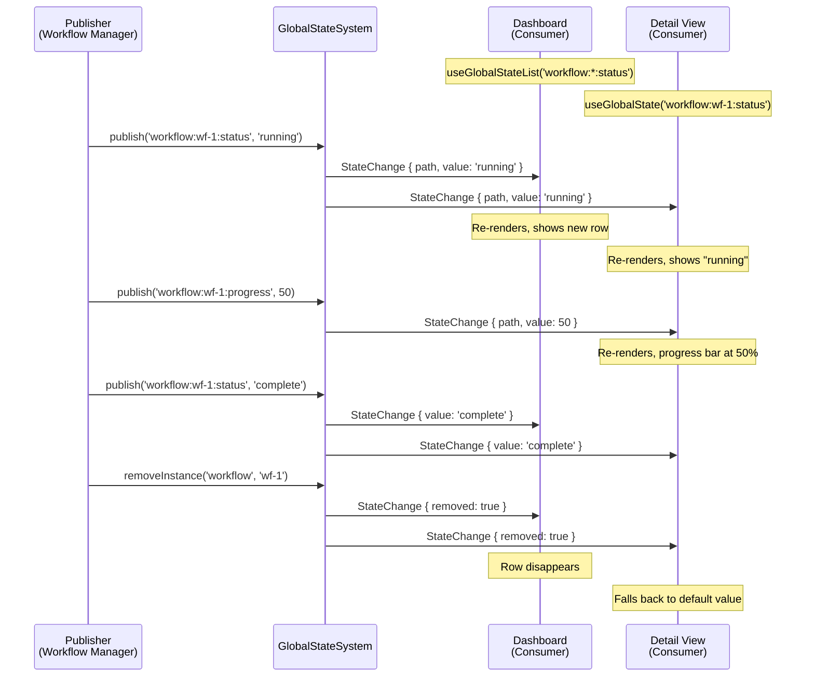

# Workshop: Developer Experience — Consuming & Publishing State

**Type**: Developer Experience / API Design
**Plan**: 053-global-state-system
**Spec**: (pre-spec — informing specification)
**Created**: 2026-02-26
**Status**: Draft
**Prerequisite**: [Workshop 001 — Hierarchical State Addressing](./001-hierarchical-state-addressing.md)

**Related Documents**:
- [Research Dossier](../research-dossier.md)
- [SDKProvider](../../../../apps/web/src/lib/sdk/sdk-provider.tsx) — SDK DX exemplar
- [useSDKSetting](../../../../apps/web/src/lib/sdk/use-sdk-setting.ts) — Hook DX exemplar
- [AgentInstance](../../../../packages/shared/src/features/019-agent-manager-refactor/agent-instance.ts) — Publisher DX exemplar

---

## Purpose

Define what it *feels like* to use GlobalStateSystem from both sides: **consuming state** (reading values, subscribing to changes, rendering in React) and **publishing state** (declaring domains, pushing values, managing instance lifecycles). Then articulate the system's **vibe** — how to explain it to engineers in 30 seconds.

---

## Part 1: The Vibe — Explaining It to Engineers

### The One-Liner

> **GlobalStateSystem is runtime settings.** Settings let domains publish configuration that other domains consume without coupling. GlobalStateSystem does the same thing, but for ephemeral runtime values that change during a session — workflow status, alert counts, active files.

### The Elevator Pitch

Imagine you're building a menu item that blinks when an agent needs attention. Today you'd have to:
1. Import agent types
2. Set up an SSE connection to the agents channel
3. Parse agent status events
4. Track which agents are "waiting"
5. Derive a boolean from that

With GlobalStateSystem, the agent domain *publishes* `worktree:alert-count` as a number. Your menu item just reads it:

```tsx
const alertCount = useGlobalState<number>('worktree:alert-count', 0);
return <MenuItem className={alertCount > 0 ? 'animate-pulse' : ''} />;
```

No agent imports. No SSE. No parsing. The agent domain is the *publisher*; your menu item is the *consumer*. They never know about each other.

### The Mental Model

Think of it as three things engineers already know:

| Concept | Analogy | What It Means Here |
|---------|---------|---------------------|
| **Pub/Sub** | Event bus | Domains publish state changes; consumers subscribe |
| **Key-Value Store** | `Map<string, any>` | State is always readable by path — not just events |
| **React Context** | `useContext()` | Hook gives you reactive values, re-renders on change |

**The key difference from events**: Events are fire-and-forget. You miss one, it's gone. State has a *current value* — you can always read it, even if you connected late. Changes are *also* events, so you get both: the current snapshot AND live updates.

### What It Is NOT

- **Not a database** — state is ephemeral, lives in memory, gone when you refresh
- **Not a replacement for SSE** — server events still arrive via SSE; publishers on the client translate them into state
- **Not a replacement for SDK settings** — settings are persisted, configured by users. State is runtime, set by code
- **Not a replacement for React state** — component-local state stays in `useState`. GlobalState is for *cross-domain* state that multiple unrelated components need

### When to Use GlobalStateSystem vs Other Things

| You want to... | Use |
|----------------|-----|
| Store a user preference (theme, font size) | SDK Settings (`useSDKSetting`) |
| Track a value that changes during runtime and multiple domains need | **GlobalStateSystem** (`useGlobalState`) |
| Send a one-off notification (toast, alert) | Events domain (`toast()`) |
| Manage component-local UI state (open/closed, hover) | React `useState` |
| Fetch data from the server | React Query / Server Components |

---

## Part 2: Consumer Developer Experience

### Reading a Single Value

The most common case. A component needs one piece of cross-domain state.

```tsx
import { useGlobalState } from '@/lib/state';

function WorkflowStatusBadge({ workflowId }: { workflowId: string }) {
  // Just like useSDKSetting, but for runtime state
  const status = useGlobalState<string>(`workflow:${workflowId}:status`, 'unknown');

  return <Badge variant={statusToVariant(status)}>{status}</Badge>;
}
```

**DX notes:**
- Same `[value]` return shape as `useSDKSetting` (but read-only — consumers don't set state)
- Generic `<T>` for type safety — no `as` casts needed
- Default value (`'unknown'`) returned when path doesn't exist yet
- Component re-renders when value changes, stays still when it doesn't
- No cleanup needed — hook handles subscribe/unsubscribe

### Reading All Instances

A dashboard that shows all running workflows, without knowing their IDs upfront.

```tsx
import { useGlobalStateList } from '@/lib/state';

function WorkflowDashboard() {
  // Pattern subscription: all workflow statuses
  const workflows = useGlobalStateList('workflow:*:status');

  if (workflows.length === 0) {
    return <EmptyState>No workflows running</EmptyState>;
  }

  return (
    <ul>
      {workflows.map(entry => {
        const id = entry.path.split(':')[1]; // extract instance ID from path
        return (
          <li key={id}>
            <WorkflowCard id={id} status={entry.value as string} />
          </li>
        );
      })}
    </ul>
  );
}
```

**DX notes:**
- `useGlobalStateList` returns `StateEntry[]` — array updates when any matching value changes
- New instances appear automatically (workflow starts → entry added)
- Removed instances disappear automatically (workflow cleaned up → entry gone)
- Pattern `workflow:*:status` reads as "every workflow's status"

### Subscribing Outside React

For non-React code (event handlers, services, imperative logic):

```typescript
import { getStateSystem } from '@/lib/state';

// In a command handler or service
function setupAlertWatcher() {
  const state = getStateSystem();

  const unsubscribe = state.subscribe('worktree:alert-count', (change) => {
    if ((change.value as number) > 0) {
      // Play notification sound, update favicon, etc.
      playNotificationSound();
    }
  });

  // Clean up when done
  return unsubscribe;
}
```

**DX notes:**
- Same subscribe/unsubscribe pattern as FileChangeHub and SDK settings
- Callback receives `StateChange` with `value`, `previousValue`, `path`
- Works anywhere — not tied to React lifecycle

### Reading Without Subscribing

For one-shot reads (e.g., in a command handler):

```typescript
const state = getStateSystem();

// Synchronous read — always returns current value
const activeFile = state.get<string>('worktree:active-file');
const workflowStatus = state.get<string>('workflow:wf-123:status');
const allWorkflows = state.listInstances('workflow');
```

**DX notes:**
- `get()` is synchronous, returns `undefined` if path doesn't exist
- No subscription, no re-render, just a read
- Useful in command handlers, event callbacks, or imperative logic

### Discovering Available State

When you don't know what state exists:

```typescript
const state = getStateSystem();

// What domains are registered?
const domains = state.listDomains();
// → [{ domain: 'worktree', description: 'Worktree-level runtime state', multiInstance: false, properties: [...] },
//    { domain: 'workflow', description: 'Workflow execution state', multiInstance: true, properties: [...] }]

// What instances of 'workflow' exist right now?
const instances = state.listInstances('workflow');
// → ['wf-build-pipeline', 'wf-deploy-staging']

// What's the full state of one instance?
const entries = state.list('workflow:wf-build-pipeline:*');
// → [{ path: 'workflow:wf-build-pipeline:status', value: 'running', updatedAt: 1740600000 },
//    { path: 'workflow:wf-build-pipeline:progress', value: 45, updatedAt: 1740600005 }]
```

**DX notes:**
- `listDomains()` is introspection — great for devtools and debugging
- `listInstances()` answers "what workflows are running right now?"
- `list()` with pattern gives all entries matching — useful for dashboards

### Consumer DX Summary

| Task | API | Returns |
|------|-----|---------|
| Read one value (React) | `useGlobalState<T>(path, default)` | `T` — re-renders on change |
| Read many values (React) | `useGlobalStateList(pattern)` | `StateEntry[]` — re-renders on any match change |
| Subscribe (imperative) | `state.subscribe(pattern, callback)` | `() => void` (unsubscribe) |
| Read once | `state.get<T>(path)` | `T | undefined` |
| List entries | `state.list(pattern)` | `StateEntry[]` |
| List instances | `state.listInstances(domain)` | `string[]` |
| List domains | `state.listDomains()` | `StateDomainDescriptor[]` |

---

## Part 3: Publisher Developer Experience

### The Publisher Mindset

Publishing state is like building a product API. You're saying: *"Here's what I know about the world, expressed in a simple contract that anyone can consume without understanding my internals."*

A publisher asks three questions:
1. **What domain am I?** (e.g., `workflow`, `worktree`)
2. **What properties do I expose?** (e.g., `status`, `progress`, `current-phase`)
3. **Am I a singleton or multi-instance?** (one worktree vs many workflows)

### Step 1: Register Your Domain

At bootstrap, declare what you publish. This is like `sdk.settings.contribute()` but for runtime state.

```typescript
// In your domain's registration function (called at app bootstrap)
// e.g., features/050-workflow-page-ux/state/register.ts

import type { IStateService } from '@/lib/state';

export function registerWorkflowState(state: IStateService): void {
  state.registerDomain({
    domain: 'workflow',
    description: 'Per-workflow execution state. One instance per running workflow.',
    multiInstance: true,
    properties: [
      { key: 'status',        description: 'Execution lifecycle',     typeHint: "'pending' | 'running' | 'complete' | 'failed'" },
      { key: 'current-phase', description: 'Active phase name',       typeHint: 'string | null' },
      { key: 'progress',      description: 'Completion percentage',   typeHint: 'number' },
      { key: 'started-at',    description: 'Execution start time',    typeHint: 'number | null' },
      { key: 'error-message', description: 'Error details if failed', typeHint: 'string | null' },
    ],
  });
}
```

**DX notes:**
- Domain registration is declarative — just data, no logic
- `properties` list is for documentation and introspection — not runtime validation
- `multiInstance: true` tells consumers to expect `workflow:*:status` patterns
- Registration happens once at bootstrap (like SDK settings contributions)
- Registering twice with the same domain name throws (fail-fast, like CommandRegistry)

### Step 2: Publish State Changes

When your domain's state changes, call `publish()`. That's it.

```typescript
// In your domain's service or event handler

function onWorkflowStarted(state: IStateService, graphSlug: string): void {
  state.publish(`workflow:${graphSlug}:status`, 'running');
  state.publish(`workflow:${graphSlug}:started-at`, Date.now());
  state.publish(`workflow:${graphSlug}:progress`, 0);
  state.publish(`workflow:${graphSlug}:current-phase`, null);
}

function onPhaseCompleted(state: IStateService, graphSlug: string, phaseName: string, progress: number): void {
  state.publish(`workflow:${graphSlug}:current-phase`, phaseName);
  state.publish(`workflow:${graphSlug}:progress`, progress);
}

function onWorkflowCompleted(state: IStateService, graphSlug: string): void {
  state.publish(`workflow:${graphSlug}:status`, 'complete');
  state.publish(`workflow:${graphSlug}:progress`, 100);
  state.publish(`workflow:${graphSlug}:current-phase`, null);
}
```

**DX notes:**
- `publish()` is synchronous — updates the internal store, then notifies subscribers
- Multiple `publish()` calls are fine — no transaction, no batching needed
- Each `publish()` triggers one subscriber notification per matching subscriber
- If value hasn't changed (same reference), subscribers are still notified (stateless dispatch — let consumers decide if they care)

### Step 3: Clean Up When Done

When an instance is destroyed, tell the state system. It removes all entries and notifies subscribers.

```typescript
function onWorkflowRemoved(state: IStateService, graphSlug: string): void {
  // One call removes all workflow:graphSlug:* entries
  state.removeInstance('workflow', graphSlug);
  // Subscribers receive StateChange with removed: true for each property
}
```

**DX notes:**
- Publisher is responsible for cleanup — the state system doesn't auto-expire
- `removeInstance()` is a convenience — removes all entries for `domain:instanceId:*`
- Subscribers get a final notification with `removed: true`
- After removal, `state.get('workflow:graphSlug:status')` returns `undefined`
- `state.listInstances('workflow')` no longer includes this ID

### Multi-Domain Publishing (Denormalized State)

Some publishers write to multiple state domains. This is intentional — it's a feature, not a code smell.

```typescript
// Workflow manager publishes both per-instance AND global aggregate state
function onWorkflowStarted(state: IStateService, graphSlug: string): void {
  // Per-instance state (consumed by workflow detail views)
  state.publish(`workflow:${graphSlug}:status`, 'running');
  state.publish(`workflow:${graphSlug}:started-at`, Date.now());

  // Global aggregate state (consumed by dashboard, menu badges)
  const runningCount = state.listInstances('workflow')
    .filter(id => state.get(`workflow:${id}:status`) === 'running')
    .length;
  state.publish('workflow-summary:active-count', runningCount);

  // Worktree-level alert state (consumed by left menu, totally decoupled)
  state.publish('worktree:alert-count',
    (state.get<number>('worktree:alert-count') ?? 0) + 1
  );
}
```

**Why this is good:**
- The left menu doesn't import anything from the workflow domain
- The dashboard reads `workflow-summary:active-count` — one number, no parsing
- Each consumer gets exactly the granularity it needs
- Publishers own the contract — they decide what to expose and how

---

## Part 4: The Instance ID System

### The Problem

Multiple things of the same type run simultaneously. Ten workflows, five agents, three file watchers. Each has its own state. Consumers need to:
- See ALL of them (dashboard)
- See ONE of them (detail view)
- React when ANY of them changes (alert badge)

### How IDs Work

Instance IDs are **opaque strings** — the state system doesn't interpret them. The publishing domain chooses meaningful IDs:

```typescript
// Workflows use their graph slug (already unique)
state.publish(`workflow:${graphSlug}:status`, 'running');
// → workflow:build-and-deploy:status

// Agents use their generated agent ID
state.publish(`agent:${agentId}:status`, 'working');
// → agent:agent-7f3a2b:status

// File watchers might use worktree path (hashed for safety)
state.publish(`watcher:${hashPath(worktreePath)}:file-count`, 42);
```

### Consumer Perspective

Consumers don't need to understand where IDs come from:

```tsx
function WorkflowList() {
  // "Give me the status of every workflow that exists"
  const statuses = useGlobalStateList('workflow:*:status');

  return statuses.map(entry => {
    // Extract instance ID from path: "workflow:build-and-deploy:status" → "build-and-deploy"
    const id = entry.path.split(':')[1];
    return <WorkflowRow key={id} id={id} status={entry.value as string} />;
  });
}

function SingleWorkflow({ id }: { id: string }) {
  // "Give me everything about this specific workflow"
  const status = useGlobalState<string>(`workflow:${id}:status`);
  const progress = useGlobalState<number>(`workflow:${id}:progress`, 0);
  const phase = useGlobalState<string | null>(`workflow:${id}:current-phase`);

  return (
    <div>
      <Badge>{status}</Badge>
      <ProgressBar value={progress} />
      {phase && <span>Phase: {phase}</span>}
    </div>
  );
}
```

### Instance Lifecycle



### ID Conventions (Suggested, Not Enforced)

| Domain | ID Source | Example |
|--------|----------|---------|
| `workflow` | Graph slug (from positional-graph) | `build-and-deploy` |
| `agent` | Generated agent ID | `agent-7f3a2b` |
| `worktree` | *(singleton — no instance ID)* | N/A |
| `workflow-summary` | *(singleton — no instance ID)* | N/A |

The state system validates that:
- IDs match `[a-zA-Z0-9_-]+`
- Multi-instance domains must have an instance ID in their paths
- Singleton domains must NOT have an instance ID

---

## Part 5: Wiring It All Together

### Bootstrap Flow

Following the proven SDKProvider + SDKWorkspaceConnector pattern:

```
App Startup
└─ Providers (components/providers.tsx)
   └─ SDKProvider ← SDK bootstrap (existing)
      └─ GlobalStateProvider ← State system bootstrap (new)
         └─ [children]
            └─ WorkspaceLayout
               └─ GlobalStateConnector ← Hydrate + register domain publishers (new)
               └─ [workspace pages]
```

### GlobalStateProvider

Mirrors SDKProvider pattern — create once, provide via context:

```tsx
// lib/state/state-provider.tsx
export function GlobalStateProvider({ children }: { children: React.ReactNode }) {
  const [stateSystem] = useState<IStateService>(() => {
    try {
      return createStateSystem();
    } catch (err) {
      console.error('[GlobalStateProvider] Bootstrap failed:', err);
      return createNoOpStateSystem(); // Graceful degradation
    }
  });

  return (
    <StateContext.Provider value={stateSystem}>
      {children}
    </StateContext.Provider>
  );
}

export function useStateSystem(): IStateService {
  const ctx = useContext(StateContext);
  if (!ctx) throw new Error('useStateSystem must be used within <GlobalStateProvider>');
  return ctx;
}
```

### GlobalStateConnector

Mirrors SDKWorkspaceConnector — invisible component that wires publishers:

```tsx
// lib/state/state-connector.tsx
export function GlobalStateConnector({ slug }: { slug: string }) {
  const state = useStateSystem();
  const sdk = useSDK();

  useEffect(() => {
    // Register domain descriptors
    registerWorktreeState(state);
    registerWorkflowState(state);

    // Wire SSE events to state publishers
    // (This is where server events get translated to client state)
    const cleanup = wireSSEToState(state, slug);

    return cleanup;
  }, [state, slug]);

  return null; // Invisible — only handles wiring
}
```

### Domain Registration Pattern

Each domain has a `state/register.ts` file (mirrors `sdk/register.ts`):

```
features/
  050-workflow-page-ux/
    state/
      register.ts          ← registerWorkflowState(stateSystem)
      workflow-publisher.ts ← functions that call stateSystem.publish()
  041-file-browser/
    state/
      register.ts          ← registerWorktreeState(stateSystem)
```

---

## Part 6: Side-by-Side Comparison with SDK Settings

Since the DX is modeled on SDK settings, here's the comparison:

### Consumer DX

| SDK Settings | GlobalStateSystem |
|-------------|-------------------|
| `const [theme, setTheme] = useSDKSetting<string>('ui.theme')` | `const status = useGlobalState<string>('workflow:wf-1:status')` |
| Read-write tuple `[value, setValue]` | Read-only value (consumers don't set state) |
| Auto-persists to server (debounced) | Ephemeral — lost on refresh |
| Flat keys: `'ui.theme'` | Hierarchical paths: `'workflow:wf-1:status'` |
| No pattern matching | Pattern matching: `'workflow:*:status'` |
| `sdk.settings.get(key)` | `state.get(path)` |
| `sdk.settings.onChange(key, cb)` | `state.subscribe(pattern, cb)` |

### Publisher DX

| SDK Settings | GlobalStateSystem |
|-------------|-------------------|
| `sdk.settings.contribute(setting)` | `state.registerDomain(descriptor)` |
| Schema-validated (`z.string()`) | Unvalidated (`typeHint` for docs only) |
| One value per key | Many instances per domain |
| No cleanup needed | `state.removeInstance()` for multi-instance |
| `sdk.settings.set(key, value)` | `state.publish(path, value)` |

### The Key Insight

SDK Settings says: *"Here's a value the USER configures."*
GlobalStateSystem says: *"Here's a value the SYSTEM produces at runtime."*

Both use the same subscription mechanics (onChange → useSyncExternalStore → React re-render). The difference is who writes and whether it persists.

---

## Part 7: Error Cases & Edge Conditions

### What happens when...

**...a consumer subscribes before any publisher has registered the domain?**
```tsx
const status = useGlobalState<string>('workflow:wf-1:status', 'unknown');
// Returns 'unknown' (default). When a publisher eventually publishes, re-renders with real value.
```
This is fine. Subscriptions are pattern matchers, not entity references.

**...a publisher publishes to an unregistered domain?**
```typescript
state.publish('mystery:abc:value', 42);
// Throws: "Unknown state domain 'mystery'. Call registerDomain() first."
```
Fail-fast. Prevents typos and undocumented state.

**...a subscriber throws an error?**
```typescript
state.subscribe('workflow:**', () => { throw new Error('boom'); });
// Error is caught, logged, other subscribers still receive the change.
```
Error isolation per PL-07. One bad subscriber never blocks others.

**...the same value is published twice?**
```typescript
state.publish('workflow:wf-1:progress', 50);
state.publish('workflow:wf-1:progress', 50);
// Subscribers are notified BOTH times. Consumers can use previousValue to skip no-ops.
```
The state system is stateless in dispatch — it stores and notifies. Consumers decide if they care.

**...a component unmounts while subscribed?**
```tsx
// useGlobalState uses useSyncExternalStore which handles cleanup automatically.
// The hook's useCallback returns the unsubscribe function to useSyncExternalStore.
```
React handles it — same as useSDKSetting.

---

## Part 8: Quick Reference Card

### For Consumers

```tsx
// ── Read one value (React) ──
const status = useGlobalState<string>('workflow:wf-1:status', 'unknown');

// ── Read all matching values (React) ──
const workflows = useGlobalStateList('workflow:*:status');

// ── Subscribe imperatively ──
const unsub = state.subscribe('worktree:alert-count', (change) => {
  console.log('Alerts:', change.value);
});

// ── Read once (no subscription) ──
const current = state.get<number>('worktree:alert-count');

// ── Discover what exists ──
const domains = state.listDomains();
const instances = state.listInstances('workflow');
```

### For Publishers

```typescript
// ── Register your domain (at bootstrap) ──
state.registerDomain({
  domain: 'workflow',
  description: 'Workflow execution state',
  multiInstance: true,
  properties: [
    { key: 'status', description: 'Lifecycle', typeHint: "'pending' | 'running' | 'complete'" },
  ],
});

// ── Publish state changes ──
state.publish(`workflow:${slug}:status`, 'running');
state.publish(`workflow:${slug}:progress`, 45);

// ── Clean up when done ──
state.removeInstance('workflow', slug);
```

### Pattern Cheatsheet

```
'workflow:wf-1:status'    →  Exact: one specific value
'workflow:*:status'       →  All instances, one property
'workflow:wf-1:*'         →  One instance, all properties  
'workflow:**'             →  Everything in domain
'*'                       →  Everything everywhere
```

---

## Open Questions

### Q1: Should consumers be able to write state?

**RESOLVED**: No. `useGlobalState` returns a value, not a tuple. Only publishers write state via `publish()`. This enforces clear ownership and prevents "who wrote this?" debugging nightmares.

If a consumer needs to trigger a state change, it should call a domain action (command, server action, or event) that the publisher reacts to. The state system is one-way: publisher → state → consumer.

### Q2: Should we provide a `useGlobalStateSelector` for derived values?

**DEFERRED**: For v1, consumers derive values themselves:
```tsx
const statuses = useGlobalStateList('workflow:*:status');
const runningCount = statuses.filter(e => e.value === 'running').length;
```
If this pattern becomes common, a selector hook could be added later.

### Q3: Should domain registration be required or optional?

**RESOLVED**: Required. Publishing to an unregistered domain throws. This prevents:
- Typos (`'worklfow:wf-1:status'` → error instead of silent black hole)
- Undocumented state (all domains are discoverable via `listDomains()`)
- Registration is cheap (one call at bootstrap) and makes the system self-documenting

### Q4: Should `publish()` skip notification if value hasn't changed?

**RESOLVED**: No. Always notify. Reasons:
- Checking equality requires deep comparison for objects/arrays (expensive, error-prone)
- Some subscribers care about "re-published" (e.g., heartbeat-like patterns)
- Consumers can check `change.previousValue` themselves if they want to skip no-ops
- `useSyncExternalStore` already handles this — if `getSnapshot()` returns the same reference, React doesn't re-render

### Q5: How do consumers know what domains/properties exist?

**RESOLVED**: Three mechanisms:
1. **TypeScript**: Type-safe path constants exported by each domain (`WORKFLOW_STATE.status(slug)`)
2. **Runtime**: `state.listDomains()` returns descriptors with property lists
3. **Documentation**: Domain docs list published state contracts (like SDK settings contributions)

---

## Appendix: Type-Safe Path Helpers (Optional Enhancement)

To avoid string manipulation and typos, domains can export path helpers:

```typescript
// features/050-workflow-page-ux/state/paths.ts
export const WORKFLOW_STATE = {
  status: (slug: string) => `workflow:${slug}:status` as const,
  progress: (slug: string) => `workflow:${slug}:progress` as const,
  currentPhase: (slug: string) => `workflow:${slug}:current-phase` as const,
  startedAt: (slug: string) => `workflow:${slug}:started-at` as const,
  /** Pattern: all instances, one property */
  allStatuses: 'workflow:*:status' as const,
  /** Pattern: everything in domain */
  all: 'workflow:**' as const,
} as const;

// Consumer usage:
const status = useGlobalState<string>(WORKFLOW_STATE.status('build-pipeline'), 'unknown');
const allStatuses = useGlobalStateList(WORKFLOW_STATE.allStatuses);
```

This is optional syntactic sugar — the string paths work fine without it. But for domains with many properties, it reduces typos and enables IDE autocomplete.
