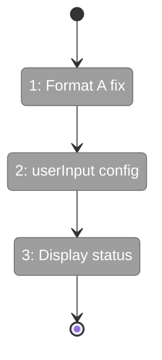
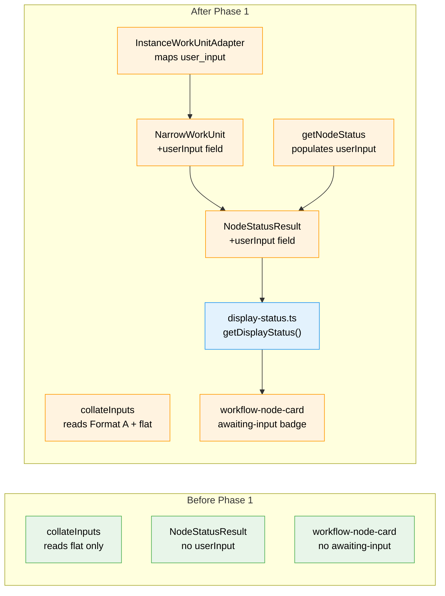

# Flight Plan: Phase 1 — NodeStatusResult + Display Status

**Plan**: [unified-human-input-plan.md](../../unified-human-input-plan.md)
**Phase**: Phase 1: NodeStatusResult + Display Status
**Generated**: 2026-02-27
**Status**: Ready for takeoff

---

## Departure → Destination

**Where we are**: User-input nodes exist in the workflow editor but are inert — they show as `pending` with no visual distinction and no way to interact. The `collateInputs` function silently fails to read data written by `saveOutputData` due to a Format A mismatch. `NodeStatusResult` exposes `unitType` but not the `user_input` configuration from unit.yaml.

**Where we're going**: After Phase 1, user-input nodes that are ready display with a violet "Awaiting Input" badge (matching the question treatment). The `NodeStatusResult` API includes the full `userInput` config (prompt, question type, options). `collateInputs` correctly reads both Format A and flat data. Phase 2 can build the modal and server action on this foundation.

---

## Domain Context

### Domains We're Changing

| Domain | What Changes | Key Files |
|--------|-------------|-----------|
| _platform/positional-graph | Fix collateInputs Format A, extend NarrowWorkUnit + NodeStatusResult with userInput, update adapter | `input-resolution.ts`, `positional-graph-service.interface.ts`, `positional-graph.service.ts`, `instance-workunit.adapter.ts` |
| workflow-ui | New display-status helper, add awaiting-input to node card | `display-status.ts` (new), `workflow-node-card.tsx` |

### Domains We Depend On (no changes)

| Domain | What We Consume | Contract |
|--------|----------------|----------|
| _platform/events | SSE broadcasts status changes | No changes — just renders updated status |

---

## Flight Status

<!-- Updated by /plan-6-v2: pending → active → done. Use blocked for problems/input needed. -->

**Legend**: grey = pending | yellow = active | red = blocked/needs input | green = done

---

## Stages

<!-- Updated by /plan-6-v2 during implementation: [ ] → [~] → [x] -->

- [ ] **Stage 1: Fix collateInputs Format A** — TDD test + one-line fix + update fixtures (`input-resolution.ts`, `collate-inputs.test.ts`)
- [ ] **Stage 2: Surface userInput config** — Extend NarrowWorkUnit + NodeStatusResult, update adapter, populate in getNodeStatus (`positional-graph-service.interface.ts`, `instance-workunit.adapter.ts`, `positional-graph.service.ts`)
- [ ] **Stage 3: Add awaiting-input display status** — Create display-status helper, add to STATUS_MAP + NodeStatus type, lightweight tests (`display-status.ts` — new, `workflow-node-card.tsx`)

---

## Architecture: Before & After

**Legend**: existing (green, unchanged) | changed (orange, modified) | new (blue, created)

---

## Acceptance Criteria

- [ ] AC-01: `user-input` + `pending` + `ready` → violet `?` badge, "Awaiting Input" label
- [ ] AC-02: `user-input` + `pending` + NOT `ready` → gray `pending` treatment
- [ ] AC-09: Downstream `from_node` input resolution sees data after Format A fix
- [ ] AC-15: Unit tests verify display status computation

---

## Goals & Non-Goals

**Goals**: Fix Format A data read, surface userInput config in API, add awaiting-input display status
**Non-Goals**: Modal UI, server action, click-to-open behavior, demo workflows

---

## Checklist

- [ ] T001: TDD: Write collateInputs Format A test
- [ ] T002: Fix collateInputs to read Format A
- [ ] T003: Update writeNodeData test helper to use Format A
- [ ] T004: TDD: Write NodeStatusResult userInput config test
- [ ] T005: Extend NarrowWorkUnit with optional userInput
- [ ] T006: Extend NodeStatusResult with optional userInput
- [ ] T007: Populate userInput in getNodeStatus() from loaded WorkUnit
- [ ] T008: Update InstanceWorkUnitAdapter to surface user_input config
- [ ] T009: Create display-status.ts helper
- [ ] T010: Add awaiting-input to NodeStatus type + STATUS_MAP
- [ ] T011: Lightweight tests for display status + STATUS_MAP
