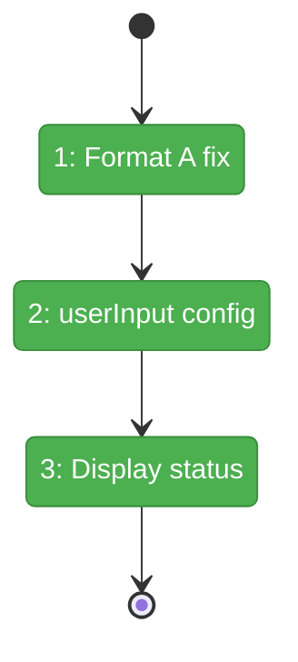
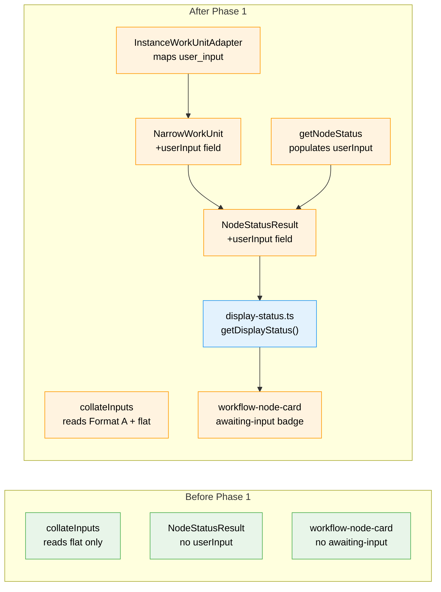

# Flight Plan: Phase 1 — NodeStatusResult + Display Status

**Plan**: [unified-human-input-plan.md](../../unified-human-input-plan.md)
**Phase**: Phase 1: NodeStatusResult + Display Status
**Generated**: 2026-02-27
**Status**: Landed

---

## Departure → Destination

**Where we are**: User-input nodes exist in the workflow editor but are inert — they show as `pending` with no visual distinction and no way to interact. The `collateInputs` function silently fails to read data written by `saveOutputData` due to a Format A mismatch. `NodeStatusResult` exposes `unitType` but not the `user_input` configuration from unit.yaml.

**Where we're going**: ~~After Phase 1~~ **DONE**: user-input nodes that are ready display with a violet "Awaiting Input" badge. `NodeStatusResult` API includes the full `userInput` config via discriminated union. `collateInputs` correctly reads both Format A and flat data.

---

## Domain Context

### Domains We're Changing

| Domain | What Changes | Key Files |
|--------|-------------|-----------|
| _platform/positional-graph | Fix collateInputs Format A, refactor NarrowWorkUnit + NodeStatusResult into discriminated unions, add type guards, update adapter + getNodeStatus | `input-resolution.ts`, `positional-graph-service.interface.ts`, `positional-graph.service.ts`, `instance-workunit.adapter.ts` |
| workflow-ui | New display-status helper, add awaiting-input to node card | `display-status.ts` (new), `workflow-node-card.tsx` |

### Domains We Depend On (no changes)

| Domain | What We Consume | Contract |
|--------|----------------|----------|
| _platform/events | SSE broadcasts status changes | No changes — just renders updated status |

---

## Flight Status

<!-- Updated by /plan-6-v2: pending → active → done. Use blocked for problems/input needed. -->

**Legend**: grey = pending | yellow = active | red = blocked/needs input | green = done

---

## Stages

<!-- Updated by /plan-6-v2 during implementation: [ ] → [~] → [x] -->

- [x] **Stage 1: Fix collateInputs Format A** — TDD test + one-line fix + update fixtures (`input-resolution.ts`, `collate-inputs.test.ts`)
- [x] **Stage 2: Discriminated type unions** — Refactor `NarrowWorkUnit` + `NodeStatusResult` into discriminated unions, add type guards, update adapter + getNodeStatus, update all test helpers/fixtures (`positional-graph-service.interface.ts`, `instance-workunit.adapter.ts`, `positional-graph.service.ts`, test files)
- [x] **Stage 3: Add awaiting-input display status** — Create display-status helper, add to STATUS_MAP + NodeStatus type, lightweight tests (`display-status.ts` — new, `workflow-node-card.tsx`)

---

## Architecture: Before & After

**Legend**: existing (green, unchanged) | changed (orange, modified) | new (blue, created)

---

## Acceptance Criteria

- [x] AC-01: `user-input` + `pending` + `ready` → violet `?` badge, "Awaiting Input" label
- [x] AC-02: `user-input` + `pending` + NOT `ready` → gray `pending` treatment
- [x] AC-09: Downstream `from_node` input resolution sees data after Format A fix
- [x] AC-15: Unit tests verify display status computation

---

## Goals & Non-Goals

**Goals**: Fix Format A data read, surface userInput config in API, add awaiting-input display status
**Non-Goals**: Modal UI, server action, click-to-open behavior, demo workflows

---

## Checklist

- [x] T001: TDD: Write collateInputs Format A test
- [x] T002: Fix collateInputs to read Format A
- [x] T003: Update writeNodeData test helper to use Format A
- [x] T004: TDD: Write discriminated NodeStatusResult userInput test
- [x] T005: Refactor NarrowWorkUnit into discriminated union
- [x] T006: Refactor NodeStatusResult into discriminated union
- [x] T007: Add type guard functions
- [x] T008: Update InstanceWorkUnitAdapter to construct correct variant
- [x] T009: Populate userInput in getNodeStatus() — build correct variant
- [x] T010: Update test helpers for discriminated variants
- [x] T011: Update inline NarrowWorkUnit literals in test files
- [x] T012: Update web test helpers (makeNode, makeNodeStatus)
- [x] T013: Create display-status.ts helper
- [x] T014: Add awaiting-input to NodeStatus type + STATUS_MAP
- [x] T015: Lightweight tests for display status + STATUS_MAP
