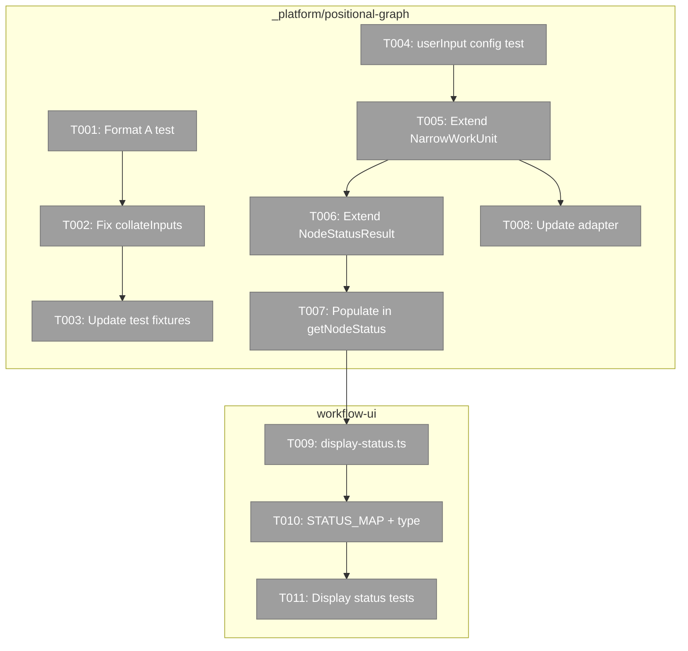
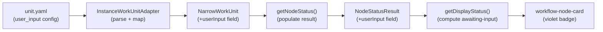
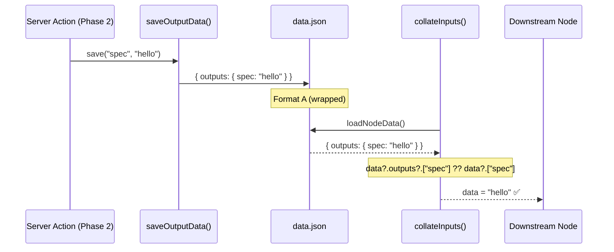

# Phase 1: NodeStatusResult + Display Status — Tasks

**Plan**: [unified-human-input-plan.md](../../unified-human-input-plan.md)
**Phase**: Phase 1: NodeStatusResult + Display Status
**Generated**: 2026-02-27
**Status**: Ready

---

## Executive Briefing

**Purpose**: Make user-input node configuration visible to the UI and fix the critical data format mismatch that prevents downstream input resolution. This phase is entirely foundational — no modals, no server actions, just plumbing.

**What We're Building**: Three things: (1) fix `collateInputs` to read Format A data written by `saveOutputData`, (2) extend `NodeStatusResult` + `NarrowWorkUnit` to surface `user_input` config from unit.yaml, and (3) add an `awaiting-input` computed display status to the node card so users can see which nodes need human input.

**Goals**:
- ✅ `collateInputs` reads both Format A (`{ outputs: { name: value } }`) and flat (`{ name: value }`) — backward compatible
- ✅ `NodeStatusResult.userInput` surfaces prompt, questionType, options, default from unit.yaml
- ✅ `awaiting-input` display status computed when `unitType === 'user-input'` + `pending` + `ready`
- ✅ Node card shows violet `?` badge for `awaiting-input` nodes
- ✅ TDD for service-layer changes, lightweight tests for UI helpers

**Non-Goals**:
- ❌ No modal — that's Phase 2
- ❌ No server action — that's Phase 2
- ❌ No click-to-open behavior — that's Phase 2 wiring
- ❌ No demo workflows — that's Phase 3

---

## Prior Phase Context

_Phase 1 — no prior phases to review._

---

## Pre-Implementation Check

| File | Exists? | Domain Check | Notes |
|------|---------|-------------|-------|
| `packages/positional-graph/src/services/input-resolution.ts` | ✅ Yes | _platform/positional-graph ✅ | Modify line 352: `data?.[fromOutput]` → `data?.outputs?.[fromOutput] ?? data?.[fromOutput]` |
| `packages/positional-graph/src/interfaces/positional-graph-service.interface.ts` | ✅ Yes | _platform/positional-graph ✅ | Extend `NarrowWorkUnit` (line 49) + `NodeStatusResult` (line 244) |
| `packages/positional-graph/src/services/positional-graph.service.ts` | ✅ Yes | _platform/positional-graph ✅ | Populate `userInput` in `getNodeStatus()` at ~line 1115 |
| `packages/positional-graph/src/adapter/instance-workunit.adapter.ts` | ✅ Yes | _platform/positional-graph ✅ | Extend YAML parse type + map `user_input` → `userInput` (line 68) |
| `apps/web/src/features/050-workflow-page/lib/display-status.ts` | ❌ NEW | workflow-ui ✅ | Create in existing `lib/` dir (has 4 files already) |
| `apps/web/src/features/050-workflow-page/components/workflow-node-card.tsx` | ✅ Yes | workflow-ui ✅ | Add `awaiting-input` to `NodeStatus` type (line 18) + `STATUS_MAP` (line 37) |
| `test/unit/positional-graph/collate-inputs.test.ts` | ✅ Yes | test ✅ | Add Format A test, update `writeNodeData` fixtures |
| `test/unit/positional-graph/input-retrieval.test.ts` | ✅ Yes | test ✅ | Already uses Format A in some tests — verify compatibility |

**Concept duplication check**: `awaiting-input` display status is a new concept not present anywhere in the codebase except Plan 054 docs. `display-status.ts` helper pattern matches existing `lib/` utilities (`compute-available-sources.ts`, `context-badge.ts`). No duplication risk.

---

## Architecture Map

---

## Tasks

| Status | ID | Task | Domain | Path(s) | Done When | Notes |
|--------|-----|------|--------|---------|-----------|-------|
| [ ] | T001 | TDD: Write collateInputs Format A test | _platform/positional-graph | `/test/unit/positional-graph/collate-inputs.test.ts` | Test: `writeNodeData` with `{ outputs: { spec: { type: 'data', dataType: 'text', value: 'hello' } } }` (Format A), `collateInputs` resolves `spec` output with correct data. Test FAILS before fix. | Per F01. Use existing `writeNodeData` helper. Add test in T004/T006 describe block. |
| [ ] | T002 | Fix `collateInputs` to read Format A | _platform/positional-graph | `/packages/positional-graph/src/services/input-resolution.ts` | Line 352: `data?.[fromOutput]` → `data?.outputs?.[fromOutput] ?? data?.[fromOutput]`. Test from T001 passes. All existing tests still pass. | One-line fix. Fallback preserves flat format backward compat. |
| [ ] | T003 | Update `writeNodeData` test helper to use Format A | _platform/positional-graph | `/test/unit/positional-graph/collate-inputs.test.ts` | `writeNodeData` wraps data as `{ outputs: { ...data } }`. All existing tests pass with wrapped format. | Standardize on Format A going forward. Flat fallback in T002 means no breakage. |
| [ ] | T004 | TDD: Write NodeStatusResult userInput config test | _platform/positional-graph | `/test/unit/positional-graph/` (new or existing node-status test file) | Test: `getNodeStatus()` for a `user-input` unit returns `userInput: { prompt, questionType, options?, defaultValue? }`. Agent/code units return `userInput: undefined`. Test FAILS before implementation. | Test-first per Hybrid TDD. Needs a user-input unit.yaml fixture. |
| [ ] | T005 | Extend `NarrowWorkUnit` with optional `userInput` | _platform/positional-graph | `/packages/positional-graph/src/interfaces/positional-graph-service.interface.ts` | `NarrowWorkUnit` gains `userInput?: { prompt: string; questionType: 'text' \| 'single' \| 'multi' \| 'confirm'; options?: { key: string; label: string; description?: string }[]; default?: string \| boolean }`. Existing code compiles (field is optional). | Interface-only change. Line 49. |
| [ ] | T006 | Extend `NodeStatusResult` with optional `userInput` | _platform/positional-graph | `/packages/positional-graph/src/interfaces/positional-graph-service.interface.ts` | `NodeStatusResult` gains `userInput?: NarrowWorkUnit['userInput']`. Existing code compiles. | Uses same type from T005 via lookup. Line 244. |
| [ ] | T007 | Populate `userInput` in `getNodeStatus()` from loaded WorkUnit | _platform/positional-graph | `/packages/positional-graph/src/services/positional-graph.service.ts` | When `unitResult.unit?.userInput` exists, include in returned `NodeStatusResult`. Test from T004 passes end-to-end. | ~Line 1115 in the return object. Only populated for user-input units. |
| [ ] | T008 | Update `InstanceWorkUnitAdapter` to surface `user_input` config | _platform/positional-graph | `/packages/positional-graph/src/adapter/instance-workunit.adapter.ts` | Adapter YAML parse type includes `user_input?`. When `type === 'user-input'`, maps `unitDef.user_input` → `unit.userInput`. Build passes. | Line 46-73. Extend generic type param + add conditional mapping. |
| [ ] | T009 | Create `display-status.ts` helper | workflow-ui | `/apps/web/src/features/050-workflow-page/lib/display-status.ts` | `getDisplayStatus(unitType, status, ready)` returns `'awaiting-input'` when `unitType === 'user-input' && status === 'pending' && ready === true`. Returns original status otherwise. Exported function. | New file in existing `lib/` dir. Pure function, no side effects. |
| [ ] | T010 | Add `awaiting-input` to `NodeStatus` type + `STATUS_MAP` | workflow-ui | `/apps/web/src/features/050-workflow-page/components/workflow-node-card.tsx` | `NodeStatus` union type includes `'awaiting-input'`. `STATUS_MAP['awaiting-input']` = violet treatment matching `waiting-question` (`#8B5CF6`, violet tailwind classes, `?` icon, "Awaiting Input" label). Build passes. | Lines 18-26 (type) + lines 37-88 (map). |
| [ ] | T011 | Lightweight tests for display status + STATUS_MAP | workflow-ui | `/test/unit/` (new display-status test file) | Tests: (1) `user-input` + `pending` + `ready` → `awaiting-input`. (2) `user-input` + `pending` + NOT ready → `pending`. (3) `agent` + `pending` + `ready` → unchanged. (4) `STATUS_MAP` has `awaiting-input` entry. All pass. | AC-15. Pure function tests — no mocks needed. |

---

## Context Brief

### Key findings from plan

- **F01 (Critical)**: `saveOutputData()` writes `{ outputs: { name: value } }` but `collateInputs()` reads `data[name]` (flat). Tasks T001-T003 fix this with a one-line fallback + fixture update.
- **F02 (High)**: Node lifecycle requires explicit `raiseNodeEvent('node:accepted')` to transition to `agent-accepted`. Relevant to Phase 2 server action — no direct impact on Phase 1.
- **F03 (High)**: `NodeStatusResult` has no `userInput` config. Tasks T004-T008 fix this by extending interface, adapter, and service.
- **F04 (Medium)**: Orchestration safety confirmed — 4 layers prevent interference with user-input nodes. No changes needed.

### Domain dependencies

- `_platform/positional-graph`: `IPositionalGraphService.getNodeStatus()` — the API we extend with `userInput`
- `_platform/positional-graph`: `collateInputs()` in `input-resolution.ts` — the function we fix for Format A
- `_platform/positional-graph`: `NarrowWorkUnit` interface — the contract we extend with `userInput`
- `_platform/positional-graph`: `InstanceWorkUnitAdapter` — maps unit.yaml → `NarrowWorkUnit`

### Domain constraints

- `NarrowWorkUnit` is a narrow interface to avoid cross-package dependency on `@chainglass/workgraph` (per DYK-P4-I2). Extension must keep it narrow — add optional `userInput` field only, not the full `WorkUnit` type.
- `display-status.ts` is a pure function — no server imports, no service dependencies. It computes display status from primitive inputs.
- `workflow-node-card.tsx` `NodeStatus` type and `STATUS_MAP` must stay in sync.

### Reusable from prior phases

- `writeNodeData` helper in `collate-inputs.test.ts` (line 51) — reuse for Format A test
- `writeState` helper in same file — reuse for setting node status
- FakeFileSystem / FakePathResolver from `@chainglass/shared` — already used in all positional-graph tests
- Existing user-input unit fixtures in `test/unit/positional-graph/` — may exist from Plan 029 agentic work units

### System state flow

### Data format fix flow

---

## Discoveries & Learnings

_Populated during implementation by plan-6._

| Date | Task | Type | Discovery | Resolution | References |
|------|------|------|-----------|------------|------------|

