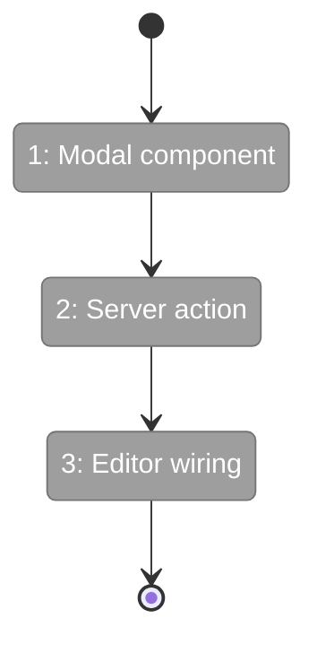
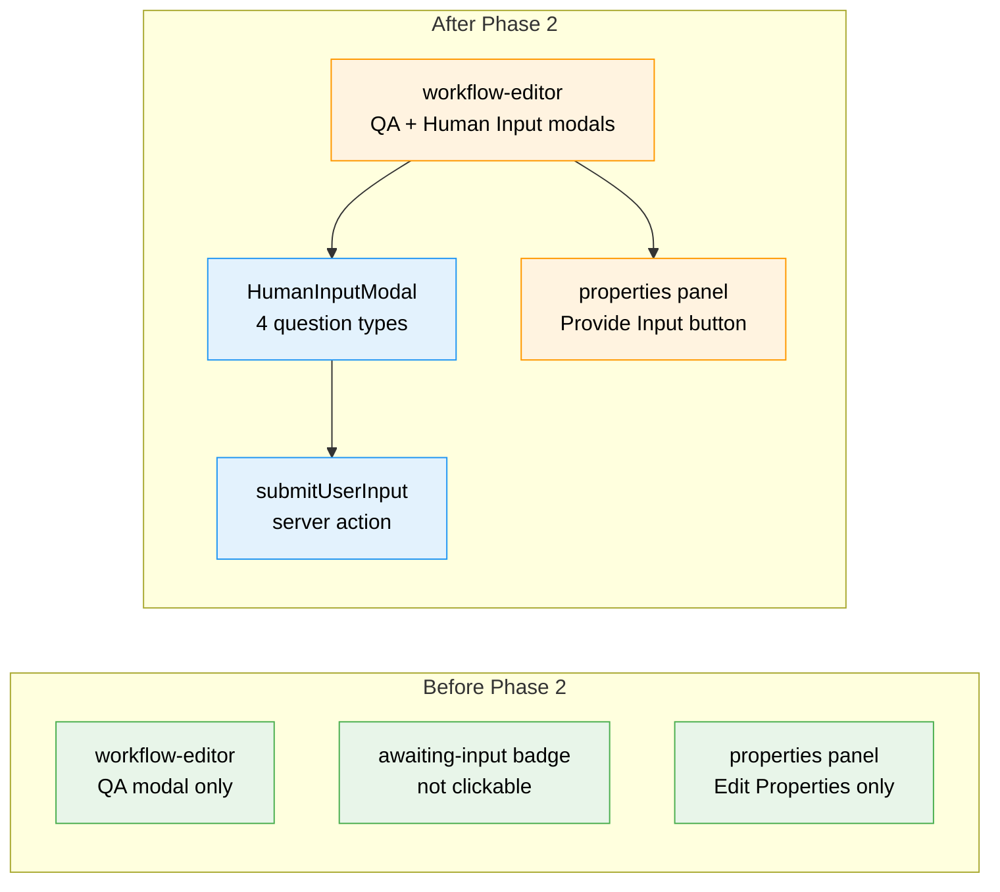

# Flight Plan: Phase 2 — Human Input Modal + Server Action

**Plan**: [unified-human-input-plan.md](../../unified-human-input-plan.md)
**Phase**: Phase 2: Human Input Modal + Server Action
**Generated**: 2026-02-27
**Status**: Ready for takeoff

---

## Departure → Destination

**Where we are**: Phase 1 delivered the plumbing — `awaiting-input` badge renders on ready user-input nodes, `NodeStatusResult` carries `userInput` config via discriminated union, `collateInputs` reads Format A data. But clicking the badge does nothing — there's no modal and no way to submit data.

**Where we're going**: After Phase 2, clicking an `awaiting-input` node opens a Human Input modal showing the question from unit.yaml. The user types their answer, clicks Submit, and the node walks the full lifecycle (startNode → accept → saveOutputData → endNode) to `complete`. Downstream nodes see the output as available.

---

## Domain Context

### Domains We're Changing

| Domain | What Changes | Key Files |
|--------|-------------|-----------|
| workflow-ui | New HumanInputModal component, submitUserInput server action, editor modal wiring, properties panel button | `human-input-modal.tsx` (new), `workflow-actions.ts`, `workflow-editor.tsx`, `node-properties-panel.tsx` |

### Domains We Depend On (no changes)

| Domain | What We Consume | Contract |
|--------|----------------|----------|
| _platform/positional-graph | startNode, raiseNodeEvent, saveOutputData, endNode | IPositionalGraphService lifecycle methods |
| _platform/positional-graph | UserInputNodeStatus.userInput | Discriminated union from Phase 1 |
| _platform/events | SSE status broadcasts | Auto-refresh after lifecycle changes |

---

## Flight Status

**Legend**: grey = pending | yellow = active | red = blocked/needs input | green = done

---

## Stages

- [ ] **Stage 1: Build HumanInputModal** — 4 question types + freeform + header (`human-input-modal.tsx` — new)
- [ ] **Stage 2: TDD lifecycle + server action** — Test lifecycle walkthrough, create `submitUserInput` (`workflow-actions.ts`)
- [ ] **Stage 3: Wire editor + properties panel** — Modal routing, onSubmit, properties panel button (`workflow-editor.tsx`, `node-properties-panel.tsx`)

---

## Architecture: Before & After

---

## Acceptance Criteria

- [ ] AC-03: Click awaiting-input node → Human Input modal with unit.yaml config
- [ ] AC-04: Modal header: "Human Input" with unit slug + type icon
- [ ] AC-05: All 4 question types render from unit.yaml
- [ ] AC-06: Freeform textarea appears for user-input nodes
- [ ] AC-07: Submit writes via saveOutputData through IPositionalGraphService
- [ ] AC-08: After submission, node → complete via full lifecycle
- [ ] AC-10: Freeform notes preserved in _metadata.freeform_notes
- [ ] AC-12: Cancel/Escape → no data change, no status change

---

## Goals & Non-Goals

**Goals**: Interactive modal, server action lifecycle, editor wiring, properties panel button
**Non-Goals**: Re-submission, auto-open, demo workflows, QAModal changes

---

## Checklist

- [ ] T001: Create HumanInputModal with 4 question types
- [ ] T002: Modal header with slug + icon
- [ ] T003: TDD: Write submitUserInput lifecycle test
- [ ] T004: Create submitUserInput server action
- [ ] T005: Wire modal to workflow-editor.tsx
- [ ] T006: Wire onSubmit to server action + refresh
- [ ] T007: Properties panel "Provide Input..." button
- [ ] T008: Lightweight rendering tests
