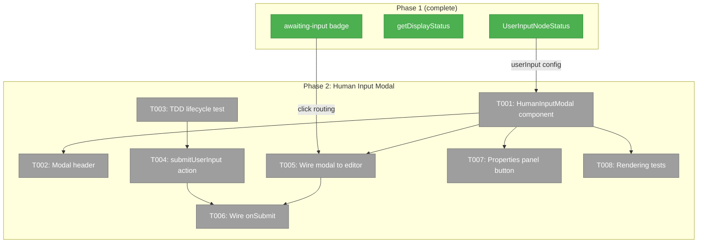
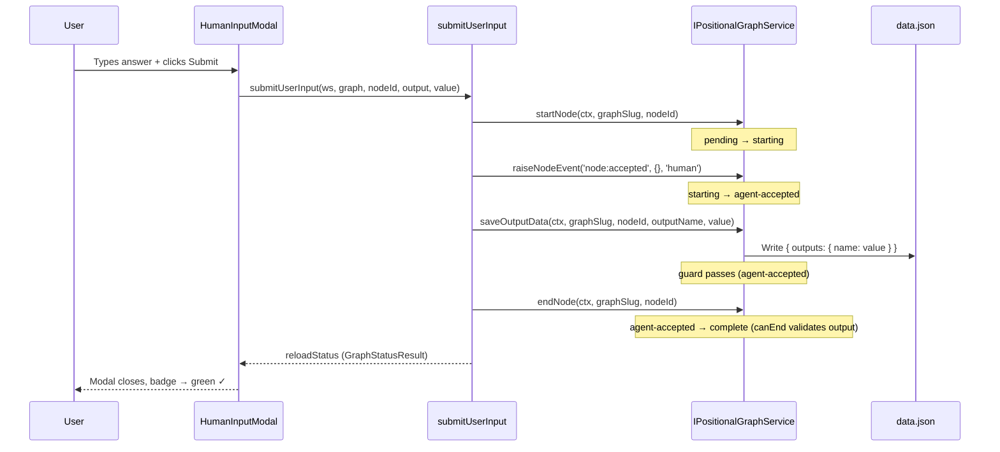

# Phase 2: Human Input Modal + Server Action — Tasks

**Plan**: [unified-human-input-plan.md](../../unified-human-input-plan.md)
**Phase**: Phase 2: Human Input Modal + Server Action
**Generated**: 2026-02-27
**Status**: Ready

---

## Executive Briefing

**Purpose**: Build the interactive modal that lets users provide input to `user-input` nodes, and the server action that walks the lifecycle to complete the node. After Phase 2, clicking an `awaiting-input` node opens a modal, the user types their answer, hits Submit, and the node transitions to `complete`.

**What We're Building**: (1) A `HumanInputModal` component rendering all 4 question types + freeform textarea, (2) a `submitUserInput` server action that calls `startNode → accept → saveOutputData → endNode`, (3) wiring in the workflow editor to open the modal for `awaiting-input` nodes, and (4) a "Provide Input..." button in the properties panel.

**Goals**:
- ✅ HumanInputModal renders all 4 question types (text, single, multi, confirm) from `UserInputNodeStatus.userInput`
- ✅ Always-on freeform textarea below the structured input
- ✅ `submitUserInput` server action walks the full lifecycle through `IPositionalGraphService`
- ✅ Clicking an `awaiting-input` node opens the modal; `waiting-question` still opens QAModal
- ✅ After submission, node transitions to `complete` and status refreshes via SSE

**Non-Goals**:
- ❌ No re-submission / edit after complete — deferred
- ❌ No auto-open when node becomes ready — user clicks to engage
- ❌ No demo workflows — that's Phase 3
- ❌ No changes to the deprecated QAModal

---

## Prior Phase Context

### Phase 1: NodeStatusResult + Display Status

**A. Deliverables**:
- `packages/positional-graph/src/interfaces/positional-graph-service.interface.ts` — Discriminated unions (`NarrowWorkUnit`, `NodeStatusResult`) with `UserInputNodeStatus` carrying `userInput` config
- `packages/positional-graph/src/services/input-resolution.ts` — Format A fallback fix
- `packages/positional-graph/src/adapter/instance-workunit.adapter.ts` — Constructs `NarrowUserInputWorkUnit` with fail-fast on malformed config
- `apps/web/src/features/050-workflow-page/lib/display-status.ts` — `getDisplayStatus()` computing `awaiting-input`
- `apps/web/src/features/050-workflow-page/components/workflow-node-card.tsx` — `awaiting-input` in `NodeStatus` type + `STATUS_MAP` + wired via `getDisplayStatus` in `nodeStatusToCardProps`

**B. Dependencies Exported**:
- `UserInputNodeStatus.userInput: { prompt, questionType, options?, default? }` — the modal reads this
- `isUserInputNodeStatus(node)` type guard — narrow to access `userInput`
- `getDisplayStatus(unitType, status, ready)` — returns `'awaiting-input'` for ready user-input nodes
- `NodeStatus` type includes `'awaiting-input'`

**C. Gotchas & Debt**:
- `awaiting-input` is UI-only — never in state.json. The modal must use `node.unitType === 'user-input'` checks, not `node.status === 'awaiting-input'`
- Type annotation needed in collateInputs fix due to discriminated union strictness
- Structural typing means test objects without `userInput` silently satisfy `NarrowAgentWorkUnit`

**D. Incomplete Items**: None — all 15 tasks complete.

**E. Patterns to Follow**:
- Discriminated union narrowing: `if (node.unitType === 'user-input') { node.userInput.prompt }`
- Server action pattern from `answerQuestion`: resolve context → resolve service → call methods → check errors → `reloadStatus()`
- QAModal wiring pattern: state variable `[modalNodeId, setModalNodeId]` + render block finding node from `graphStatus`
- Pure functions for computed display states

---

## Pre-Implementation Check

| File | Exists? | Domain Check | Notes |
|------|---------|-------------|-------|
| `apps/web/src/features/050-workflow-page/components/human-input-modal.tsx` | ❌ NEW | workflow-ui ✅ | Create alongside `qa-modal.tsx` in same directory |
| `apps/web/app/actions/workflow-actions.ts` | ✅ Yes | workflow-ui ✅ | Add `submitUserInput` after existing actions (~line 536) |
| `apps/web/src/features/050-workflow-page/components/workflow-editor.tsx` | ✅ Yes | workflow-ui ✅ | Add state + render block mirroring QA modal pattern |
| `apps/web/src/features/050-workflow-page/components/node-properties-panel.tsx` | ✅ Yes | workflow-ui ✅ | Add conditional button for user-input nodes |

**Concept duplication check**: `HumanInputModal` is intentionally separate from `QAModal` — the QAModal is deprecated territory (serves pre-baked dope questions). No duplication concern.

---

## Architecture Map

---

## Tasks

| Status | ID | Task | Domain | Path(s) | Done When | Notes |
|--------|-----|------|--------|---------|-----------|-------|
| [ ] | T001 | Create `HumanInputModal` component with 4 question types | workflow-ui | `apps/web/src/features/050-workflow-page/components/human-input-modal.tsx` | Modal renders: text input, single-choice radio, multi-choice checkboxes, confirm yes/no. Each sourced from `userInput.questionType`. Freeform textarea always visible below. Submit + Cancel buttons. `'use client'` component. | AC-05, AC-06. Reference `qa-modal.tsx` for question type rendering pattern. |
| [ ] | T002 | Modal header: "Human Input" + unit slug + type icon | workflow-ui | `apps/web/src/features/050-workflow-page/components/human-input-modal.tsx` | Header shows "Human Input", unit slug text, and user-input icon (👤). Per Workshop 007 visual design. | AC-04. |
| [ ] | T003 | TDD: Write submitUserInput lifecycle test | _platform/positional-graph | `test/unit/positional-graph/` (new or existing lifecycle test) | Test: For a user-input unit, `startNode` → `raiseNodeEvent('node:accepted', {}, 'human')` → `saveOutputData(nodeId, outputName, value)` → `endNode` succeeds. Node transitions pending → starting → agent-accepted → complete. Real filesystem fixture. Test FAILS before action exists. | Test-first per Hybrid TDD. Exercises the real service — NOT the server action wrapper. |
| [ ] | T004 | Create `submitUserInput` server action | workflow-ui | `apps/web/app/actions/workflow-actions.ts` | Action calls: `startNode(ctx, graphSlug, nodeId)` → `raiseNodeEvent(ctx, graphSlug, nodeId, 'node:accepted', {}, 'human')` → `saveOutputData(ctx, graphSlug, nodeId, outputName, value)` → `endNode(ctx, graphSlug, nodeId)`. Returns `reloadStatus()`. Checks errors at each step. Uses `IPositionalGraphService` only. | AC-07, AC-08. Follow `answerQuestion` pattern: resolve ctx → resolve svc → call methods → check errors → reload. |
| [ ] | T005 | Wire modal to `workflow-editor.tsx` | workflow-ui | `apps/web/src/features/050-workflow-page/components/workflow-editor.tsx` | Add `humanInputModalNodeId` state. `awaiting-input` nodes fire `onInputClick` → `setHumanInputModalNodeId`. Render `HumanInputModal` when state is set. `waiting-question` continues to open `QAModal` (separate code paths). | AC-03. Mirror QA modal pattern: state variable + render block finding node from graphStatus. |
| [ ] | T006 | Wire modal onSubmit to server action + status refresh | workflow-ui | `apps/web/src/features/050-workflow-page/components/workflow-editor.tsx` | Modal `onSubmit` calls `submitUserInput`, updates `graphStatus` from response, closes modal. Error handling: display toast on failure. | AC-07, AC-08. |
| [ ] | T007 | Update `node-properties-panel.tsx`: "Provide Input..." button | workflow-ui | `apps/web/src/features/050-workflow-page/components/node-properties-panel.tsx` | When `unitType === 'user-input'` and node is `awaiting-input`, show "Provide Input..." button instead of or alongside "Edit Properties...". Button triggers modal open callback. | Props panel at ~line 247. Conditional on unitType. |
| [ ] | T008 | Lightweight rendering tests for modal + action | workflow-ui | `test/unit/web/features/050-workflow-page/human-input-modal.test.tsx` | Tests: (1) text type renders input field, (2) single type renders radio buttons, (3) multi type renders checkboxes, (4) confirm type renders yes/no, (5) freeform textarea always visible, (6) cancel closes without data change. | AC-05, AC-12. Lightweight — no server action calls in these tests. |

---

## Context Brief

### Key findings from plan

- **F01 (Critical)**: Format A mismatch — **FIXED in Phase 1**. `collateInputs` now reads `data?.outputs?.[name] ?? data?.[name]`.
- **F02 (High)**: Lifecycle requires `raiseNodeEvent('node:accepted')` after `startNode` to transition starting → agent-accepted. The `saveOutputData` guard passes only when node is `agent-accepted`. **This is the critical sequencing for T004.**
- **F03 (High)**: `NodeStatusResult` now carries `userInput` via discriminated union — **DONE in Phase 1**. Modal reads from `node.userInput`.

### Domain dependencies

- `_platform/positional-graph`: `IPositionalGraphService.startNode()` — initiates lifecycle
- `_platform/positional-graph`: `IPositionalGraphService.raiseNodeEvent()` — transitions to agent-accepted
- `_platform/positional-graph`: `IPositionalGraphService.saveOutputData()` — writes output to data.json (Format A)
- `_platform/positional-graph`: `IPositionalGraphService.endNode()` — completes node (canEnd validates output exists)
- `_platform/positional-graph`: `UserInputNodeStatus.userInput` — modal reads prompt, questionType, options, default
- `_platform/events`: SSE broadcasts — status refreshes automatically after lifecycle changes

### Domain constraints

- Server action uses `IPositionalGraphService` ONLY — no direct `IFileSystem` writes. Clean architecture preserved.
- `HumanInputModal` is a `'use client'` component — it cannot import server-only modules.
- The modal does NOT modify `qa-modal.tsx` — separate code paths for deprecated Q&A vs new human input.

### Reusable from Phase 1

- `isUserInputNodeStatus(node)` type guard for narrowing in the editor
- `getDisplayStatus()` already wired in `nodeStatusToCardProps` — editor receives `awaiting-input` as status
- `nodeStatusToCardProps` pattern for mapping status to card props
- QAModal wiring pattern in workflow-editor.tsx: state + render block + close handler

### Server action lifecycle flow

### Modal question type rendering

```mermaid
flowchart TD
    QT["questionType"] --> T["text → <textarea>"]
    QT --> S["single → radio buttons from options[]"]
    QT --> M["multi → checkboxes from options[]"]
    QT --> C["confirm → Yes/No buttons"]
    ALL["Always: freeform <textarea> below"]
```

---

## Discoveries & Learnings

_Populated during implementation by plan-6._

| Date | Task | Type | Discovery | Resolution | References |
|------|------|------|-----------|------------|------------|

