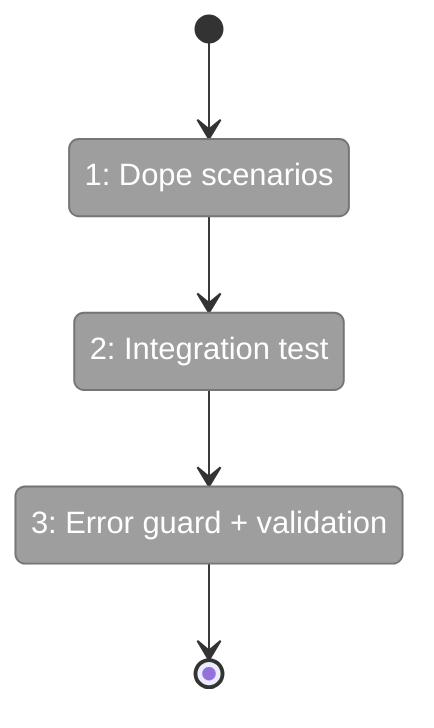
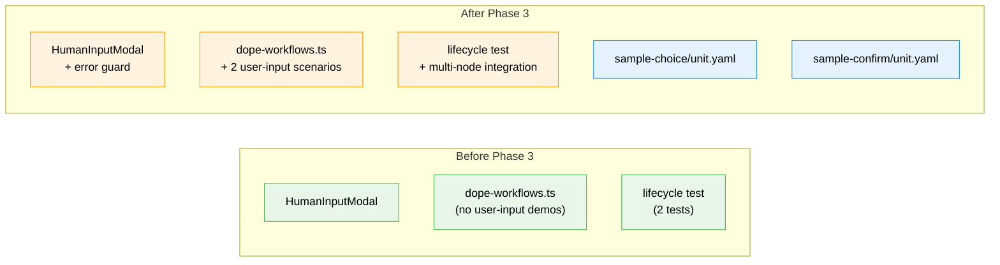

# Flight Plan: Phase 3 — Demo + Integration + Cleanup

**Plan**: [unified-human-input-plan.md](../../unified-human-input-plan.md)
**Phase**: Phase 3: Demo + Integration + Cleanup
**Generated**: 2026-02-28
**Status**: Ready for takeoff

---

## Departure → Destination

**Where we are**: Phases 1-2 are complete. User-input nodes display `awaiting-input` badges, the HumanInputModal works with all 4 input types + freeform + pre-fill + re-edit. The `submitUserInput` server action walks the full lifecycle. Everything is browser-verified. But `just dope` has no user-input demo workflows, there's no integration test proving downstream gates open, and malformed units have no UI error guard.

**Where we're going**: A developer runs `just dope` and sees user-input nodes ready for interaction, demonstrating both single-node and multi-node composition. The test suite proves end-to-end data flow. Malformed configs get a clear error message. All 16 ACs pass.

---

## Domain Context

### Domains We're Changing

| Domain | What Changes | Key Files |
|--------|-------------|-----------|
| workflow-ui | Add 2 dope scenarios, error guard in modal/editor | `scripts/dope-workflows.ts`, `human-input-modal.tsx`, `workflow-editor.tsx` |
| test | Add integration test for multi-node composition | `submit-user-input-lifecycle.test.ts` |

### Domains We Depend On (no changes)

| Domain | What We Consume | Contract |
|--------|----------------|----------|
| _platform/positional-graph | `IPositionalGraphService` create/addNode/setInput/startNode/accept/saveOutput/endNode | Service interface |
| _platform/positional-graph | `collateInputs` Format A resolution | input-resolution.ts |
| _platform/events | SSE status broadcasts | No contract changes |

---

## Flight Status

<!-- Updated by /plan-6-v2: pending → active → done. Use blocked for problems/input needed. -->

**Legend**: grey = pending | yellow = active | red = blocked/needs input | green = done

---

## Stages

<!-- Updated by /plan-6-v2 during implementation: [ ] → [~] → [x] -->

- [ ] **Stage 1: Dope demo scenarios** — Create sample units + 2 dope scenarios for user-input nodes (`dope-workflows.ts`, `sample-choice/unit.yaml`, `sample-confirm/unit.yaml`)
- [ ] **Stage 2: Integration test** — Multi-node composition lifecycle test proving downstream gates open (`submit-user-input-lifecycle.test.ts`)
- [ ] **Stage 3: Error guard + validation** — Malformed config error state in modal/editor + Next.js MCP validation (`human-input-modal.tsx`, `workflow-editor.tsx`)

---

## Architecture: Before & After

**Legend**: existing (green, unchanged) | changed (orange, modified) | new (blue, created)

---

## Acceptance Criteria

- [ ] AC-11: Missing `user_input` config → error state in modal
- [ ] AC-14: `just dope` creates user-input demo workflow
- [ ] AC-16: Integration test: submit → complete → downstream gates open

## Goals & Non-Goals

**Goals**: Demo workflows, integration test, error handling, final validation
**Non-Goals**: No new features, no changes to modal/action/display status from Phase 2

---

## Checklist

- [ ] T001: Add `demo-user-input` dope scenario
- [ ] T002: Create sample user-input units for multi-input demo
- [ ] T003: Add `demo-multi-input` dope scenario
- [ ] T004: Integration test: submit → complete → downstream gates open
- [ ] T005: Error state for missing `user_input` config
- [ ] T006: Verify via Next.js MCP: zero errors, routes work
