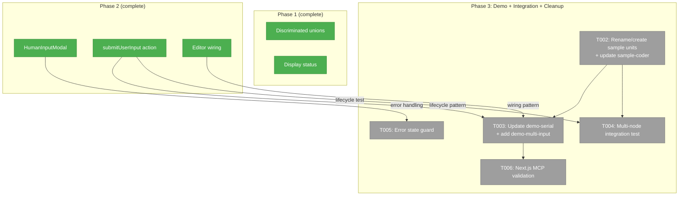
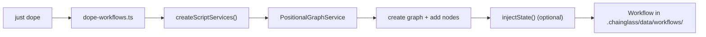
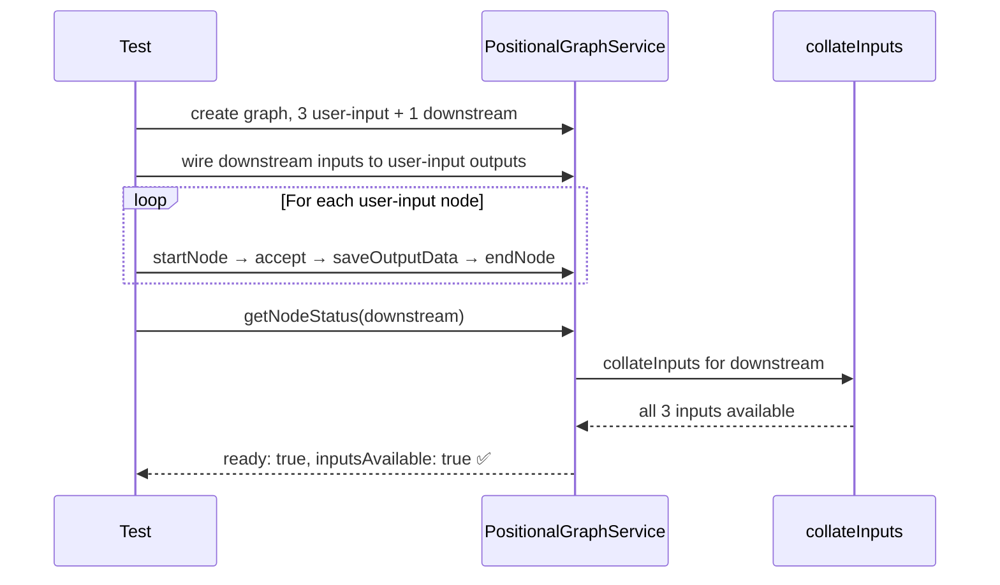
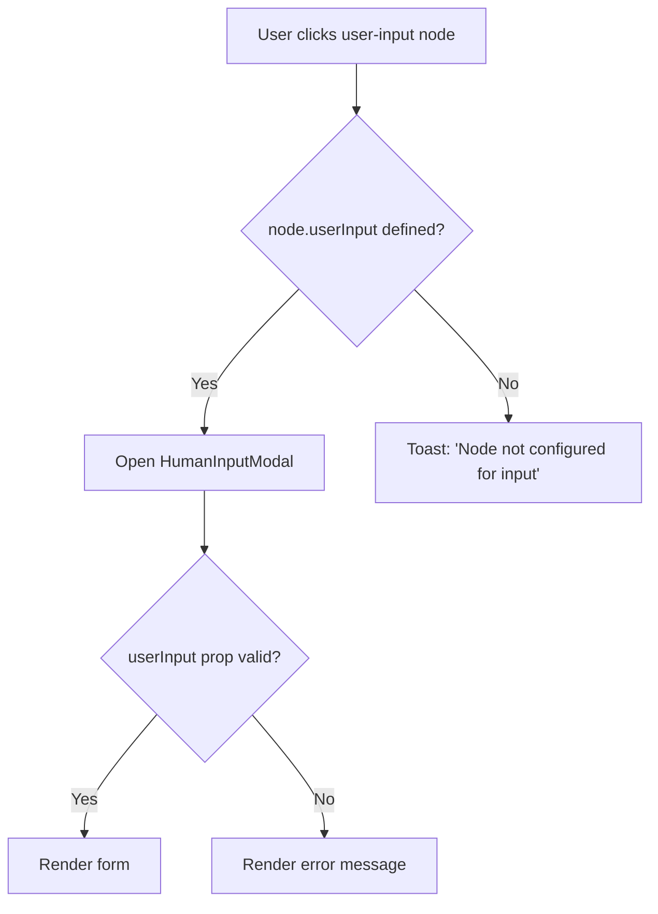

# Phase 3: Demo + Integration + Cleanup — Tasks

**Plan**: [unified-human-input-plan.md](../../unified-human-input-plan.md)
**Phase**: Phase 3: Demo + Integration + Cleanup
**Generated**: 2026-02-28
**Status**: Ready

---

## Executive Briefing

**Purpose**: Make user-input nodes discoverable via `just dope` demo workflows, add integration tests proving end-to-end data flow, and handle the malformed-config error case. After Phase 3, a developer can run `just dope` and immediately interact with user-input nodes, the test suite covers the full submit → complete → downstream-gates-open path, and malformed units show a helpful error instead of a broken modal.

**What We're Building**: (1) A `demo-user-input` dope scenario with a single user-input node in ready/awaiting-input state, (2) a `demo-multi-input` scenario with 3 user-input nodes on one line demonstrating different input types, (3) an integration test exercising the full lifecycle through to downstream gate resolution, (4) error-state handling in the modal/editor for missing `user_input` config, and (5) Next.js MCP validation of zero errors.

**Goals**:
- ✅ `just dope` creates demo workflows with user-input nodes in awaiting-input state
- ✅ Multi-node composition pattern demonstrated (3 user-input nodes → downstream)
- ✅ Integration test proves submit → complete → downstream `inputsAvailable: true`
- ✅ Malformed user-input units show a clear error state, not a broken modal
- ✅ Next.js MCP reports zero errors on all routes

**Non-Goals**:
- ❌ No new features — this is demo, test, and polish only
- ❌ No changes to the modal, server action, or display status from Phase 2
- ❌ No browser-based E2E tests (per testing strategy)

---

## Prior Phase Context

### Phase 1: NodeStatusResult + Display Status

**A. Deliverables**:
- `packages/positional-graph/src/interfaces/positional-graph-service.interface.ts` — Discriminated unions for `NarrowWorkUnit` (3 variants) and `NodeStatusResult` (3 variants)
- `packages/positional-graph/src/services/input-resolution.ts` — Format A fallback fix (line 352)
- `packages/positional-graph/src/adapter/instance-workunit.adapter.ts` — Constructs `NarrowUserInputWorkUnit` with fail-fast on malformed config
- `apps/web/src/features/050-workflow-page/lib/display-status.ts` — `getDisplayStatus()` computing `awaiting-input`
- `apps/web/src/features/050-workflow-page/components/workflow-node-card.tsx` — `awaiting-input` in `NodeStatus` type + `STATUS_MAP`

**B. Dependencies Exported**:
- `UserInputNodeStatus.userInput: { prompt, inputType, outputName, options?, default? }` — modal reads this
- `isUserInputNodeStatus(node)` type guard
- `getDisplayStatus(unitType, status, ready)` returns `'awaiting-input'`

**C. Gotchas & Debt**:
- `awaiting-input` is UI-only — never in state.json
- Structural typing means test objects without `userInput` silently satisfy `NarrowAgentWorkUnit`
- `getDisplayStatus` checks both `'pending'` AND `'ready'` statuses — engine computes `ready` when `canRun` is true

**D. Incomplete Items**: None — all tasks complete.

**E. Patterns to Follow**:
- Discriminated union narrowing: `if (node.unitType === 'user-input') { node.userInput.prompt }`
- Pure functions for computed display states
- Server action pattern from `answerQuestion`: resolve ctx → resolve svc → call methods → check errors → `reloadStatus()`

### Phase 2: Human Input Modal + Server Action

**A. Deliverables**:
- `apps/web/src/features/050-workflow-page/components/human-input-modal.tsx` — Full modal with 4 input types + freeform + pre-fill
- `apps/web/app/actions/workflow-actions.ts` — `submitUserInput` (line 539), `resetUserInput` (line 580), `loadUserInputData` (line 604)
- `apps/web/src/features/050-workflow-page/components/workflow-editor.tsx` — Modal wiring, click routing, atomic reset+submit
- `apps/web/src/features/050-workflow-page/components/workflow-node-card.tsx` — "Provide Input" button on card
- `apps/web/src/features/050-workflow-page/components/node-properties-panel.tsx` — "Provide Input..." button

**B. Dependencies Exported**:
- `submitUserInput(ws, graph, nodeId, outputName, value, worktreePath)` — server action
- `resetUserInput(ws, graph, nodeId, worktreePath)` — fires `node:restart` from complete
- `loadUserInputData(ws, graph, nodeId, outputName, worktreePath)` — loads previous answer for pre-fill
- `HumanInputModal` component with `HumanInputModalProps`

**C. Gotchas & Debt**:
- `node:accepted` requires source `'executor'`, not `'human'` (E192 error)
- `node:restart` now allowed from `'complete'` state (added to VALID_FROM_STATES)
- Reset happens at submit time, NOT modal open — cancel preserves complete state
- `loadUserInputData` reads from `getOutputData` → `result.value` (NOT `result.data`)
- The web app uses `WorkUnitService` (via DI), NOT `InstanceWorkUnitAdapter` — critical `userInput` camelCase mapping was required

**D. Incomplete Items**: None — all 8 tasks + re-edit, pre-fill, card button extras complete.

**E. Patterns to Follow**:
- Dope scenarios pattern: `SCENARIOS` array with `{ slug, description, build }` objects
- `UNIT_USER_INPUT = 'sample-input'` constant already defined in dope-workflows.ts
- `injectState()` helper for setting node status
- Test lifecycle from `submit-user-input-lifecycle.test.ts`: create graph → wire inputs → walk lifecycle → assert downstream

---

## Pre-Implementation Check

| File | Exists? | Domain Check | Notes |
|------|---------|-------------|-------|
| `scripts/dope-workflows.ts` | ✅ Yes | workflow-ui ✅ | Add 2 new scenarios to `SCENARIOS` array. `UNIT_USER_INPUT = 'sample-input'` already defined. |
| `.chainglass/units/sample-input/unit.yaml` | ✅ Yes | workflow-ui ✅ | Existing unit — text input type. Need 2-3 more units for multi-input demo (different question types). |
| `apps/web/src/features/050-workflow-page/components/human-input-modal.tsx` | ✅ Yes | workflow-ui ✅ | Add error guard for missing/malformed `userInput` prop |
| `apps/web/src/features/050-workflow-page/components/workflow-editor.tsx` | ✅ Yes | workflow-ui ✅ | Add error guard in `openHumanInputModal` for missing `node.userInput` |
| `test/unit/positional-graph/submit-user-input-lifecycle.test.ts` | ✅ Yes | test ✅ | Existing file — add integration-style test for multi-node composition |

**Concept duplication check**: Demo scenarios follow established `SCENARIOS` pattern — no new concepts. Error state is a guard, not a new component. Integration test extends existing lifecycle test file.

---

## Architecture Map



---

## DYK Decisions (2026-02-28)

| # | Decision | Impact |
|---|----------|--------|
| DYK-1 | Drop T001 — `demo-serial` already creates a user-input → coder workflow, satisfying AC-14 | Removed task |
| DYK-2 | Rename `sample-input` → `sample-challenge`. Create `sample-language` (single-choice). Update `sample-coder` to 2 inputs (`challenge` + `language`). Update `demo-serial` wiring. | Redesigned T002/T003 |
| DYK-3 | YAML options must use `{key, label}` object format per Zod schema, not plain strings | T002 note |
| DYK-4 | AC-16 already covered by existing lifecycle test #2, but multi-node composition test still valuable | T004 note |
| DYK-5 | Error guard (T005) is defense-in-depth — adapter already prevents malformed units reaching UI. Keep minimal (3-line conditional). | T005 scope |

---

## Tasks

| Status | ID | Task | Domain | Path(s) | Done When | Notes |
|--------|-----|------|--------|---------|-----------|-------|
| [x] | T002 | Rename `sample-input` → `sample-challenge`, create `sample-language`, update `sample-coder` | workflow-ui | `/.chainglass/units/sample-challenge/unit.yaml`, `/.chainglass/units/sample-language/unit.yaml`, `/.chainglass/units/sample-coder/unit.yaml` | `sample-input` renamed to `sample-challenge` (text: "What coding challenge should we solve?", output: `challenge`). New `sample-language` unit (question_type: single, options with `{key, label}` objects: TypeScript/Python/Go, output: `language`). `sample-coder` updated: inputs changed from `[spec]` to `[challenge, language]`. | DYK-2, DYK-3. Options MUST use `{key, label}` format per Zod schema. |
| [x] | T003 | Update `demo-serial` + add `demo-multi-input` dope scenario | workflow-ui | `/scripts/dope-workflows.ts` | `demo-serial` updated: uses `sample-challenge` + wires to `challenge` input. New `demo-multi-input`: Line 0 has `sample-challenge` + `sample-language`, Line 1 has `sample-coder` wired to both outputs (`challenge` → `challenge`, `language` → `language`). `UNIT_USER_INPUT` constant renamed to match. | DYK-1 (T001 dropped), DYK-2. |
| [x] | T004 | Integration test: multi-node submit → complete → downstream gates open | test | `/test/unit/positional-graph/submit-user-input-lifecycle.test.ts` | New test: 2 user-input nodes (text + single-choice) on Line 0, 1 downstream agent on Line 1 wired to both outputs. Submit both → both complete → downstream `ready: true, inputsAvailable: true`. | AC-16 (already green via test #2, this adds multi-node coverage). |
| [x] | T005 | Error state for missing `user_input` config | workflow-ui | `/apps/web/src/features/050-workflow-page/components/human-input-modal.tsx`, `/apps/web/src/features/050-workflow-page/components/workflow-editor.tsx` | Modal: if `userInput` falsy → render inline error message. Editor: if `node.userInput` undefined → toast + don't open modal. Minimal — 3-line conditional each. | AC-11. DYK-5: defense-in-depth, adapter already prevents this. |
| [x] | T006 | Verify via Next.js MCP: zero errors, routes work | workflow-ui | N/A | Start dev server, query Next.js MCP `get_errors` → 0 errors. Navigate to workflow page with doped user-input workflows → renders correctly. | Final validation. Non-blocking if MCP not available — fallback to `pnpm build` clean. |

---

## Context Brief

### Key findings from plan

- **F01 (Critical)**: Format A mismatch — **FIXED in Phase 1**. `collateInputs` reads `data?.outputs?.[name] ?? data?.[name]`.
- **F02 (High)**: Lifecycle sequence `startNode → accept → saveOutputData → endNode` — **IMPLEMENTED in Phase 2**. Used by `submitUserInput` server action.
- **F04 (Medium)**: Orchestration safety — 4 layers prevent interference with user-input nodes. **No changes needed** for demo workflows.

### Domain dependencies

- `workflow-ui`: `dope-workflows.ts` scenario pattern — add scenarios to `SCENARIOS` array
- `_platform/positional-graph`: `IPositionalGraphService` — used by dope script for graph creation
- `_platform/positional-graph`: `collateInputs` / input resolution — tested by integration test (downstream gates)
- `workflow-ui`: `HumanInputModal` — add error guard for missing config

### Domain constraints

- Dope scenarios use `createScriptServices()` — a lightweight DI container separate from web bootstrap
- `UNIT_USER_INPUT = 'sample-input'` already defined; new units need committed `.chainglass/units/` directories
- Integration test uses `FakeFileSystem` + `FakePathResolver` (per Phase 2 lifecycle test pattern)
- Error guard in modal must not change the happy path — conditional rendering only

### Reusable from prior phases

- `UNIT_USER_INPUT = 'sample-input'` in `dope-workflows.ts`
- `injectState()` helper for state injection (though demo-user-input may not need it)
- Lifecycle test setup from `submit-user-input-lifecycle.test.ts`: `createFakeUnitLoader`, `createTestService`, `createTestContext`
- `demo-serial` scenario pattern: create graph → add lines → add nodes → wire inputs
- `assertDefined()` helper for safe ID extraction

### Dope scenario flow



### Integration test flow



### Error state guard flow



---

## Discoveries & Learnings

_Populated during implementation by plan-6._

| Date | Task | Type | Discovery | Resolution | References |
|------|------|------|-----------|------------|------------|

---

## Directory Layout

```
docs/plans/054-unified-human-input/
  ├── unified-human-input-plan.md
  ├── unified-human-input-spec.md
  ├── workshops/
  │   ├── 010-single-question-simplification.md
  │   ├── 011-discriminated-type-architecture.md
  │   ├── 012-output-name-flow.md
  │   └── 013-re-edit-ux.md
  └── tasks/
      ├── phase-1-nodestatus-display/
      │   ├── tasks.md
      │   ├── tasks.fltplan.md
      │   └── execution.log.md
      ├── phase-2-human-input-modal/
      │   ├── tasks.md
      │   ├── tasks.fltplan.md
      │   └── execution.log.md
      └── phase-3-demo-integration-cleanup/
          ├── tasks.md              ← you are here
          ├── tasks.fltplan.md
          └── execution.log.md     # created by plan-6
```
