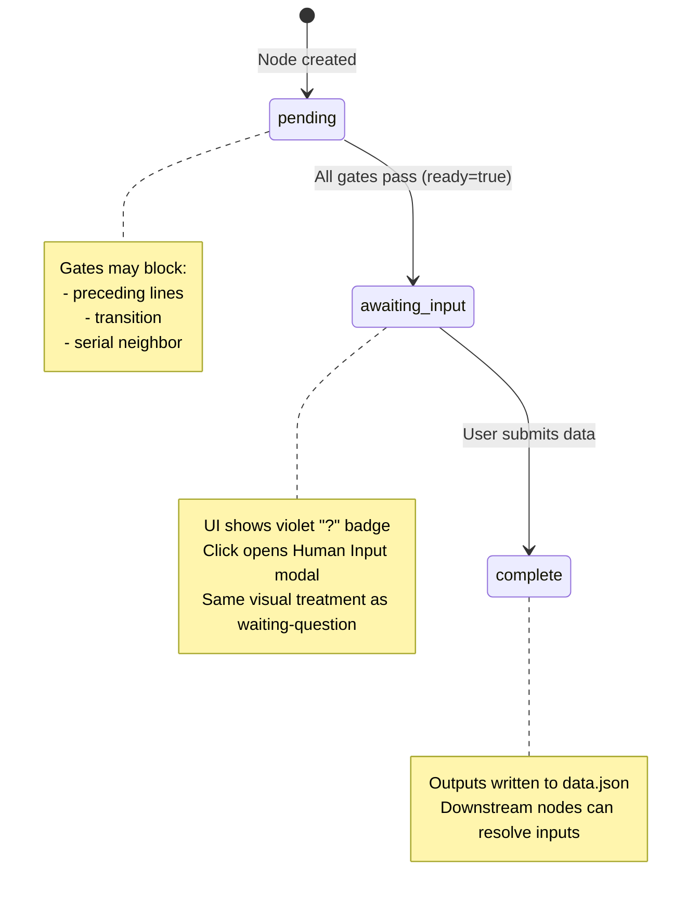

# Workshop: Unified Human Input Design

> **Superseded in part**: This workshop was written assuming the engine Q&A protocol (`askQuestion`/`answerQuestion`) was a live system. It has since been confirmed as deprecated scaffolding. The "unified" design (sharing a modal between agent questions and user-input nodes) is **not** the approach. Instead, Plan 054 builds a standalone `HumanInputModal` for user-input nodes that does NOT use the engine Q&A protocol. See [Workshop 008](./008-save-persistence-strategy.md) for the corrected save strategy. The data model analysis (data.json format, lifecycle walkthrough, display status computation) remains valid.

**Type**: Data Model / Integration Pattern / UI Design
**Plan**: 054-unified-human-input
**Spec**: [unified-human-input-spec.md](../unified-human-input-spec.md)
**Created**: 2026-02-27
**Status**: Partially superseded

**Related Documents**:
- [Workshop 003: Per-Instance Work Unit Configuration](./003-per-instance-work-unit-configuration.md)
- [Workshop 001: Line-Based Canvas UX Design](./001-line-based-canvas-ux-design.md)
- [Positional Graph Service Interface](../../../../packages/positional-graph/src/interfaces/positional-graph-service.interface.ts)
- [QA Modal Component](../../../../apps/web/src/features/050-workflow-page/components/qa-modal.tsx)

**Domain Context**:
- **Primary Domain**: `workflow-ui` (owns the input collection UI, modal, and server actions)
- **Related Domains**: `_platform/positional-graph` (owns question protocol, node status, state.json), `_platform/events` (SSE for real-time status changes)

---

## Purpose

Define how "human input" nodes present a unified input experience in the workflow editor. Today, agent questions (asked mid-execution) work through the QA modal, but user-input nodes (pure data collection) have no input mechanism at all — they sit at `pending` status with no way to provide data. This workshop designs a unified approach where both mechanisms reuse the same QA modal UI and the same answer submission protocol, while respecting that they differ in storage and lifecycle.

## Key Questions Addressed

- How do user-input nodes collect data when they have no agent to "ask" the question?
- Can we reuse the existing QA modal for both agent questions and user-input nodes?
- Where does user-input data get stored vs. agent question answers?
- How should the language be standardized (badge text, status labels, modal headers)?
- How do downstream nodes read user-input data?

---

## The Problem

### Two Input Mechanisms, Only One Works

```
┌─────────────────────────────────────────────────────────────────────┐
│ AGENT QUESTION (works today)                                        │
│                                                                     │
│   Agent runs → asks question → state.json gets question entry →     │
│   node status = 'waiting-question' → pendingQuestion populated →    │
│   QA modal opens on click → answer submitted → node:restart →       │
│   agent resumes                                                     │
│                                                                     │
│   Storage: state.json questions[] array                             │
│   Lifecycle: mid-execution, agent-initiated                         │
└─────────────────────────────────────────────────────────────────────┘

┌─────────────────────────────────────────────────────────────────────┐
│ USER-INPUT NODE (broken today)                                      │
│                                                                     │
│   Node sits at 'pending' → no agent runs → no question asked →      │
│   no pendingQuestion → no QA modal → user has no way to provide     │
│   data → node stays pending forever                                 │
│                                                                     │
│   Storage: should write to node's data outputs (data.json?)         │
│   Lifecycle: pre-execution, human-initiated                         │
└─────────────────────────────────────────────────────────────────────┘
```

### What The User Sees Today

On a node card with `unitType: 'user-input'`:
- 👤 icon, unit slug label, `pending` status (gray dot)
- No click action, no way to provide input
- The node just sits there

### What The User Should See

On a node card with `unitType: 'user-input'`:
- 👤 icon, unit slug label, a status indicating "needs your input"
- Click opens the QA modal pre-populated from `unit.yaml → user_input` config
- After submission, node transitions to `complete` with outputs populated
- Downstream nodes can read the provided data

---

## Design: Synthetic Question Protocol

The cleanest approach: when a user-input node becomes ready, the system **auto-generates a question** from the node's `user_input` config. This funnels user-input nodes into the existing question protocol, reusing all the machinery.

### Sequence: User-Input Node Lifecycle

```
User-input node becomes ready (all gates pass)
    │
    ├── UI detects: unitType === 'user-input' AND status === 'pending' AND ready === true
    │
    ├── Option A: Auto-surface (recommended)
    │   UI shows the node as "awaiting input" (same violet treatment as waiting-question)
    │   Click opens QA modal populated from unit.yaml user_input config
    │
    ├── User fills in the form, clicks Submit
    │
    ├── Server action: submitUserInput(workspaceSlug, graphSlug, nodeId, answer)
    │   ├── Read unit.yaml for this node's unit_slug
    │   ├── Map answer to the unit's declared outputs
    │   ├── Write outputs to node data (IPositionalGraphService.setOutput or similar)
    │   ├── Transition node to 'complete' status
    │   └── Return updated graph status
    │
    └── Downstream nodes see inputs available → gates open
```

### Why Not Actually Create a Question in state.json?

Creating a synthetic question entry in state.json would work but adds complexity:
- Need an "ask" step that nobody triggers (the node isn't running)
- The question protocol expects an agent/code executor to ask
- Answer storage goes to state.json but outputs need to go to node data for downstream consumption

Instead, the **UI handles the presentation** using the same modal, and the **server action handles persistence** by writing directly to node outputs.

---

## UI Unified Input Experience

### Rebranding: "Question" → "Human Input"

Standardize all user-facing language:

| Old Term | New Term | Where |
|----------|----------|-------|
| "Question" (modal header) | "Human Input" | QA modal header |
| "?" badge on node | "?" badge (keep — universal "needs input" signal) | Node card |
| "Submit Answer" button | "Submit" | QA modal footer |
| "Awaiting Input" status label | Keep as-is | Node card status |
| `waiting-question` status | Keep internally — badge maps both | Status mapping |

### Node Card Status Additions

Current status mapping handles `waiting-question` with violet treatment. For user-input nodes, we add a new computed status:

```typescript
// Pseudo-logic in the UI layer (not in positional-graph service)
function getDisplayStatus(node: NodeStatusResult): DisplayStatus {
  // Agent/code node with a pending question
  if (node.status === 'waiting-question') {
    return 'waiting-question'; // existing violet treatment
  }
  
  // User-input node that's pending and ready → needs human input
  if (node.unitType === 'user-input' && node.status === 'pending' && node.ready) {
    return 'awaiting-input'; // same violet treatment, QA modal on click
  }
  
  // User-input node that's pending but NOT ready → still blocked
  if (node.unitType === 'user-input' && node.status === 'pending' && !node.ready) {
    return 'pending'; // gray treatment, gates shown
  }
  
  return node.status; // all other statuses pass through
}
```

### New Status Entry

```typescript
// Add to STATUS_CONFIG in workflow-node-card.tsx
'awaiting-input': {
  color: 'text-violet-500',
  bgColor: 'bg-violet-500/8',
  label: 'Awaiting Input',
  icon: '?',
  // Same interactive behavior as waiting-question
},
```

### QA Modal: Unified for Both Cases

The QA modal already supports all 4 question types. The difference is where the question data comes from:

| Source | Agent Question | User-Input Node |
|--------|---------------|-----------------|
| Question text | `pendingQuestion.text` | `unit.yaml → user_input.prompt` |
| Question type | `pendingQuestion.questionType` | `unit.yaml → user_input.question_type` |
| Options | `pendingQuestion.options` | `unit.yaml → user_input.options` |
| Modal header | "Human Input" | "Human Input" |
| Submit action | `answerQuestion()` server action | `submitUserInput()` server action (new) |

### QA Modal Props Update

```typescript
// Current
interface QAModalProps {
  question: PendingQuestion;
  nodeId: string;
  onAnswer: (answer: { structured: unknown; freeform: string }) => void;
  onClose: () => void;
}

// Updated — accept a common shape that both sources can provide
interface HumanInputModalProps {
  input: {
    questionId?: string;        // present for agent questions, absent for user-input
    text: string;               // prompt text
    questionType: 'text' | 'single' | 'multi' | 'confirm';
    options?: { key: string; label: string }[];
  };
  nodeId: string;
  mode: 'question' | 'user-input'; // controls header text and submit action
  onSubmit: (answer: { structured: unknown; freeform: string }) => void;
  onClose: () => void;
}
```

### Modal Header Variations

```
┌─ Human Input ─────────────────────────────────┐    ← both modes
│                                                │
│  Node: sample-input-fe5                        │
│                                                │
│  What code would you like to generate?         │    ← prompt from unit.yaml
│  ┌──────────────────────────────────────────┐  │
│  │                                          │  │    ← text input
│  └──────────────────────────────────────────┘  │
│                                                │
│  Additional notes (optional)                   │
│  ┌──────────────────────────────────────────┐  │
│  │                                          │  │    ← always-on freeform
│  └──────────────────────────────────────────┘  │
│                                                │
│                        [Cancel]  [Submit]       │
└────────────────────────────────────────────────┘
```

```
┌─ Human Input ─────────────────────────────────┐    ← single choice example
│                                                │
│  Node: db-selector-x7y                         │
│                                                │
│  Which database should we use?                 │
│                                                │
│  ○ PostgreSQL                                  │
│  ● MySQL                ← selected             │
│  ○ SQLite                                      │
│                                                │
│  Additional notes (optional)                   │
│  ┌──────────────────────────────────────────┐  │
│  │ Need MySQL for legacy compat             │  │
│  └──────────────────────────────────────────┘  │
│                                                │
│                        [Cancel]  [Submit]       │
└────────────────────────────────────────────────┘
```

---

## Server-Side: Two Submit Paths

### Path 1: Agent Question Answer (existing)

```
answerQuestion(workspaceSlug, graphSlug, nodeId, questionId, answer)
    │
    ├── svc.answerQuestion() → stores answer in state.json questions[]
    ├── svc.raiseNodeEvent('node:restart') → agent resumes
    └── return updated graph status
```

**Storage**: `state.json → questions[].answer`
**Node transition**: stays `waiting-question` until agent processes answer and completes

### Path 2: User-Input Node Submission (new)

```
submitUserInput(workspaceSlug, graphSlug, nodeId, answer)
    │
    ├── Read unit.yaml for this node → get declared outputs
    ├── Map the structured answer to the first (or matching) output
    │   e.g., answer.structured → output "spec" (for sample-input unit)
    ├── Write output data via svc.setOutput(ctx, graphSlug, nodeId, outputName, value)
    │   (or equivalent — may need to create data.json with outputs)
    ├── Transition node to 'complete' via svc.raiseNodeEvent('node:complete')
    │   (or svc.setNodeStatus if direct status change is supported)
    └── return updated graph status
```

**Storage**: Node's output data (readable by downstream nodes via `inputPack`)
**Node transition**: `pending` → `complete` directly

### Open Question: Output Writing

**Q: Does `IPositionalGraphService` have a method to write node output data?**

Looking at the current interface, the service has:
- `askQuestion()` / `answerQuestion()` — for the question protocol
- `raiseNodeEvent()` — for status transitions
- `setNodeStatus()` — direct status changes (if it exists)

What may be missing:
- `setNodeOutput(ctx, graphSlug, nodeId, outputName, value)` — write an output value

**RESOLVED**: The simplest approach is to:
1. Write to the node's `data.json` file (same pattern as agent output data)
2. Transition the node to `complete` status
3. Let `collateInputs()` pick up the output via normal resolution

If `setNodeOutput()` doesn't exist, the server action can write directly to the filesystem:
```
.chainglass/data/workflows/{graphSlug}/nodes/{nodeId}/data.json
```

This is consistent with how agent outputs work — they write to `data.json` and downstream nodes read from it.

---

## Data Flow: User-Input → Downstream

### Before (broken)

```
[sample-input-fe5]          [sample-coder-fa1]
  type: user-input            inputs:
  outputs:                      spec: from_node → sample-input-fe5.spec
    - spec (text)             
                              
  status: pending             status: pending
  (no way to provide data)    (inputs not available — gate blocks)
```

### After (working)

```
[sample-input-fe5]          [sample-coder-fa1]
  type: user-input            inputs:
  outputs:                      spec: from_node → sample-input-fe5.spec
    - spec (text)             
                              
  status: complete            status: ready → can start
  data.json:                  inputPack.spec.available: true
    spec: "Build a REST API    
    for user management"      
```

### data.json Format

```json
{
  "outputs": {
    "spec": {
      "type": "data",
      "data_type": "text",
      "value": "Build a REST API for user management"
    }
  },
  "submitted_at": "2026-02-27T04:30:00.000Z",
  "freeform_notes": "Should support pagination and filtering"
}
```

---

## Multi-Output User-Input Nodes

Some user-input nodes could have multiple outputs. The modal handles this by:

1. **Single output** (common case): the structured answer maps directly to the one output
2. **Multiple outputs**: the prompt collects all data at once, and the server action maps fields to outputs

### Example: Multi-Output Unit

```yaml
# unit.yaml
slug: project-config
type: user-input
outputs:
  - name: requirements
    type: data
    data_type: text
    required: true
  - name: language
    type: data
    data_type: text
    required: true
user_input:
  question_type: text  # For now, single prompt — future: multi-field form
  prompt: "Describe your project requirements and preferred language"
```

For v1, multi-output user-input nodes use the single prompt field + freeform notes. The server action writes the structured answer to the primary output and notes to a secondary output (or a metadata field). Multi-field forms are a future enhancement.

---

## Implementation Checklist

### 1. UI Layer (workflow-ui domain)

- [ ] **Rename QA modal** → `HumanInputModal` (or keep `QAModal` internally, just change displayed text)
- [ ] **Add `awaiting-input` display status** to `workflow-node-card.tsx` STATUS_CONFIG
- [ ] **Compute display status** in a helper: `user-input` + `pending` + `ready` → `awaiting-input`
- [ ] **Wire click handler** for `awaiting-input` nodes to open the modal
- [ ] **Populate modal from unit config**: read `unitType`, fetch unit's `user_input` config via graph status or a new endpoint
- [ ] **Add `submitUserInput` server action** in `workflow-actions.ts`
- [ ] **Wire modal onSubmit** to call the right action based on mode (question vs user-input)

### 2. Data Layer (positional-graph domain)

- [ ] **Ensure `setOutput()` or equivalent exists** — write output data to node's data.json
- [ ] **Ensure `collateInputs()` reads data.json** — downstream nodes pick up user-input outputs
- [ ] **Node status transition**: user-input node goes `pending` → `complete` after data submission
  - May need a `completeNode()` service method or use `raiseNodeEvent('node:complete')`

### 3. Unit Config Surfacing

The UI needs to know the `user_input` config for a node's unit. Options:
- **Option A**: Include `userInputConfig` in `NodeStatusResult` (extend the interface)
- **Option B**: Separate endpoint/action to fetch unit config by nodeId
- **Option C**: Include in `WorkUnitSummary` (already fetched for toolbox)

**Recommendation**: Option A — extend `NodeStatusResult` with an optional `userInput` field for `user-input` type nodes. This keeps the data co-located and avoids extra round trips.

```typescript
// Addition to NodeStatusResult
export interface NodeStatusResult {
  // ... existing fields ...
  
  /** Present when unitType is 'user-input'. Config from unit.yaml. */
  userInput?: {
    prompt: string;
    questionType: 'text' | 'single' | 'multi' | 'confirm';
    options?: { key: string; label: string }[];
    defaultValue?: string | boolean;
  };
}
```

### 4. Demo Workflows

- [ ] **Update `dope-workflows.ts`** to include user-input demo scenarios:
  - `demo-input-text`: User-input node with text prompt (pending, ready)
  - `demo-input-choice`: User-input node with single-choice (pending, ready)
  - `demo-input-complete`: User-input node already submitted (complete)

---

## State Machine: User-Input Node



Note: `awaiting_input` is a **UI-computed display status**, not a stored status in state.json. The actual stored status remains `pending` — the UI layer computes the display based on `unitType + status + ready`.

---

## Comparison: Agent Questions vs User-Input Nodes

| Aspect | Agent Question | User-Input Node |
|--------|---------------|-----------------|
| **Trigger** | Agent code calls `askQuestion()` | Node becomes ready (gates pass) |
| **Stored status** | `waiting-question` | `pending` (UI shows `awaiting-input`) |
| **Question source** | Agent-defined at runtime | `unit.yaml → user_input` config |
| **Answer storage** | `state.json → questions[].answer` | `nodes/{id}/data.json → outputs` |
| **After submission** | Node stays `waiting-question` until agent processes | Node → `complete` immediately |
| **Resumption** | `node:restart` event → agent resumes | No agent to resume — node is done |
| **Downstream access** | Agent produces outputs after processing | Outputs written directly from user data |
| **Modal UI** | Same Human Input modal | Same Human Input modal |
| **Freeform always visible** | Yes | Yes |
| **Can have multiple questions** | Yes (agent can ask multiple times) | No (single collection per node) |

---

## Open Questions

### Q1: Should user-input nodes support re-submission (edit after complete)?

**OPEN**: Once a user-input node is `complete`, can the user click it to edit their input? This would require:
- Transitioning back to `pending` status
- Clearing downstream data that depended on the old input
- Potentially triggering undo snapshot

For v1, recommend: **No re-submission**. User can use Undo (Ctrl+Z) to revert the entire workflow state. Re-submission is a future enhancement.

### Q2: How does `collateInputs()` find user-input node output data?

**RESOLVED**: `collateInputs()` already resolves `from_node` references by reading the source node's output data. If we write to `data.json` in the standard output format, it should Just Work. Need to verify the exact data.json schema expected by the input resolution system.

### Q3: Should the Human Input modal show which output the answer maps to?

**OPEN**: For single-output units (most cases), this is obvious. For multi-output units, the user might benefit from knowing "your answer will be used as the 'spec' input for downstream nodes." Low priority for v1.

### Q4: What if a user-input node has no `user_input` config in unit.yaml?

**RESOLVED**: This would be a malformed unit definition. The `UserInputUnitSchema` requires `user_input` with at least a `question_type` and `prompt`. The UI should show an error state (like `blocked-error`) if the config is missing, with a message like "Unit configuration incomplete — missing user_input section."

### Q5: Should we auto-open the modal when a user-input node becomes ready?

**OPEN**: Auto-opening could be disruptive if multiple user-input nodes become ready simultaneously. Recommendation for v1: **Don't auto-open**. Show the violet `?` badge and let the user click when ready. Could add a toast notification: "Node 'sample-input' needs your input."

---

## Summary

The unified human input design reuses the existing QA modal for both agent questions and user-input nodes by:

1. **Computing a display status** (`awaiting-input`) for user-input nodes that are pending + ready
2. **Populating the modal** from `unit.yaml → user_input` config instead of `state.json → questions[]`
3. **Writing output data** to `data.json` (not state.json) for user-input submissions
4. **Transitioning to `complete`** immediately (no agent to resume)
5. **Standardizing language** to "Human Input" across both modes

The key insight: the existing question protocol is agent-centric (agent asks, human answers, agent resumes). User-input nodes are human-centric (human provides data, node completes). The UI unifies them visually while the server-side keeps them distinct in storage and lifecycle.
