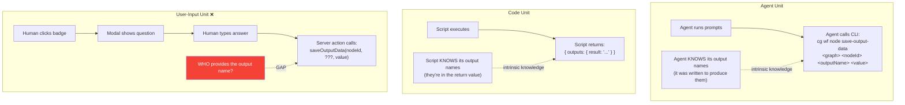
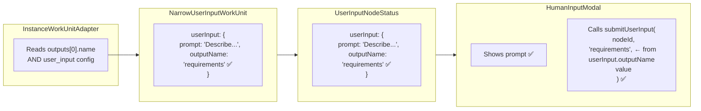

# Workshop: Output Name Flow for Human Input

**Type**: Architecture Clarification
**Plan**: 054-unified-human-input
**Created**: 2026-02-27
**Status**: Authoritative

---

## Purpose

Clarify how output names flow through the system, why user-input nodes have a unique gap, and the minimal fix to close it.

---

## How Output Names Work Today

**Key insight**: This is NOT a problem for agents or code units. They know their own output names intrinsically — agents call CLI commands with explicit output names, code scripts return named outputs. **Only user-input nodes have this gap** because the "executor" is a human using a web modal, not code that knows its outputs.

---

## The Data Flow Gap

```mermaid
flowchart LR
    subgraph UnitYaml["unit.yaml"]
        Y1["outputs:<br/>  - name: requirements"]
        Y2["user_input:<br/>  prompt: 'Describe...'"]
    end

    subgraph Adapter["InstanceWorkUnitAdapter"]
        AD["Reads BOTH outputs[]<br/>AND user_input config"]
    end

    subgraph NWU["NarrowUserInputWorkUnit"]
        N1["outputs: [{name:'requirements'}]"]
        N2["userInput: {prompt:'Describe...'}"]
    end

    subgraph NSR["UserInputNodeStatus<br/>(what the UI sees)"]
        S1["unitSlug: 'get-requirements'"]
        S2["userInput: {prompt:'Describe...'}"]
        S3["❌ outputs[] NOT included"]
    end

    subgraph Modal["HumanInputModal"]
        M1["Shows prompt: 'Describe...' ✅"]
        M2["User types answer ✅"]
        M3["Calls submitUserInput(nodeId, ???, value)"]
        M4["Doesn't know output name ❌"]
    end

    UnitYaml --> AD --> NWU --> NSR --> Modal

    style S3 fill:#F44336,color:#fff
    style M4 fill:#F44336,color:#fff
```

The output name is available in `NarrowUserInputWorkUnit.outputs[0].name` but is **dropped** when building `UserInputNodeStatus` — it doesn't flow through to the UI.

---

## The Fix: Add `outputName` to `userInput`

Since each user-input node has exactly one output (the governing design decision from Workshop 010), we just thread the output name into the `userInput` config:

**Changes needed**:
1. `NarrowUserInputWorkUnit.userInput` gains `outputName: string`
2. `UserInputNodeStatus.userInput` gains `outputName: string`
3. `InstanceWorkUnitAdapter` populates from `outputs[0].name`
4. `getNodeStatus()` threads it through (already copies `userInput` from unit)
5. Modal passes `userInput.outputName` to server action

**Scope**: 2 type definitions + 1 adapter line. No new concepts — just one more string.

---

## Why Not Let the Server Action Figure It Out?

The server action (`submitUserInput`) runs on the server with access to `IPositionalGraphService`. Could it load the unit to get the output name?

**Problem**: `IPositionalGraphService` doesn't expose the unit loader directly. The action can call `getNodeStatus()` to get `unitSlug`, but then has no way to load the unit definition to read `outputs[0].name`. Adding a `getUnitOutputName()` method to the service interface just for this is over-engineering.

The `outputName` is already sitting right there in the adapter when it builds the `userInput` config — just include it.

---

## Is This a Broader Problem?

**No.** Only user-input nodes have this gap because:

| Unit Type | Who Provides Output Name | Gap? |
|-----------|--------------------------|------|
| Agent | The agent calls `cg wf node save-output-data <outputName>` | No — agent knows its outputs |
| Code | Script returns `{ outputs: { name: value } }` | No — script knows its outputs |
| User-Input | The web modal calls `submitUserInput(...)` | **Yes** — the modal doesn't know the output name |

Agent and code units are autonomous — they run code that intrinsically knows what outputs to produce. User-input nodes are passive — the human provides data but the *system* needs to know where to store it.
