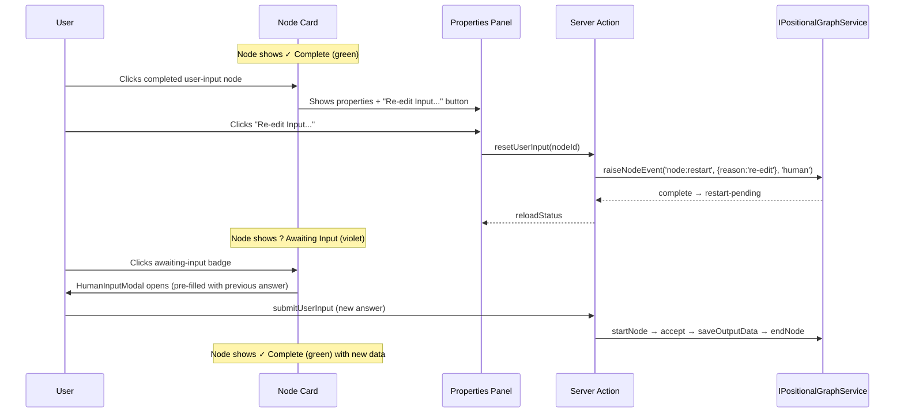

# Workshop: Re-Edit UX for Completed Human Input Nodes

**Type**: State Machine / UX Design
**Plan**: 054-unified-human-input
**Created**: 2026-02-28
**Status**: Draft

**Domain Context**:
- **Primary Domain**: workflow-ui (UX + server action)
- **Related Domains**: _platform/positional-graph (state transitions, event system)

---

## Purpose

Design how a user re-edits a completed human input node. Today, once a user submits input, the node is `complete` and locked — there's no way to change the answer. This workshop explores the mechanics, constraints, and UX for re-editing.

## Key Questions Addressed

- How does a user indicate they want to re-edit?
- What state transition path gets from `complete` back to `awaiting-input`?
- What happens to downstream nodes that already consumed the output?
- Should the modal pre-fill with the previous answer?

---

## Constraint: `node:restart` Does NOT Work from `complete`

The existing `node:restart` event only fires from `waiting-question` or `blocked-error`:

```typescript
// raise-event.ts line 34-42
const VALID_FROM_STATES = {
  'node:restart': ['waiting-question', 'blocked-error'],  // ← NOT 'complete'
};
```

This means we **cannot** use the existing restart mechanism. We have three options:

---

## Option A: Add `complete` to `node:restart` Valid States

**Change**: One line — add `'complete'` to `VALID_FROM_STATES['node:restart']`.

```typescript
'node:restart': ['waiting-question', 'blocked-error', 'complete'],
```

**Pros**: Minimal code change. Reuses existing event + handler.
**Cons**: Changes engine semantics — `node:restart` from `complete` wasn't designed for this. Could have unintended effects on orchestration (ONBAS sees `restart-pending` and may try to re-execute).

**Risk**: ONBAS/ODS currently skip user-input nodes (4 layers of defense), so restart-pending on a user-input node won't trigger orchestration. But the principle of allowing restart from `complete` could be surprising for agent/code nodes if someone extends this later.

**Mitigation**: Guard the state expansion to user-input only, or accept it as a general capability.

---

## Option B: Direct State Write via Server Action

**Change**: The server action directly writes `state.json` to reset the node to `pending`, bypassing the event system.

```typescript
// In server action:
const state = await svc.loadGraphState(ctx, graphSlug);
state.nodes[nodeId] = { status: undefined }; // Back to pending (no stored state = pending)
delete state.nodes[nodeId]; // Or remove entirely
await svc.persistGraphState(ctx, graphSlug, state);
```

**Pros**: No engine changes. Node returns to `pending`, `getNodeStatus` computes `ready`, display shows `awaiting-input`.
**Cons**: Bypasses event system — no audit trail, no event log entry. Violates clean architecture (server action writes state directly).

**Risk**: `loadGraphState` and `persistGraphState` exist on the service (lines 2680-2688) but are intended for E2E test support, not production use.

---

## Option C: New `node:reset` Event Type (Recommended)

**Change**: Register a new event type specifically for resetting completed nodes to pending.

```typescript
registry.register({
  type: 'node:reset',
  displayName: 'Reset Node',
  description: 'Reset a completed node back to pending for re-entry',
  payloadSchema: NodeResetPayloadSchema,  // { reason: string }
  allowedSources: ['human'],              // Only humans can reset
  stopsExecution: false,
  domain: 'node',
});

// VALID_FROM_STATES:
'node:reset': ['complete'],

// Handler:
function handleNodeReset(ctx: HandlerContext): void {
  ctx.node.status = undefined;              // Remove status → computed as pending
  ctx.node.completed_at = undefined;        // Clear completion timestamp
  ctx.stamp('node-reset');
}
```

**Pros**: Clean event audit trail. Explicit intent (`reset` vs `restart`). Only from `complete`. Only by `human`.
**Cons**: New event type + handler + schema (3 small files to touch).

---

## Recommendation: Option A (Pragmatic)

Option C is the cleanest architecture, but it's over-engineered for what is essentially "let the user try again". Option A is one line of code and achieves the same result:

1. User clicks "Re-edit" on a completed user-input node
2. Server action fires `raiseNodeEvent('node:restart', { reason: 're-edit' }, 'human')`
3. Handler sets status to `restart-pending`, clears pending_question_id
4. `getNodeStatus` computes `ready` (from `restart-pending`)
5. `getDisplayStatus` returns `awaiting-input`
6. User sees the badge, clicks, modal opens pre-filled with previous answer
7. Submit walks the lifecycle again: `startNode` → `accept` → `saveOutputData` (overwrites) → `endNode`

The ONBAS/ODS safety layers (4 layers, all tested) prevent orchestration interference with user-input nodes regardless of their state.

---

## UX Flow



---

## Node Card States After Re-Edit

| State | Badge | Clickable? | Properties Panel |
|-------|-------|-----------|-----------------|
| `complete` (user-input) | ✓ Complete (green) | Click → shows properties | "Re-edit Input..." button visible |
| `restart-pending` → computed `awaiting-input` | ? Awaiting Input (violet) | Click → opens modal | "Provide Input..." button |
| `complete` (after re-submit) | ✓ Complete (green) | Click → shows properties | "Re-edit Input..." button visible |

---

## Pre-Filling the Modal

When the modal opens for re-edit, it should show the previous answer:

1. Server action loads `data.json` for the node
2. Extracts `outputs[outputName]` — either the raw value or `{ value, freeform_notes }`
3. Passes to `HumanInputModal` as `defaultValue` prop
4. Modal pre-fills the structured input and freeform textarea

**For text type**: Pre-fill textarea with previous answer
**For single/multi**: Pre-select previous choices
**For confirm**: Pre-select yes/no

---

## Downstream Impact

When a user re-edits input, downstream nodes that already consumed the output may have stale data:

**Current behavior**: Downstream nodes already read the output via `collateInputs`. If the upstream node restarts, `collateInputs` will return `waiting` (because the source is no longer `complete`). When the user re-submits and the node completes again, downstream gates re-open with the new data.

**This is correct** — downstream nodes haven't executed yet in the user-input workflow scenario (they were just `pending` with gates unblocked). If they HAD executed, that's an orchestration concern beyond Plan 054's scope.

---

## Implementation Tasks

| # | Task | Scope |
|---|------|-------|
| 1 | Add `'complete'` to `VALID_FROM_STATES['node:restart']` | 1 line in `raise-event.ts` |
| 2 | Create `resetUserInput` server action | ~15 lines in `workflow-actions.ts` |
| 3 | Add "Re-edit Input..." button to properties panel for completed user-input nodes | ~10 lines in `node-properties-panel.tsx` |
| 4 | Wire "Re-edit" button to `resetUserInput` action in editor | ~5 lines in `workflow-editor.tsx` |
| 5 | Pre-fill modal with previous answer (optional, can defer) | Read data.json, pass as prop |
| 6 | Update `getDisplayStatus` to handle `restart-pending` → `awaiting-input` | Already handled — `restart-pending` maps to `ready` in engine |

**Estimated total**: ~30 lines of production code + tests.

---

## Open Questions

### Q1: Should "Re-edit" require confirmation?

**OPEN**: A simple click resets the node. Should there be a "Are you sure?" dialog? Probably not — undo (Ctrl+Z) via snapshot restore can recover if needed.

### Q2: Pre-fill vs blank modal on re-edit?

**OPEN**: Pre-filling is better UX (user sees what they entered before and can modify). But it requires loading data.json, which adds a server call or needs the data passed through the status API. Could defer to a later enhancement.

---

## Summary

Re-edit is achievable with ~30 lines of code by adding `'complete'` to `node:restart`'s valid states. The UX is: complete node → click → properties panel shows "Re-edit Input..." → click → node resets to `awaiting-input` → user clicks badge → modal opens → submit → complete again. Pre-filling the modal with the previous answer is optional and can be deferred.
