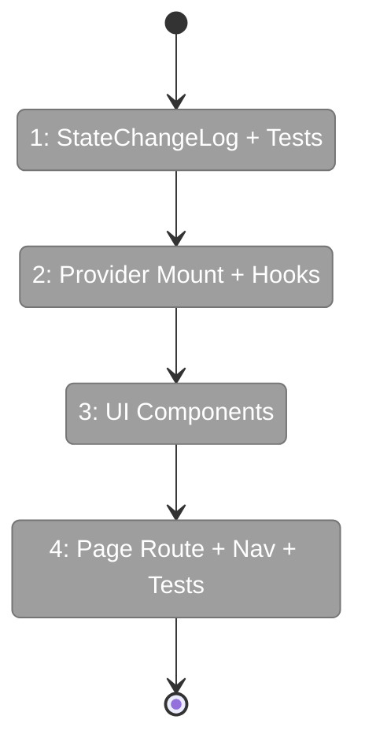
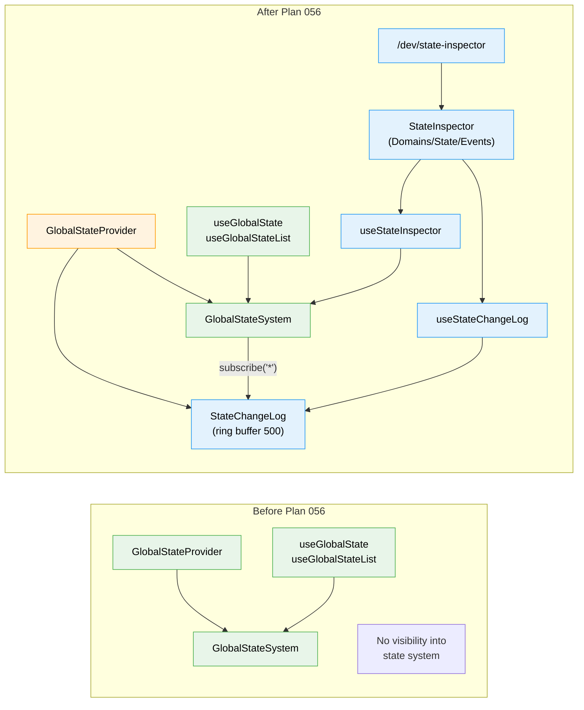

# Flight Plan: Implementation — State DevTools Panel

**Plan**: [state-devtools-panel-plan.md](../../state-devtools-panel-plan.md)
**Mode**: Simple (single implementation phase)
**Generated**: 2026-02-27
**Status**: Ready for takeoff

---

## Departure → Destination

**Where we are**: Plan 053 delivered a complete GlobalStateSystem — types, interface, path engine, real + fake implementations, React hooks, provider, and a working worktree exemplar. 145 tests pass. The system works but is invisible — developers can't see what domains are registered, what state is published, or what changes are flowing through the system.

**Where we're going**: A developer opens `/dev/state-inspector` from the Dev sidebar and immediately sees all registered domains, current state entries sorted by recency, and a scrolling event log showing every state change since app boot. They can filter by domain, pause the stream to analyze a moment, click any entry for full JSON detail, and see live diagnostics in the footer. The inspector is a read-only observer with zero impact on the state system.

---

## Domain Context

### Domains We're Changing

| Domain | What Changes | Key Files |
|--------|-------------|-----------|
| `_platform/dev-tools` | **NEW domain** — StateChangeLog, inspector hooks, UI components, page route | `features/_platform/dev-tools/**` |
| `_platform/state` | Add StateChangeLog mount + context in GlobalStateProvider | `lib/state/state-provider.tsx` |

### Domains We Depend On (no changes)

| Domain | What We Consume | Contract |
|--------|----------------|----------|
| `_platform/state` | IStateService — listDomains, list, subscribe, diagnostics | IStateService interface |
| `_platform/state` | StateChange, StateEntry, StateDomainDescriptor | Value types |
| `_platform/state` | FakeGlobalStateSystem | Test injection via StateContext |

---

## Flight Status

<!-- Updated by /plan-6-v2: pending → active → done. Use blocked for problems/input needed. -->

**Legend**: grey = pending | yellow = active | red = blocked/needs input | green = done

---

## Stages

<!-- Updated by /plan-6-v2 during implementation: [ ] → [~] → [x] -->

- [ ] **Stage 1: StateChangeLog class + unit tests** — Ring buffer with append/getEntries/clear/size, FIFO eviction. TDD: RED tests first. (`state-change-log.ts`, `state-change-log.test.ts` — new files)
- [ ] **Stage 2: Mount log in provider** — Create StateChangeLog in GlobalStateProvider, subscribe to `'*'`, export StateChangeLogContext. (`state-provider.tsx` — modified)
- [ ] **Stage 3: Hooks** — useStateChangeLog (reads log + subscribes for live re-renders), useStateInspector (composes domains, entries, diagnostics, pause/resume/clear). (`hooks/*.ts` — new files)
- [ ] **Stage 4: DomainOverview component** — Expandable domain list with property schemas, instance count. (`domain-overview.tsx` — new file)
- [ ] **Stage 5: StateEntriesTable component** — Current state table sorted by updatedAt, domain filter chips, click → detail. (`state-entries-table.tsx` — new file)
- [ ] **Stage 6: EventStream component** — Scrolling event list from log, compact rows, pause/resume/clear, auto-scroll, domain filter. (`event-stream.tsx` — new file)
- [ ] **Stage 7: EntryDetail component** — Side panel with full JSON, previousValue, domain context. (`entry-detail.tsx` — new file)
- [ ] **Stage 8: StateInspector main panel** — Tabs, 50/50 split, diagnostics footer, throttled re-renders. (`state-inspector.tsx` — new file)
- [ ] **Stage 9: Route + nav + barrel** — Page at `/dev/state-inspector`, DEV_NAV_ITEMS entry, barrel exports. (`page.tsx`, `navigation-utils.ts`, `index.ts` — new/modified)
- [ ] **Stage 10: Component tests** — FakeGlobalStateSystem tests for all UI components and hooks. RED first. (`state-inspector.test.tsx` — new file)

---

## Architecture: Before & After

**Legend**: existing (green, unchanged) | changed (orange, modified) | new (blue, created)

---

## Acceptance Criteria

- [ ] AC-01: Panel displays registered domains with name, description, multiInstance, property count
- [ ] AC-02: Domains expand to show property descriptors
- [ ] AC-03: Instance count for multi-instance domains
- [ ] AC-04: Current state entries sorted by recency
- [ ] AC-05: Entries show path, value, time since update
- [ ] AC-06: Entries filterable by domain
- [ ] AC-07: Click entry → full detail
- [ ] AC-08: Real-time state changes shown
- [ ] AC-09: Events show timestamp, domain, property, value, change type
- [ ] AC-10: Stream filterable by domain
- [ ] AC-11: Pause/resume with count; Clear button
- [ ] AC-12: Auto-scroll to newest
- [ ] AC-13: Dev sidebar nav item
- [ ] AC-14: Route at /dev/state-inspector
- [ ] AC-15: Works with collapsed sidebar
- [ ] AC-16: Footer shows subscriberCount, entryCount, domain count
- [ ] AC-17: Footer updates live
- [ ] AC-18: Click → detail with full JSON
- [ ] AC-19: Detail shows previousValue
- [ ] AC-20: Detail shows domain context
- [ ] AC-21: High-frequency updates throttled
- [ ] AC-22: No perf degradation
- [ ] AC-23: StateChangeLog ring buffer (500 cap)
- [ ] AC-24: Inspector shows historical entries
- [ ] AC-25: useStateChangeLog hook
- [ ] AC-26: Log mounted in GlobalStateProvider

## Goals & Non-Goals

**Goals**:
- ✅ Full state system visibility from a single page
- ✅ Historical events from boot (not just since panel open)
- ✅ Filterable, pausable, drillable event stream
- ✅ Zero state system changes (pure consumer + one provider addition)
- ✅ Looks good — follows workshop UX patterns

**Non-Goals**:
- ❌ Time-travel replay
- ❌ Write capability
- ❌ Virtual scrolling
- ❌ Keyboard navigation
- ❌ New documentation

---

## Checklist

- [ ] T001: StateChangeLog ring buffer class
- [ ] T002: StateChangeLog unit tests (RED first)
- [ ] T003: Mount log in GlobalStateProvider
- [ ] T004: useStateChangeLog hook
- [ ] T005: useStateInspector hook
- [ ] T006: DomainOverview component
- [ ] T007: StateEntriesTable component
- [ ] T008: EventStream component
- [ ] T009: EntryDetail component
- [ ] T010: StateInspector main panel
- [ ] T011: Route + barrel exports
- [ ] T012: DEV_NAV_ITEMS entry
- [ ] T013: Component + hook tests (RED first)
