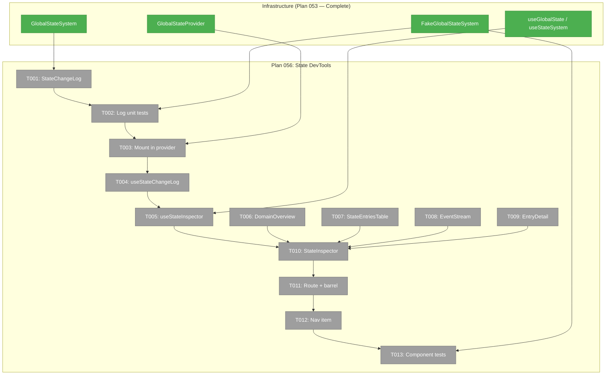
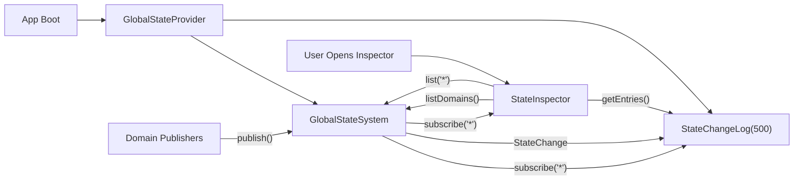
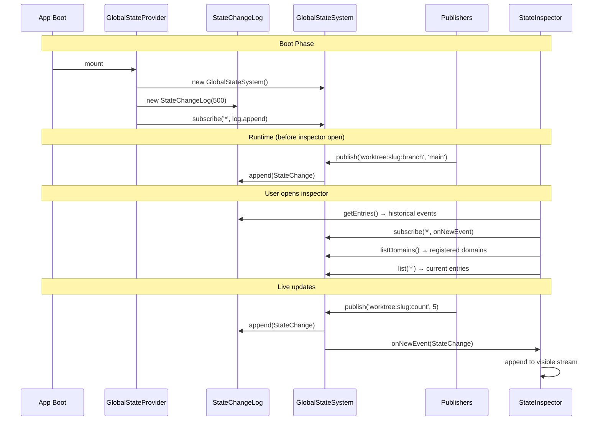

# Implementation — Tasks & Context Brief

**Plan**: [state-devtools-panel-plan.md](../../state-devtools-panel-plan.md)
**Mode**: Simple (single implementation phase)
**Generated**: 2026-02-27
**Status**: Pending

---

## Executive Briefing

**Purpose**: Build a live state inspector panel accessible from the Dev sidebar. Shows registered domains, current state entries, and a real-time change log accumulated from app boot — enabling developers to see what's happening across the GlobalStateSystem without reading code.

**What We're Building**: A `/dev/state-inspector` page with three tabs (Domains / State / Events), a detail panel, diagnostics footer, and a `StateChangeLog` ring buffer that captures all state changes from first render.

**Goals**:
- ✅ StateChangeLog ring buffer accumulating from boot (500 cap)
- ✅ Domain overview with expandable property schemas
- ✅ Current state table sorted by recency with domain filters
- ✅ Live event stream with pause/resume/clear and auto-scroll
- ✅ Detail panel for drill-down (full JSON, previousValue, domain context)
- ✅ Diagnostics footer (subscriberCount, entryCount, domain count)
- ✅ Nav item in Dev sidebar section

**Non-Goals**:
- ❌ Time-travel replay / undo
- ❌ Write capability (read-only inspector)
- ❌ Virtual scrolling (defer until volume demands it)
- ❌ Keyboard navigation (mouse first)
- ❌ New documentation

---

## Prior Phase Context

### Plan 053: GlobalStateSystem (✅ Complete — 6 phases, 145 tests)

**A. Deliverables**:
- `packages/shared/src/state/` — types, IStateService interface, path parser, path matcher, DI tokens
- `packages/shared/src/fakes/fake-state-system.ts` — FakeGlobalStateSystem with inspection methods
- `apps/web/src/lib/state/` — GlobalStateSystem, GlobalStateProvider, useStateSystem, useGlobalState, useGlobalStateList, GlobalStateConnector, barrel exports
- `apps/web/src/components/providers.tsx` — GlobalStateProvider mounted
- `apps/web/src/features/041-file-browser/state/` — worktree exemplar (register, publisher, subtitle)
- Tests: 145 total (25 parser + 22 matcher + 44 contract + 37 unit + 10 hook + 7 publisher)

**B. Dependencies Exported**:
- `IStateService` — `listDomains()`, `list(pattern)`, `get(path)`, `subscribe(pattern, cb)`, `subscriberCount`, `entryCount`, `listInstances(domain)`
- `StateChange` — path, domain, instanceId, property, value, previousValue, timestamp, removed?
- `StateEntry` — path, value, updatedAt
- `StateDomainDescriptor` — domain, description, multiInstance, properties[]
- `useGlobalState<T>(path, default?)`, `useGlobalStateList(pattern)`, `useStateSystem()`
- `StateContext` — exported for test injection (DYK-20)
- `FakeGlobalStateSystem` — `getPublished()`, `getSubscribers()`, `wasPublishedWith()`, `reset()`

**C. Gotchas & Debt**:
- DYK-16: Inline defaults cause infinite re-renders → pin with `useRef(defaultValue).current`
- DYK-17: Don't subscribe with `'*'` in hooks → causes excessive getSnapshot calls. BUT raw `subscribe('*', cb)` is fine for the StateChangeLog (plain callback, not a hook)
- DYK-19: Wrap subscribe/getSnapshot in `useCallback` for stable identity
- DYK-18: Fail-fast — no silent degradation on errors
- Idempotent registration: `useState` initializer + `listDomains().some()` guard for StrictMode/HMR

**D. Incomplete Items**: None

**E. Patterns to Follow**:
- `useSyncExternalStore` for concurrent-safe React subscriptions
- `StateContext.Provider` wrapping for test injection
- Behavioral fakes (FakeGlobalStateSystem), not mocks
- Pattern-scoped list cache (stable refs when unchanged)

---

## Pre-Implementation Check

| File | Exists? | Domain Check | Notes |
|------|---------|-------------|-------|
| `apps/web/src/features/_platform/dev-tools/` | ❌ Create dir | `_platform/dev-tools` ✅ | New feature folder |
| `apps/web/src/features/_platform/dev-tools/state-change-log.ts` | ❌ Create | `_platform/dev-tools` ✅ | Ring buffer class |
| `apps/web/src/features/_platform/dev-tools/hooks/use-state-change-log.ts` | ❌ Create | `_platform/dev-tools` ✅ | Hook reading log context |
| `apps/web/src/features/_platform/dev-tools/hooks/use-state-inspector.ts` | ❌ Create | `_platform/dev-tools` ✅ | Composing hook |
| `apps/web/src/features/_platform/dev-tools/components/state-inspector.tsx` | ❌ Create | `_platform/dev-tools` ✅ | Main panel |
| `apps/web/src/features/_platform/dev-tools/components/domain-overview.tsx` | ❌ Create | `_platform/dev-tools` ✅ | Domain list |
| `apps/web/src/features/_platform/dev-tools/components/state-entries-table.tsx` | ❌ Create | `_platform/dev-tools` ✅ | Current state table |
| `apps/web/src/features/_platform/dev-tools/components/event-stream.tsx` | ❌ Create | `_platform/dev-tools` ✅ | Live event stream |
| `apps/web/src/features/_platform/dev-tools/components/entry-detail.tsx` | ❌ Create | `_platform/dev-tools` ✅ | Detail panel |
| `apps/web/src/features/_platform/dev-tools/index.ts` | ❌ Create | `_platform/dev-tools` ✅ | Barrel exports |
| `apps/web/app/(dashboard)/dev/state-inspector/page.tsx` | ❌ Create | `_platform/dev-tools` ✅ | New route dir needed |
| `apps/web/src/lib/navigation-utils.ts` | ✅ Modify | Cross-domain | Add to DEV_NAV_ITEMS. Note: `Activity` icon not imported yet. |
| `apps/web/src/lib/state/state-provider.tsx` | ✅ Modify | `_platform/state` | Cross-domain: add StateChangeLog + context. Minimal change. |
| `test/unit/web/dev-tools/state-change-log.test.ts` | ❌ Create dir + file | `_platform/dev-tools` ✅ | Test directory needed |
| `test/unit/web/dev-tools/state-inspector.test.tsx` | ❌ Create | `_platform/dev-tools` ✅ | Component + hook tests |

**Concept Duplication Check**: No existing ring buffer, changelog, or event accumulator found in codebase. `agent-events-to-log-entries.ts` transforms stored events but doesn't accumulate them — different pattern.

---

## Architecture Map



---

## Tasks

| Status | ID | Task | Domain | Path(s) | Done When | Notes |
|--------|-----|------|--------|---------|-----------|-------|
| [ ] | T001 | Create `StateChangeLog` — ring buffer class | `_platform/dev-tools` | `/Users/jordanknight/substrate/chainglass-048/apps/web/src/features/_platform/dev-tools/state-change-log.ts` | Class with `append(change)`, `getEntries(pattern?, limit?)`, `clear()`, `size`, configurable cap (default 500). FIFO eviction when full. | AC-23. ~40 LOC. Pure TypeScript, no React. |
| [ ] | T002 | Create `StateChangeLog` unit tests | `_platform/dev-tools` | `/Users/jordanknight/substrate/chainglass-048/test/unit/web/dev-tools/state-change-log.test.ts` | Tests: append entries, FIFO eviction at cap, getEntries with pattern filter, getEntries with limit, clear resets buffer, size property. RED first. | AC-23. Use plain StateChange objects, no fakes needed. |
| [ ] | T003 | Mount StateChangeLog in GlobalStateProvider | `_platform/state` | `/Users/jordanknight/substrate/chainglass-048/apps/web/src/lib/state/state-provider.tsx` | Provider creates StateChangeLog alongside GlobalStateSystem, subscribes to `'*'`, provides log via context. Export `StateChangeLogContext`. | AC-26. Cross-domain edit. |
| [ ] | T004 | Create `useStateChangeLog` hook | `_platform/dev-tools` | `/Users/jordanknight/substrate/chainglass-048/apps/web/src/features/_platform/dev-tools/hooks/use-state-change-log.ts` | Hook: `useStateChangeLog(pattern?, limit?) → StateChange[]`. Reads from StateChangeLogContext. Subscribes to system for live updates to trigger re-render. | AC-25. |
| [ ] | T005 | Create `useStateInspector` hook | `_platform/dev-tools` | `/Users/jordanknight/substrate/chainglass-048/apps/web/src/features/_platform/dev-tools/hooks/use-state-inspector.ts` | Hook composing: domains via `listDomains()`, entries via `list('*')`, diagnostics. Pause/resume/clear state for event stream. | AC-01, AC-04, AC-16. |
| [ ] | T006 | Create `DomainOverview` component | `_platform/dev-tools` | `/Users/jordanknight/substrate/chainglass-048/apps/web/src/features/_platform/dev-tools/components/domain-overview.tsx` | Registered domains with expandable property schemas. Instance count for multi-instance. | AC-01, AC-02, AC-03. Workshop 001 row pattern. |
| [ ] | T007 | Create `StateEntriesTable` component | `_platform/dev-tools` | `/Users/jordanknight/substrate/chainglass-048/apps/web/src/features/_platform/dev-tools/components/state-entries-table.tsx` | Current entries sorted by updatedAt. Columns: path, value (truncated), time since update. Click → detail. Domain filter chips. | AC-04..07. Workshop 001 filter bar pattern. |
| [ ] | T008 | Create `EventStream` component | `_platform/dev-tools` | `/Users/jordanknight/substrate/chainglass-048/apps/web/src/features/_platform/dev-tools/components/event-stream.tsx` | Scrolling list from StateChangeLog. Compact rows (32px): relative timestamp, badge, domain, property, value. Pause/resume/clear. Auto-scroll. Domain filter. | AC-08..12, AC-24. Workshop 001 event row + auto-scroll. |
| [ ] | T009 | Create `EntryDetail` component | `_platform/dev-tools` | `/Users/jordanknight/substrate/chainglass-048/apps/web/src/features/_platform/dev-tools/components/entry-detail.tsx` | Side panel: full JSON value, previousValue (events), domain descriptor, timestamp. Type-colored values. | AC-18..20. Workshop 001 detail panel. |
| [ ] | T010 | Create `StateInspector` main panel | `_platform/dev-tools` | `/Users/jordanknight/substrate/chainglass-048/apps/web/src/features/_platform/dev-tools/components/state-inspector.tsx` | Tabs (line variant): Domains / State / Events. 50/50 split with detail panel. Diagnostics footer. Composes T006-T009. | AC-16, AC-17, AC-21, AC-22. Workshop 001 layout. |
| [ ] | T011 | Create barrel exports + page route | `_platform/dev-tools` | `index.ts`, `apps/web/app/(dashboard)/dev/state-inspector/page.tsx` | Client page renders `<StateInspector />`. Barrel exports StateChangeLog, hooks. | AC-14. Create `/dev/` route directory. |
| [ ] | T012 | Add nav item to DEV_NAV_ITEMS | cross-domain | `/Users/jordanknight/substrate/chainglass-048/apps/web/src/lib/navigation-utils.ts` | Add state inspector entry. Import `Activity` from lucide-react. | AC-13, AC-15. |
| [ ] | T013 | Component + hook tests | `_platform/dev-tools` | `/Users/jordanknight/substrate/chainglass-048/test/unit/web/dev-tools/state-inspector.test.tsx` | FakeGlobalStateSystem tests: domain overview renders, state table renders, event stream shows history, pause/resume, clear, detail panel. RED first. | AC-01..22. |

---

## Context Brief

### Key Findings from Plan

- **Finding 01** (High): No `/dev/` route directory — must create `apps/web/app/(dashboard)/dev/state-inspector/page.tsx`
- **Finding 02** (High): `'*'` global pattern works for StateChangeLog raw subscribe — no workaround needed
- **Finding 03** (High): No shadcn badge/scroll-area/collapsible — use native Tailwind instead
- **Finding 04** (Medium): No existing ring buffer — build StateChangeLog (~40 LOC)
- **Finding 05** (Medium): DYK-17 only applies to hooks, not raw subscribe — StateChangeLog is safe

### Workshop Consumed

- **Workshop 001** (`workshops/001-event-log-ux.md`): Defines event row design (32px, relative timestamps, type-colored values), filter bar (domain chips + text search), auto-scroll behavior ("↓ N new events" banner), pause/resume/clear mechanics, detail panel layout, diagnostics footer, data flow (boot → log → UI).

### Domain Dependencies

- `_platform/state`: `IStateService.listDomains()`, `.list(pattern)`, `.subscribe('*', cb)`, `.subscriberCount`, `.entryCount` — all introspection methods for the inspector
- `_platform/state`: `StateChange`, `StateEntry`, `StateDomainDescriptor` — display types
- `_platform/state`: `StateContext` — test injection (DYK-20)
- `_platform/state`: `FakeGlobalStateSystem` from `@chainglass/shared/fakes` — behavioral fake for tests

### Domain Constraints

- `_platform/dev-tools` → `_platform/state`: **allowed** (infra → infra, read-only consumer)
- `_platform/state` → `_platform/dev-tools`: **NOT allowed** — provider change (T003) adds StateChangeLog but it's a self-contained addition, not a reverse dependency
- No business domain dependencies — pure infrastructure consumer

### Reusable from Plan 053

- `FakeGlobalStateSystem` with inspection methods — for all tests
- `StateContext.Provider` wrapping pattern — proven in 10 hook tests + 7 publisher tests
- `useCallback` + `useSyncExternalStore` pattern — for useStateChangeLog hook
- `useRef(defaultValue).current` — for pinning defaults (DYK-16)

### System Flow



### Sequence Diagram



---

## Discoveries & Learnings

_Populated during implementation by plan-6._

| Date | Task | Type | Discovery | Resolution | References |
|------|------|------|-----------|------------|------------|

**Types**: `gotcha` | `research-needed` | `unexpected-behavior` | `workaround` | `decision` | `debt` | `insight`

---

## Directory Layout

```
docs/plans/056-state-devtools-panel/
  ├── state-devtools-panel-plan.md
  ├── state-devtools-panel-spec.md
  ├── research-dossier.md
  ├── workshops/001-event-log-ux.md
  └── tasks/implementation/
      ├── tasks.md                    ← this file
      ├── tasks.fltplan.md            ← flight plan
      └── execution.log.md           # created by plan-6
```
