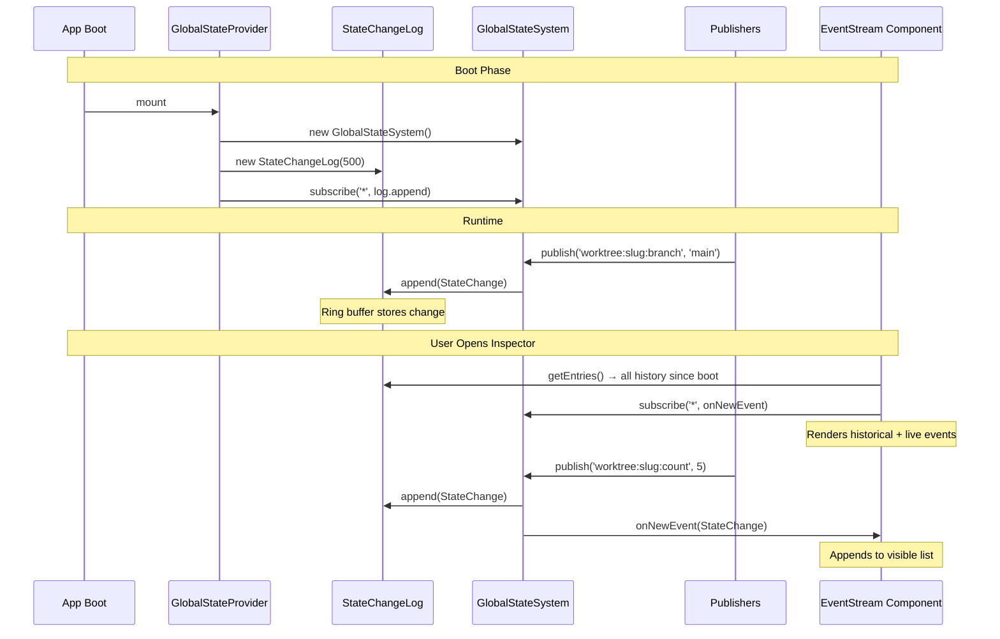

# Workshop: Event Log UX & Live State Updates

**Type**: UI Pattern
**Plan**: 056-state-devtools-panel
**Spec**: [state-devtools-panel-spec.md](../state-devtools-panel-spec.md)
**Created**: 2026-02-27
**Status**: Draft

**Domain Context**:
- **Primary Domain**: `_platform/dev-tools`
- **Related Domains**: `_platform/state` (data source), `_platform/panel-layout` (UI patterns)

---

## Purpose

Define the visual design, interaction patterns, and data flow for the state inspector's event log. This workshop answers: what does a good event row look like? How do we filter, scroll, pause, and drill down without over-engineering? How does live data flow from StateChangeLog to the UI without jank?

## Key Questions Addressed

- What row layout gives maximum information density without clutter?
- How do we handle auto-scroll vs manual inspection?
- What filtering UX keeps things simple but powerful?
- How does the detail panel work when you click an event?
- How does live data actually flow from boot to screen?

---

## Panel Layout

Three tabs, dual-pane layout. Keep it simple — no resizable drag handles, just a fixed split.

```
┌──────────────────────────────────────────────────────────────┐
│ State Inspector        [Pause ▶] [Clear 🗑] [⚙]            │
├────────────┬─────────────────────────────────────────────────┤
│ [Domains]  │ [State]  │ [Events]                            │
├────────────┴──────────┬──────────────────────────────────────┤
│                       │                                      │
│   Event List          │   Detail Panel                       │
│   (scrolling)         │   (selected event)                   │
│                       │                                      │
│                       │                                      │
│                       │                                      │
├───────────────────────┴──────────────────────────────────────┤
│ Domains: 1  Entries: 4  Subscribers: 7  Log: 23/500         │
└──────────────────────────────────────────────────────────────┘
```

### Tab Content

| Tab | Left Pane | Right Pane |
|-----|-----------|------------|
| **Domains** | Expandable domain list with property schemas | Selected domain detail (instances, entry count) |
| **State** | Current entries table sorted by `updatedAt` | Selected entry full JSON value |
| **Events** | Scrolling event stream from StateChangeLog | Selected event: value + previousValue + domain context |

### Why This Structure

- **Tabs** not sidebars — avoids visual clutter in an already information-dense panel
- **Fixed 50/50 split** — simpler than resizable panels, good enough for a dev tool
- **Detail panel always visible** — no modal popups, no expanding rows that push content around

---

## Event Row Design

Each row is a single line, 32px tall, monospace timestamps. Information flows left-to-right: time → badge → domain → property → value.

```
┌──────────────────────────────────────────────────────────────┐
│ +0.2s  ● worktree  changed-file-count  3                    │
│ +0.0s  ● worktree  branch              "main"               │
│ +1.4s  ○ worktree  changed-file-count  5                    │
│ +0.1s  ✕ alerts    count               — removed —          │
└──────────────────────────────────────────────────────────────┘
```

### Row Structure (JSX)

```tsx
<div className="h-8 px-2 flex items-center gap-2 font-mono text-xs
                hover:bg-accent/50 cursor-pointer transition-colors
                border-l-2 border-blue-500">
  {/* Relative timestamp */}
  <span className="text-[10px] text-muted-foreground tabular-nums w-14 shrink-0">
    +0.2s
  </span>

  {/* Change type indicator */}
  <span className="w-3 shrink-0">●</span>

  {/* Domain */}
  <span className="text-muted-foreground w-20 truncate shrink-0">
    worktree
  </span>

  {/* Property */}
  <span className="text-foreground w-32 truncate shrink-0">
    changed-file-count
  </span>

  {/* Value summary */}
  <span className="text-emerald-400 truncate flex-1">
    3
  </span>
</div>
```

### Change Type Indicators

| Type | Symbol | Border | Value Color |
|------|--------|--------|-------------|
| First publish | `●` | `border-blue-500` | Type-colored (see below) |
| Update | `○` | `border-blue-500` | Type-colored |
| Remove | `✕` | `border-red-500` | `text-muted-foreground italic` "— removed —" |

### Value Type Colors

| Type | Color | Example |
|------|-------|---------|
| String | `text-emerald-400` | `"main"` |
| Number | `text-blue-400` | `3` |
| Boolean | `text-amber-400` | `true` |
| Null/Undefined | `text-muted-foreground italic` | `null` |
| Object/Array | `text-zinc-300` | `{...}` / `[3 items]` |

### Timestamp Format

**Default**: Relative elapsed time since the previous event: `+0.2s`, `+1.4s`, `+12ms`.

**Why relative?** During debugging, developers care about *deltas* — "how long between this event and the last one?" — not wall-clock time. Wall clock is available in the detail panel.

**Implementation**: Store `lastTimestamp` in state. For each event, compute `event.timestamp - lastTimestamp`. Format:
- `< 1s` → `+{ms}ms` (e.g., `+42ms`)
- `1-60s` → `+{s.d}s` (e.g., `+1.4s`)
- `> 60s` → `+{m}m{s}s` (e.g., `+2m15s`)

Use `tabular-nums` font-variant to prevent width jitter as digits change.

---

## Filter Bar

Persistent sticky bar at top of event list. Domain chips + text search.

```
┌──────────────────────────────────────────────────────────────┐
│ 🔍 [filter...          ]  [worktree] [workflow] [all]       │
└──────────────────────────────────────────────────────────────┘
```

### Chip Behavior

- **Chips auto-populate** from registered domains (via `listDomains()`)
- **"all"** chip is default-active — shows everything
- **Click domain chip** → solo that domain (deselect others)
- **Click "all"** → reset to everything
- Multiple selection via shift-click would be nice but defer — keep it simple with single-domain focus or all

### Text Filter

- Filters on `path` substring match (case-insensitive)
- Typing `branch` shows only events where path contains "branch"
- Debounced at 150ms

### Chip Tailwind

```tsx
// Active chip
<button className="px-2 py-0.5 rounded-full text-[10px] font-medium
                    bg-blue-500/20 text-blue-300 ring-1 ring-blue-500/30">
  worktree
</button>

// Inactive chip
<button className="px-2 py-0.5 rounded-full text-[10px] font-medium
                    bg-muted text-muted-foreground hover:bg-accent">
  workflow
</button>
```

---

## Auto-Scroll Behavior

The most important UX detail. Get this wrong and the log is unusable.

### Rules

1. **Auto-scroll ON** by default — new events scroll into view
2. **User scrolls up** → auto-scroll OFF (user is reading history)
3. **Sticky banner appears** at bottom: `"↓ 12 new events"` — clicking jumps to bottom and re-enables auto-scroll
4. **Pause** freezes the list entirely — no new rows added, no scroll changes

### Detection

```tsx
const isAtBottom = useCallback(() => {
  if (!scrollRef.current) return true;
  const { scrollTop, scrollHeight, clientHeight } = scrollRef.current;
  return scrollHeight - scrollTop - clientHeight < 32; // within one row
}, []);
```

### New Events Banner

```tsx
{newEventCount > 0 && !isAtBottom && (
  <button
    onClick={scrollToBottom}
    className="sticky bottom-0 w-full bg-background/90 backdrop-blur
               text-xs text-blue-400 py-1.5 px-3 cursor-pointer
               border-t border-border text-center"
  >
    ↓ {newEventCount} new events
  </button>
)}
```

---

## Pause / Resume / Clear

Three action buttons in the panel header.

| Button | Icon | Behavior |
|--------|------|----------|
| **Pause** | `⏸` (Pause icon) | Stop adding new events to the visible list. Buffer incoming events. Show buffered count: `⏸ (47)` |
| **Resume** | `▶` (Play icon) | Flush buffered events into the list in one batch. Re-enable auto-scroll. |
| **Clear** | `🗑` (Trash icon) | Wipe the displayed event list. Does NOT clear the StateChangeLog ring buffer — historical events are preserved for re-display if user switches tabs and back. |

### Pause Implementation

```tsx
const [paused, setPaused] = useState(false);
const bufferRef = useRef<StateChange[]>([]);

// In the subscription callback:
if (paused) {
  bufferRef.current.push(change);
  setBufferedCount(bufferRef.current.length);
} else {
  setEvents(prev => [...prev, change]);
}

// On resume:
const handleResume = () => {
  setEvents(prev => [...prev, ...bufferRef.current]);
  bufferRef.current = [];
  setBufferedCount(0);
  setPaused(false);
};
```

---

## Detail Panel

Right side of the split. Shows full context for the selected event or entry.

### Event Detail Layout

```
┌──────────────────────────────────────┐
│ worktree:chainglass:changed-file-count
│                                      │
│ Domain     worktree                  │
│ Instance   chainglass                │
│ Property   changed-file-count        │
│ Type       number                    │
│ Time       2026-02-27 23:42:01.456   │
│                                      │
│ ── Value ────────────────────────    │
│ 5                                    │
│                                      │
│ ── Previous Value ───────────────    │
│ 3                                    │
│                                      │
│ ── Domain Info ──────────────────    │
│ worktree (multi-instance)            │
│ "Worktree runtime state"             │
│ Properties: changed-file-count,      │
│             branch                   │
└──────────────────────────────────────┘
```

### Value Display

- **Primitives**: Inline with type color (number blue, string green, boolean amber)
- **Objects/Arrays**: Render as indented JSON with syntax coloring
- **Large values** (>10 lines): Use the existing `CodeEditor` component in read-only mode with JSON language support

### No Detail Selected

Show a placeholder:

```tsx
<div className="flex items-center justify-center h-full text-muted-foreground text-sm">
  Select an event to inspect
</div>
```

---

## Data Flow: Boot → Screen

How state changes get from the GlobalStateSystem to the event log UI.



### Key Design Decisions

1. **StateChangeLog is passive** — it just accumulates. No filtering, no transformation. The UI filters.
2. **Dual subscription**: The log subscribes at boot (for history). The UI subscribes when mounted (for live updates). The log is the source of truth for history; the UI subscription handles real-time rendering.
3. **No deduplication**: If the same path publishes 100 times, all 100 entries are in the log. The FIFO cap (500) handles memory.

---

## Diagnostics Footer

Always visible at the bottom of the panel. Live-updating stats.

```
┌──────────────────────────────────────────────────────────────┐
│ Domains: 1  Entries: 4  Subscribers: 7  Log: 23/500         │
└──────────────────────────────────────────────────────────────┘
```

```tsx
<div className="flex items-center gap-4 px-3 py-1.5 border-t text-[10px]
                text-muted-foreground font-mono bg-muted/30">
  <span>Domains: {domains.length}</span>
  <span>Entries: {entryCount}</span>
  <span>Subscribers: {subscriberCount}</span>
  <span>Log: {logSize}/{logCap}</span>
</div>
```

Updates via `useStateSystem()` diagnostics properties — these re-render on state changes because the component subscribes.

---

## What We're NOT Building (Keep It Simple)

| Feature | Why Not |
|---------|---------|
| Resizable panes | CSS `resize` adds complexity. Fixed 50/50 is fine for a dev tool. |
| Virtual scrolling | Only needed at 1000+ events. Cap at 500 first. Add later if needed. |
| Keyboard navigation | Nice-to-have. Focus on mouse interaction first. Add arrow keys later. |
| Diff view (side-by-side) | previousValue shown below current value is sufficient. Inline diff is over-engineering. |
| Export/import | Low priority. JSON.stringify the log if you need it. |
| Drag-and-drop column reorder | Definitely not. |

---

## Existing Components to Reuse

| Component | From | Use For |
|-----------|------|---------|
| `StatusBadge` | `components/ui/status-badge.tsx` | Domain status indicators |
| `Tabs` / `TabsList` / `TabsContent` | `components/ui/tabs.tsx` | Domains / State / Events tabs (use `variant="line"`) |
| `Card` | `components/ui/card.tsx` | Detail panel wrapper |
| `Button` | `components/ui/button.tsx` | Pause/resume/clear actions (`variant="ghost" size="icon"`) |
| `PanelHeader` pattern | `_platform/panel-layout` | Title bar with action buttons |
| `ChangesView` row pattern | `041-file-browser` | Event row structure (item + badge + status) |
| `CodeEditor` (lazy) | `041-file-browser` | Large JSON value display in detail panel |

---

## Summary: Implementation Checklist

For the implementor, here's the priority order:

1. **StateChangeLog class** — ring buffer with append/getEntries/clear/size (~40 LOC)
2. **Mount in provider** — subscribe to `'*'` at boot
3. **Event row component** — the core visual unit (timestamp + badge + domain + property + value)
4. **Event stream list** — scrolling container with auto-scroll behavior
5. **Filter bar** — domain chips + text filter
6. **Detail panel** — selected event full display
7. **Pause/resume/clear** — header action buttons
8. **Diagnostics footer** — live stats bar
9. **Tabs + page route** — wire it all together
