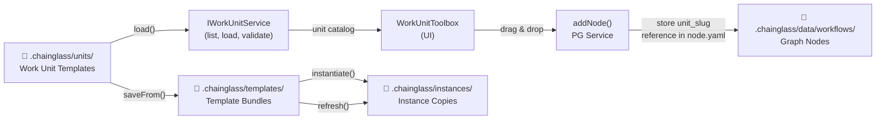

# Research Report: Work Unit Creator & Editor

**Generated**: 2026-02-28T05:32:00Z
**Research Query**: "Work unit creator and editor — creating and editing work unit templates, syncing to workflows, code/agent/human-input unit types, inputs/outputs"
**Mode**: Pre-Plan (branch-detected: 058-workunit-editor)
**Location**: docs/plans/058-workunit-editor/research-dossier.md
**FlowSpace**: Available ✅
**Findings**: 71 total (IA:10, DC:10, PS:10, QT:10, IC:10, DE:10, PL:15, DB:8) — deduplicated below

## Executive Summary

### What It Does
Work units are **reusable template definitions** stored at `.chainglass/units/<slug>/` that define executable work (agent prompts, code scripts, or human input questions). They are the building blocks that get **fully copied** into positional graph workflows when dragged from the toolbox onto canvas lines. The system currently supports listing, loading, and validating work units but **lacks a dedicated editor UI** for creating and modifying them.

### Business Purpose
Work unit templates enable workflow composition — users build workflows by assembling pre-defined units. Currently, units are created via CLI (`cg unit create`) or manually editing YAML files. A visual editor would allow non-technical users to create, modify, and manage the unit catalog, then sync changes to existing workflow instances.

### Key Insights
1. **IWorkUnitService is read-only** — it exposes `list()`, `load()`, `validate()` but has NO `create()`, `update()`, or `delete()` methods. The rich domain classes (`AgenticWorkUnitInstance`, `CodeUnitInstance`) do have `setPrompt()`/`setScript()` for template content, but no metadata CRUD.
2. **Template refresh exists but is template→instance only** — `ITemplateService.refresh()` syncs work units from a saved template into an instance. There is no mechanism for syncing from the global `.chainglass/units/` catalog directly into workflow graph nodes. The user's "resync" concept maps to `ITemplateService.refresh()`.
3. **Three unit types with distinct editing needs**: Agent units edit a prompt template file, code units edit a script file, user-input units configure question type + options. Each requires a different editor experience.

### Quick Stats
- **Components**: ~25 files across positional-graph, workflow, web features
- **Dependencies**: 3 core (IFileSystem, IYamlParser, IPathResolver) + 5 consumers
- **Test Coverage**: ~80% for CRUD read operations; **0% for editing/syncing** (critical gap)
- **Complexity**: Medium-High (discriminated types, path security, DI wiring, SSE eventing)
- **Prior Learnings**: 15 relevant discoveries from Plans 029, 048, 050, 054
- **Domains**: workflow-ui (consumer), _platform/positional-graph (provider), new domain recommended

## How It Currently Works

### Entry Points

| Entry Point | Type | Location | Purpose |
|------------|------|----------|---------|
| `cg unit create <slug>` | CLI | `apps/cli/src/commands/unit.command.ts:86-110` | Create unit scaffold |
| `cg unit list` | CLI | `apps/cli/src/commands/unit.command.ts` | List all units |
| `cg unit validate <slug>` | CLI | `apps/cli/src/commands/unit.command.ts` | Validate unit |
| `listWorkUnits()` | Server Action | `apps/web/app/actions/workflow-actions.ts:168-180` | List units for toolbox |
| `addNode()` | Service | `packages/positional-graph/.../positional-graph.service.ts:667` | Drop unit onto workflow |
| `refresh()` | Service | `packages/workflow/src/services/template.service.ts:364` | Sync template units to instance |

### Core Execution Flow: Adding a Work Unit to a Workflow

1. **User drags from toolbox** → `WorkUnitToolbox` component lists units via `listWorkUnits()` server action
2. **Drop on canvas** → `useWorkflowMutations.addNode(lineId, unitSlug, atPosition)` called
3. **Server action** → Resolves DI container → calls `IPositionalGraphService.addNode()`
4. **addNode()** implementation:
   - Load graph definition (`graph.yaml`)
   - Validate unit exists: `workUnitLoader.load(ctx, unitSlug)`
   - Generate unique nodeId: `generateNodeId(unitSlug, allNodeIds)`
   - Create node directory: `mkdir(.chainglass/graphs/<graphSlug>/nodes/<nodeId>/)`
   - Write `node.yaml` with NodeConfig (id, unit_slug, created_at, properties, orchestratorSettings)
   - Update `graph.yaml`: splice nodeId into `line.nodes[]` at position
5. **Result**: Node stores a `unit_slug` reference in `node.yaml` — unit content is loaded from the global catalog at runtime (not copied)

### Core Execution Flow: Template Refresh (Resync)

> **Note**: Template bundles (`.chainglass/templates/`) DO copy unit files and CAN become stale.
> However, working graphs (`.chainglass/data/workflows/`) only store slug references and always
> load latest from the global catalog. The sync model for Plan 058 focuses on the working graph
> case — a simple banner notification when units change, since a page refresh picks up changes.

1. **Template saved** via `ITemplateService.saveFrom(graphSlug, templateSlug)` — copies graph + bundles units
2. **Instance created** via `ITemplateService.instantiate(templateSlug, instanceId)` — copies template to instance dir
3. **Refresh** via `ITemplateService.refresh(templateSlug, instanceId)`:
   - Read `instance.yaml` to find bundled unit list
   - For each unit: full directory replacement (rmdir + copy from template)
   - Update `instance.yaml` timestamps
   - Graph topology (`graph.yaml`, `nodes/`) **never modified**
   - Only units present at instantiation time are refreshed

### Data Flow



### State Management
- **Filesystem is single source of truth** — no in-memory caches for work unit catalog
- **Every mutation persists atomically** via `atomicWriteFile()`
- **SSE propagates changes** to other clients watching the same workspace
- **Undo snapshots are memory-only** (workflow canvas), not persisted

## Architecture & Design

### Component Map

#### Core Package: `packages/positional-graph/src/features/029-agentic-work-units/`
| File | Purpose |
|------|---------|
| `workunit-service.interface.ts` | IWorkUnitService (list, load, validate) |
| `workunit.service.ts` | Implementation: YAML read → Zod validate → factory create |
| `workunit.schema.ts` | Zod discriminated union schema (source of truth) |
| `workunit.classes.ts` | Rich domain objects: AgenticWorkUnitInstance, CodeUnitInstance, UserInputUnitInstance |
| `workunit.adapter.ts` | Filesystem path resolution at `.chainglass/units/` |
| `workunit.types.ts` | Compile-time type assertions |
| `workunit-errors.ts` | Error factories E180-E187 |
| `reserved-params.ts` | Reserved input names: `main-prompt`, `main-script` |
| `fake-workunit.service.ts` | Test double with call capture |

#### UI: `apps/web/src/features/050-workflow-page/`
| Area | Purpose |
|------|---------|
| `components/work-unit-toolbox.tsx` | Right sidebar: grouped units with search, drag sources |
| `hooks/use-workflow-mutations.ts` | Wraps server actions with optimistic updates |
| `components/node-edit-modal.tsx` | Edit node description, orchestratorSettings, input wiring |

#### Server Actions: `apps/web/app/actions/workflow-actions.ts`
28 actions including: `listWorkUnits`, `addNode`, `removeNode`, `moveNode`, `saveAsTemplate`, `instantiateTemplate`

### Design Patterns Identified

1. **Discriminated Union** (Zod): `z.discriminatedUnion('type', [AgentConfig, CodeConfig, UserInputConfig])`
2. **Schema-First Types** (ADR-0003): Types derived via `z.infer<>` from schemas
3. **Rich Domain Objects**: Factory functions create typed instances with type-specific methods
4. **Adapter Pattern**: `WorkUnitAdapter` → filesystem; `InstanceWorkUnitAdapter` → instance-local paths
5. **Skip-and-Warn**: `list()` returns both valid units AND errors from malformed units
6. **Reserved Parameter Routing**: Hyphens for reserved (`main-prompt`), underscores for user inputs
7. **DI Factory Registration**: `registerPositionalGraphServices()` reused by web + CLI + tests
8. **Atomic Writes**: All graph mutations use `atomicWriteFile()` for crash safety

### System Boundaries
- **Work units** own: `.chainglass/units/<slug>/` (unit.yaml + template files)
- **Positional graph** owns: `.chainglass/graphs/<slug>/` (graph.yaml + nodes/)
- **Templates** own: `.chainglass/templates/<slug>/` (bundled graph + units)
- **Instances** own: `.chainglass/instances/<template>/<id>/` (hydrated copies)

## Dependencies & Integration

### What Work Units Depend On

| Dependency | Type | Purpose |
|------------|------|---------|
| `IFileSystem` | Required | Read/write unit.yaml, prompt/script files |
| `IPathResolver` | Required | Path join, resolve, containment checks |
| `IYamlParser` | Required | Parse unit.yaml ↔ objects |
| `WorkUnitAdapter` | Internal | `.chainglass/units/` path resolution |

### What Depends on Work Units

| Consumer | How It Uses WU | Breaking Change Impact |
|----------|---------------|----------------------|
| `PositionalGraphService` | `IWorkUnitLoader.load()` for input resolution, node startup | Graph operations fail |
| `ODS` (Orchestration Dispatch) | Resolve unit config for pod creation | Orchestration fails |
| `WorkUnitToolbox` (UI) | `listWorkUnits()` for drag catalog | Toolbox empty |
| `CLI unit.command` | `list`, `create`, `validate` | CLI broken |
| `TemplateService` | Bundles units into templates; `refresh()` syncs | Template ops fail |

## Quality & Testing

### Current Test Coverage
- **Unit Tests**: ~80% for read operations (list, load, validate, schema validation, error codes)
- **Integration Tests**: Doping creates 8 demo workflow scenarios (`test/integration/dope-workflows.test.ts`)
- **Contract Tests**: `test/contracts/workunit-service.contract.ts` ensures fake/real parity
- **Gaps**: ❌ **0% coverage for editing/syncing** — no tests for create→modify→persist cycle
- **Gaps**: ❌ **0% coverage for web editor UI** — no component tests for unit editing

### Known Issues & Technical Debt
| Issue | Severity | Location | Impact |
|-------|----------|----------|--------|
| IWorkUnitService is read-only | High | workunit-service.interface.ts | Can't edit units via service |
| Two duplicate FakeWorkUnitService | Medium | positional-graph + workgraph | Maintenance burden |
| No edit/sync test coverage | High | test/ | Risk of editor bugs |
| No catalog change eventing | Medium | _platform/events | Editor can't show live updates |

## Modification Considerations

### ✅ Safe to Modify
1. **Add methods to IWorkUnitService**: Can extend interface with `create()`, `update()`, `delete()` — no existing consumers break
2. **Add new feature folder**: `apps/web/src/features/058-workunit-editor/` is greenfield
3. **Add server actions**: New actions in `workflow-actions.ts` or separate `workunit-actions.ts`

### ⚠️ Modify with Caution
1. **WorkUnit schema changes**: Adding fields is safe; changing existing field semantics affects all consumers
2. **Adapter path changes**: `.chainglass/units/` path is hardcoded in multiple places
3. **Rich domain class changes**: `getPrompt()`, `setPrompt()` etc. are used by orchestration

### 🚫 Danger Zones
1. **Input/output schema**: Changing input name validation regex breaks existing units on disk
2. **Node.yaml format**: Changing NodeConfig breaks graph loading for all existing workflows
3. **Atomic write pattern**: Bypassing `atomicWriteFile()` risks YAML corruption

### Extension Points
1. **IWorkUnitService**: Designed for extension — add write methods alongside existing read methods
2. **WorkUnit domain classes**: Factory pattern allows new unit types (add new `create*Instance()`)
3. **Server actions**: Pattern well-established — add new actions following existing DI resolution pattern
4. **SSE channels**: Can add `work-units` channel for catalog change events following existing event adapter pattern

## Prior Learnings (From Previous Implementations)

### 📚 PL-01: WorkUnitAdapter Path Override
**Source**: Plan 029 Phase 2 | **Type**: design
Work units use `.chainglass/units/` NOT `.chainglass/data/units/`. The adapter overrides `getDomainPath()`. Editor must use same adapter for path resolution.

### 📚 PL-02: Path Traversal Security
**Source**: Plan 029 Phase 2 | **Type**: gotcha
Use `startsWith(unitDir + sep)` with trailing separator. Simple `startsWith(unitDir)` is vulnerable to prefix attacks (`my-agent` matching `my-agent-evil/../`).

### 📚 PL-03: Template vs Instance Distinction
**Source**: Plan 048 Phase 1 | **Type**: architecture
Editor must clearly show whether user is editing a template or an instance. Template edits affect all future instances; instance edits are local.

### 📚 PL-05: InstanceWorkUnitAdapter Decoupled Design
**Source**: Plan 048 Phase 2 | **Type**: architecture
`InstanceWorkUnitAdapter` accepts `basePath` in constructor for instance-local unit loading. Editor on instances must use this adapter, not the global one.

### 📚 PL-06: Type-Specific Template Accessors
**Source**: Plan 029 Phase 2 | **Type**: design
Agent units need `getPrompt()`/`setPrompt()`, code units need `getScript()`/`setScript()`. Editor forms must dispatch by type — agent shows "Prompt" tab, code shows "Script" tab.

### 📚 PL-07: Atomic Writes for Mutations
**Source**: Plan 026 Phase 3 | **Type**: design
All mutations must persist atomically via `atomicWriteFile()`. No partial writes to disk.

### 📚 PL-08: Running-Line Lock Pattern
**Source**: Plan 050 Phase 3 | **Type**: business-logic
Lines in "running" or "complete" status cannot accept mutations. Editor must check line status before allowing operations.

### 📚 PL-11: Sample Work Unit Doping System
**Source**: Plan 050 Phase 1 | **Type**: testing
Sample units (`sample-coder`, `sample-input`, etc.) at `.chainglass/units/sample-*` enable rapid UI testing. Editor can use these for development without real agents.

### 📚 PL-13: Q&A Modal vs HumanInput Modal
**Source**: Plan 054 Phase 2 | **Type**: UI
Two separate modal types. Agent/code nodes → QAModal; user-input nodes → HumanInputModal. Important for editor interaction design.

### 📚 PL-15: Kebab-Case Validation
**Source**: Plan 050 Phase 3 | **Type**: UI
All naming inputs must validate kebab-case: `/^[a-z0-9]+(-[a-z0-9]+)*$/`. Slug validation is critical for filesystem safety.

### Prior Learnings Summary

| ID | Type | Source Plan | Key Insight | Action |
|----|------|-------------|-------------|--------|
| PL-01 | design | 029 | Units at `.chainglass/units/` not `data/units/` | Use WorkUnitAdapter |
| PL-02 | security | 029 | Path traversal: trailing sep required | Validate all template paths |
| PL-03 | architecture | 048 | Template vs instance editing | Show context in UI |
| PL-05 | architecture | 048 | InstanceWorkUnitAdapter for instances | Support instance-local editing |
| PL-06 | design | 029 | Type-specific accessors | Dispatch editor forms by type |
| PL-07 | design | 026 | Atomic writes required | Use atomicWriteFile |
| PL-08 | logic | 050 | Running lines locked | Check status before mutations |
| PL-11 | testing | 050 | Sample units for doping | Use for rapid UI testing |
| PL-13 | UI | 054 | Two modal types | Route by node type |
| PL-15 | input | 050 | Kebab-case validation | Validate all naming inputs |

## Domain Context

### Existing Domains Relevant to This Research

| Domain | Relationship | Relevant Contracts | Key Components |
|--------|-------------|-------------------|----------------|
| `_platform/positional-graph` | Provides IWorkUnitService | IWorkUnitService (read-only), IWorkUnitLoader | WorkUnitService, WorkUnitAdapter |
| `workflow-ui` | Consumes work units | IWorkUnitService.list() via toolbox | WorkUnitToolbox, useWorkflowMutations |
| `_platform/events` | Will provide change notifications | ICentralEventNotifier, useSSE, useFileChanges | FileChangeHub, SSE infrastructure |
| `_platform/file-ops` | Filesystem operations | IFileSystem, IPathResolver | NodeFileSystemAdapter |

### Domain Map Position
Work unit editing sits **between** `_platform/positional-graph` (service layer) and `workflow-ui` (consumer). It would:
- Consume: `IFileSystem`, `IPathResolver`, `IYamlParser` from shared infrastructure
- Provide: Extended `IWorkUnitService` with CRUD operations
- Integrate: `_platform/events` for catalog change notifications

### Potential Domain Actions
- **Extend existing domain** `_platform/positional-graph`: Add write operations to IWorkUnitService (simplest approach — keeps all unit operations in one place)
- **OR Extract new domain**: `work-unit-editor` as a business domain with its own feature folder (if the editor has significant UI complexity warranting separation)
- **Formalize contract**: Add `IWorkUnitEditorService` or extend `IWorkUnitService` with `create()`, `update()`, `delete()`

## Critical Discoveries

### 🚨 Critical Finding 01: IWorkUnitService Has No Write Operations
**Impact**: Critical
**Source**: IC-01, IC-02, DB-02
**What**: The primary service interface only supports `list()`, `load()`, `validate()`. There are no `create()`, `update()`, or `delete()` methods. The CLI `cg unit create` command writes files directly, bypassing the service.
**Why It Matters**: A work unit editor MUST have write operations through the service layer, not direct filesystem writes.
**Required Action**: Extend IWorkUnitService with CRUD write methods (or create a new IWorkUnitEditorService).

### 🚨 Critical Finding 02: Working Graphs Always Load Latest — No Per-Node Sync Needed
**Impact**: Simplifying (reduces scope)
**Source**: IA-07, IA-08, DE-05, confirmed by code inspection of `addNode()` and `IWorkUnitLoader`
**What**: Graph nodes store only a `unit_slug` reference in `node.yaml`. At runtime, `IWorkUnitLoader.load(ctx, slug)` reads from the global catalog. Nodes always see the latest unit content. There are no local copies to get stale.
**Why It Matters**: The sync model is dramatically simpler than originally assumed. No per-node sync indicators, no content hashing, no individual sync operations. A simple banner notification ("units updated, refresh page") via the state system is sufficient.
**Required Action**: File watcher on `.chainglass/units/` → state system event → banner on workflow page. Page refresh picks up all changes automatically.

### 🚨 Critical Finding 03: No Catalog Change Eventing Exists
**Impact**: High
**Source**: DB-06, QT-10
**What**: There is no SSE channel or file watcher for `.chainglass/units/` changes. The workflow UI has SSE for graph changes (`WorkflowWatcherAdapter`) but nothing for the unit catalog.
**Why It Matters**: The user wants live "out of sync" indicators that update when units are edited on disk or in another window. This requires file change detection for the units directory.
**Required Action**: Create a `WorkUnitCatalogWatcherAdapter` following the pattern of `WorkflowWatcherAdapter`, routing to an SSE channel.

### 🚨 Critical Finding 04: Zero Test Coverage for Editing Operations
**Impact**: High
**Source**: QT-07, QT-10
**What**: The doping infrastructure creates demo workflows but never validates CRUD mutations (load→modify→persist). No tests for editing unit.yaml, no tests for setPrompt/setScript round-trips, no web editor component tests.
**Required Action**: Comprehensive testing strategy needed: contract tests for write operations, integration tests for edit→save→load cycle, component tests for editor UI.

## Supporting Documentation

### Related Documentation
- `docs/domains/workflow-ui/domain.md` — Workflow UI domain with gotchas and composition
- `docs/plans/029-agentic-work-units/` — Original work unit implementation plan
- `docs/plans/048-wf-web/` — Workflow web implementation (template/instance system)
- `docs/plans/050-workflow-page-ux/` — Workflow page UX (current canvas/toolbox)

### Key Code Paths
- `packages/positional-graph/src/features/029-agentic-work-units/` — Core work unit package
- `apps/web/src/features/050-workflow-page/` — Workflow UI feature folder
- `apps/web/app/actions/workflow-actions.ts` — Server actions (28 actions)
- `apps/cli/src/commands/unit.command.ts` — CLI unit commands
- `scripts/dope-workflows.ts` — Doping system for demo data

## Recommendations

### If Modifying This System (Building the Editor)
1. **Extend IWorkUnitService** with `create()`, `update()`, `delete()` methods following existing pattern
2. **Create new feature folder** `apps/web/src/features/058-workunit-editor/` for editor UI
3. **Add server actions** in `apps/web/app/actions/workunit-actions.ts` (separate from workflow-actions)
4. **Implement file watcher** for `.chainglass/units/` changes → SSE `work-units` channel
5. **Follow type-specific editor pattern**: Agent → prompt editor, Code → script editor, User-Input → form builder
6. **Use existing doping** for development — sample units provide all 3 types for testing

### If Extending This System (Adding Change Notifications)
1. **File watcher**: Watch `.chainglass/units/` for changes → publish state system event
2. **Banner notification**: Workflow page subscribes to state event → shows "units updated, refresh" banner
3. **Page refresh**: Re-fetches server components, which re-resolve all unit references from global catalog

### If Refactoring This System
1. **Consolidate duplicate fakes**: Merge `fake-workunit.service.ts` from positional-graph and workgraph packages
2. **Add version field tracking**: Units have `version` field but no version comparison infrastructure
3. **Consider content hashing**: Hash unit.yaml content for cheap staleness detection in template bundles (deferred — not needed for working graphs)

## External Research Opportunities

### Research Opportunity 1: Code Editor Component for Work Unit Script/Prompt Editing

**Why Needed**: The editor needs an embedded code editor for editing agent prompts (markdown) and code scripts (various languages). Need to determine whether to use CodeMirror, Monaco, or a simpler textarea approach.
**Impact on Plan**: Core UX decision — affects bundle size, feature set, and complexity.
**Source Findings**: IA-03, IC-05, PL-06

**Ready-to-use prompt:**
```
/deepresearch "What is the best embeddable code editor for a Next.js 16 App Router application with React 19 Server Components? Requirements: edit markdown (agent prompts) and code scripts (bash, python, javascript), syntax highlighting, ~500 line files, must work as client component. Compare Monaco Editor, CodeMirror 6, and lightweight alternatives. Consider bundle size impact, SSR compatibility, and React 19 support."
```

### Research Opportunity 2: Filesystem Change Detection Patterns for SSE-Based Live Updates

**Why Needed**: Need to detect when `.chainglass/units/` files change on disk (edited externally or by another user) and push updates via SSE to the browser.
**Impact on Plan**: Required for "out of sync" indicators and live editor updates.
**Source Findings**: DB-06, IA-08

**Ready-to-use prompt:**
```
/deepresearch "Best practices for filesystem change detection in Node.js for real-time UI updates via SSE. Compare chokidar, fs.watch, and custom polling approaches. Need to watch a directory tree (.chainglass/units/) for YAML file changes, debounce rapid changes (200ms), and emit structured events. Must work on macOS and Linux. Consider performance for 50-200 watched files."
```

## Appendix: Work Unit On-Disk Format

### Unit Directory Structure
```
.chainglass/units/<slug>/
  unit.yaml                  ← Unit definition (Zod-validated)
  prompts/main.md            ← Agent prompt template (agent type)
  scripts/main.sh            ← Code script (code type)
```

### unit.yaml Schema (Agent Example)
```yaml
slug: my-agent
type: agent
version: "1.0.0"
description: "An agent that does X"
agent:
  prompt_template: prompts/main.md
  system_prompt: "You are a helpful assistant"
  supported_agents:
    - claude-code
inputs:
  - name: source_code
    type: data
    data_type: text
    required: true
    description: "The code to review"
outputs:
  - name: review_result
    type: data
    data_type: text
    required: true
    description: "The review output"
```

### unit.yaml Schema (Code Example)
```yaml
slug: my-script
type: code
version: "1.0.0"
code:
  script: scripts/main.sh
  timeout: 300
inputs:
  - name: input_file
    type: file
    required: true
outputs:
  - name: output_file
    type: file
    required: true
```

### unit.yaml Schema (User-Input Example)
```yaml
slug: my-question
type: user-input
version: "1.0.0"
user_input:
  question_type: single
  prompt: "Choose a deployment target"
  options:
    - key: staging
      label: Staging
      description: "Deploy to staging environment"
    - key: production
      label: Production
      description: "Deploy to production environment"
inputs: []
outputs:
  - name: choice
    type: data
    data_type: text
    required: true
```

## Next Steps

1. Run `/plan-1b-specify` to create the feature specification for the work unit editor
2. Consider running `/deepresearch` prompts above for code editor and file watcher research
3. Key decision needed: extend `IWorkUnitService` in-place vs. create new `IWorkUnitEditorService`

---

**Research Complete**: 2026-02-28T05:32:00Z
**Report Location**: docs/plans/058-workunit-editor/research-dossier.md
